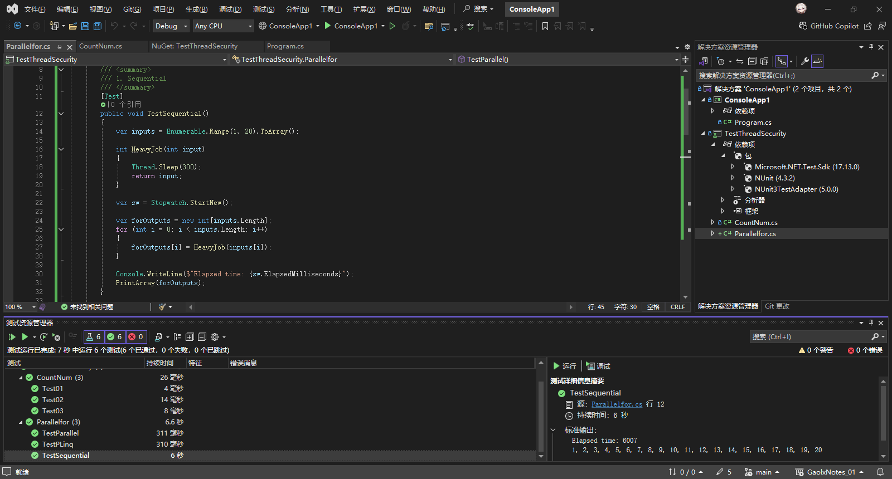
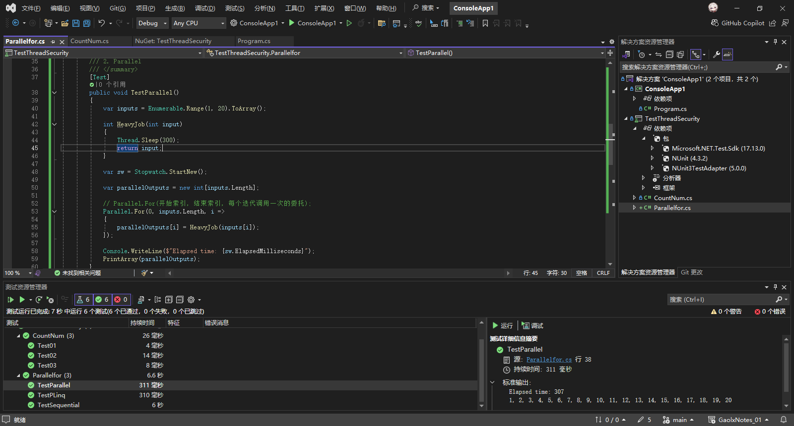
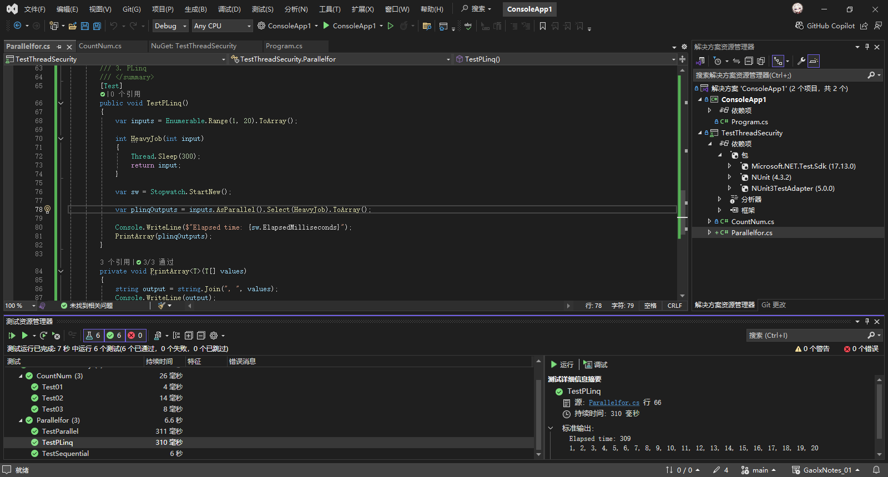
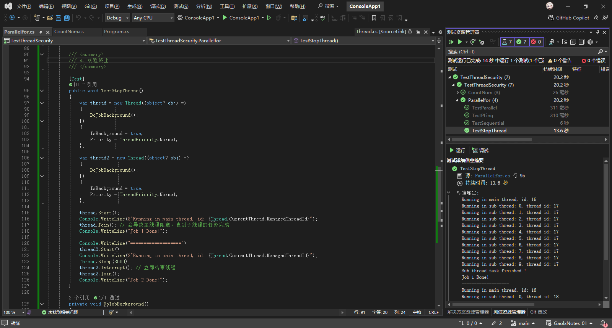
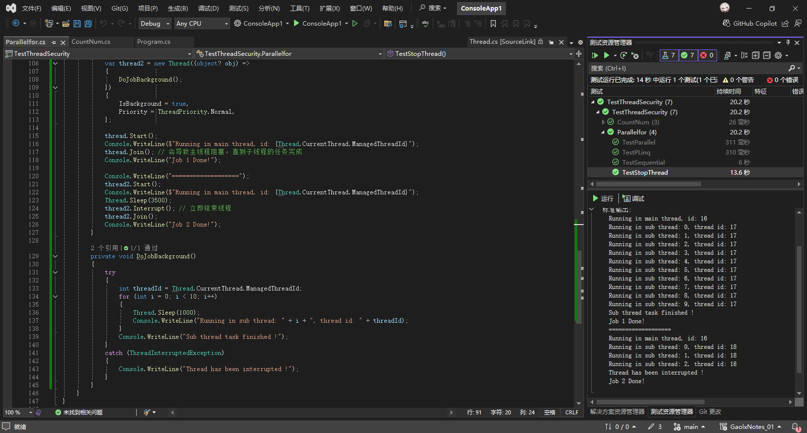
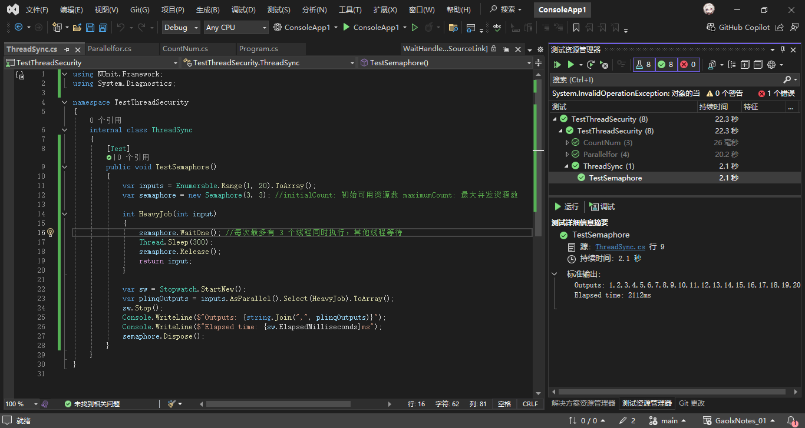
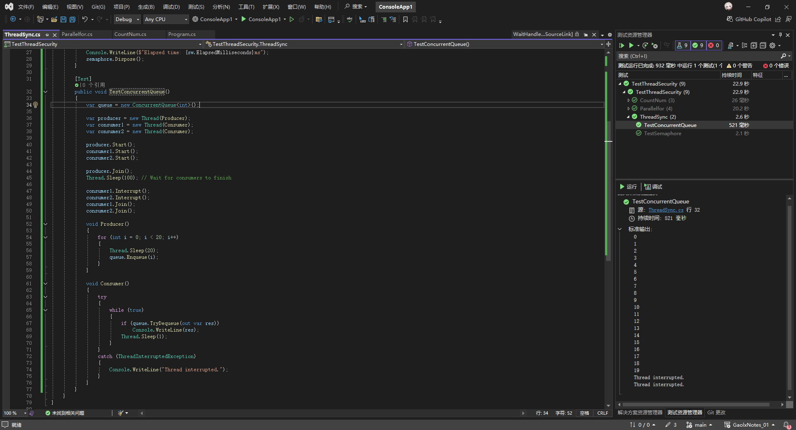

# C#多线程与异步编程（二）

## 二、C#中常见的多线程实现方式

### 2.1 内置多线程方法

#### 2.1.1 Parallel 类：For、ForEach、Invoke

在C#中，`Parallel.For` 是 **并行编程** 的核心工具之一，属于 `System.Threading.Tasks` 命名空间。它用于将传统的顺序 `for` 循环转换为并行执行的循环，利用多核处理器提升性能。以下是详细说明：

---

**定义**：提供对并行循环和区域的支持。

**语法**：
```csharp
Parallel.For(int fromInclusive, int toExclusive, Action<int> body);
```
- **参数**：
  - `fromInclusive`：起始索引（包含）
  - `toExclusive`：结束索引（不包含）
  - `body`：每个迭代执行的委托（接受当前索引作为参数）

**示例**：并行计算数组元素的平方
```csharp
int[] data = new int[1000];
Parallel.For(0, data.Length, i => {
    data[i] = i * i;
});
```

---

#### 2.1.2 PLINQ：AsParallel、AsSequential、AsOrdered

PLINQ 定义：并行 LINQ (PLINQ) 是语言集成查询 (LINQ) 模式的并行实现。 PLINQ 将整套 LINQ 标准查询运算符实现为 System.Linq 命名空间的扩展方法，并提供适用于并行操作的其他运算符。 PLINQ 将 LINQ 语法的简洁和可靠性与并行编程的强大功能结合在一起。

在C#的PLINQ（Parallel LINQ）中，`AsParallel`、`AsSequential` 和 `AsOrdered` 是控制并行查询行为的关键方法。以下是它们的详细介绍及区别：

---

### **1. `AsParallel()`**
- **作用**：将LINQ查询转换为并行执行。  
  它是PLINQ的入口点，告诉运行时后续的操作可以尝试并行化以提高性能。
- **特点**：
  - 默认情况下，结果的顺序**不保证**与输入顺序一致。
  - 适合处理大规模数据且独立的任务（例如`Where`、`Select`）。
- **示例**：
  ```csharp
  var results = data.AsParallel()
                    .Where(x => x % 2 == 0)
                    .Select(x => Process(x));
  ```

---

### **2. `AsOrdered()`**
- **作用**：在并行处理中保持输入元素的顺序。  
  它会确保输出结果的顺序与输入顺序一致，但可能引入性能开销。
- **适用场景**：
  - 需要保留顺序的后续操作（例如`Take`、`Skip`）。
  - 结果顺序对业务逻辑有影响时。
- **示例**：
  ```csharp
  var orderedResults = data.AsParallel()
                          .AsOrdered()  // 保持顺序
                          .Where(x => x > 10)
                          .Select(x => x * 2);
  ```

---

### **3. `AsSequential()`**
- **作用**：将后续查询切换回顺序执行模式。  
  在并行操作后，某些操作可能需要按顺序处理（例如依赖顺序的聚合操作）。
- **典型用例**：
  - 并行处理后需要顺序操作（例如`foreach`循环、`First()`）。
  - 与非PLINQ兼容的方法结合时（如某些第三方库）。
- **示例**：
  ```csharp
  var finalResult = data.AsParallel()
                       .Where(x => x.IsValid)
                       .AsSequential() // 后续操作按顺序执行
                       .OrderBy(x => x.Id)
                       .Take(100);
  ```

---

总之，ParallelEnumerable.AsParallel 方法，启用查询的并行化，如果需要保证执行顺序，可以在后面加一个 AsOrdered保证顺序

---

我们以Paraller.For 和 ParallelEnumerable.AsParallel 为例，使用 Thread.Sleep 模拟耗时操作，使用 Stopwatch查看执行耗时，看看相较于for循环的性能的提升。

运行以下代码，观察输出结果和耗时。

```csharp
using NUnit.Framework;
using System.Diagnostics;

namespace TestThreadSecurity
{
    internal class Parallelfor
    {
        /// <summary>
        /// 1. Sequential
        /// </summary>
        [Test]
        public void TestSequential()
        {
            var inputs = Enumerable.Range(1, 20).ToArray();

            int HeavyJob(int input)
            {
                Thread.Sleep(300);
                return input;
            }

            var sw = Stopwatch.StartNew();

            var forOutputs = new int[inputs.Length];
            for (int i = 0; i < inputs.Length; i++)
            {
                forOutputs[i] = HeavyJob(inputs[i]);
            }

            Console.WriteLine($"Elapsed time: {sw.ElapsedMilliseconds}");
            PrintArray(forOutputs);
        }

        /// <summary>
        /// 2. Parallel
        /// </summary>
        [Test]
        public void TestParallel()
        {
            var inputs = Enumerable.Range(1, 20).ToArray();

            int HeavyJob(int input)
            {
                Thread.Sleep(300);
                return input;
            }

            var sw = Stopwatch.StartNew();

            var parallelOutputs = new int[inputs.Length];

            // Parallel.For(开始索引, 结束索引, 每个迭代调用一次的委托);
            Parallel.For(0, inputs.Length, i =>
            {
                parallelOutputs[i] = HeavyJob(inputs[i]);
            });

            Console.WriteLine($"Elapsed time: {sw.ElapsedMilliseconds}");
            PrintArray(parallelOutputs);
        }

        /// <summary>
        /// 3. PLinq
        /// </summary>
        [Test]
        public void TestPLinq()
        {
            var inputs = Enumerable.Range(1, 20).ToArray();

            int HeavyJob(int input)
            {
                Thread.Sleep(300);
                return input;
            }

            var sw = Stopwatch.StartNew();

            var plinqOutputs = inputs.AsParallel().Select(HeavyJob).ToArray();

            Console.WriteLine($"Elapsed time: {sw.ElapsedMilliseconds}");
            PrintArray(plinqOutputs);
        }

        private void PrintArray<T>(T[] values)
        {
            string output = string.Join(", ", values);
            Console.WriteLine(output);
        }
    }
}

```

运行结果如下：





Sequential 执行速度最慢，约6s后执行完成，而 Parallel For 和 PLinq 执行速度约310ms，可以看出当使用并行的方式去运行for或者linq，可以大大提高迭代速度，但是顺序是不能被保证的。

### 2.2 线程（Thread）

#### 2.2.1 Thread 类

定义：创建和控制线程，设置其优先级并获取其状态。

##### 1. 线程的创建

代码：

```csharp
void ThreadStart(object? obj) { }
// 1. 创建 Thread 实例，并传入 ThreadStart 委托 
Thread thread = new Thread(ThreadStart);
// 2. 调用 Thread.Start 方法，还可以传参
thread.Start();
// 3. 还可以配置线程，如是否为后台线程
thread.IsBackground = true;
```

##### 2. 线程的终止

1. 调用 `Thread.Join` 方法，等待线程的结束
在继续执行标准的 COM 和 SendMessage 消息泵处理期间，阻止调用线程，直到由该实例表示的线程终止。

2. 调用 `Thread.Interrupt` 方法，中断正在运行的子线程
中断处于 WaitSleepJoin 线程状态的线程。

注：不建议使用 `Thread.Abort` 终止线程，原因如下：

1. 使用 Abort 方法来强制终止线程可能导致一些严重的问题，包括资源泄漏和不可预测的行为。
2. 较新版本的 .NET 中如果使用这个方法，会报 `PlatformNotSupportedException` （Thread.Abort is not supported and throws PlatformNotSupportedException.），说明该方法已经过时，无法使用。

推荐使用 `Thread.Interrupt` 或 `CancellationToken` 作为替代。

代码：

```csharp
/// <summary>
/// 4. 线程终止
/// </summary>

[Test]
public void TestStopThread()
{
    var thread = new Thread((object? obj) =>
    {
        DoJobBackground();
    })
    {
        IsBackground = true,
        Priority = ThreadPriority.Normal,
    };

    var thread2 = new Thread((object? obj) =>
    {
        DoJobBackground();
    })
    {
        IsBackground = true,
        Priority = ThreadPriority.Normal,
    };

    thread.Start();
    Console.WriteLine($"Running in main thread, id: {Thread.CurrentThread.ManagedThreadId}");
    thread.Join(); // 会导致主线程阻塞，直到子线程的任务完成
    Console.WriteLine("Job 1 Done!");

    Console.WriteLine("===================");
    thread2.Start();
    Console.WriteLine($"Running in main thread, id: {Thread.CurrentThread.ManagedThreadId}");
    Thread.Sleep(3500);
    thread2.Interrupt(); // 立即结束线程
    thread2.Join();
    Console.WriteLine("Job 2 Done!");
}

private void DoJobBackground()
{
    try
    {
        int threadId = Thread.CurrentThread.ManagedThreadId;
        for (int i = 0; i < 10; i++)
        {
            Thread.Sleep(1000);
            Console.WriteLine("Running in sub thread: " + i + ", thread id: " + threadId);
        }
        Console.WriteLine("Sub thread task finished !");
    }
    catch (ThreadInterruptedException)
    {
        Console.WriteLine("Thread has been interrupted !");
    }
}
```

运行结果如下：




从中我们发现，Thread.Join 尽管可以等待线程的结束，但是会导致主线程的阻塞，即主线程这个时候必须等待这个new出来的子线程跑完才能回到主线程继续执行，我们可以通过调用 Thread.Interrupt 方法，中断线程的执行，此时会会在相应线程中抛出 `ThreadInterruptedException` ，

注：调用 `Thread.Interrupt` 方法，如果线程中包含一个 while(true) 循环，那么需要保证包含等待方法，如IO操作，`Thread.Sleep` 等。

##### 3. 线程的挂起与恢复

我们可以使用 `Thread.Suspend` 以及 `Thread.Resume` ，较新版本的 .NET 中，这两个方法已经被标记为 [Obsolete] ，且调用会报错，推荐使用锁、信号量等方式实现这一逻辑。

##### 4. 线程的超时

### 2.3 线程池（ThreadPool）

### 2.4 异步编程（async Task）

## 3. 线程安全与同步机制

### 3.1 原子操作

Interlocked 类：为多个线程共享的变量提供原子操作，例如 `Increment` 和 `Decrement` 方法递增或递减变量，并将生成的值存储在单个操作中。 

### 3.2 锁与信号量

以下是 C# 多线程编程中常见的锁与信号量及其用途和特点：

---

### 1. **`lock` 关键字**
- **用途**：确保代码块在指定时间内只能被一个线程访问，实现临界区保护。
- **特点**：
  - 语法糖，底层基于 `Monitor` 类。（Monitor.Enter、Monitor.Exit）
  - 适用于简单的线程同步场景（如修改共享变量）。
  - 需要锁定一个引用类型对象（如 `private readonly object _lockObj = new object();`）。
- **注意**：
  - 避免锁定公共对象或字符串，防止外部代码意外锁定相同对象。
  - 锁的粒度要小，避免长时间阻塞其他线程。

---

### 2. **`Mutex`（互斥锁）**
- **用途**：跨进程或跨线程的互斥访问，控制对共享资源的独占访问。
- **特点**：
  - 系统级锁，可跨进程使用（通过命名 `Mutex`）。
  - 需要显式调用 `ReleaseMutex()` 释放锁。
  - 支持等待超时（`WaitOne(timeout)`）。
- **适用场景**：
  - 单实例应用程序（确保程序只运行一个实例）。
  - 跨进程共享资源（如文件或硬件设备）。
- **注意**：
  - 性能开销较大，优先选择 `lock` 或 `Monitor`（单进程场景）。

---

### 3. **`Semaphore`（信号量）**
- **用途**：限制同时访问某个资源的线程数量。
- **特点**：
  - 通过计数器控制并发数量（初始值和最大值）。
  - 支持跨进程（命名信号量）。
  - 轻量级版本 `SemaphoreSlim`（推荐单进程使用）。
- **示例**：
  ```csharp
  // 初始化信号量：
  // initialCount: 初始可用资源数
  // maximumCount: 最大并发资源数
  Semaphore semaphore = new Semaphore(3, 5); // 初始允许 3 个线程进入，最大并发数为 5
  semaphore.WaitOne(); // 阻塞直到获取资源
  semaphore.Release(); // 释放一个资源
  ```
- **适用场景**：
  - 资源池（如数据库连接池）。
  - 限制并发任务数。

---

### 4. **`WaitHandle` 及其派生类**
#### **`ManualResetEvent`**
- **用途**：线程间通过信号通知，允许手动重置事件状态。
- **特点**：
  - 初始状态为 `false`（阻塞线程）。
  - 调用 `Set()` 后所有等待线程被释放，直到手动调用 `Reset()`。
- **示例**：
  ```csharp
  ManualResetEvent mre = new ManualResetEvent(false);
  mre.Set();    // 释放所有等待线程
  mre.Reset();  // 重置为非信号状态
  ```

#### **`AutoResetEvent`**
- **用途**：自动重置的事件，每次触发仅释放一个等待线程。
- **特点**：
  - 调用 `Set()` 后仅唤醒一个线程，并自动重置为 `false`。
  - 适用于单次通知（如生产者-消费者模型）。
- **示例**：
  ```csharp
  AutoResetEvent are = new AutoResetEvent(false);
  are.Set();  // 释放一个线程，随后自动重置
  ```

---

### 5. **`ReaderWriterLock` / `ReaderWriterLockSlim`**
- **用途**：优化读写分离场景，允许多个读线程或单个写线程访问。
- **特点**：
  - `ReaderWriterLockSlim` 是轻量级版本，性能更好。
  - 读锁可共享（多个线程同时读），写锁独占。
- **示例**：
  ```csharp
  ReaderWriterLockSlim rwLock = new ReaderWriterLockSlim();
  // 读操作
  rwLock.EnterReadLock();
  // ... 读操作
  rwLock.ExitReadLock();

  // 写操作
  rwLock.EnterWriteLock();
  // ... 写操作
  rwLock.ExitWriteLock();
  ```
- **适用场景**：
  - 读多写少的数据结构（如缓存、配置管理）。
- **注意**：
  - 避免锁升级（从读锁转为写锁可能导致死锁）。

---

### 总结
- **简单同步**：优先使用 `lock` 或 `Monitor`。
- **跨进程/复杂同步**：使用 `Mutex` 或命名信号量。
- **资源数量限制**：使用 `Semaphore`。
- **线程间通知**：根据场景选择 `ManualResetEvent` 或 `AutoResetEvent`。
- **读写分离**：使用 `ReaderWriterLockSlim` 提高性能。

以 `Semaphore` 为例，演示信号量是如何控制多线程并发数量的。

```csharp
[Test]
public void TestSemaphore()
{
    var inputs = Enumerable.Range(1, 20).ToArray();
    var semaphore = new Semaphore(3, 3); //initialCount: 初始可用资源数 maximumCount: 最大并发资源数

    int HeavyJob(int input)
    {
        semaphore.WaitOne(); //每次最多有 3 个线程同时执行，其他线程等待
        Thread.Sleep(300);
        semaphore.Release();
        return input;
    }

    var sw = Stopwatch.StartNew();
    var plinqOutputs = inputs.AsParallel().Select(HeavyJob).ToArray();
    sw.Stop();
    Console.WriteLine($"Outputs: {string.Join(",", plinqOutputs)}");
    Console.WriteLine($"Elapsed time: {sw.ElapsedMilliseconds}ms");
    semaphore.Dispose();
}
```

运行结果如下：



---

### 轻量级的锁与信号量

在 C# 多线程编程中，除了上述的线程同步方法，还有一些轻量级同步工具专门优化了性能和场景适配。以下是 **SemaphoreSlim**、**ManualResetEventSlim** 和 **ReaderWriterLockSlim** 的详细对比与使用指南：

---

## **1. SemaphoreSlim（轻量级信号量）**
### **核心作用**
- 用于限制**单进程内**线程的并发访问数量，比 `Semaphore` 更轻量，支持异步操作。
- **不跨进程**，但性能更高，适合大多数单进程场景。

### **关键特性**
- 支持 `WaitAsync()`（异步等待），适合 `async/await` 代码。
- 初始化和释放的开销更小。

### **代码示例**
```csharp
using System.Threading;

SemaphoreSlim semaphoreSlim = new SemaphoreSlim(3, 3); // 允许3个线程并发

async Task AccessResourceAsync()
{
    await semaphoreSlim.WaitAsync(); // 异步等待
    try
    {
        // 访问共享资源
        await Task.Delay(1000);
    }
    finally
    {
        semaphoreSlim.Release();
    }
}
```

### **适用场景**
- 异步任务并发控制（如限制 HTTP 请求并发数）。
- 单进程内资源池管理（如对象池）。

---

## **2. ManualResetEventSlim（轻量级手动重置事件）**
### **核心作用**
- 用于**线程间通知**，通过信号机制控制线程阻塞与唤醒。
- 比 `ManualResetEvent` 更高效，适合高频操作的短时等待。

### **关键方法**
- `Set()`：设置事件为**有信号状态**，唤醒所有等待线程。
- `Reset()`：重置事件为**无信号状态**。
- `Wait()`：阻塞线程直到事件被设置。

### **代码示例**
```csharp
ManualResetEventSlim mre = new ManualResetEventSlim(false); // 初始无信号

// 线程1：等待信号
Thread worker = new Thread(() =>
{
    mre.Wait();
    Console.WriteLine("收到信号，继续执行！");
});
worker.Start();

// 线程2：发送信号
Thread.Sleep(1000);
mre.Set(); // 唤醒所有等待线程
```

### **适用场景**
- 多线程初始化完成后通知其他线程（如缓存预热）。
- 任务协调（等待某个条件满足后继续执行）。

---

## **3. ReaderWriterLockSlim（轻量级读写锁）**
### **核心作用**
- 实现**读写分离锁**，允许多个线程同时读取资源，但写入时独占。
- 比 `ReaderWriterLock` 性能更好，且避免递归锁问题。

### **关键方法**
- `EnterReadLock()` / `ExitReadLock()`：获取/释放读锁。
- `EnterWriteLock()` / `ExitWriteLock()`：获取/释放写锁。
- `EnterUpgradeableReadLock()`：允许从读锁升级为写锁。

---

### 常见的线程安全类型

以下是常见的线程安全类型：

1. 线程安全的单例：Lazy
2. 线程安全的集合类型：ConcurrentBag、ConcurrentStack、ConcurrentQueue、ConcurrentDictionary
3. 阻塞集合：BlockingCollection
4. 通道：Channel
5. 原子操作：Interlocked
6. 周期任务：PeriodicTimer

以 `ConcurrentQueue` 为例，演示线程安全队列是如何保证线程安全的。

```csharp
[Test]
public void TestConcurrentQueue()
{
    var queue = new ConcurrentQueue<int>();

    var producer = new Thread(Producer);
    var consumer1 = new Thread(Consumer);
    var consumer2 = new Thread(Consumer);

    producer.Start();
    consumer1.Start();
    consumer2.Start();

    producer.Join();
    Thread.Sleep(100); // Wait for consumers to finish

    consumer1.Interrupt();
    consumer2.Interrupt();
    consumer1.Join();
    consumer2.Join();

    void Producer()
    {
        for (int i = 0; i < 20; i++)
        {
            Thread.Sleep(20);
            queue.Enqueue(i);
        }
    }

    void Consumer()
    {
        try
        {
            while (true)
            {
                if (queue.TryDequeue(out var res))
                    Console.WriteLine(res);
                Thread.Sleep(1);
            }
        }
        catch (ThreadInterruptedException)
        {
            Console.WriteLine("Thread interrupted.");
        }
    }
}
```

运行结果如下：


