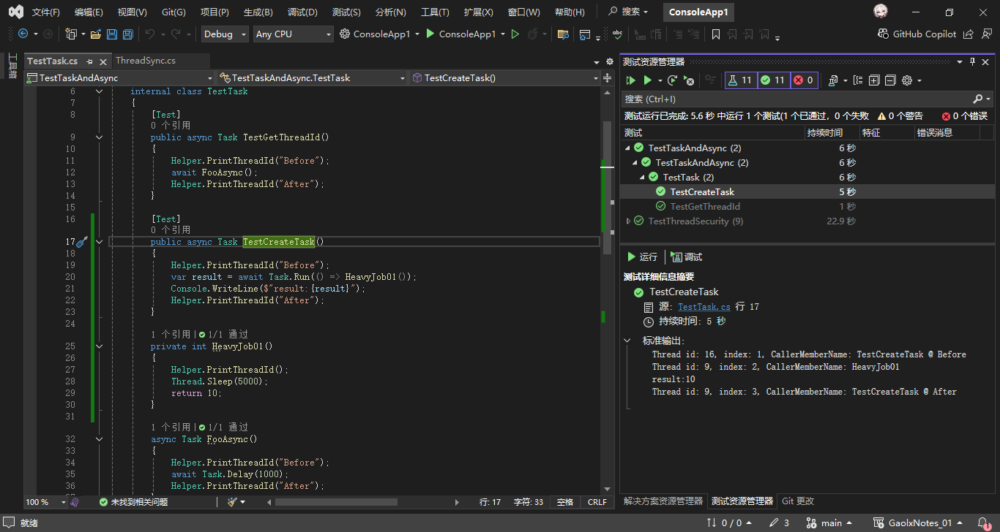
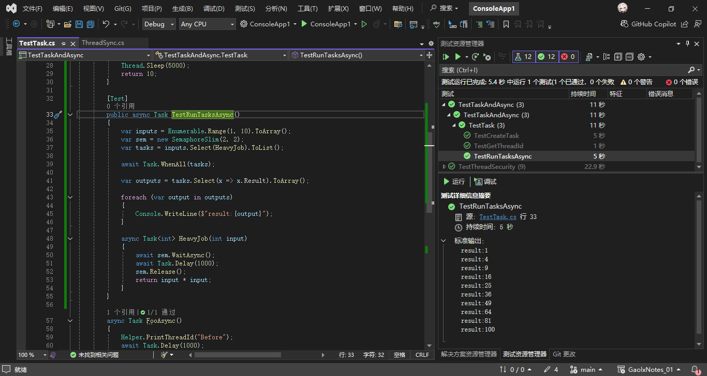

# C#多线程与异步编程（五）

## 1. 简单任务

### 1.1 如何创建异步任务

- Task.Run()
  - 在一个新的线程上执行代码
  - 传入异步匿名方法会被包装成 Task
    - Task.Run(async () => await Task.Delay(100))
    - 保证异步方法在别的线程上运行
- Task.Factory.StartNew()
  - 提供更多功能，比如 TaskCreationOptions.LongRunning
  - Task.Run 相当于简化版
- new Task + Task.Start() 看起来类似 new Thread + Thread.Start()，不常用

---

在C#中，创建异步任务的主要方式包括 `Task.Run()`、`Task.Factory.StartNew()` 和 `new Task()`，但它们的使用场景和行为存在差异。以下从用户提出的几点展开论述：

---

### 1. **`Task.Run()`**
`Task.Run()` 是将代码提交到线程池执行的**推荐方式**，适用于大多数异步任务场景。

#### 新线程上的执行
- 通过 `Task.Run()` 提交的代码会在线程池的线程上运行（不一定是“新线程”，但确保不阻塞主线程）。
- 线程池会根据负载动态分配线程，避免频繁创建/销毁线程的开销。
  
#### 异步匿名方法的处理
当传入**异步匿名方法**时，`Task.Run()` 会自动将异步操作包装为 `Task`，并确保异步方法在线程池线程启动：
```csharp
// 示例：Task.Run 包裹异步方法
Task.Run(async () => {
    await Task.Delay(100); 
    Console.WriteLine("完成延迟");
});
```
- **关键行为**：异步方法的初始部分（`await` 之前）在线程池线程运行，`await` 后的代码可能因同步上下文影响执行位置（如在UI线程需返回主线程）。
- **自动解包**：`Task.Run` 自动处理嵌套 `Task<Task>`，直接返回表示整个异步操作的任务，无需手动 `Unwrap`。

#### Example

```csharp
[Test]
public async Task TestCreateTask()
{
    Helper.PrintThreadId("Before");
    var result = await Task.Run(() => HeavyJob01());
    Console.WriteLine($"result:{result}");
    Helper.PrintThreadId("After");
}

private int HeavyJob01()
{
    Helper.PrintThreadId();
    Thread.Sleep(5000);
    return 10;
}
```



---

### 2. **`Task.Factory.StartNew()`**
`Task.Factory.StartNew()` 提供了更细粒度的控制，但需谨慎使用以避免常见陷阱。

#### 更多功能与选项
- **`TaskCreationOptions`**：支持 `LongRunning`、`DenyChildAttach` 等选项。
  - `LongRunning` 提示任务可能长时间运行，线程池可能为其分配独立线程（避免线程池阻塞）。
  ```csharp
  Task.Factory.StartNew(async () => {
      await Task.Delay(100);
  }, TaskCreationOptions.LongRunning);
  ```

#### 与 `Task.Run()` 的差异
- **默认行为**：`Task.Run` 是 `Task.Factory.StartNew` 的简化版，默认附加 `TaskScheduler.Default` 和 `DenyChildAttach`。
- **异步委托处理**：`StartNew` 返回 `Task<Task>`，需手动调用 `.Unwrap()` 获取实际任务：
  ```csharp
  var task = Task.Factory.StartNew(async () => await Task.Delay(100)).Unwrap();
  ```

---

### 3. **`new Task() + Task.Start()`**
此方式类似 `new Thread().Start()`，但**不推荐使用**。

#### 缺点与风险
- **手动管理**：需显式调用 `Start()` 启动任务，易遗漏导致任务未执行。
- **缺乏灵活性**：无法直接处理异步委托（构造函数仅接受 `Action`/`Func`，不接受 `async` 方法）。
- **反模式**：违背任务基于线程池的设计初衷，可能导致性能问题。

```csharp
// 不推荐示例
var task = new Task(() => Console.WriteLine("运行"));
task.Start();
```

---

### 总结
| 方法                     | 适用场景                          | 异步支持 | 线程行为               | 推荐度 |
|--------------------------|-----------------------------------|----------|------------------------|--------|
| `Task.Run()`             | 简单异步任务                      | ✔️自动解包 | 线程池动态分配         | ★★★★★ |
| `Task.Factory.StartNew()` | 需要精细控制的场景（如 `LongRunning`） | 需 `Unwrap` | 可配置线程池或独立线程 | ★★★☆☆ |
| `new Task() + Start()`    | 遗留代码或特殊需求                | ❌        | 手动管理               | ★☆☆☆☆ |

**最佳实践**：
- 优先使用 `Task.Run()` 简化异步操作。
- 仅在需要 `TaskCreationOptions` 时使用 `Task.Factory.StartNew()`，并注意处理嵌套任务。
- 避免使用 `new Task()`，除非有明确的低级控制需求。

### 1.2 如何同时开启多个异步任务

在C#中，使用`Task.WhenAll()`和`Task.WhenAny()`可以高效地管理多个异步任务。以下是具体实现方法及示例：

### 使用 `Task.WhenAll()`
`Task.WhenAll()`会等待所有任务完成后再继续执行。

#### 示例1：无返回值任务
```csharp
public async Task RunAllTasksAsync()
{
    Task task1 = DoWorkAsync("Task 1");
    Task task2 = DoWorkAsync("Task 2");
    Task task3 = DoWorkAsync("Task 3");

    await Task.WhenAll(task1, task2, task3);
    Console.WriteLine("所有任务完成！");
}

async Task DoWorkAsync(string taskName)
{
    await Task.Delay(1000); // 模拟耗时操作
    Console.WriteLine($"{taskName} 完成");
}
```

#### 示例2：带返回值的任务
```csharp
public async Task ProcessDataAsync()
{
    Task<int> task1 = CalculateResultAsync(10);
    Task<int> task2 = CalculateResultAsync(20);

    int[] results = await Task.WhenAll(task1, task2);
    Console.WriteLine($"结果总和：{results.Sum()}");
}

async Task<int> CalculateResultAsync(int input)
{
    await Task.Delay(500);
    return input * 2;
}
```

### 使用 `Task.WhenAny()`
`Task.WhenAny()`在任意一个任务完成时立即继续。

#### 示例1：处理首个完成的任务
```csharp
public async Task HandleFirstCompletedTaskAsync()
{
    Task<string> task1 = FetchDataAsync("Source1");
    Task<string> task2 = FetchDataAsync("Source2");

    Task<string> firstTask = await Task.WhenAny(task1, task2);
    string result = await firstTask;
    Console.WriteLine($"最先返回的数据：{result}");
}

async Task<string> FetchDataAsync(string source)
{
    await Task.Delay(new Random().Next(500, 2000)); // 模拟不同响应时间
    return $"{source} 的数据";
}
```

#### 示例2：处理任务并取消其他任务
```csharp
public async Task<string> GetDataWithCancellationAsync()
{
    var cts = new CancellationTokenSource();
    var tasks = new List<Task<string>>
    {
        DownloadWithCancelAsync("http://example.com", cts.Token),
        DownloadWithCancelAsync("http://example.org", cts.Token)
    };

    Task<string> completedTask = await Task.WhenAny(tasks);
    cts.Cancel(); // 取消未完成的任务
    return await completedTask;
}

async Task<string> DownloadWithCancelAsync(string url, CancellationToken token)
{
    using (var client = new HttpClient())
    {
        await Task.Delay(1000, token); // 模拟可取消操作
        return await client.GetStringAsync(url);
    }
}
```

#### 示例3
```csharp
[Test]
public async Task TestRunTasksAsync()
{
    var inputs = Enumerable.Range(1, 10).ToArray();
    var sem = new SemaphoreSlim(2, 2);
    var tasks = inputs.Select(HeavyJob).ToList();

    await Task.WhenAll(tasks);

    var outputs = tasks.Select(x => x.Result).ToArray();

    foreach (var output in outputs)
    {
        Console.WriteLine($"result:{output}");
    }

    async Task<int> HeavyJob(int input)
    {
        await sem.WaitAsync();
        await Task.Delay(1000);
        sem.Release();
        return input * input;
    }
}
```



通过上述方法，可以灵活管理多个异步任务的执行与结果处理。
