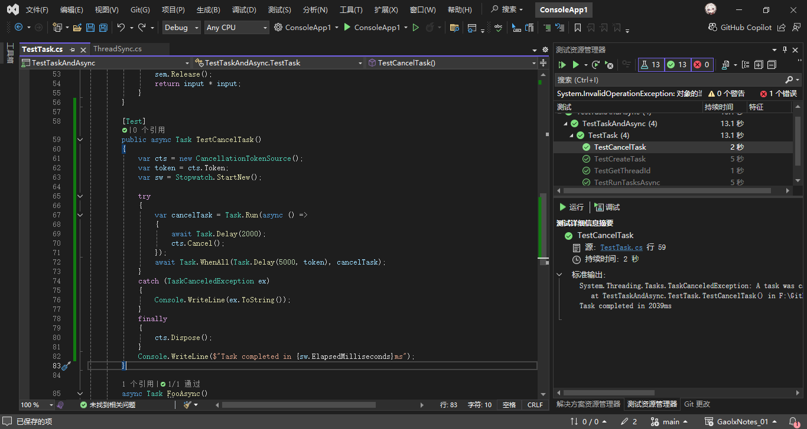
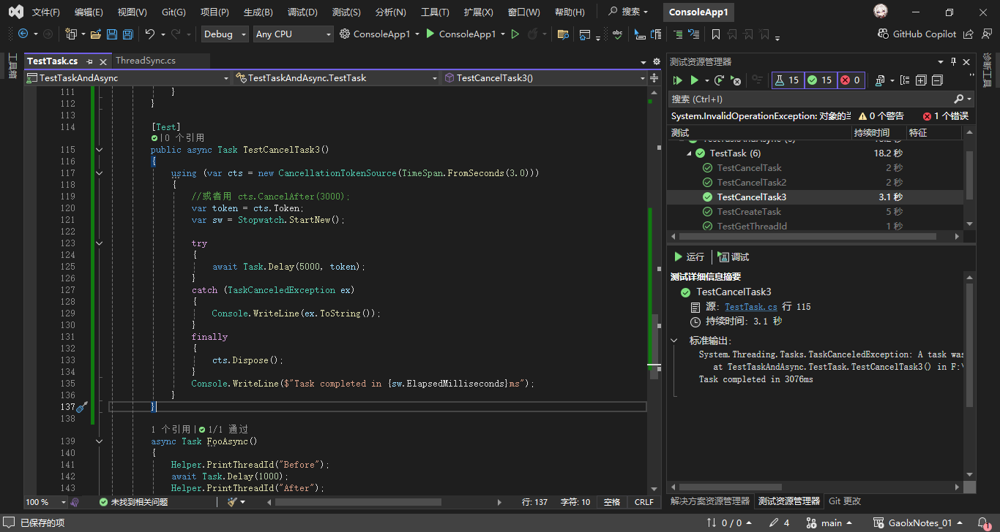
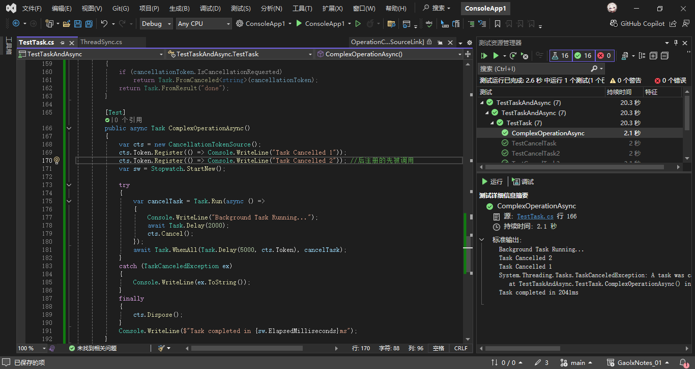

# C#多线程与异步编程（六）

## 4. 异步取消

当我们执行一个异步任务的时候，可能任务执行中途会以各种理由，取消这个任务，因此，我们需要借助 CancellationTokenSource + CancellationToken 来实现异步任务的取消，许多异步方法（例如SemaphoreSlim.WaitAsync）也允许传入CancellationToken来取消。

### 4.1 CancellationTokenSource + CancellationToken取消异步

案例一（手动取消）：

```csharp
[Test]
public async Task TestCancelTask()
{
    var cts = new CancellationTokenSource();
    var token = cts.Token;
    var sw = Stopwatch.StartNew();

    try
    {
        var cancelTask = Task.Run(async () =>
        {
            await Task.Delay(2000);
            cts.Cancel();
        });
        await Task.WhenAll(Task.Delay(5000, token), cancelTask);
    }
    catch (TaskCanceledException ex)
    {
        Console.WriteLine(ex.ToString());
    }
    finally
    {
        cts.Dispose();
    }
    Console.WriteLine($"Task completed in {sw.ElapsedMilliseconds}ms");
}
```



---

### **1. 异步取消的异常处理问题**
- **`Task.WhenAll` 的异常包装机制**：当多个任务中有一个抛出取消异步的异常时，会抛出`TaskCanceledException`，需要处理。

---

### **2. `CancellationTokenSource` 的释放问题**
#### 原代码问题：
- **手动调用 `Dispose` 的风险**：虽然代码在 `finally` 中调用了 `cts.Dispose()`，但若作用域内出现未处理的异常或提前返回，可能跳过释放（尽管此处 `finally` 已经较安全）。
- **更优雅的释放方式**：使用 `using` 语句可以自动管理资源生命周期，确保 `Dispose` 被调用。

#### 改进方案：
- **用 `using` 包裹 `CancellationTokenSource`**：将 `cts` 包裹在 `using` 作用域中，自动释放资源。

```csharp
[Test]
public async Task TestCancelTask2()
{
    using (var cts = new CancellationTokenSource())
    {
        var token = cts.Token;
        var sw = Stopwatch.StartNew();

        try
        {
            var cancelTask = Task.Run(async () =>
            {
                await Task.Delay(2000);
                cts.Cancel();
            });
            await Task.WhenAll(Task.Delay(5000, token), cancelTask);
        }
        catch (TaskCanceledException ex)
        {
            Console.WriteLine(ex.ToString());
        }
        finally
        {
            cts.Dispose();
        }
        Console.WriteLine($"Task completed in {sw.ElapsedMilliseconds}ms");
    }
}
```

---

此改进方案确保异常被正确处理且资源管理更安全。

---

案例二（超时自动取消）：

```csharp
[Test]
public async Task TestCancelTask3()
{
    using (var cts = new CancellationTokenSource(TimeSpan.FromSeconds(3.0)))
    {
        //或者用 cts.CancelAfter(3000);
        var token = cts.Token;
        var sw = Stopwatch.StartNew();

        try
        {
            await Task.Delay(5000, token);
        }
        catch (TaskCanceledException ex)
        {
            Console.WriteLine(ex.ToString());
        }
        finally
        {
            cts.Dispose();
        }
        Console.WriteLine($"Task completed in {sw.ElapsedMilliseconds}ms");
    }
}
```

---



---

### **TimeSpan 介绍**
#### **作用**：
- `TimeSpan`是C#中表示时间间隔的结构体，用于精确描述时间段（如天、小时、分钟、秒、毫秒）。

#### **常用创建方法**：
- `TimeSpan.FromDays(double)`: 按天数创建。
- `TimeSpan.FromHours(double)`: 按小时数创建。
- `TimeSpan.FromMinutes(double)`: 按分钟数创建。
- `TimeSpan.FromSeconds(double)`: 按秒数创建。
- `TimeSpan.FromMilliseconds(double)`: 按毫秒数创建。

#### **示例**：
```csharp
TimeSpan ts1 = TimeSpan.FromSeconds(3);    // 3秒
TimeSpan ts2 = TimeSpan.FromMinutes(1.5);  // 1分30秒
TimeSpan ts3 = TimeSpan.FromMilliseconds(500); // 500毫秒
```

#### **其他功能**：
- **时间计算**：支持加减运算（`+`, `-`）和比较（`>`, `<`）。
- **属性提取**：可通过`Days`, `Hours`, `Minutes`, `Seconds`, `Milliseconds`等属性获取时间间隔的各部分值。

---

解读：

这段C#代码通过`CancellationTokenSource`和`TimeSpan`实现了异步任务的超时自动取消机制。以下是实现原理的详细分析及`TimeSpan`的介绍：

---

### **超时自动取消的实现原理**
#### 代码关键点：
- **`CancellationTokenSource`**：用于生成取消令牌（`CancellationToken`），并在指定时间后触发取消操作。
  - 构造函数`new CancellationTokenSource(TimeSpan.FromSeconds(3.0))`会在3秒后自动触发取消。
  - 内部通过一个计时器实现超时，超时后调用`Cancel()`方法，将`CancellationToken`的状态标记为“已取消”。
- **`Task.Delay`**：接受一个`CancellationToken`参数，当令牌被取消时，`Task.Delay`会立即抛出`TaskCanceledException`。
  - 本例中`Task.Delay(5000, token)`原本会等待5秒，但3秒后因令牌取消而提前终止。

#### 执行流程：
1. 创建`CancellationTokenSource`并设置3秒超时。
2. 启动`Stopwatch`记录耗时。
3. 执行`Task.Delay(5000, token)`，传入取消令牌。
4. **3秒后**，`CancellationTokenSource`触发取消，`Task.Delay`抛出`TaskCanceledException`。
5. 异常被`catch`块捕获，输出异常信息。
6. 最终输出耗时约为3000ms（而非5000ms），证明任务因超时被取消。

---

### 说明

1. CTS 实现了 IDisposable 接口，所以需要释放。
2. CTS 还可以传入一个 TimeSpan，表示超时后自动取消，或调用 CancelAfter 方法。
3. 推荐所有异步方法都带上 CancellationToken 这一传参。

### 补充

#### 1. 异步方法中 CancellationToken 重载写法

为了方便的取消异步任务，我们通常会给每个方法都写一个传入CancellationToken的参数，但很多时候，我们并不是总需要传入 CancellationToken 取消，对此我们可以写一个不带CT的方法重载，或者直接传入一个可为空的 CancellationToken。

```csharp
class Demo
{
    private async Task FooAsync(CancellationToken ct)
    {
        await Task.Delay(5000, ct);
        // ...
    }

    private async Task FooAsync()
    {
        await FooAsync(CancellationToken.None);
    }
    //或者：
    //private async Task FooAsync() => await FooAsync(CancellationToken.None);
    //private Task FooAsync() => FooAsync(CancellationToken.None);

    private async Task FooAsync2(int delay, CancellationToken? ct = null)
    {
        var token = ct ?? CancellationToken.None;
        await Task.Delay(delay, token);
    }
}
```

有时候为了保证不阻塞，我们会用await Task.Run去包装一些方法使其变成异步，显然我们无法直接用 CancellationToken 取消他，对于这种情况，可以手动处理。
我们在运行Task.Run中的任务前以及函数体中一些操作（IO、循环）前都先检查 IsCancellationRequested 字段，检查token是否被取消，如果被取消则抛出 OperationCanceledException异常。（不推荐，建议改写成异步方法）

```csharp
private Task FooAsync3(CancellationToken cancellationToken)
{
    return Task.Run(() =>
    {
        if (cancellationToken.IsCancellationRequested)
            cancellationToken.ThrowIfCancellationRequested();
        //...
        while (true)
        {
            if (cancellationToken.IsCancellationRequested)
                cancellationToken.ThrowIfCancellationRequested();
            //...
            Thread.Sleep(1000);
            Console.WriteLine("Background Task Running...");
        }
    });
}
```

### 4.2 异步任务取消的处理

- 抛出异常
  - TaskCanceledException
  - OperationCanceledException
- 提前返回
  - Task.FromCancelled
- 记得售后
  - try-catch-finally
  - Token.Register()
    - Register中注册委托，当异步任务取消会触发的回调
  - 注意中释放资源、非托管对象

---

抛出异常的处理方式：
第一种处理方式，前面讲的很清楚了，假如我们实在不希望任务取消抛出异常，可以用 `Task.FromCancelled` 来提前返回。

```csharp
private Task<string> FooAsync4(CancellationToken cancellationToken)
{
    if (cancellationToken.IsCancellationRequested)
        return Task.FromCanceled<string>(cancellationToken);
    return Task.FromResult("done");
}
```

---

### 1. 抛出异常：显式通知任务被取消
#### (1) `TaskCanceledException` 和 `OperationCanceledException`
- **区别**：
  - `OperationCanceledException` 是基类，表示通用取消操作。
  - `TaskCanceledException` 继承自前者，专用于 `Task` 相关的取消（如 `Task.Run` 内部）。
- **使用场景**：
  ```csharp
  async Task DoWorkAsync(CancellationToken token)
  {
      token.ThrowIfCancellationRequested(); // 手动触发 OperationCanceledException
      await Task.Delay(1000, token);         // 内部可能抛出 TaskCanceledException
  }
  ```

#### (2) 手动触发取消异常
在长时间运行的循环中定期检查取消标记：
```csharp
while (!token.IsCancellationRequested)
{
    // 工作代码
}
token.ThrowIfCancellationRequested(); // 退出循环后显式抛出
```

---

### 2. 提前返回：不抛出异常，直接返回取消状态
#### (1) `Task.FromCanceled`
直接返回一个已取消的任务，避免后续逻辑执行：
```csharp
async Task<int> CalculateAsync(CancellationToken token)
{
    if (token.IsCancellationRequested)
        return await Task.FromCanceled<int>(token); // 提前返回取消状态的任务
    
    // 正常逻辑
    return 42;
}
```

---

### 3. 资源释放：确保取消时清理资源
#### (1) `try-catch-finally` 基础保障
无论是否取消，`finally` 块始终执行：
```csharp
async Task ReadFileAsync(CancellationToken token)
{
    FileStream file = null;
    try
    {
        file = File.OpenRead("data.txt");
        await ProcessDataAsync(file, token);
    }
    catch (OperationCanceledException)
    {
        Console.WriteLine("任务被取消。");
    }
    finally
    {
        file?.Dispose(); // 确保文件句柄释放
    }
}
```

#### (2) `CancellationToken.Register` 高级回调
注册取消时的回调函数，适合非托管资源：
```csharp
async Task ConnectToDeviceAsync(CancellationToken token)
{
    var device = new ExternalDevice();
    // 注册取消回调
    using (token.Register(() => device.SafeShutdown()))
    {
        await device.ConnectAsync(token);
        // 其他操作
    }
}
```

#### 关键注意事项：
- **回调线程安全性**：`Register` 的回调可能在任意线程触发，需确保线程安全。
- **及时注销回调**：通过 `using` 或手动调用 `Unregister` 避免内存泄漏。
- **避免阻塞**：回调中避免耗时操作，防止取消请求被阻塞。

---

### 完整示例

```csharp
[Test]
public async Task ComplexOperationAsync()
{
    var cts = new CancellationTokenSource();
    cts.Token.Register(() => Console.WriteLine("Task Cancelled 1"));
    cts.Token.Register(() => Console.WriteLine("Task Cancelled 2")); //后注册的先被调用
    var sw = Stopwatch.StartNew();

    try
    {
        var cancelTask = Task.Run(async () =>
        {
            Console.WriteLine("Background Task Running...");
            await Task.Delay(2000);
            cts.Cancel();
        });
        await Task.WhenAll(Task.Delay(5000, cts.Token), cancelTask);
    }
    catch (TaskCanceledException ex)
    {
        Console.WriteLine(ex.ToString());
    }
    finally
    {
        cts.Dispose();
    }
    Console.WriteLine($"Task completed in {sw.ElapsedMilliseconds}ms");
}
```

运行结果如下：



---

### 2. 为Task.Run传入 CancellationToken

在 C# 中，将 `CancellationToken` 传递给 `Task.Run` 的主要意义在于实现**协作式取消**，具体作用如下：

---

### 1. **任务未启动时，阻止执行**
   - 如果任务**尚未开始执行**（例如线程池资源紧张时排队等待），传递的 `CancellationToken` 可以立即取消任务，使其状态直接变为 `Canceled`，避免无意义的执行。
   - **示例**：
     ```csharp
     var cts = new CancellationTokenSource();
     var task = Task.Run(() => DoWork(), cts.Token);
     cts.Cancel(); // 如果任务未启动，会被直接取消
     ```

---

### 2. **与任务内部逻辑配合，实现协作取消**
   - `CancellationToken` 本身不会自动终止正在运行的任务，需要任务代码**主动检查**令牌状态：
     - 通过 `token.ThrowIfCancellationRequested()` 抛出 `OperationCanceledException`。
     - 检查 `token.IsCancellationRequested` 并手动终止。
   - **示例**：
     ```csharp
     Task.Run(() => {
         while (true) {
             token.ThrowIfCancellationRequested(); // 若取消，抛出异常
             // 或者手动检查：
             if (token.IsCancellationRequested) break;
         }
     }, token); // 传入 CancellationToken
     ```

---

### 3. **正确传递任务状态**
   - 当任务因取消而抛出 `OperationCanceledException` 时：
     - 若 `CancellationToken` 通过 `Task.Run` 传递，任务状态会变为 `Canceled`。
     - 若未传递，任务状态会变为 `Faulted`（异常状态），而非标准的取消状态。
   - **这对任务的状态监控和延续处理（如 `ContinueWith`）非常重要**。

---

### 4. **资源优化**
   - 避免启动不再需要的任务，减少线程池资源的浪费。

---

### 完整示例
```csharp
var cts = new CancellationTokenSource();
CancellationToken token = cts.Token;

// 传递 CancellationToken 给 Task.Run
var task = Task.Run(() => {
    for (int i = 0; i < 100; i++) {
        token.ThrowIfCancellationRequested(); // 协作式取消检查
        Thread.Sleep(100);
    }
}, token); // 传入令牌

cts.CancelAfter(1000); // 1秒后取消

try {
    await task;
} catch (OperationCanceledException) {
    Console.WriteLine("任务已取消。");
}

Console.WriteLine(task.Status); // 输出: Canceled
```

---

### 关键总结
- **仅传递 `CancellationToken` 给 `Task.Run` 是不够的**，任务内部必须主动响应取消请求。
- 两者的结合使用能实现：
  - 任务未启动时的快速取消。
  - 任务执行中的优雅终止。
  - 正确的任务状态跟踪。
