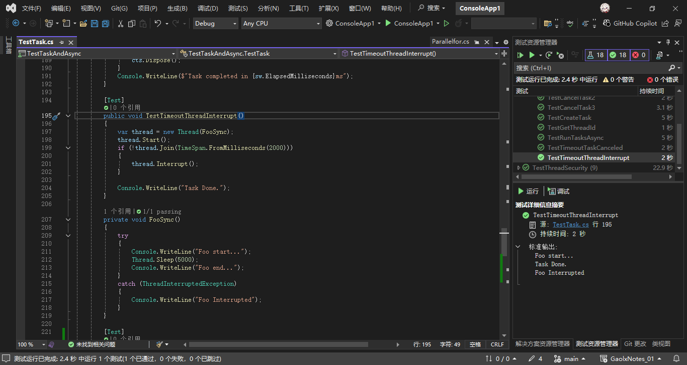
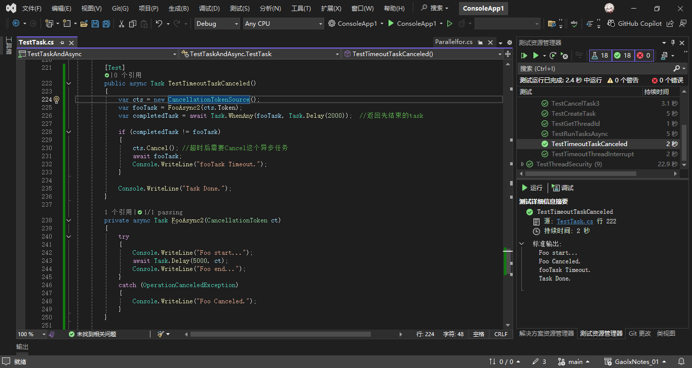

# C#多线程与异步编程（七）

## 5. 异步超时

### 1. thread中的超时机制

```csharp
[Test]
public void TestTimeoutThreadInterrupt()
{
    var thread = new Thread(FooSync);
    thread.Start();
    if (!thread.Join(TimeSpan.FromMilliseconds(2000)))
    {
        thread.Interrupt();
    }

    Console.WriteLine("Task Done.");
}

private void FooSync()
{
    try
    {
        Console.WriteLine("Foo start...");
        Thread.Sleep(5000);
        Console.WriteLine("Foo end...");
    }
    catch (ThreadInterruptedException)
    {
        Console.WriteLine("Foo Interrupted");
    }
}
```



在C#中，这段代码通过结合`Thread.Join`的超时检测和`Thread.Interrupt`方法，实现了对线程执行的超时控制。具体机制如下：

---

### 1. **超时检测机制**
- **`thread.Join(TimeSpan.FromMilliseconds(2000))`**：  
  主线程调用`Join`方法并设置2秒的超时时间。此方法会阻塞主线程，直到以下两种情况之一发生：
  - **子线程在2秒内完成**：`Join`返回`true`，主线程继续执行后续代码（不触发中断）。
  - **子线程未在2秒内完成**：`Join`返回`false`，主线程调用`thread.Interrupt()`中断子线程。

---

### 2. **中断子线程**
- **`thread.Interrupt()`**：  
  当主线程调用此方法时，若子线程正处于**可中断的阻塞状态**（如`Thread.Sleep`、`Monitor.Wait`等），则会抛出`ThreadInterruptedException`异常。在此代码中，子线程正在执行`Thread.Sleep(5000)`，因此会被立即中断。

---

### 3. **子线程的异常处理**
- **`catch (ThreadInterruptedException ex)`**：  
  子线程在睡眠过程中被中断后，会捕获此异常并提前结束阻塞状态，从而终止耗时操作（原本需要5秒的`Sleep`被缩短）。

---

### 执行流程示例
1. 主线程启动子线程，子线程进入`FooSync`并开始睡眠5秒。
2. 主线程等待子线程最多2秒：
   - 若2秒内子线程未完成（实际不可能，因为子线程需5秒），主线程调用`Interrupt`。
3. 子线程在睡眠中被中断，抛出异常，执行`catch`块后结束。
4. 最终控制台输出：
   ```
   Foo start...
   Task Done.
   Foo Interrupted
   ```

---

### 2. async Task中的超时机制

1. 用 `Task.WhenAny(Task, Task.Delay())` 实现异步超时。

```csharp
[Test]
public async Task TestTimeoutTaskCanceled()
{
    var cts = new CancellationTokenSource();
    var fooTask = FooAsync2(cts.Token);
    var completedTask = await Task.WhenAny(fooTask, Task.Delay(2000));  //返回先结束的task

    if (completedTask != fooTask)
    {
        cts.Cancel(); //超时后需要Cancel这个异步任务
        await fooTask;
        Console.WriteLine("fooTask Timeout.");
    }

    Console.WriteLine("Task Done.");
}

private async Task FooAsync2(CancellationToken ct)
{
    try
    {
        Console.WriteLine("Foo start...");
        await Task.Delay(5000, ct);
        Console.WriteLine("Foo end...");
    }
    catch (OperationCanceledException)
    {
        Console.WriteLine("Foo Canceled.");
    }
}
```



---

这段C#代码通过`Task.WhenAny`实现异步超时的机制如下：

### 关键步骤解析：
1. **并发执行任务与超时检测**  
   使用`Task.WhenAny(fooTask, Task.Delay(2000))`同时等待`fooTask`（实际业务逻辑）和`Task.Delay(2000)`（超时检测）。无论哪个任务先完成，`Task.WhenAny`会立即返回已完成的任务。

2. **判定超时**  
   若`completedTask`不等于`fooTask`，说明`Task.Delay(2000)`先完成（即超时发生）。此时调用`cts.Cancel()`取消`fooTask`，并通过`await fooTask`等待其终止（确保资源清理或异常处理）。

3. **处理任务取消**  
   在`FooAsync2`中，`Task.Delay(5000, ct)`绑定取消令牌。取消时，抛出`OperationCanceledException`，触发catch块输出“Foo Canceled.”，确保任务优雅终止。

### 输出顺序示例（超时场景）：
```text
Foo start...          // FooAsync2开始执行
（2秒后）
Foo Canceled.         // 超时后取消，触发异常处理
fooTask Timeout.      // 主线程处理超时
Task Done.            // 最终完成
```

2. 自定义异步拓展方法 `TimeoutAfter` 实现超时取消

```csharp
static class AsyncExtensions
{
    public static async Task<TResult> TimeoutAfter<TResult>(this Task<TResult> task, TimeSpan timeout)
    {
        using var cts = new CancellationTokenSource();
        var completedTask = await Task.WhenAny(task, Task.Delay(timeout, cts.Token));
        if (completedTask != task)
        {
            cts.Cancel();
            throw new TimeoutException();
        }

        return await task;
    }
}
```

该C#扩展方法通过结合`Task.WhenAny`和`Task.Delay`实现异步超时机制，其核心逻辑如下：

1. **创建取消令牌源**：  
   使用`CancellationTokenSource`生成取消令牌，用于控制`Task.Delay`的超时任务。`using`语句确保资源释放。

2. **并行等待任务与超时**：  
   通过`Task.WhenAny`同时等待原始任务和带有取消令牌的`Task.Delay`。第一个完成的任务（原任务或超时）将返回。

3. **处理超时情况**：  
   - 若`Task.Delay`先完成（即超时），调用`cts.Cancel()`取消延迟任务（避免资源浪费），并抛出`TimeoutException`。
   - 若原任务先完成，直接返回其结果。通过再次`await task`确保异常正确传播（如任务已失败，此处会抛出相应异常）。

**总结**：该方法通过竞争执行原任务和超时任务，实现异步超时控制。核心机制依赖`Task.WhenAny`的竞争等待，结合取消令牌管理延迟任务，确保超时后及时中断并抛出异常。

3. 