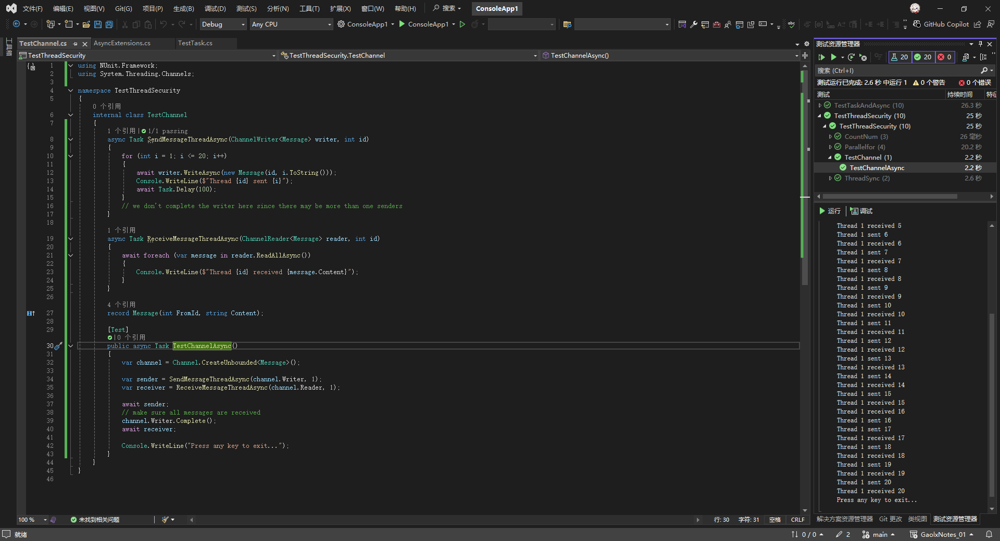

# C#多线程与异步编程（八）

## 6. 使用Channel实现异步任务之间的通信

在异步编程中，我们无法使用`BlockingCollection`并发集合，原因是其阻塞性与异步编程的非阻塞设计原则存在冲突，例如BlockingCollection依赖同步机制（如锁、事件等），这些机制在异步上下文中无法正确协作。异步方法可能在任意线程上恢复执行，导致同步原语失效或死锁。因此，我们需要使用Channel<T>实现异步任务之间的通信。

### 1. Channel<T>

在C#中，`Channel<T>` 是.NET Core 3.0及更高版本中引入的一个高性能异步通信机制，专为**生产者-消费者场景**设计。它提供了一种线程安全的、异步友好的方式，用于在多个任务或线程之间传递数据，尤其适合高并发或异步数据流处理。

---

### **核心概念**
1. **通道类型**：
   - **无界通道** (`Channel.CreateUnbounded<T>()`)：容量无限，生产者可以无阻塞写入。
   - **有界通道** (`Channel.CreateBounded<T>(capacity)`)：固定容量，写入满时生产者需等待空间。

2. **核心组件**：
   - `ChannelWriter<T>`：用于写入数据（生产者端）。
   - `ChannelReader<T>`：用于读取数据（消费者端）。

3. **核心操作**：
   - 写入数据：`WriteAsync`（非阻塞）、`WaitToWriteAsync`（等待写入条件）。
   - 读取数据：`ReadAsync`（非阻塞）、`WaitToReadAsync`（等待数据到来）。
   - 关闭通道：`Complete()` 标记通道不再接受新数据。

---

### **实现异步任务通信**
以下是一个完整示例，展示如何用 `Channel<T>` 实现生产者和消费者之间的异步通信：

#### 1. 创建通道
```csharp
using System.Threading.Channels;

// 创建无界通道
var channel = Channel.CreateUnbounded<int>();

// 创建有界通道（容量为10）
// var channel = Channel.CreateBounded<int>(10);
```

#### 2. 生产者写入数据
```csharp
async Task Producer(ChannelWriter<int> writer)
{
    for (int i = 0; i < 10; i++)
    {
        await writer.WriteAsync(i); // 异步写入
        await Task.Delay(100); // 模拟生产耗时
    }
    writer.Complete(); // 标记写入完成
}
```

#### 3. 消费者读取数据
```csharp
async Task Consumer(ChannelReader<int> reader)
{
    try
    {
        // 循环读取直到通道关闭
        await foreach (var item in reader.ReadAllAsync())
        {
            Console.WriteLine($"Consumed: {item}");
            await Task.Delay(200); // 模拟消费耗时
        }
    }
    catch (ChannelClosedException)
    {
        Console.WriteLine("Channel closed.");
    }
}
```

#### 4. 启动生产者和消费者
```csharp
var producerTask = Producer(channel.Writer);
var consumerTask = Consumer(channel.Reader);

await Task.WhenAll(producerTask, consumerTask);
```

---

### **关键特性与最佳实践**
1. **线程安全**：
   - `ChannelWriter<T>` 和 `ChannelReader<T>` 是线程安全的，支持多生产者和多消费者。

2. **背压控制**（有界通道）：
   - 当通道满时，`WriteAsync` 会自动等待，避免生产者过载。
   - 可通过 `BoundedChannelOptions` 配置满时行为（如 `FullMode.Wait` 或 `FullMode.DropOldest`）。

3. **高效异步迭代**：
   - `ReadAllAsync()` 返回 `IAsyncEnumerable<T>`，允许用 `await foreach` 简化消费逻辑。

4. **错误传播**：
   - 若生产者或消费者抛出异常，可调用 `writer.TryComplete(ex)` 传递异常到消费者。

5. **关闭通道**：
   - 确保调用 `writer.Complete()` 通知消费者结束，否则消费者可能永久等待。

---

### **多生产者和消费者示例**
```csharp
// 创建通道
var channel = Channel.CreateUnbounded<int>();

// 启动3个生产者
var producers = Enumerable.Range(0, 3).Select(i => 
    Task.Run(() => Producer(channel.Writer))
).ToArray();

// 启动2个消费者
var consumers = Enumerable.Range(0, 2).Select(i => 
    Task.Run(() => Consumer(channel.Reader))
).ToArray();

await Task.WhenAll(producers);
channel.Writer.Complete(); // 所有生产者完成后关闭通道
await Task.WhenAll(consumers);
```

---

### **适用场景**
- 流式数据处理（如实时日志、事件流）。
- 任务队列（生产者提交任务，消费者处理）。
- 微服务间异步通信（结合 `System.Threading.Channels` 和网络层）。

通过 `Channel<T>`，开发者可以轻松构建高效、可扩展的异步数据流管道，避免手动管理锁或阻塞操作。

### 3. BoundedChannelOptions

在 C# 中，`BoundedChannelOptions` 是用于配置**有界通道**（`Channel.CreateBounded<T>`）的核心类。通过它，可以精细控制通道的行为，尤其是在通道容量满时如何处理生产者和消费者之间的协调。以下是它的关键属性和使用场景的详细说明：

---

### **BoundedChannelOptions 核心属性**

#### 1. **`Capacity`（容量）**
   - **作用**：定义通道的最大容量（即最多能存储多少数据项）。
   - **示例**：
     ```csharp
     var options = new BoundedChannelOptions(100) { ... };
     var channel = Channel.CreateBounded<int>(options);
     ```
   - **注意**：容量必须为正整数，超过容量时根据 `FullMode` 处理。

#### 2. **`FullMode`（满时模式）**
   - **作用**：当通道已满时，生产者写入数据的策略。
   - **可选值**：
     - **`Wait`（默认）**：生产者调用 `WriteAsync` 时会被阻塞，直到有空间可用。
     - 适合严格保证数据完整性的场景（不允许丢失数据）。
     - 示例：日志处理必须记录所有条目。
     
     - **`DropNewest`**：丢弃最新的未写入项（直接丢弃当前要写入的项）。
     - 适合实时数据流，允许丢弃最新的冗余数据。
     - 示例：传感器数据流，只需保留最新的有效值。
     
     - **`DropOldest`**：丢弃最旧的已存储项，腾出空间写入新项。
     - 适合处理历史数据不重要，但需要最新数据的场景。
     - 示例：实时股票价格推送，仅关心当前价格。
     
     - **`DropWrite`**：静默丢弃当前写入的项（不阻塞，直接忽略）。
     - 适合低优先级数据，允许按需丢弃。
     - 示例：非关键的状态更新，可以容忍丢失。

   - **示例配置**：
     ```csharp
     var options = new BoundedChannelOptions(10)
     {
         FullMode = BoundedChannelFullMode.DropOldest
     };
     ```

#### 3. **`AllowSynchronousContinuations`（允许同步延续）**
   - **作用**：控制异步操作的延续（continuation）是否可能在同步上下文中执行。
   - **默认值**：`false`（延续通常在线程池线程执行）。
   - **设为 `true`**：
     - 可能提升性能（减少线程切换），但需确保代码不会因同步执行导致死锁。
     - 适合高性能场景，且开发者明确了解异步上下文管理。

#### 4. **`SingleWriter`（单生产者）**
   - **作用**：是否只有单个生产者会写入通道。
   - **默认值**：`false`（允许多生产者）。
   - **设为 `true`**：
     - 通道会优化并发控制，提升性能。
     - 如果实际存在多个生产者，可能引发竞争异常。

#### 5. **`SingleReader`（单消费者）**
   - **作用**：是否只有单个消费者会读取通道。
   - **默认值**：`false`（允许多消费者）。
   - **设为 `true`**：
     - 优化读取性能，减少锁竞争。
     - 若存在多个消费者，可能引发异常。

---

### **完整使用示例**

#### 场景：实时股票价格处理
- 需求：
  - 最多缓存最新的 100 条价格。
  - 当通道满时，丢弃最旧的价格，写入新价格。
  - 允许多生产者（多个数据源）、多消费者。

```csharp
using System.Threading.Channels;

// 配置通道选项
var options = new BoundedChannelOptions(100)
{
    FullMode = BoundedChannelFullMode.DropOldest, // 满时丢弃最旧数据
    AllowSynchronousContinuations = false,        // 安全模式
    SingleWriter = false,                         // 允许多生产者
    SingleReader = false                          // 允许多消费者
};

// 创建有界通道
var channel = Channel.CreateBounded<StockPrice>(options);

// 生产者写入
async Task ProduceStockPrice(ChannelWriter<StockPrice> writer, string source)
{
    while (true)
    {
        var price = await FetchStockPriceAsync(source); // 模拟获取实时价格
        await writer.WriteAsync(price);
    }
}

// 消费者读取
async Task ConsumeStockPrices(ChannelReader<StockPrice> reader)
{
    await foreach (var price in reader.ReadAllAsync())
    {
        Console.WriteLine($"Processed: {price.Symbol} ${price.Value}");
    }
}

// 启动多个生产者和消费者
var producer1 = ProduceStockPrice(channel.Writer, "SourceA");
var producer2 = ProduceStockPrice(channel.Writer, "SourceB");
var consumer1 = ConsumeStockPrices(channel.Reader);
var consumer2 = ConsumeStockPrices(channel.Reader);

await Task.WhenAll(producer1, producer2);
channel.Writer.Complete(); // 关闭通道（实际场景可能不需要）
await Task.WhenAll(consumer1, consumer2);
```

---

### **最佳实践与注意事项**

1. **容量选择**：
   - 根据内存和数据重要性权衡容量大小。例如：
     - 实时视频帧处理：容量小（如 5-10），避免内存爆炸。
     - 任务队列：容量大（如 1000），允许积压任务。

2. **`FullMode` 选择**：
   - **`Wait`**：严格数据完整性（如支付交易）。
   - **`DropOldest`/`DropNewest`**：实时数据流（如 IoT 传感器）。
   - **`DropWrite`**：非关键数据（如 UI 界面更新）。

3. **性能优化**：
   - 若确定只有单生产者/消费者，设置 `SingleWriter`/`SingleReader` 为 `true` 以减少锁开销。
   - 谨慎使用 `AllowSynchronousContinuations`，仅在无同步上下文（如非 UI 线程）时启用。

4. **异常处理**：
   - 生产者调用 `WriteAsync` 时若通道已关闭（`Complete()` 被调用），会抛出 `ChannelClosedException`。
   - 消费者可通过 `reader.Completion` 属性监听通道关闭事件：
     ```csharp
     try
     {
         await reader.Completion;
     }
     catch (ChannelClosedException ex)
     {
         Console.WriteLine($"Channel closed: {ex.Message}");
     }
     ```

---

通过灵活配置 `BoundedChannelOptions`，可以实现高性能、高可靠性的异步通信管道，适应各种复杂场景需求。

---

#### 案例


```csharp
using NUnit.Framework;
using System.Threading.Channels;

namespace TestThreadSecurity
{
    internal class TestChannel
    {
        async Task SendMessageThreadAsync(ChannelWriter<Message> writer, int id)
        {
            for (int i = 1; i <= 20; i++)
            {
                await writer.WriteAsync(new Message(id, i.ToString()));
                Console.WriteLine($"Thread {id} sent {i}");
                await Task.Delay(100);
            }
            // we don't complete the writer here since there may be more than one senders
        }

        async Task ReceiveMessageThreadAsync(ChannelReader<Message> reader, int id)
        {
            await foreach (var message in reader.ReadAllAsync())
            {
                Console.WriteLine($"Thread {id} received {message.Content}");
            }
        }

        record Message(int FromId, string Content);

        [Test]
        public async Task TestChannelAsync()
        {
            var channel = Channel.CreateUnbounded<Message>();

            var sender = SendMessageThreadAsync(channel.Writer, 1);
            var receiver = ReceiveMessageThreadAsync(channel.Reader, 1);

            await sender;
            // make sure all messages are received
            channel.Writer.Complete();
            await receiver;

            Console.WriteLine("Press any key to exit...");
        }
    }
}

```

运行结果：



---

这段C#代码通过`System.Threading.Channels`实现异步任务间通信的核心机制如下：

### 1. **Channel的创建**
   ```csharp
   var channel = Channel.CreateUnbounded<Message>();
   ```
   创建一个无界（Unbounded）的Channel，允许生产者（发送者）无限写入消息，无需等待消费者（接收者）。Channel内部自动处理线程同步，确保生产者和消费者的并发安全。

---

### 2. **生产者逻辑（发送消息）**
   ```csharp
   async Task SendMessageThreadAsync(ChannelWriter<Message> writer, int id) {
       for (int i = 1; i <= 20; i++) {
           await writer.WriteAsync(new Message(id, i.ToString())); // 异步写入消息
           Console.WriteLine($"Thread {id} sent {i}");
           await Task.Delay(100);
       }
   }
   ```
   - **异步写入**：通过`WriteAsync`方法异步向Channel写入消息，避免阻塞当前线程。
   - **循环发送**：发送20条消息，每条间隔100毫秒。
   - **不主动Complete**：注释指出可能有多个发送者，因此单个发送者完成时不关闭Writer，由外部统一管理。

---

### 3. **消费者逻辑（接收消息）**
   ```csharp
   async Task ReceiveMessageThreadAsync(ChannelReader<Message> reader, int id) {
       await foreach (var message in reader.ReadAllAsync()) { // 异步遍历消息
           Console.WriteLine($"Thread {id} received {message.Content}");
       }
   }
   ```
   - **异步遍历**：`ReadAllAsync`返回`IAsyncEnumerable<Message>`，结合`await foreach`持续异步读取消息。
   - **自动终止条件**：当Channel的Writer调用`Complete()`后，`ReadAllAsync`会结束遍历，退出循环。

---

### 4. **协调生产与消费**
   ```csharp
   [Test]
   public async Task TestChannelAsync() {
       var channel = Channel.CreateUnbounded<Message>();
   
       var sender = SendMessageThreadAsync(channel.Writer, 1);
       var receiver = ReceiveMessageThreadAsync(channel.Reader, 1);
   
       await sender;          // 等待发送任务完成
       channel.Writer.Complete(); // 标记Channel写入完成
       await receiver;         // 等待接收任务处理剩余消息
   }
   ```
   - **启动任务**：同时启动生产者和消费者任务。
   - **等待生产者完成**：`await sender`确保所有消息已发送。
   - **关闭Channel**：调用`Writer.Complete()`通知消费者不再有新消息，触发接收循环退出。
   - **等待消费者完成**：`await receiver`确保所有消息被处理。

---

### 5. **线程安全与异步协作**
   - **隐式同步**：Channel内部机制保证了多线程下的线程安全，无需手动加锁。
   - **流量控制**（若有界Channel）：若使用`CreateBounded`，当队列满时，`WriteAsync`会等待直到有空间，天然支持背压。
   - **无阻塞设计**：通过异步方法（`WriteAsync`/`ReadAllAsync`）避免阻塞线程，适合高并发场景。

---

### 关键点总结
- **生产者-消费者模式**：通过Channel解耦发送和接收逻辑，提升代码可维护性。
- **异步迭代**：利用`await foreach`和`ReadAllAsync`简化消息接收代码。
- **生命周期管理**：通过`Complete()`明确终止写入，确保消费者能正确退出。

此代码展示了如何用Channel实现高效、安全的异步消息传递，适用于需要协调多个异步任务的场景，如任务队列、事件处理等。
