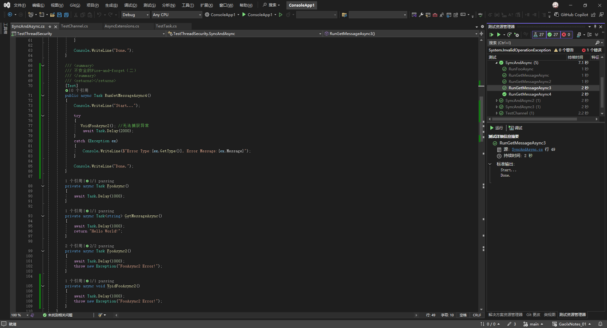
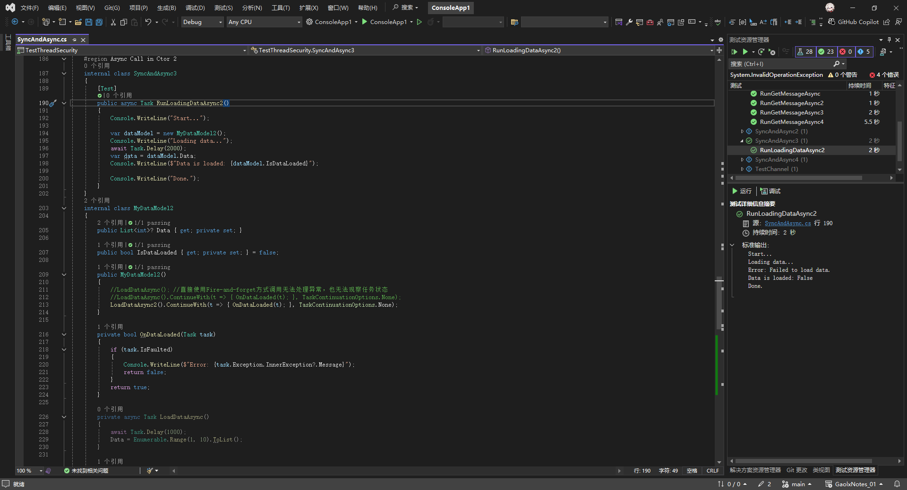

# C#多线程与异步编程（九）

## 7. 在同步中调用异步方法

虽然说C#基于Task的这套异步编程用起来确实很方便，但是C#实际开发中，很多情况下无法将一个方法改写成异步，而不得不同步调用异步方法，例如：构造函数调用异步方法、接口中必须实现的同步方法里需要异步操作，以及老项目中使用阻断方式控制异步传染性等，因此，在同步中调用异步方法是我们不得不面对的一个问题。

### 1. 以阻塞的方式调用异步方法

在异步方法无返回值的情况下，我们可以直接使用`Task.Wait`，用阻塞的方式等待任务结束

```csharp
[Test]
public void RunFooAsync()
{
    Console.WriteLine("Run FooAsync...");
    // 用阻塞的方式等待任务结束
    FooAsync().Wait();
    Console.WriteLine("Done.");
}

private async Task FooAsync()
{
    await Task.Delay(1000);
}
```

运行结果如下：


---

对于有返回值的异步方法，我们可以使用`Task.Result`，用阻塞的方式等待任务返回值

```csharp
[Test]
public void RunGetMessageAsync()
{
    Console.WriteLine("Start...");
    // 用阻塞的方式等待任务结束（需要考虑死锁问题）
    var message = GetMessageAsync().Result;
    Console.WriteLine($"message:{message}");

    Console.WriteLine("Done.");
}

private async Task<string> GetMessageAsync()
{
    await Task.Delay(1000);
    return "Hello World!";
}
```

运行结果如下：


---

以上两种方式虽然都能实现在同步方法中以阻塞的方式调用异步方法，但是也存在一些问题。

在异步方法无返回值的情况下，直接使用 `Task.Wait()`，有返回值情况下使用`Task.Result`以阻塞方式等待任务结束，虽然在某些特定场景下（如简单的控制台程序）可能不会立即出现问题，但**这种做法存在严重隐患，应避免使用**。以下是关键原因和替代方案：

1. **死锁风险**  
   在存在同步上下文的环境（如 UI 线程、ASP.NET 请求上下文）中，`Wait()` 会阻塞当前线程，而异步任务完成后的回调可能依赖该线程继续执行，导致两者互相等待，形成死锁。

2. **异常处理差异**  
   `Wait()` 会将异常封装为 `AggregateException`，而 `await` 直接抛出原始异常，后者更符合直觉且便于调试。

3. **线程资源浪费**  
   阻塞线程会导致线程无法释放去处理其他任务，在高并发场景下可能引发性能问题。

为了解决上述问题，我们应该优先使用 `GetAwaiter().GetResult()` 而非 `.Result`/`.Wait`，在 C# 中，`GetAwaiter().GetResult()` 和 `Task.Result` 都可以用来在同步方法中阻塞等待异步操作的结果，但它们在行为和使用场景上有显著差异。以下是两者的核心区别：

---

### **1. 异常处理方式**
| **方法**                     | **异常抛出方式**                                                                 | **示例**                                 |
|------------------------------|--------------------------------------------------------------------------------|-----------------------------------------|
| **`Task.Result`**            | 抛出 `AggregateException`，将异步操作中的所有异常包装成一个集合类异常         | `catch (AggregateException ex)`        |
| **`GetAwaiter().GetResult()`** | 直接抛出原始异常（如 `InvalidOperationException` 或自定义异常）                | `catch (HttpRequestException ex)`      |

**示例对比**：
```csharp
async Task ThrowAsync()
{
    await Task.Delay(100);
    throw new InvalidOperationException("Oops!");
}

void SyncMethod()
{
    try
    {
        // 使用 .Result
        var result = ThrowAsync().Result; // ❌ 抛出 AggregateException
    }
    catch (AggregateException ex)
    {
        // 需要解包才能获取原始异常
        var originalEx = ex.InnerException;
    }

    try
    {
        // 使用 GetAwaiter().GetResult()
        var result = ThrowAsync().GetAwaiter().GetResult(); // ✅ 直接抛出 InvalidOperationException
    }
    catch (InvalidOperationException ex)
    {
        // 直接捕获目标异常
    }
}
```

---

### **2. 死锁风险**
两者在同步上下文中（如 UI 线程或传统 ASP.NET 请求上下文）都可能引发死锁，但结合 `ConfigureAwait(false)` 的行为不同：

| **方法**                     | **上下文行为**                                                                 |
|------------------------------|------------------------------------------------------------------------------|
| **`Task.Result`**            | 即使使用 `ConfigureAwait(false)`，仍可能因未正确切断上下文导致死锁          |
| **`GetAwaiter().GetResult()`** | 更明确地与 `ConfigureAwait(false)` 配合使用，能更可靠地避免上下文死锁       |

**优化写法**：
```csharp
// 正确避免死锁的写法
var result = asyncTask
    .ConfigureAwait(false)  // 切断同步上下文
    .GetAwaiter()           // 优先使用此方式
    .GetResult();
```

---

### **3. 代码可读性与意图**
| **方法**                     | **代码意图**                                                                 | **适用场景**                         |
|------------------------------|----------------------------------------------------------------------------|-------------------------------------|
| **`Task.Result`**            | 隐式表示“获取任务结果”，可能被误解为任务已自然完成                         | 适用于已知任务已完成的情况（如 `Task.FromResult`） |
| **`GetAwaiter().GetResult()`** | 显式表示“同步阻塞等待任务完成”，代码意图更清晰                             | 强制等待未完成的任务                 |

---

### **4. 性能与底层机制**
| **方法**                     | **底层行为**                                                                 |
|------------------------------|----------------------------------------------------------------------------|
| **`Task.Result`**            | 直接访问 `Task` 的 `Result` 属性，若任务未完成会阻塞并等待                 |
| **`GetAwaiter().GetResult()`** | 通过 `TaskAwaiter` 机制获取结果，与 `await` 的底层行为更一致               |

---

### **总结：如何选择？**
| **场景**                                                                 | **推荐方法**                              |
|--------------------------------------------------------------------------|------------------------------------------|
| 需要直接捕获原始异常（如业务逻辑中的错误处理）                           | `GetAwaiter().GetResult()` + `ConfigureAwait(false)` |
| 已知任务已完成（如缓存的结果或已完成的任务）                             | `Task.Result`                            |
| 在同步上下文中强制等待异步操作（如旧代码改造）                           | `GetAwaiter().GetResult()`               |
| 需要兼容旧代码或第三方库（某些遗留代码可能依赖 `AggregateException`）    | `Task.Result`                            |

---

演示代码：

```csharp
[Test]
public void RunGetMessageAsync2()
{
    Console.WriteLine("Start...");

    try
    {
        FooAsync2().GetAwaiter().GetResult();
    }
    catch (Exception ex)
    {
        Console.WriteLine($"Error Type:{ex.GetType()}, Error Message:{ex.Message}");
    }

    Console.WriteLine("Done.");
}

private async Task FooAsync2()
{
    await Task.Delay(1000);
    throw new Exception("FooAsync2 Error!");
}
```

运行结果如下：


---

可以看到我们可以直接捕获到`FooAsync2()`中的异常，而无需对`AggregateException`解包获取原始异常，因此，推荐在任何需要同步调用异步方法的情况下，都使用`GetAwaiter().GetResult()`以阻塞的方式调用异步方法。

### 2. 一发即忘（Fire-and-forget）

```csharp
/// <summary>
/// 不安全的Fire-and-forget（一）
/// </summary>
/// <returns></returns>
[Test]
public async Task RunGetMessageAsync3()
{
    Console.WriteLine("Start...");

    try
    {
        _ = FooAsync2(); //无法捕获异常
        await Task.Delay(2000);
    }
    catch (Exception ex)
    {
        Console.WriteLine($"Error Type:{ex.GetType()}, Error Message:{ex.Message}");
    }

    Console.WriteLine("Done.");
}

/// <summary>
/// 不安全的Fire-and-forget（二）
/// </summary>
/// <returns></returns>
[Test]
public async Task RunGetMessageAsync4()
{
    Console.WriteLine("Start...");

    try
    {
       VoidFooAsync2(); //无法捕获异常
        await Task.Delay(2000);
    }
    catch (Exception ex)
    {
        Console.WriteLine($"Error Type:{ex.GetType()}, Error Message:{ex.Message}");
    }

    Console.WriteLine("Done.");
}

private async Task FooAsync2()
{
    await Task.Delay(1000);
    throw new Exception("FooAsync2 Error!");
}

private async void VoidFooAsync2()
{
    await Task.Delay(1000);
    throw new Exception("FooAsync2 Error!");
}
```

运行结果如下，可以看出异常未被正确捕获，`RunGetMessageAsync3`方法无法捕获到FooAsync2抛出的异常，也无法判断任务执行的状态，而`RunGetMessageAsync4`则直接导致进程崩溃。




---

在C#中，Fire-and-forget模式的两个示例存在以下问题：

---

### **1. 不安全的Fire-and-forget（一）`_ = FooAsync2()`**
#### 问题分析：
- **任务被丢弃**：通过`_ =`忽略返回的`Task`，导致异常无法被观察。
- **未处理的Task异常**：当`FooAsync2`抛出异常时，异常会存储在返回的`Task`中。但由于没有`await`或显式检查该`Task`，异常成为“未观察的异常”（Unobserved Exception）。此类异常不会触发调用方的`catch`块，而是在垃圾回收时可能触发`TaskScheduler.UnobservedTaskException`事件（默认不崩溃，但不可靠）。

#### 示例代码的缺陷：
```csharp
_ = FooAsync2(); // 异常被存储在丢弃的Task中，无法被catch捕获
```

---

### **2. 不安全的Fire-and-forget（二）`VoidFooAsync2()`**
#### 问题分析：
- **`async void`的致命缺陷**：`async void`方法没有返回`Task`，因此异常无法通过任务传播。当`VoidFooAsync2`抛出异常时，异常会直接传播到同步上下文（如`SynchronizationContext`），导致：
  - 在UI应用程序中，可能引发全局未处理异常，导致进程崩溃。
  - 在非UI环境（如控制台或测试框架）中，异常可能被静默吞没或触发`AppDomain.UnhandledException`，但**永远不会进入调用方的`catch`块**。

#### 示例代码的缺陷：
```csharp
private async void VoidFooAsync2() // async void 无法被安全捕获异常！
{
    await Task.Delay(1000);
    throw new Exception("Error!"); // 异常直接传播到同步上下文
}
```

---

### **为什么无法捕获异常？**
1. **Fire-and-forget（一）的异常路径**：
   ```text
   FooAsync2 → Task（异常存储于Task） → 未观察的Task → 未被catch捕获
   ```
2. **Fire-and-forget（二）的异常路径**：
   ```text
   VoidFooAsync2 → 异常直接抛出到同步上下文 → 未被catch捕获
   ```

---

### **解决方案**
#### 1. 对返回`Task`的方法：
- **显式处理异常**（推荐）：
  ```csharp
  _ = FooAsync2().ContinueWith(task =>
  {
      if (task.Exception != null)
      {
          Console.WriteLine($"Error: {task.Exception.Message}");
      }
  }, TaskScheduler.Default);
  ```
- **全局处理未观察到的异常**（需谨慎）：
  ```csharp
  TaskScheduler.UnobservedTaskException += (sender, e) =>
  {
      Console.WriteLine($"Unobserved error: {e.Exception.Message}");
      e.SetObserved(); // 标记为已处理，避免进程崩溃
  };
  ```

#### 2. 避免使用`async void`：
- **始终优先使用`async Task`**：
  ```csharp
  private async Task VoidFooAsync2() // 改为返回Task
  {
      await Task.Delay(1000);
      throw new Exception("Error!");
  }
  ```
- **强制调用方处理Task**：
  ```csharp
  await VoidFooAsync2(); // 需要await，不再是Fire-and-forget
  ```
  若必须Fire-and-forget：
  ```csharp
  _ = VoidFooAsync2().ConfigureAwait(false); // 至少保留Task
  ```

---

### **总结**
- **永远不要忽略`Task`**：使用`_ =`丢弃`Task`会导致异常丢失。
- **永远避免`async void`**：除非在事件处理程序（如UI按钮点击）中，且内部已用`try-catch`包裹所有代码。
- **Fire-and-forget需谨慎**：确保异常有明确的处理路径（如日志记录）。

---

### 3. 安全的用Fire-and-forget调用异步方法（一）SafeFireAndForget方案

```csharp
#region Async Call in Ctor 1
internal class SyncAndAsync2
{
    [Test]
    public async Task RunLoadingDataAsync()
    {
        Console.WriteLine("Start...");

        var dataModel = new MyDataModel();
        Console.WriteLine("Loading data...");
        await Task.Delay(2000);
        var data = dataModel.Data;
        Console.WriteLine($"Data is loaded: {dataModel.IsDataLoaded}");

        Console.WriteLine("Done.");
    }
}
internal class MyDataModel
{
    public List<int>? Data { get; private set; }

    public bool IsDataLoaded { get; private set; } = false;

    public MyDataModel()
    {
        //LoadDataAsync(); //直接使用Fire-and-forget方式调用无法处理异常，也无法观察任务状态
        //SafeFireAndForget(LoadDataAsync(), () => { IsDataLoaded = false; }, ex => { Console.WriteLine($"Error Message: {ex.Message}"); });
        LoadDataAsync2().Forget(() => { IsDataLoaded = false; }, ex => { Console.WriteLine($"Error Message: {ex.Message}"); });
        SafeFireAndForget(LoadDataAsync2(), () => { IsDataLoaded = false; }, ex => { Console.WriteLine($"Error Message: {ex.Message}"); });
    }

    private static async void SafeFireAndForget(Task task, Action? onCompleted = null, Action<Exception>? onError = null)
    {
        try
        {
            await task;
            onCompleted?.Invoke();
        }
        catch (Exception ex)
        {
            onError?.Invoke(ex);
        }
    }

    private async Task LoadDataAsync()
    {
        await Task.Delay(1000);
        Data = Enumerable.Range(1, 10).ToList();
    }

    private async Task LoadDataAsync2()
    {
        await Task.Delay(1000);
        throw new Exception("Failed to load data.");
    }
}

static class TaskExtensions
{
    public static async void Forget(this Task task, Action? onCompleted = null, Action<Exception>? onError = null)
    {
        try
        {
            await task;
            onCompleted?.Invoke();
        }
        catch (Exception ex)
        {
            onError?.Invoke(ex);
        }
    }
}
#endregion
```

运行结果如下：


---

这段代码通过以下机制安全地实现了一发即忘（Fire-and-forget）并处理异常：

1. **异步异常捕获机制**：
   - `SafeFireAndForget`方法被标记为`async void`，使其成为可独立运行的异步操作
   - 内部使用`try-catch`块包裹`await task`语句，确保捕获所有同步和异步异常
   - 通过`onError`回调参数传递异常信息（示例中输出到控制台）

2. **状态回调机制**：
   - 提供`onCompleted`回调用于处理成功场景（示例中设置IsDataLoaded = false）
   - 通过可选参数设计允许选择性处理完成/失败事件

3. **任务生命周期管理**：
   - 使用`await`确保任务完成前保持对象引用
   - 避免直接使用`.Result`或`.Wait()`可能造成的死锁

4. **扩展方法支持**：
   - `TaskExtensions.Forget`提供链式调用语法
   - 保持统一异常处理逻辑

5. **构造函数安全调用**：
   - 通过包装异步方法避免直接在构造函数中使用`async void`
   - 防止未处理异常导致程序崩溃

典型使用场景：
```csharp
public MyDataModel()
{
    // 安全启动异步初始化
    this.LoadDataAsync()
        .Forget(
            onCompleted: () => IsDataLoaded = true,
            onError: ex => Logger.LogError(ex)
        );
}
```

这种模式适用于不需要等待结果但需要确保异常处理的场景（如后台初始化、事件通知等），但需注意异步操作的生命周期管理。

### 4. 安全的用Fire-and-forget调用异步方法（二） ContinueWith方案

```csharp
#region Async Call in Ctor 2
internal class SyncAndAsync3
{
    [Test]
    public async Task RunLoadingDataAsync2()
    {
        Console.WriteLine("Start...");

        var dataModel = new MyDataModel2();
        Console.WriteLine("Loading data...");
        await Task.Delay(2000);
        var data = dataModel.Data;
        Console.WriteLine($"Data is loaded: {dataModel.IsDataLoaded}");

        Console.WriteLine("Done.");
    }
}
internal class MyDataModel2
{
    public List<int>? Data { get; private set; }

    public bool IsDataLoaded { get; private set; } = false;

    public MyDataModel2()
    {
        //LoadDataAsync(); //直接使用Fire-and-forget方式调用无法处理异常，也无法观察任务状态
        //LoadDataAsync().ContinueWith(t => { OnDataLoaded(t); }, TaskContinuationOptions.None);
        LoadDataAsync2().ContinueWith(t => { OnDataLoaded(t); }, TaskContinuationOptions.None);
    }

    private bool OnDataLoaded(Task task)
    {
        if (task.IsFaulted)
        {
            Console.WriteLine($"Error: {task.Exception.InnerException?.Message}");
            return false;
        }
        return true;
    }

    private async Task LoadDataAsync()
    {
        await Task.Delay(1000);
        Data = Enumerable.Range(1, 10).ToList();
    }

    private async Task LoadDataAsync2()
    {
        await Task.Delay(1000);
        throw new Exception("Failed to load data.");
    }
}
#endregion
```

---

运行结果如下：



---

以下是对该C#代码安全实现一发即忘（Fire-and-Forget）机制的分析，以及使用`ContinueWith`可能引发的问题：

---

### **安全实现一发即忘的关键机制**
1. **异常捕获与处理**
   - 通过`ContinueWith`注册回调，在`OnDataLoaded`方法中检查`task.IsFaulted`
   - 显式访问`task.Exception.InnerException`提取异常信息（示例中输出错误日志）
   - 避免了未观察异常（Unobserved Exception）导致进程崩溃的风险

2. **异步任务与构造函数的解耦**
   - 在构造函数中通过`ContinueWith`触发异步操作，不阻塞构造函数执行
   - 通过回调机制将异步操作结果与对象状态更新分离

3. **可控的任务延续**
   - 使用`TaskContinuationOptions.None`确保无论任务成功/失败都会执行回调
   - 在统一入口`OnDataLoaded`中集中处理所有任务完成状态

---

### **ContinueWith的潜在问题**
1. **上下文丢失（Context Loss）**
   - **问题**：默认不捕获同步上下文（SynchronizationContext），可能导致：
     - UI线程应用中回调执行在非UI线程，引发跨线程访问问题
     - ASP.NET Core中`HttpContext`丢失，访问`HttpContext.Current`为null
   - **示例**：若在WinForms中更新UI控件，需显式捕获上下文：
     ```csharp
     .ContinueWith(t => ..., TaskScheduler.FromCurrentSynchronizationContext())
     ```

2. **异常处理不完整**
   - **问题**：若未检查`task.IsFaulted`或忽略`task.Exception`：
     - 异常可能被静默吞噬（如示例未重新抛出或记录日志）
     - 违反[异常传播规则](https://learn.microsoft.com/en-us/dotnet/standard/parallel-programming/exception-handling-task-parallel-library)
   - **风险点**：
     ```csharp
     if (task.IsFaulted)
     {
         // 仅输出InnerException.Message，未处理AggregateException
         Console.WriteLine(task.Exception.InnerException?.Message); 
     }
     ```

3. **状态管理缺陷**
   - **问题**：回调中未正确更新对象状态
     - 示例中`OnDataLoaded`返回`bool`但未使用返回值
     - `IsDataLoaded`属性在任务成功后仍为`false`（逻辑错误）
   - **后果**：对象状态与实际异步操作结果不一致

4. **未处理的嵌套异常**
   - **问题**：若回调代码自身抛出异常：
     ```csharp
     .ContinueWith(t => { throw new Exception(); }) // 新异常无法被捕获
     ```
   - **结果**：导致未观察异常，.NET 4.5+默认触发`TaskScheduler.UnobservedTaskException`

5. **延续任务链失控**
   - **问题**：未管控延续任务的执行条件和资源释放
     - 可能引发意外的长任务链（如未使用`CancellationToken`）
     - 内存泄漏风险（如闭包捕获外部对象导致无法GC回收）

---

### **改进建议**
1. **显式指定延续选项**
   ```csharp
   .ContinueWith(t => OnDataLoaded(t), 
       TaskContinuationOptions.ExecuteSynchronously | 
       TaskContinuationOptions.DenyChildAttach)
   ```

2. **完整处理异常**
   ```csharp
   private void OnDataLoaded(Task task)
   {
       if (task.Exception != null) 
       {
           foreach (var ex in task.Exception.Flatten().InnerExceptions)
           {
               _logger.LogError(ex, "Loading failed");
           }
       }
       else 
       {
           IsDataLoaded = true; // 显式更新状态
       }
   }
   ```

3. **结合CancellationToken**
   ```csharp
   private readonly CancellationTokenSource _cts = new();

   public MyDataModel2()
   {
       LoadDataAsync2()
           .ContinueWith(t => OnDataLoaded(t), _cts.Token);
   }
   ```

4. **避免状态污染**
   ```csharp
   // 使用Interlocked保证原子操作
   if (task.IsCompletedSuccessfully)
   {
       Interlocked.Exchange(ref _data, loadedData);
   }
   ```

---

### **与首个方案的对比**
| 特性               | SafeFireAndForget方案          | ContinueWith方案              |
|--------------------|-------------------------------|------------------------------|
| **异常可见性**      | 通过try-catch直接捕获          | 依赖手动检查`task.Exception`  |
| **上下文保留**      | 默认保留同步上下文（await特性）| 需显式指定`TaskScheduler`     |
| **代码可读性**      | 更符合async/await模式          | 回调嵌套降低可维护性          |
| **状态管理**        | 通过回调参数明确区分成功/失败  | 需手动在回调中处理状态        |
| **资源释放**        | 天然支持using作用域            | 需手动管理CancellationToken   |

---

**结论**：  
虽然`ContinueWith`能实现一发即忘，但其对上下文、异常和状态的管理成本较高。在现代化C#开发中，更推荐通过`async/await`配合`Task.Run`或专用Fire-and-Forget框架（如[Microsoft.VisualStudio.Threading](https://github.com/microsoft/vs-threading)）来实现安全的一发即忘模式。