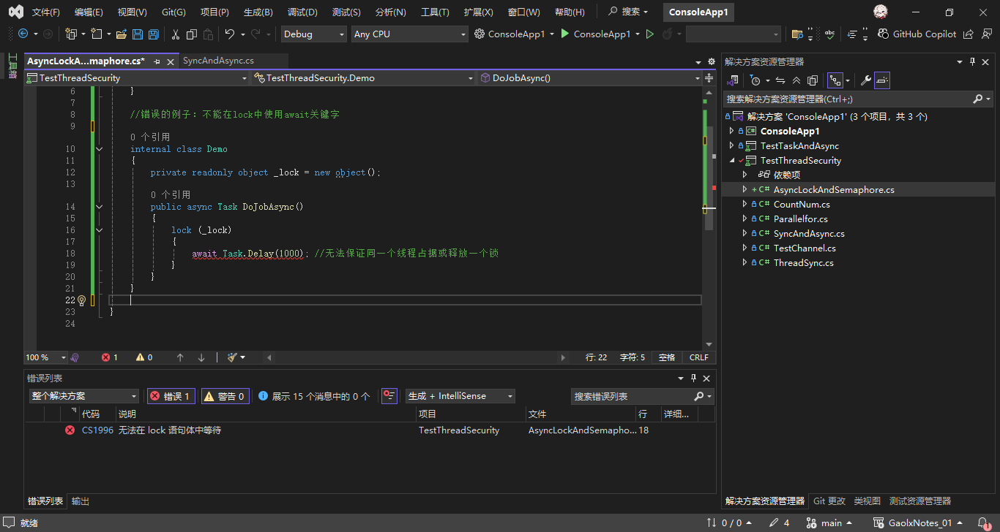
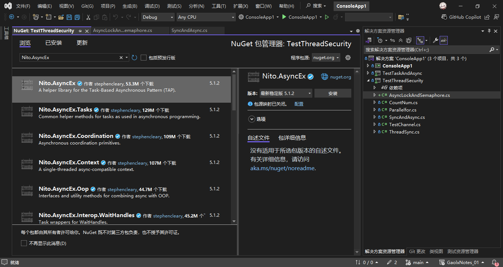
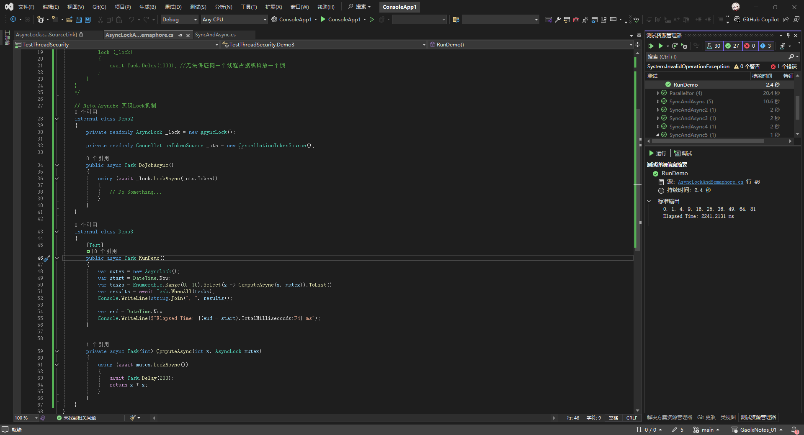

# C#多线程与异步编程（十）

## 8. 在异步任务中实现同步机制及使用信号量

我们在多线程中会使用Monitor（lock）、Mutex、Semaphore、EventWaitHandle（ManualResetEvent、AutoResetEvent）等实现同步机制，由于阻塞的特性，他们均不能用于异步编程。

### 1. 常见误区

我们无法在lock语句中使用await关键字，也不建议在async中使用lock关键字。

```csharp
//错误的例子：不能在lock中使用await关键字
internal class Demo
{
    private readonly object _lock = new object();

    public async Task DoJobAsync()
    {
        lock (_lock)
        {
            await Task.Delay(1000); //无法保证同一个线程占据或释放一个锁
        }
    }
}
```

---

运行结果如下：



在 C# 中，`lock` 语句和 `async`/`await` 关键字之间存在根本性的冲突，主要原因是两者的执行模型和线程上下文特性不兼容。以下是具体原因和背后的逻辑：

---

### 1. **`lock` 语句与线程关联性**
   - **`lock` 的本质**：`lock` 语句底层使用 `Monitor.Enter` 和 `Monitor.Exit` 实现，而 `Monitor` 是**线程关联**的。这意味着：
     - 只有获取锁的线程才能释放该锁。
     - 锁的获取和释放必须在同一个线程上下文中完成。
   - **问题场景**：当在 `lock` 块内使用 `await` 时，`await` 可能导致代码在异步恢复时运行在**不同的线程**上（例如线程池线程）。此时，异步恢复后的代码尝试释放锁时，会因为线程不匹配而抛出 `SynchronizationLockException`。

   ```csharp
   lock (_lock)
   {
       await Task.Delay(1000); // 异步恢复可能切换到其他线程
       // 此处可能抛出 SynchronizationLockException
   }
   ```

---

### 2. **`lock` 的同步性与 `async` 的异步性冲突**
   - **锁的同步性**：`lock` 是一种同步机制，它会阻塞当前线程直到锁被获取。这与异步编程的核心理念（避免阻塞线程）直接冲突。
   - **异步方法的特性**：`async` 方法的设计目的是让线程在等待异步操作（如 I/O）时能够释放，避免资源浪费。如果在 `async` 方法中使用 `lock`：
     - 可能因为长时间持有锁而降低并发性能。
     - 可能因锁的阻塞导致死锁（例如，多个异步方法相互等待对方释放锁）。

---

---

### 3. **总结：关键原则**
1. **避免在 `lock` 内使用 `await`**：锁的线程关联性会被异步上下文破坏。
2. **避免在 `async` 方法中使用 `lock`**：同步阻塞会违背异步编程的非阻塞原则，可能导致性能问题或死锁。
3. **优先使用异步同步原语**：如 `SemaphoreSlim`、`AsyncLock` 等。

通过遵循这些原则，可以确保异步代码在保证线程安全的同时，维持高效的非阻塞特性。

### 2. 借助 Nito.AsyncEx 实现 AsyncLock

为了能在异步中使用Lock机制，我们可以通过第三方Package实现，在Nuget包管理器中安装好`Nito.AsyncEx`包即可。



用法如下：

```csharp
// Nito.AsyncEx 实现Lock机制
internal class Demo2
{
    private readonly AsyncLock _lock = new AsyncLock();

    private readonly CancellationTokenSource _cts = new CancellationTokenSource();

    public async Task DoJobAsync()
    {
        using (await _lock.LockAsync(_cts.Token))
        {
            // Do Something...
        }
    }
}
```

案例：

```csharp
internal class Demo3
{
    [Test]
    public async Task RunDemo()
    {
        var mutex = new AsyncLock();
        var start = DateTime.Now;
        var tasks = Enumerable.Range(0, 10).Select(x => ComputeAsync(x, mutex)).ToList();
        var results = await Task.WhenAll(tasks);
        Console.WriteLine(string.Join(", ", results));

        var end = DateTime.Now;
        Console.WriteLine($"Elapsed Time: {(end - start).TotalMilliseconds:F4} ms");
    }


    private async Task<int> ComputeAsync(int x, AsyncLock mutex)
    {
        using (await mutex.LockAsync())
        {
            await Task.Delay(200);
            return x * x;
        }
    }
}
```

运行结果如下：



### 3. 借助 SemaphoreSlim 实现 WaitAsync

`lock(obj)`替代方案：使用异步友好的同步机制

若需要在异步代码中实现临界区保护，应使用专为异步设计的同步原语，例如 `SemaphoreSlim` 的 `WaitAsync` 方法：

```csharp
private readonly SemaphoreSlim _semaphore = new SemaphoreSlim(1, 1);

public async Task DoJobAsync()
{
    await _semaphore.WaitAsync();
    try
    {
        await Task.Delay(1000); // 安全地异步等待
    }
    finally
    {
        _semaphore.Release();
    }
}
```

- **优势**：
  - `SemaphoreSlim.WaitAsync` 是异步的，不会阻塞线程。
  - 支持异步上下文中的线程安全操作。

