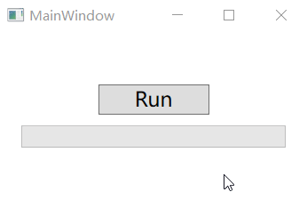
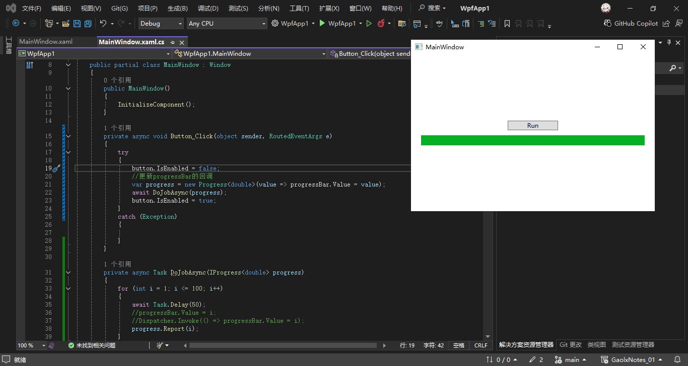
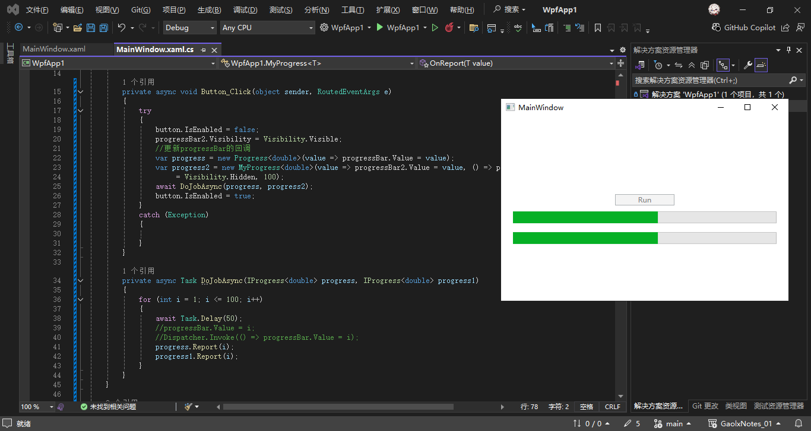
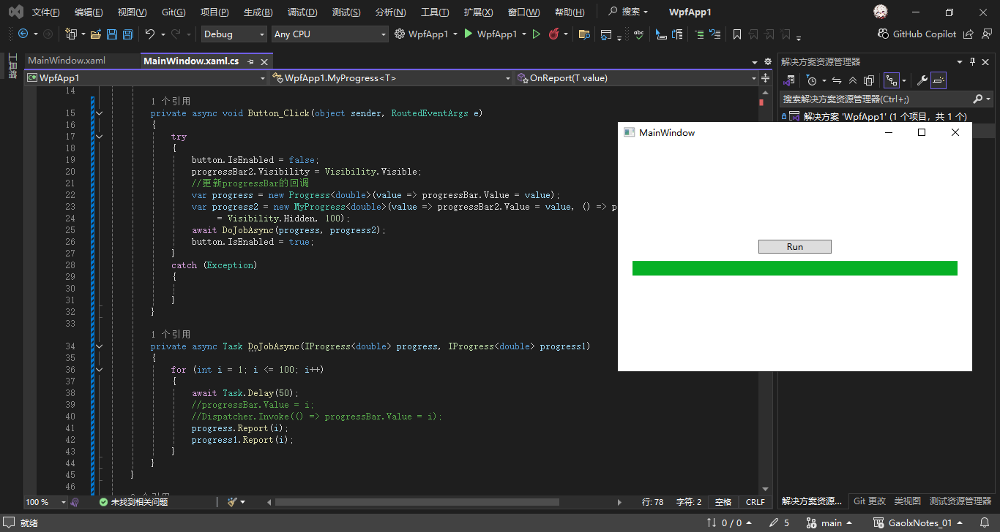

# C#多线程与异步编程（十二）

## 10. C# 在异步任务中汇报进度

在执行异步任务时，有时候我们会希望有办法汇报进度。比如在一个 WPF 程序中，我们在界面上放了一个进度条，从而展示当前任务的进度。那么该如何汇报异步任务的进度呢？

其实 .NET 标准库就为我们提供了实现这一功能的接口和类：`IProgress<T>` 与 `Progress<T>`，其中 `T` 是一个泛型类型，表示要汇报的内容。如果我们希望汇报一个百分比进度，那么使用 `double` 类型即可；类似地，如果我们希望汇报一些更加复杂的内容，还可以使用 `string` 甚至一些自定义类与结构体。

### 1. IProgress<T>、Progress<T>

在C#异步编程中，`IProgress<T>` 和 `Progress<T>` 是用于**跨线程/上下文报告进度**的机制，常用于在异步操作中向调用方（如UI线程）反馈进度信息（例如文件下载进度、任务完成百分比等）。

---

### **1. `IProgress<T>` 接口**
- **作用**：定义了一个通用的进度报告接口，通过 `Report(T value)` 方法传递进度数据。
- **特点**：
  - 抽象接口，不依赖具体实现。
  - 支持泛型类型 `T`，可以是自定义的进度模型（例如 `int` 表示百分比，或一个包含详细信息的对象）。
- **典型用途**：作为异步方法的参数，允许调用方传入自定义的进度报告逻辑。
- **注意**：
  - 如果不需要同步到特定上下文（例如在后台服务中），可以自定义实现 `IProgress<T>`，直接处理进度数据。

```csharp
public interface IProgress<in T>
{
    void Report(T value);
}
```

---

### **2. `Progress<T>` 类**
- **作用**：`IProgress<T>` 的默认实现类，内部封装了事件触发机制，简化进度报告。
- **特点**：
  - 自动将进度事件**同步到创建它的上下文**（例如UI线程），无需手动处理线程切换。
  - 通过 `ProgressChanged` 事件通知进度更新。
- **注意**：
  - `Progress<T>` 在构造时会捕获当前的 `SynchronizationContext`（如UI线程的上下文）。
  - 当调用 `Report(T)` 时，事件处理程序会在原始上下文中触发，避免跨线程访问问题。

```csharp
public class Progress<T> : IProgress<T>
{
    public event EventHandler<T>? ProgressChanged;
    public void Report(T value) { /* 触发 ProgressChanged 事件 */ }
}
```

### 2. 在WPF中通过Progress<T>展示异步任务进度

以一个简单的wpf项目为例，我们创建了一个run的按钮（Button）和一个进度条（ProgressBar），并给按钮添加点击事件，我们的要求是当用户点击run 按钮之后，开启一个耗时的异步任务，并在进度条展示任务进度，同时窗口需要能正常响应。

**项目搭建：**

Window:

```xml
<Window x:Class="WpfApp1.MainWindow"
        xmlns="http://schemas.microsoft.com/winfx/2006/xaml/presentation"
        xmlns:x="http://schemas.microsoft.com/winfx/2006/xaml"
        xmlns:d="http://schemas.microsoft.com/expression/blend/2008"
        xmlns:mc="http://schemas.openxmlformats.org/markup-compatibility/2006"
        xmlns:local="clr-namespace:WpfApp1"
        mc:Ignorable="d"
        Title="MainWindow" Height="350" Width="500">
    <StackPanel Margin="20, 0" VerticalAlignment="Center">
        <Button Name="button"
                Width="100"
                Margin="0,0,0,10"
                Content="Run"
                Click="Button_Click"/>
        <ProgressBar Name="progressBar"
                     Height="20"
                     d:Value="10"/>
    </StackPanel>
</Window>

```

run button:

```csharp
private void Button_Click(object sender, RoutedEventArgs e)
{
    button.IsEnabled = false;
    button.IsEnabled = true;
}
```

---

**常规做法（不推荐）：**

```csharp
public partial class MainWindow : Window
{
    public MainWindow()
    {
        InitializeComponent();
    }

    private async void Button_Click(object sender, RoutedEventArgs e)
    {
        await DoJobAsync(CancellationToken.None);
    }

    async Task DoJobAsync(CancellationToken token)
    {
        if (token.IsCancellationRequested)
            return;
        for (int i = 0; i < 100; i++)
        {
            await Task.Delay(50, token);
            progressBar.Value = i + 1;
            if (token.IsCancellationRequested)
            {
                break;
            }
        }
    }
}

```

我们将按钮注册的 `Button_Click` 方法修改为 `async void`，这样我们就可以在里面等待一个异步任务了。

> info
> 虽然 `async void` 是一种非常危险的方式，但因为 Button 控件的 Click 事件对应委托对于函数传参及返回值的限制，这里我们不得不这样做。

然后，我们在 `DoJobAsync` 中实现后台的异步任务。这里我们简单地使用一个 for 循环，并在其中使用 `Task.Delay`，从而实现一个拥有进度的异步任务。然后，我们在每次循环中直接修改 `progressBar` 控件的值。运行程序，就可以直接看到效果了：



这个问题难道就这么轻松地就解决了吗？其实不是的，因为在异步任务中，很可能会出现在别的线程中操作 UI 线程的资源（也就是控件及其属性），这种情况下程序会报错。所以如果使用这样的方式，通常我们还需要使用老套的 `Dispatcher.Invoke` 的方式来规避这个问题。但这样就显得不够优雅了。

那么同样的功能，我们该如何使用 `Progress` 类来实现呢？

**推荐做法：**

MainWindow:

```csharp
using System.Windows;

namespace WpfApp1
{
    /// <summary>
    /// Interaction logic for MainWindow.xaml
    /// </summary>
    public partial class MainWindow : Window
    {
        public MainWindow()
        {
            InitializeComponent();
        }

        private async void Button_Click(object sender, RoutedEventArgs e)
        {
            try
            {
                button.IsEnabled = false;
                //更新progressBar的回调
                var progress = new Progress<double>(value => progressBar.Value = value);
                await DoJobAsync(progress);
                button.IsEnabled = true;
            }
            catch (Exception)
            {

            }
        }

        private async Task DoJobAsync(IProgress<double> progress)
        {
            for (int i = 1; i <= 100; i++)
            {
                await Task.Delay(50);
                //progressBar.Value = i;
                //Dispatcher.Invoke(() => progressBar.Value = i);
                progress.Report(i);
            }
        }
    }
}
```

**运行效果：**



**说明：**

1. **相较于 `直接赋值` 和 `Dispatcher.Invoke` 优点**

- 直接赋值 `progressBar.Value = i`：
  - ❌ 仅在 UI 线程中有效，若后台线程调用会崩溃。
  - ❌ 耦合业务逻辑与 UI 控件，难以复用和测试。

- `Dispatcher.Invoke(() => progressBar.Value = i)`：
  - ❌ 需要手动处理线程调度，代码冗余。
  - ❌ 依然耦合 UI 控件，违反关注点分离原则。

2. **`progress.Report(i)` 线程安全的原因**

在 WPF 中，`progress.Report(i)` **看似在非 UI 线程调用，却仍是线程安全**，这归功于 `Progress<T>` 类型的内部设计机制。以下是其工作原理和线程安全性的关键点：

---

### 1. **`Progress<T>` 的同步上下文捕获**
   - 当你在 UI 线程中创建 `Progress<T>` 实例时（例如 `var progress = new Progress<double>(...);`）：
     ```csharp
     var progress = new Progress<double>(value => progressBar.Value = value);
     ```
     **`Progress<T>` 会自动捕获当前的 `SynchronizationContext`**（即 UI 线程的上下文）。这个上下文是一个与 UI 线程关联的“调度器”，用于将代码逻辑调度回 UI 线程执行。

---

### 2. **`Report` 方法的内部逻辑**
   - 当你调用 `progress.Report(i)` **（无论当前在哪个线程）**：
     ```csharp
     progress.Report(i); // 可能在后台线程调用
     ```
     `Progress<T>` 内部会将回调委托（`value => progressBar.Value = value`）**通过 `SynchronizationContext.Post` 方法提交到 UI 线程的消息队列**。这相当于自动执行了以下逻辑：
     ```csharp
     // Progress<T> 内部简化逻辑
     SynchronizationContext.Current.Post(_ => 
     {
         value => progressBar.Value = value; // 在 UI 线程执行
     }, null);
     ```

   - **`Post` 方法是异步的**：它不会阻塞当前线程，而是将回调加入 UI 线程的消息队列，由 UI 线程在空闲时处理。这保证了：
     1. **线程安全性**：UI 控件的操作始终在 UI 线程执行。
     2. **非阻塞性**：后台线程不会被阻塞。

> info
> 除了给构造函数传回调，`Progress` 类还为我们提供了一个 `ProgressChanged` 事件。注册这个事件可以实现相同的效果，并且也是在相同的同步上下文执行的。

---

### 3. 实现自定义 Progress 类

如果我们还有其他额外的需求，那么我们还可以自己实现接口，或者继承 `Progress` 类。官方特意没有将这个类设为 `sealed`，并且将 `OnReport` 方法设为 `virtual`，就是为了满足我们的这些需求。

> Note
> 但是如果我们去继承这个 `Progress` 类，会发现其实我们能自由发挥的空间并不大，因为它其中的很多字段（尤其是同步上下文）都是 `private` 的，所以我们能做的事情基本上也只有重写 `OnReport` 方法了。

比如这里我写了一个子类，从而可以在进度完成后执行一个回调方法。

```csharp

internal class MyProgress<T> : Progress<T> where T : notnull
{
    private readonly Action? _complete;
    private readonly T _maximum;
    private bool _isCompleted;

    public MyProgress(Action<T> handler, Action? complete, T maximum)
        : base(handler)
    {
        _complete = complete;
        _maximum = maximum;

        ProgressChanged += CheckCompletion;
    }

    protected override void OnReport(T value)
    {
        if (_isCompleted)
            return;
        base.OnReport(value);
    }

    private void CheckCompletion(object? sender, T e)
    {
        if (e.Equals(_maximum) && !_isCompleted)
        {
            _isCompleted = true;
            _complete?.Invoke();
        }
    }
}
```

这里实现的效果是，当异步任务完成后，将会隐藏进度条，则Window代码如下：

```csharp
public partial class MainWindow : Window
{
    public MainWindow()
    {
        InitializeComponent();
    }

    private async void Button_Click(object sender, RoutedEventArgs e)
    {
        try
        {
            button.IsEnabled = false;
            progressBar2.Visibility = Visibility.Visible;
            //更新progressBar的回调
            var progress = new Progress<double>(value => progressBar.Value = value);
            var progress2 = new MyProgress<double>(value => progressBar2.Value = value, () => progressBar2.Visibility
                 = Visibility.Hidden, 100);
            await DoJobAsync(progress, progress2);
            button.IsEnabled = true;
        }
        catch (Exception)
        {

        }
    }

    private async Task DoJobAsync(IProgress<double> progress, IProgress<double> progress1)
    {
        for (int i = 1; i <= 100; i++)
        {
            await Task.Delay(50);
            //progressBar.Value = i;
            //Dispatcher.Invoke(() => progressBar.Value = i);
            progress.Report(i);
            progress1.Report(i);
        }
    }
}
```

**运行效果：**




