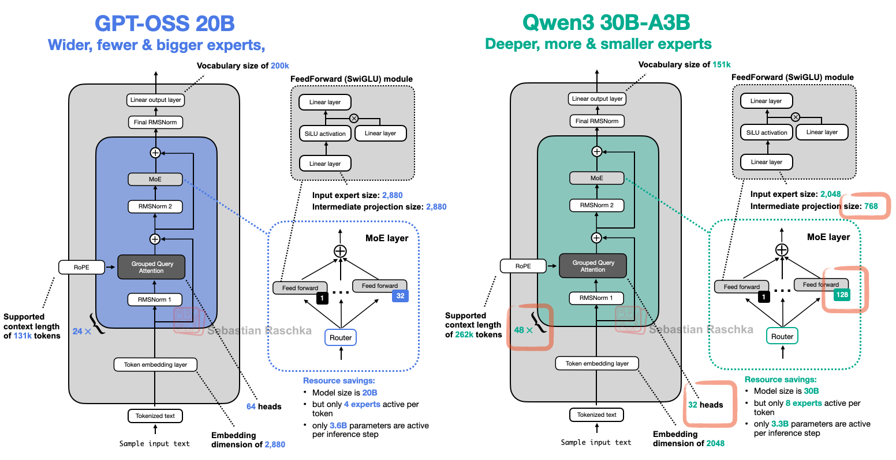

# MoE因细粒度专家需更深网络

### 🧑‍💻 User

为什么相同hidden size的moe和dense model，moe模型的hidden layer普遍更深？（尤其是细粒度专家流行后）

---

### 🤖 Assistant

这是一个非常深刻且触及当前大模型架构演进核心的问题。从你提供的对比图（左侧类似早期的宽浅型MoE，右侧类似DeepSeek-V2/V3、Qwen等最新的细粒度深层MoE）可以明显看出这一趋势：**在相同的激活参数量或Hidden Size下，现代细粒度MoE模型倾向于采用“更小的 $d_{model}$ + 更多的层数 (Depth) + 更细粒度的专家”的设计。**

导致这一现象的核心原因可以归结为以下几个维度的权衡（Trade-offs）：

### 1. 长上下文需求与 Attention 计算的瓶颈 (KV Cache 压力)

这是最直接的工程原因。图中明确标注了右侧模型支持更长的上下文（262k vs 131k）。

*   **宽度 ($d_{model}$) 的代价：** 在 Transformer 中，Attention 层的计算复杂度和 KV Cache 的显存占用与 Hidden Size ($d_{model}$) 以及注意力头数呈正相关。如果为了增加模型容量而扩大 $d_{model}$（走“宽”路线），长文本下的显存爆炸和计算延迟将无法承受。
*   **深度 (Depth) 的优势：** 相比之下，增加层数（走“深”路线）虽然也会增加参数，但它对长文本推理阶段的 KV Cache 占用增加是线性的，并且可以通过诸如 MQA/GQA (图中已标出 Grouped Query Attention) 进一步压缩。
*   **结论：** 为了在有限的算力和显存预算下支持超长上下文，模型设计者被迫**压缩 Hidden Size ($d_{model}$ 从 2880 降至 2048) 并减少 Head 数量 (64 降至 32)**。既然单层的表征能力被压缩了，就必须通过**增加层数 (24层增加到48层)** 来弥补模型整体的逻辑推理和表征能力。

点击展开：Attention 与 KV Cache 的数学关系

设上下文长度为 $N$，批次大小为 $B$，层数为 $L$。
KV Cache 的大小主要取决于：$2 \times B \times N \times L \times n_{kv\_heads} \times d_{head}$。
在图中右侧模型，虽然 $L$ 翻倍（24->48），但通过减小 $d_{model}$ 和采用更激进的 GQA（减少 $n_{kv\_heads}$），可以有效控制总 KV Cache 大小，从而将支持的 Context Length 翻倍。

### 2. 细粒度专家 (Fine-grained Experts) 带来的参数重分配

细粒度专家（如 DeepSeek 提出的架构）的核心思想是：将原本少数几个庞大的 FFN 专家，切分成几十上百个极其微小的专家（Intermediate projection size 大幅缩小，图中从 2880 暴降至 768）。

*   **单层 FFN 容量的下降：** 当专家变得非常细粒度时，即便增加了每次激活的专家数量（从 4 个增加到 8 个），单层中 Active FFN 的参数量相对 Attention 参数量的比例依然可能下降或保持紧凑。
*   **如何消耗参数预算？** 如果单层的激活参数量变少了，而在同等推理成本（FLOPs）预算下，我们希望模型拥有更强的能力，最有效的方法就是**把省下来的单层计算预算，投资到更多的层数上**。
*   **结论：** 细粒度专家使得每层的 FFN 变得更“轻”，为了达到预定的模型总激活参数（例如图中两者的 Active Params 都在 3.3B - 3.6B 左右），就必须把网络做深。

### 3. 路由组合的指数级爆炸 (Combinatorial Routing Paths)

MoE 模型的强大之处在于其“组合泛化”能力。Token 在每一层都会选择不同的专家，形成一条特定的路由路径 (Routing Path)。

*   **浅而宽的模型：** 假设 24 层，每层 32 选 4。总的路径组合空间很大，但单次路由的粒度很粗（专家包含的知识太杂）。
*   **深且细粒度的模型：** 假设 48 层，每层 128 选 8。此时的路径组合变成了 $(C_{128}^8)^{48}$。
*   **结论：** **更深的网络 + 更多的细粒度专家 = 指数级增长的特征组合路径。** 细粒度专家意味着每个专家学习到的是非常具体、单一的微观特征（例如专门处理某个特定领域的介词搭配，或者某段代码的缩进逻辑）。要将这些“微观特征”组合成复杂的“宏观语义”，需要更多的非线性变换步骤，也就是**更深的网络层数**。

### 4. 缓解“表征坍塌”与路由同质化 (Routing Collapse)

在 MoE 模型的训练中，经常遇到负载不均衡（Load Imbalance）或路由坍塌（所有 token 都倾向于选择某几个专家）的问题。

*   如果模型很浅但专家很大，Router 在进行决策时，由于不同专家的特征区分度不够高，很容易陷入局部最优。
*   在细粒度 + 深层的架构中，特征的提取被分散到了更长的流水线（48层）中。每一层的 Router 只需要做相对简单的、微小特征的区分（128个微小专家中选8个）。这种分层递进的路由选择，使得整个训练过程更加稳定，专家之间的分工更加明确。

### 总结

相同 Hidden Size 或激活参数预算下，细粒度 MoE 模型更深的原因是一个系统工程的综合结果：

1.  **算力与内存的枷锁：** 为支持几十万 token 的上下文，必须压低 $d_{model}$ 和 Attention 开销，只能靠**加深层数**来保证模型智商。
2.  **预算转移：** 细粒度切分让单层 FFN 变“薄”了，维持同等推理 FLOPs 的方法就是**叠加更多层**。
3.  **知识组合的逻辑：** 细粒度专家掌握的是“碎片化知识”，需要**更深的层级流水线**才能将这些碎片拼装成高级逻辑。