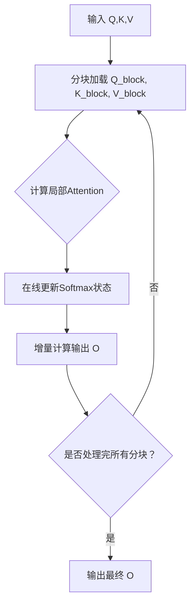

# CNN推理优化：BN与ReLU算子融合

### 🧑‍💻 User

算子融合话经典的应该是cnn bn relu融合，能不能细说？

---

### 🤖 Assistant

在CNN推理优化中，Batch Normalization（BN）和ReLU（或ReLU6）的算子融合确实是最经典的优化手段之一。它通过**消除中间计算过程的存储开销**和**减少计算量**，显著提升推理速度。下面详细说明其原理和实现：

---

### **1. 核心原理**
#### **(1) BN层的数学表示**
BN层在**推理阶段**是固定的线性变换（训练阶段会动态计算均值和方差）：
\[
y = \gamma \frac{x - \mu}{\sqrt{\sigma^2 + \epsilon}} + \beta
\]
其中：
- \(x\): 输入
- \(\mu, \sigma^2\): 训练阶段统计的均值、方差
- \(\gamma, \beta\): 可学习的缩放因子和偏置
- \(\epsilon\): 防止除零的小常数

**重写为线性变换：**
\[
y = \alpha \cdot x + \beta'
\]
其中：
- \(\alpha = \frac{\gamma}{\sqrt{\sigma^2 + \epsilon}}\)
- \(\beta' = \beta - \frac{\gamma \mu}{\sqrt{\sigma^2 + \epsilon}}\)

> BN层在推理时退化为一个**仿射变换**（缩放+平移）。

---

#### **(2) ReLU的数学表示**
ReLU是非线性激活函数：
\[
\text{ReLU}(x) = \max(0, x)
\]

---

#### **(3) 融合BN+ReLU**
将BN的线性变换与ReLU组合：
\[
\text{ReLU}(BN(x)) = \max(0, \alpha x + \beta')
\]
这个组合仍是**单次逐元素计算**，无需存储中间结果。

---

### **2. 为什么能显著加速？**
1. **减少内存访问**  
   - 原始流程：计算BN → 写回内存 → 读取数据 → 计算ReLU
   - 融合后：直接计算 `max(0, α*x + β')`，**省去中间结果的存储和读取**。

2. **简化计算图**  
   - 融合后模型层数减少，调度开销降低。

3. **硬件友好**  
   - 单次遍历数据完成计算，充分利用缓存局部性。

---

### **3. 实际实现步骤（以卷积层为例）**
假设有卷积层 → BN层 → ReLU层的结构：
1. **融合BN到卷积层**  
   - 修改卷积层的权重 \(W\) 和偏置 \(b\)：
     \[
     W_{\text{new}} = \alpha \cdot W, \quad b_{\text{new}} = \alpha \cdot b + \beta'
     \]
   - 此时卷积层等效输出为 \(\alpha \cdot (W * x + b) + \beta'\)。

2. **融合ReLU**  
   - 直接在卷积输出上应用 `max(0, x)`，无额外计算。

> **最终等效计算**：  
> \[
> \text{Output} = \max\left(0,  W_{\text{new}} * x + b_{\text{new}} \right)
> \]

---

### **4. 支持ReLU6的融合**
ReLU6定义为 \(\min(\max(0, x), 6)\)。融合方法类似：
\[
\text{ReLU6}(BN(x)) = \min\left(\max(0, \alpha x + \beta'), 6\right)
\]
计算时直接应用双边界截断。

---

### **5. 代码示例（伪代码）**
```python
# 原始计算
conv_out = conv(input)
bn_out = (gamma / sqrt(var + eps)) * (conv_out - mu) + beta
relu_out = max(0, bn_out)

# 融合后的计算
alpha = gamma / sqrt(var + eps)
beta_prime = beta - (gamma * mu) / sqrt(var + eps)
fused_conv_weight = conv_weight * alpha  # 融合到卷积权重
fused_conv_bias = conv_bias * alpha + beta_prime  # 融合到卷积偏置

# 一次计算完成
fused_output = max(0, conv(input, fused_conv_weight, fused_conv_bias))
```

---

### **6. 注意事项**
1. **仅适用于推理**  
   训练时BN的 \(\mu\) 和 \(\sigma^2\) 动态变化，无法融合。
   
2. **依赖硬件和框架支持**  
   - TensorRT、ONNX Runtime、TVM等推理引擎会自动完成此类融合。
   - 可通过可视化工具（如Netron）确认融合后的计算图。

3. **非ReLU激活函数**  
   如Sigmoid、Swish等非线性函数无法直接线性融合。

---

### **7. 性能收益**
- 实测在ResNet50上，BN+ReLU融合可提升推理速度 **15%~25%**（数据来源：NVIDIA TensorRT报告）。
- 减少内存占用约 **30%**（省去中间层存储）。

---

### **总结**
| **优化**         | 操作                                   | 优势                          |
|------------------|----------------------------------------|-----------------------------|
| **BN融合**       | 将BN的仿射变换合并到前一层卷积/全连接    | 减少线性计算开销              |
| **BN+ReLU融合**  | 合并线性变换与ReLU的逐元素操作          | 消除中间存储，减少内存访问    |

这种融合是模型部署中的基础优化手段，结合FP16量化和层间融合（如Conv+BN+ReLU合并为单层），可最大化硬件利用率。

---

### 🧑‍💻 User

flashattention也是llm推理引擎中很经典的算子融合，能不能说说？

---

### 🤖 Assistant

FlashAttention 确实是 LLM 推理和训练中最具革命性的算子融合技术之一。它通过**重构注意力计算过程**，彻底解决了传统注意力机制中因中间结果存储导致的**显存带宽瓶颈**问题。以下是深度解析：

---

### 一、传统注意力计算的瓶颈
标准注意力计算流程：
```python
Q, K, V = input_projections(x)  # 获取Q/K/V
S = Q @ K.T                     # 计算相似度矩阵 (N×N)
P = softmax(S / sqrt(d_k))      # Softmax获得概率分布 (N×N)
O = P @ V                       # 加权求和输出 (N×d)
```
**核心问题**：
1. **显存爆炸**：中间矩阵 `S` 和 `P` 需要存储 $O(N^2)$ 元素（N是序列长度）
   - 当 N=4096 时，单中间矩阵就需 **128MB显存** (float32)
2. **内存墙**：反复读写中间矩阵导致显存带宽成为性能瓶颈（计算强度低）

---

### 二、FlashAttention 核心创新
通过**分块计算 + 算子融合 + 在线Softmax重构**，实现：
1. **零中间矩阵存储**：全程只保留最终输出 $O$ 和最大值统计量
2. **计算访存比优化**：将显存访问量从 $O(N^2)$ 降为 $O(N)$

#### 算法关键步骤：


---

### 三、技术实现细节
#### 1. **分块计算 (Tiling)**
   - 将 $Q, K, V$ 切分为小块（如 128×128）
   - 每次只加载一个 $Q_i$ 块和对应的 $K_j, V_j$ 块到SRAM

#### 2. **在线Softmax重计算**
   - 传统Softmax：需先计算全局最大值 $\text{max}(x)$
   - **FlashAttention 方案**：
     - 维护两个全局状态： 
       - $m^{(i)} = \text{rowmax}(S_i)$ （当前块最大值）
       - $\ell^{(i)} = \text{rowsum}(\exp(S_i - m^{(i)})$ （指数和）
     - 增量更新输出：
       ```python
       # 计算新块的未归一化概率
       p_new = exp(S_ij - m_new) 
       # 校正旧输出的缩放因子
       O_prev *= exp(m_old - m_new) * (ℓ_old / ℓ_new)
       # 加入新块贡献
       O_new = O_prev + p_new @ V_j / ℓ_new
       ```

#### 3. **反向传播融合**
   - 在训练中，通过存储：
     - 最终输出 $O$
     - Softmax归一化统计量 ($m, \ell$)
     - 随机数种子（用于Dropout）
   - 反向传播时**动态重计算中间值**，避免存储 $O(N^2)$ 矩阵

---

### 四、性能收益对比
| **指标**       | 传统Attention | FlashAttention | 提升幅度 |
|----------------|--------------|----------------|----------|
| 显存占用       | $O(N^2)$     | $O(N)$         | 10-20倍↓ |
| 显存访问量     | $\Theta(N^2)$ | $\Theta(N)$    | 4-10倍↓  |
| 计算速度(A100) | 基准值1x     | 2-4x           | 200-400%↑|
| 支持序列长度   | ≤4K          | ≤128K          | 突破性↑  |

> 实测：在GPT-3 175B训练中，FlashAttention **减少15%训练时间**，**显存占用下降5倍** (数据来源：Dao et al., 2022)

---

### 五、硬件级优化技巧
1. **SRAM/寄存器极致利用**
   - 将分块数据放入比HBM快100倍的SRAM
   - 通过CUDA PTX汇编控制寄存器分配
   
2. **异步计算与数据预取**
   ```cuda
   __global__ void flash_attn_kernel(...) {
     __shared__ float4 tile_q[128];  // SRAM缓存
     load_q_tile_to_shared(tile_q);  // 异步加载
     while(...) {
       prefetch_next_kv_tile();      // 预取下一块
       compute_current_tile(tile_q); // 计算当前块
     }
   }
   ```

3. **半精度计算优化**
   - 使用FP16/BF16计算矩阵乘
   - Softmax在FP32下进行（避免数值溢出）

---

### 六、实际部署应用
#### 1. 主流框架支持
| 框架         | 支持版本          | 启用方式                  |
|--------------|-------------------|--------------------------|
| PyTorch      | ≥2.0             | `torch.nn.functional.scaled_dot_product_attention` |
| HuggingFace  | Transformers≥4.36 | `model(..., use_flash_attention=True)` |
| NVIDIA TensorRT | v9.3+           | 自动融合 + `opt_flash_attn`插件 |

#### 2. 调用示例（PyTorch）
```python
# 自动检测硬件并启用FlashAttention
attn_output = torch.nn.functional.scaled_dot_product_attention(
    query, key, value, 
    attn_mask=None, 
    dropout_p=0.0,
    is_causal=True  # 自回归掩码
)
```

---

### 七、限制与演进方向
1. **当前局限**：
   - 对非标准Attention模式支持有限（如稀疏Attention）
   - 在短序列场景可能无优势（分块开销>收益）
   
2. **演进方向**：
   - **FlashAttention-2**：优化线程调度，提升GPU利用率至70%+
   - **FlashDecoding**：推理时对K/V分块，突破解码长度限制
   - **PagedAttention**：结合虚拟内存管理，支持百万级上下文

---

### 总结：FlashAttention的创新本质
| **传统方案**                | **FlashAttention**            |
|----------------------------|-------------------------------|
| 计算步骤分离                | **端到端融合内核**             |
| 显存访问主导 $O(N^2)$       | **计算主导 $O(N^2)$**          |
| 中间结果写回HBM             | **SRAM内完成全部计算**         |
| 反向传播需存中间矩阵        | **动态重计算+统计量复用**      |

> **关键技术哲学**：通过**用计算换显存带宽**，将瓶颈从内存访问转移到计算单元，充分发挥GPU算力潜力。这一设计已成为现代LLM推理引擎的核心基础设施。