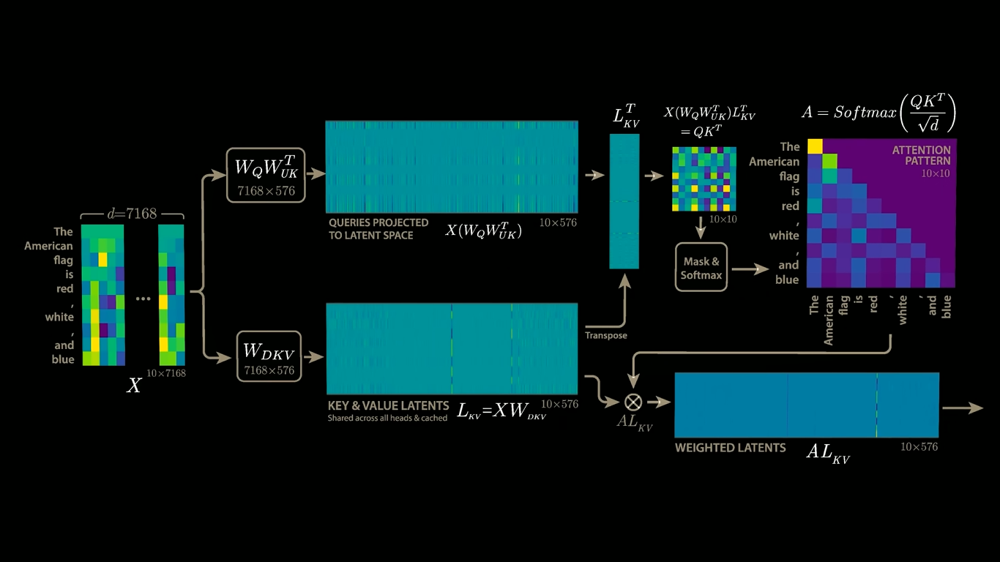

# DeepSeek模型的MLA注意力变体

### 🧑‍💻 User

这是什么模型的attn变体？

---

### 🤖 Assistant

从图片中的矩阵运算和维度信息可以判断，这是 **DeepSeek** 提出的 **Multi-Head Latent Attention (MLA, 多头潜在注意力)** 变体，并且根据具体的维度数据，这对应的是 **DeepSeek-V3**（或基于其架构的 DeepSeek-R1）模型。

以下是具体的判断依据和原理解析：

### 1. 核心特征：KV Cache 压缩 (Latent KV)
图中下方分支展示了核心的优化操作：
* 输入 $X$ 通过下采样矩阵 $W_{DKV}$ 映射到了一个低维度的潜在空间，生成了 **$L_{KV}$ (Key & Value Latents)**。
* 图中特别标注了 `Shared across all heads & cached`，这意味着**模型在推理时只需要缓存这个低维的 $L_{KV}$，而不是传统的各个头的 Key 和 Value 矩阵**。这是 MLA 能够大幅减少 KV Cache 显存占用的关键机制。

### 2. 维度信息匹配 DeepSeek-V3
图中的维度数字是完美的“指纹”：
* **$d = 7168$**：这是模型的 Hidden Size，完美匹配 DeepSeek-V3 的隐藏层维度。
* **潜在维度 $576$**：在 DeepSeek-V3 中，KV 的潜在内容维度 (KV Latent Size) 为 512，加上用于旋转位置编码 (RoPE) 的 64 维，刚好是 $512 + 64 = 576$ 维。

### 3. 矩阵吸收技巧 (Weight Absorption)
图中上方分支展示了 MLA 的另一个巧妙设计：
* 标准的注意力机制中，Query 和 Key 需要先分别生成然后再计算内积。
* 为了直接使用压缩后的 $L_{KV}$ 进行注意力计算，MLA 将 Query 的投影矩阵 $W_Q$ 和 Key 的上采样矩阵 $W_{UK}^T$ 进行了预先相乘（**矩阵吸收**），变成了 $W_QW_{UK}^T$。
* 这样，输入 $X$ 只需要乘一次这个复合矩阵，就可以直接进入由 $L_{KV}$ 构成的潜在空间（QUERIES PROJECTED TO LATENT SPACE）计算注意力分数。

### 4. Value 上采样的后置
* 在计算出注意力权重 $A$ 后，图中显示直接将其与 $L_{KV}$ 相乘，得到 `WEIGHTED LATENTS`（$AL_{KV}$）。
* 在标准的 MLA 架构中，这里的输出随后才会乘以 Value 的上采样矩阵 $W_{UV}$ 和输出矩阵 $W_O$。由于注意力计算是线性的，将上采样操作移到注意力加权之后，可以避免在计算过程中生成高维的 Value 矩阵，进一步优化了显存带宽。