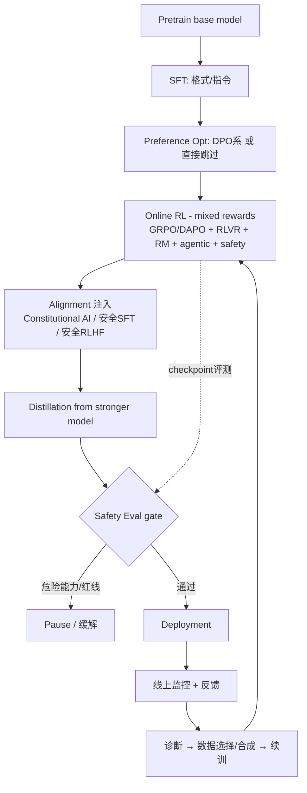

# 前沿后训练流水线

## 🧑‍💻 User

@联网搜索 了解下frontier 基模后训练pipeline，不晓得现在后训练流程都变成啥样了，好像dpo都被deprecated‌了，用mixed RL取代（因为dpo容易破坏模型能力），做完posttrain应该还有alignment和Safety Eval，Alignment就得注入思想还有Guardrail，然后训完一个stage还要跑bench->反馈->续训...具体这个pipeline是怎么运作的？

---
## 🤖 Assistant

I'll research the frontier foundation model post-training pipeline. Let me first discover available tools.

Let me inspect the browser and fetch tools to plan my searches.

Now let me run several web searches in parallel to gather information.

Good, I have leads. Let me dig into the most relevant sources and run additional targeted searches.

Excellent — found a directly relevant 2026 survey. Let me fetch the key sources in depth.

Some sites block plain fetches. Let me use the browser to access the most relevant sources.

Browser calls timed out in parallel. Let me try sequentially.

Great source. Now let me get the alignment/safety-eval and "mixed RL" material.

Let me fetch the frontier safety framework, Constitutional AI, and iterative self-improvement sources.

Transient network issue. Let me retry sequentially.

Let me grab the alignment-tax explanation and a lab-level pipeline description.

Let me fetch the alignment-tax theory, the over-refusal benchmark, and a concrete lab pipeline.

已经联网调研完成。我读了 2026 年最新的后训练综述、对齐税理论论文、前沿安全框架、Constitutional AI、拒答基准、以及 DeepSeek-V3 的实际 pipeline 文档等一手来源。下面把「前沿基模后训练 pipeline」到底怎么运转讲清楚——包括你提到的 DPO 是否被"废弃"、mixed RL、alignment、guardrail、安全评测，以及"训完一段→跑 bench→反馈→续训"这个闭环。

---

# 一、先给结论:你的直觉对了一半

> **一句话**:DPO 没有被"删除",而是从**主角**退成了**配角**。前沿实验室把"对齐 + 安全 + 能力提升"合并进**一个在线 RL 阶段**,用**混合奖励(mixed rewards)**驱动,再套一层**评测驱动的迭代闭环**。

| 你的说法 | 准确度 | 修正 |
|---|---|---|
| DPO 被 deprecated | ⚠️ 部分正确 | 离线 DPO 仍存在(SimPO/KTO/ORPO 等),但**不再是前沿模型的主要对齐手段** |
| 用 mixed RL 取代 | ✅ 方向对 | "mixed RL"不是某个正式算法名,而是**把 RLHF + RLVR + agentic + 安全奖励混进同一个在线 RL 目标**的工程实践 |
| DPO 破坏模型能力 | ✅ 有依据 | 这就是 **alignment tax(对齐税)**,已被形式化证明(见下文数学) |
| 做完 posttrain 还有 alignment 和 safety eval | ✅ | 但对齐/安全**不是**训完才做的独立阶段,而是**贯穿全程、且与 RL 融合** |
| 训完一个 stage 跑 bench→反馈→续训 | ✅ | 这就是 **iterative post-training / iterative deployment**,但有"自我改进反转"的坑 |

---

# 二、现代后训练 Pipeline 的完整骨架

llm-stats 2026 年的技术综述明确指出:**"12 个月前,配方是预训练 → RLHF(人类偏好),那个配方已经死了。"** 现在的流水线大致是这样:

```
Pretrain (trillions tokens)
      │
      ▼
┌─────────────────────────────────────────────────────────┐
│  Stage 1: SFT (Supervised Fine-Tuning)                   │
│  教"格式":指令遵循、结构化输出、对话风格                    │
│  数据量:1–10M 精选样本 (Nemotron 3 Super 用 7M/语料 40M) │
└─────────────────────────────────────────────────────────┘
      │
      ▼
┌─────────────────────────────────────────────────────────┐
│  Stage 2: Preference Optimization (偏好优化)             │
│  DPO / SimPO / KTO / ORPO —— 静态偏好对,成本低            │
│  ⚠️ 这一步正在被 Stage 3 "吸收"                           │
└─────────────────────────────────────────────────────────┘
      │
      ▼
┌─────────────────────────────────────────────────────────┐
│  Stage 3: 在线 RL —— 这里是新一代核心 (所谓 mixed RL)     │
│  算法:GRPO / DAPO / PPO-variant (去 critic)              │
│  奖励:RLVR(可验证) + RM(偏好) + agentic 环境 + 安全奖励   │
│  作用:产生推理能力、超越训练数据、多步工具使用             │
└─────────────────────────────────────────────────────────┘
      │
      ▼
┌─────────────────────────────────────────────────────────┐
│  Stage 4: Alignment & Safety 注入 (与 2/3 交织进行)       │
│  Constitutional AI / 安全 SFT / 安全 RLHF                 │
│  值(value)注入 + 拒答边界 + 谄媚/诚实性调校                │
└─────────────────────────────────────────────────────────┘
      │
      ▼
┌─────────────────────────────────────────────────────────┐
│  Stage 5: Safety Eval & Red-teaming (门禁 gate)           │
│  危险能力评测 / CCL / 红队 / 越狱 / 过度拒答               │
│  → 通过才放行部署 (safety case)                          │
└─────────────────────────────────────────────────────────┘
      │
      ▼
   Deployment  ←─── 线上监控/反馈 ───┐
      │                              │
      └──── iterative loop ──────────┘
            (评测→选数据→续训→再评测)
```

---

# 三、"DPO 被废弃"的真相:为什么、以及被什么取代

## 3.1 DPO 为什么失宠

DPO(Rafailov et al., 2023)当年很优雅——**跳过 RL、直接拿偏好对做监督**。但生产环境暴露了三个硬伤:

1. **长度偏置(length bias)**——偏好获胜的回答往往更长,模型学会"变啰嗦"而非"变好";
2. **参考模型依赖**——训练时得在显存里冻结一份 reference model;
3. **静态偏好对的策展成本**——而且**上界被数据质量锁死**,无法超越偏好集。

> 你提到的"DPO 容易破坏模型能力",正是 **alignment tax(对齐税)**。2026 年一篇论文首次把它形式化(几何理论):

$$
\text{对齐税率} \;=\; \bigl\|\,\mathrm{Proj}_{\,\mathcal{C}}\,(s)\,\bigr\|^{2}
$$

其中 $s$ 是"安全方向",$\mathcal{C}$ 是"能力子空间"。直觉是:**只要安全方向在能力子空间上有投影,对齐就必然损耗能力**,且该 Pareto 前沿由安全子空间与能力子空间的**主角(principal angle)**参数化。论文还给出缩放律:对齐税 = **不可约分量**(由数据结构决定)+ **packing 残差**,后者随 $O(m'/d)$ 衰减。也就是说——**税无法归零,只能减小**。

## 3.2 取代它的东西

DPO 的继任者们各自砍掉一个依赖(llm-stats 综述):

| 方法 | 砍掉了什么 | 收益 |
|---|---|---|
| **SimPO** | 参考模型 | AlpacaEval 2 +6.4, Arena-Hard +7.5 |
| **KTO** | 成对数据(只要点赞/点踩) | 二值反馈便宜且海量 |
| **ORPO** | 把 SFT 和偏好优化合并 | 单一目标,消除分布漂移 |

但在**前沿规模**上,真正的替代者是在线 RL:

<details>
<summary><b>展开:GRPO / DAPO 为什么成为主流(含数学)</b></summary>

**GRPO(Group Relative Policy Optimization)** 干掉 critic 模型。对每个 prompt 采样一组回答(8–64 条),用组内归一化算优势:

$$
A_i = \frac{r_i - \mathrm{mean}(r)}{\mathrm{std}(r)}
$$

不需要 value/critic,显存砍半。2026 年还有理论工作证明 GRPO 的策略梯度是 **U-statistic**,渐近等价于"有理想 value function 的 oracle 算法"——不是碰巧能work,而是**可证明最优**。

**DAPO**(字节/清华,2025)针对长 CoT 的不稳定,加了四招:
- **Clip-Higher**:抬高 ratio 上界,防熵塌缩;
- **Dynamic Sampling**:过滤批次,保持梯度信号一致;
- **Token-level Policy Gradient Loss**:长序列的关键;
- **Overlong Reward Shaping**:降低超长回答的奖励噪声。

AIME 2024 上,用 DAPO 训 Qwen2.5-32B 到 50 分,**训练步数少 50%**,且全部开源。

**关键区别**:DPO 在静态偏好对上固化学习、**有上界**;GRPO 是**在线**的,训练中不断生成新回答,**能超出训练数据**。
</details>

---

# 四、Mixed RL 到底"混"了什么(拆解)

"mixed RL"不是论文里的正式算法,而是工程界对**同一个在线 RL 阶段里混合多种奖励信号**的俗称。它把过去分散在多个独立阶段的信号合并:

$$
r_{\text{total}}(x,y) \;=\; \underbrace{\lambda_1 r_{\text{RM}}}_{\text{偏好/人类价值}} \;+\; \underbrace{\lambda_2 r_{\text{VR}}}_{\text{可验证}} \;+\; \underbrace{\lambda_3 r_{\text{agent}}}_{\text{环境/工具}} \;+\; \underbrace{\lambda_4 r_{\text{safety}}}_{\text{安全}}
$$

目标函数(KL 正则化,防止跑偏):

$$
J(\theta) \;=\; \mathbb{E}_{y \sim \pi_\theta}\!\left[\, r_{\text{total}}(x,y) \,\right] \;-\; \beta \, \mathrm{KL}\!\left[\pi_\theta \,\|\, \pi_{\text{ref}}\right]
$$

各分量:

- **$r_{\text{RM}}$ (RLHF)**:人类偏好训练的 reward model。前沿规模下,真实 RM + 足够算力,RLHF 抽取的质量**DPO 追不上**;
- **$r_{\text{VR}}$ (RLVR,可验证奖励)**:**2025 年最重大的转变**。数学/代码/结构化推理根本不用人类打分——**单元测试、证明检查器、数学验证器给出二值信号**,比人快、便宜、稳定。DeepSeek-R1 证明**纯 RLVR 就能涌现推理能力**(自我反思、策略自适应),无需人类标注的思维链;
- **$r_{\text{agent}}$ (环境奖励)**:多步工具调用、异步 rollout。NVIDIA **NeMo Gym** 给 Nemotron 3 Super 生成了 21 种环境配置、**120 万条 rollout**;
- **$r_{\text{safety}}$ (安全奖励)**:MOSAIC(2026.03)把推理结构化为"**plan → check → act or refuse**",用 trajectory-level 偏好学习,在 Qwen/Phi 上**有害行为降 50% 而不损任务性能**。

> 注意一个细节:**RM 本身也不再是纯人性化了**。2026 年有工作处理"噪声 verifier"——数学检查器有边界情况、代码测试可能不全,所以开发了**去偏算法**修正观测奖励,防止模型钻假阳性的空子。奖励塑造本身成了安全工程。

---

# 五、Alignment:思想注入 + Guardrail(两层防御)

这里要区分两个经常被混淆的东西(来自安全指南的官方定义):

| | **Alignment(对齐)** | **Guardrail(护栏)** |
|---|---|---|
| 本质 | **训练**模型内在地追求安全有益目标 | 在模型**外面**过滤输入输出,**不改模型** |
| 手段 | RLHF/宪法AI/安全SFT/值训练 | 输入校验、输出过滤、系统级策略 |
| 关系 | 降低不安全输出**频率** | 兜住**漏网之鱼** |

生产系统**两者都用**(defense-in-depth)。

## 5.1 思想注入:Constitutional AI 是代表

Anthropic 的 **Constitutional AI**(2022 论文《Harmlessness from AI Feedback》)用**约 75 条书面原则**替代海量人类标注:模型读"宪法"→**自我批判并修订输出**→再训练。核心是 **RLAIF**(AI 反馈而非人类反馈)。这就是你说的"注入思想"最主流的做法。2026 年的趋势是把这套"自我批判/自我改进的安全性"内化,减少对外部过滤器的依赖。

## 5.2 Guardrail 的分层(工程落地)

- **输入护栏**:prompt injection 检测、输入净化、主题分类(拒离题);
- **输出护栏**:内容过滤、PII/凭据泄露阻断、幻觉检测;
- **系统级护栏**:跨 pipeline 的行为策略。

常见工具:**NeMo Guardrails**(NVIDIA,Colang DSL,可编程对话流)、**Guardrails AI**(结构化校验)、**LLM Guard**(综合扫描)、**Lakera / Arthur AI Shield**(企业托管)、**Microsoft Guidance**(受约束生成)。

**延迟代价**(重要工程约束):规则/分类器护栏 +10–50ms;LLM-as-judge 护栏 +200–1000ms。所以生产上常用**快分类器做实时过滤 + 批量 LLM judge 做异步质量监控**。

**合规压力**(2026):EU AI Act 要求高风险系统落实保障;NIST AI RMF 要持续监控;中国《生成式AI管理办法》要求内容安全。护栏已从"最佳实践"变成**监管硬要求**。

---

# 六、Safety Eval:不是"训完才做",而是门禁 + 循环

这是你问的"做完 posttrain 还有 Safety Eval"——更准确的说法是**评测是贯穿训练前/中/后的门禁机制**。

<details>
<summary><b>展开:前沿安全评测体系全貌</b></summary>

**公司级框架(能力触发式)**:
- Anthropic **RSP**(Responsible Scaling Policy)→ **ASL-1..ASL-4**,基于能力划级;
- OpenAI **Preparedness Framework**;
- Google DeepMind **Frontier Safety Framework**→ **CCL(Critical Capability Levels)**,每级配评测协议 + 缓解措施,**含部署前评测和部署后监控**,发现新危险能力触发升级流程。

**评测维度**:
- **危险能力评测**(受控条件下):生物武器合成、网络攻击辅助等;
- **通用能力**:GPQA/MMLU-Pro/AIME/SWE-Bench 等;
- **对齐质量**:诚实性、谄媚(sycophancy)、**过度拒答(over-refusal)**;
- **红队**:越狱、多轮攻击、token smuggling、间接 prompt injection。

**监管定义**(compute 阈值):EU AI Act $10^{25}$ FLOP;US EO 14110 $10^{26}$ FLOP。

**政府侧**:UK AISI / US AISI 做**部署前评测**,与厂商达成自愿协议测试危险能力。**International Network of AI Safety Institutes** 共享评测方法论。

**门禁机制(safety case)**:框架内含 **pause mechanism**——发现危险就暂停开发/部署,直到保障到位。EU AI Act 允许监管强制下架不合规系统。
</details>

## 6.1 一个容易被忽视的评测:过度拒答

安全对齐的**副作用是过度拒答**——模型变得"宁可错杀"。**FalseReject**(Amazon/Dartmouth,16k 样本、44 个安全类别)在 **29 个 SOTA LLM** 上发现**持续的 over-refusal 问题**。它的解法不是让模型更保守,而是**结构化推理**:

```
1. 承认并区分多种上下文解读
2. 详解安全语境
3. 澄清并引导可能不安全的语境
4. 基于上下文分析总结
```

用 FalseReject 微调可**大幅减少不必要的拒答,而不损整体安全或通用能力**。这类"**过度对齐**"和"**对齐不足**"的拉锯,正是 safety eval 要持续量化的。

---

# 七、迭代闭环:"训完 → 跑 bench → 反馈 → 续训"

你描述的这个 loop 就是 **iterative post-training / iterative deployment**。机制大概是:

```
checkpoint Mt
   │
   ├─► 多维度评测 (bench, capability, safety, red-team)
   │
   ├─► 诊断:哪些弱、哪些退化、哪些拒答过度
   │
   ├─► 数据选择 / 合成 (挑难点、补短板、生成针对性任务)
   │      └─ 用 RLVR 验证合成数据 (自动 curriculum)
   │
   ├─► 续训 (continued training / midtraining / 新 RL 阶段)
   │
   └─► 得到 Mt+1 ──► 回到评测
```

<details>
<summary><b>⚠️ 关键陷阱:自我改进反转 (Self-Improvement Reversal)</b></summary>

GAIR(Fudan/SJTU/上海AI Lab)的《Progress or Regress?》揭示:在迭代后训练中,**pass@1 上升的同时,输出多样性 & OOD 泛化会下降**——呈悖论式趋势。三个发现:

1. **答案选择优化**:迭代自改进**几乎不产生新能力**,只是在模型已有生成空间里**更好地挑出正确答案**;
2. **多样性权衡**:追求准确率会**牺牲输出多样性**(句法 Distinct-N、语义 SentenceBERT 相似度、逻辑 Distinct Equations 都降);
3. **能力塌缩**:迭代后训练**加剧群体间泛化差距**,模型偏向简单问题,而非提升难题能力。

**可操作结论**:用 **Correct Answer Coverage**(正确答案空间占比)做选择依据——
- coverage $> 0.5$ → **Iterative DPO / SFT-DPO** 最好;
- coverage $< 0.5$ → **Iterative SFT** 更优。

且收益在 **4–5 次迭代后趋于平台期**——不是无限续训就越强。
</details>

**闭环的高级形态(2026 前沿)**:
- **自动课程(self-curriculum)**:模型自己**识别弱点→生成针对性训练数据→RLVR 验证→训练→重复**,全程无人类(SPICE 的雏形:+8.9% 数学,+9.8% 通用推理);
- **环境原生训练**:从静态数据集转向**交互环境**(浏览器、文件系统、数据库、API)。"chat model"和"agent model"的差距会越来越大——**纯文本对训练的模型会在 agentic 任务上掉队**;
- **统一流水线**:ORPO 已合并 SFT + 偏好;逻辑下一步是**把三阶段(指令/偏好/推理)塞进单一目标**,但目前**还没大规模落地**。

---

# 八、蒸馏:别漏掉的收尾环节

以 **DeepSeek-V3** 为例,整个后训练只用 **0.1M GPU 小时**(相对 671B 预训练微不足道),三阶段:

1. **SFT**;
2. **RL**(chat 版用 GRPO 系);
3. **Knowledge Distillation from DeepSeek-R1**——把推理能力从 R1 **蒸馏进 V3**。

**蒸馏是"把能力从强模型转移到可部署模型"的关键一步**,也常被当作迭代闭环的"再注入"手段。

---

# 九、完整心智模型(把一切串起来)



---

# 十、给从业者的务实提醒

1. **别把 pipeline 当线性**。真实流程里,对齐/安全/评测是与 RL **交织**的,不是串行;
2. **"mixed RL"是描述性名词**,不是某个可调用的算法。落地时你要自己定 $\lambda_1..\lambda_4$ 和 KL 系数 $\beta$;
3. **DPO 没死**。小团队、算力有限、偏好数据干净时,DPO/SimPO 仍是高性价比选择;它只是**不再是前沿模型的性能天花板**;
4. **对齐税不可约,只能减小**——用多目标优化把"安全方向"往"能力子空间的正交方向"推;
5. **警惕过度拒答**:安全评测必须同时测"该拒的拒了" + "不该拒的别拒"(FalseReject 类基准);
6. **迭代闭环有天花板**(4–5 轮平台期)和**反转风险**(多样性/OOD 退化),要用 coverage 指标决定用哪种续训方法。

---

## 📚 主要来源

| 主题 | 来源 |
|---|---|
| 2026 后训练全栈综述(mixed RL、GRPO/DAPO、RLVR、self-play) | llm-stats.com — *Post-Training in 2026: GRPO, DAPO, RLVR & Beyond* |
| 对齐税的形式化理论 | arXiv:2603.00047 — *What Is the Alignment Tax?* |
| 对齐税实证(Claude 精度退化) | TechTimes — *The Alignment Tax* |
| Guardrail 全指南(与 alignment 的区别、工具、延迟、合规) | aisecurityandsafety.org — *LLM Guardrails (2026)* |
| 前沿安全框架/RSP/ASL/CCL/red-teaming | aisecurityandsafety.org — *Frontier AI Safety (2026)* |
| 迭代自我改进反转 | GAIR-NLP — *Progress or Regress? Self-Improvement Reversal* |
| 过度拒答基准 | FalseReject (arXiv:2505.08054) |
| Constitutional AI / RLAIF | Anthropic — *Constitutional AI: Harmlessness from AI Feedback* |
| 具体 pipeline 实例(SFT→RL→蒸馏) | DeepWiki — *DeepSeek-V3 Post-Training* |

> ⚠️ 说明:网络检索到的多为 2026 年来源,术语如 "mixed RL" 在文献中并非统一命名的算法。如果你指的是某个**具体的厂商内部叫法**(比如某篇技术报告里的 "mixed RL stage"),告诉我出处,我可以精确定位那一版的实现细节。

---
## 🧑‍💻 User

随着训练规模的扩大，pretrain某些阶段也在分离，关于模型中训练阶段（mid-training）也是一个值得讨论的问题，各家在这个阶段一般会做哪些事情？或者说为后续的posttrain埋下伏笔

---
## 🤖 Assistant

The user now wants to dig into **mid-training**. Let me research this deeply.

Let me run several targeted searches in parallel.

Let me check the available tool names.

Now let me run the searches with the correct tool names.

Let me inspect the fetch tool to get the exact callable name.

The namespaced id works. Let me run the searches in parallel.

Excellent set of leads. Let me fetch the key sources in depth.

Let me get deeper into the key sources — the mid-training→RL interplay and practitioner details.

Let me grab the rest of the mid-training↔RL interplay and the second survey.

Let me capture the mid-training↔RL feedback loop and the consolidated recipe.

调研完成。我读了两篇 mid-training 综述(arXiv 2510.23081 / 2510.06826)、IBM 的 PRISM 大规模研究、NVIDIA 的"reasoning 前置"与 RLP、CMU 的 stage 间算力分配、ReMiT 反馈回路、以及 Qwen/DeepSeek/GLM/OLMo 等一手技术报告。下面把 mid-training 讲透。

---

# 一、先定位:mid-training 在哪、叫什么、为什么会有这一阶段

你在上一轮听到的那个"训完一阶段→评测→续训"的闭环,其实在 pretrain 和 posttrain 之间还藏着一个**战略上最重要、但过去不被公开讨论**的阶段。

> "早期 2024 年,mid-training 是 pipeline 里没人公开谈的部分……在 pretrain 的宏大与 RLHF 的兴奋之间那个安静的阶段。" —— guanghan.ai

## 1.1 它有好几个名字

| 叫法 | 含义 |
|---|---|
| **mid-training / 中训练** | 通用名 |
| **CPT**(Continual Pre-training) | 续训 |
| **DAPT**(Domain-Adaptive Pre-training) | 领域自适应预训练 |
| **Stage 2.5 / structured pre-training** | 结构化预训练(狭义,渐成主流) |
| **post-training phase 0 / annealing / cool-down** | 退火、冷却 |

## 1.2 广义 vs 狭义(这是各家用法混乱的根源)

- **广义**:pretrain 之后、SFT 之前,任何**继续做 next-token prediction(NTP)、但数据分布发生偏移**的阶段。Code Llama 的 500B code token、Qwen-Coder 的 5.5T code token 都算。
- **狭义(越来越常用)**:特指坐在 raw-CPT 和 SFT 之间的 **Stage 2.5**——**用 chat 格式的数据、loss masking、高质量合成数据,但按 pretraining 的规模(数百亿 token)来训**。

> **关键洞察——"scale-format mismatch"**:Stage 2.5 用 chat 格式(教指令跟随和编辑模式),但按 pretrain 的 token 量(避免过拟合)。如果把 100B token 的 CommitPack 塞进 SFT 阶段,模型会对短 commit 模式严重过拟合;放进 Stage 2.5 的多样高质量混合里,它就学会一种**通用的"编辑能力"**,SFT 之后才被激活用于复杂任务。

## 1.3 为什么会有这一阶段:不是"更多 pretrain",而是"有意的分布偏移"

| | Pretrain | Mid-training |
|---|---|---|
| 目标 | 广覆盖 | **战略性超配某些能力**,同时保住通用能力 |
| 数据 | 2–18T 通用 web token | 0.1–5.5T,code/math/reasoning 浓度高得多 |
| LR | 峰值如 $1\text{e-}4$ | **低 3–10 倍**(如 $2\text{e-}5$) |
| 理论动机 | — | 梯度噪声尺度↑、信息瓶颈、课程学习 |

**为什么会需要它**:web token 的边际价值在后期递减,模型陷入"记忆平台期"。降低 LR + 换成高质/合成语料,每多一个 token 的边际收益显著提升。这是在**从记忆走向抽象**。

---

# 二、各家在 mid-training 阶段到底在做什么(活动清单)

综述把它归纳为 **3+1 个维度**:数据分布、LR 调度、长上下文扩展(+能力目标)。下面逐项拆。

## 2.1 数据侧:re-weighting + 合成 + 过滤 + 回放

<details>
<summary><b>展开:数据漏斗(Phase 2 广度 vs Phase 3 精度)</b></summary>

同样的原始数据源(GitHub commit、StackExchange)会**在 Phase 2 和 Phase 3 各出现一次**,但过滤标准、格式、目标完全不同——这不是"复用",是**漏斗**:

| 维度 | Phase 2(域 CPT,"看清全貌") | Phase 3(Stage 2.5,"精通技能") |
|---|---|---|
| 过滤 | 保留 top ~50% commit | 只留 ~top 5–10%,含测试、AST 合法 |
| 格式 | 原始 unified diff | chat 格式 + SEARCH/REPLACE 块 |
| Loss | 全序列 NTP | **masked**,只算 assistant 回复 |
| 目的 | 学"message 后跟 change"的弱对齐 | 训练 agent 的 **action space** |

**为什么不跳过 Phase 2 只用高质量数据**:①高质量 commit/SE 总量可能只有几十亿 token,而 Phase 2 需要 500B–5.5T,只喂优质子集会导致**严重过拟合**;②**长尾知识**——2015 年的 Perl CGI 脚本、冷门 Fortran 库,SE 票数低、commit message 烂,但 Phase 2 全滤掉,模型遇到遗留代码就零暴露。**Phase 2 教广度,Phase 3 教精度。**
</details>

**数据层面各家动作**:
- **上采样** reasoning/code/math/STEM/多语言/指令数据,下采样低质 token;
- **合成数据注入**:Phi-4 显示 10B 合成 token 在推理上胜过 1T web token(教科书式讲解、带测试的代码题、推理链、agentic 轨迹);
- **质量过滤**:DCLM 证明 2T 过滤 token 可匹敌 10T 未过滤——5x 效率;
- **Replay buffer(防遗忘生命线)**:每批混入 **5–15% 原始 pretrain 分布数据**。Qwen-Coder 用 80% code + 10% math + **10% general replay**,去掉 replay 会导致自然语言可测退化;
- **数据重复**:最多 4 epoch,超过收益骤降。

## 2.2 训练策略:LR 重新升温 + 退火(annealing)

- **LR Re-Warming**:从已衰减到近零的 checkpoint 出发,先短暂把 LR 抬到原峰值的 $\tfrac13 \sim \tfrac1{10}$,再 cosine decay;
- **Annealing**:最后 **5–15%** 用最高质量数据 + 衰减 LR。Llama 3.1 在退火阶段把 code 比例从 ~10% 抬到 **~50%**,math 同样抬高。**这一步影响不成比例地大**,因为是模型定型前的最后曝光;
- 调度族:linear/cosine decay、多阶段、WSD(Warmup-Stable-Decay)、decay scaling laws。

## 2.3 架构侧:长上下文扩展(独立成阶段)

- 挑战:8K 预训练的模型不能直接吃 128K(RoPE 没见过那些位置,注意力退化);
- 方法:**Position Interpolation (PI)、NTK-aware、YaRN、ABF**;
- 实践:**渐进式** $8\text{K}\to32\text{K}\to128\text{K}\to256\text{K}$(GLM-5 甚至 $32\text{K}\to128\text{K}\to200\text{K}$,1.55T mid-training token);
- 关键技巧:长上下文数据里**保留足够短数据**,否则短上下文能力下滑;**mid-training 若用了较短 context,后面要补一个短暂的 "long-context restoration" 阶段**;
- 2026:**1M 上下文已成 table stakes**,且目标是"便宜到能拿来做 RL",不只是能推理。

## 2.4 技术工具箱(约 10 项核心技巧)

<details>
<summary><b>展开:mid-training 核心技巧 + 超参推荐</b></summary>

| # | 技巧 | 要点 |
|---|---|---|
| 1 | **LR 重升温** | 抬到峰值 $1/3\sim1/10$,再 cosine |
| 2 | **数据回放** | 5–15% 通用数据,防灾难性遗忘 |
| 3 | **FIM(Fill-in-the-Middle)** | code 场景**单项影响最大**;50% 率、PSM 格式 |
| 4 | **仓库级训练** | 按依赖序拼接同 repo 文件,`<|repo_name|>` `<|file_sep|>` |
| 5 | **质量过滤** | 分类器打分(docstring/lint/命名/复杂度) |
| 6 | **退火** | 最后 10–15% 最高质数据 |
| 7 | **合成数据注入** | 教科书/带测代码题/推理链/agentic 轨迹 |
| 8 | **长上下文扩展** | 渐进式加长 |
| 9 | **蒸馏即 CPT** | 用强模型(如 R1)推理链做 mid-training 数据 |
| 10 | **Model Souping** | OLMo 2:多组超参训练后权重平均 |

**超参推荐**:

| 超参 | 推荐 | 说明 |
|---|---|---|
| Peak LR | 1e-5 ~ 5e-5 | 比 pretrain 低 3–10x |
| Warmup | 总步数 1–2% | 从近零短暂回温 |
| Annealing | 最后 10–15% | LR 递减 |
| FIM rate | **50%** | <30% 编辑能力弱 |
| Replay | 5–15% | 防遗忘 |
| Code ratio | 70–85% | code mid-training |
| 重复 | ≤4 epoch | 再多收益骤降 |

> **学习率是最敏感的超参**:太高→遗忘,太低→不适应。
</details>

## 2.5 能力目标(综述的 "objective-driven" 视角)

mid-training 被用来定点增强:**知识掌握、推理、指令跟随、编码、Agent、长上下文、多语言**。DeepSeek-V3 甚至把 P2 **整合进预训练**(14.8T,30% code,FIM,multi-token prediction)。

---

# 三、mid-training 如何给 posttrain "埋下伏笔"(核心)

这是你问题的重点。答案是:**mid-training 决定了 RL 只能在哪个边界内工作**。

## 3.1 知识 vs 策略:谁教什么

| 阶段 | 学会 | 能力 |
|---|---|---|
| Pretrain | "认识词" | 语言理解、世界知识 |
| **Mid-training** | **"认识代码/领域"** | **领域知识、工具格式、结构、调试** |
| SFT | "认识格式" | 输出格式、指令跟随、对话 |
| RL | "认识策略" | 何时检索 vs 编辑、如何分解、错误恢复 |

> **RL 能优化"策略"(动作序列),但无法凭空制造模型没有的"知识"。** 如果模型不懂 Python 的 import 系统,再多的 RL 也教不会它跨模块导航。

## 3.2 RL 的三种工作区间(关键框架)

1. **熟悉区(分布内)**:RL 是**磨刀石**——把 pass@1 抬向 pass@100,**不产生新能力**,只是更可靠地选对已有策略;
2. **能力边缘(略超分布)**:RL 是**组合式创新者**——有足够"积木"时,能组合出训练数据里从未出现的推理拓扑(CMU 实验实测到 novel DAG topology);
3. **能力边界之外**:RL **无能为力**——没有积木,探索退化成随机动作序列。

> 类比:**mid-training 教棋子怎么走,RL 发现新的棋局策略。** 不懂棋子就没法发现策略,但懂棋子也不等于免费得到策略。

## 3.3 Agentic RL 的"冷启动问题"(最直接的伏笔)

用 GRPO 在 SWE-Bench 上训 coding agent(二值奖励:补丁是否修好测试):

| | 无 mid-training(冷启动) | 有 code mid-training |
|---|---|---|
| 工具调用 | 无效 → reward = 0 | 有效(mid-training 学会格式) |
| 文件导航 | 找错文件 → reward = 0 | 合理(mid-training 学会 repo 结构) |
| 补丁 | 语法错误 → reward = 0 | 语法合法(学会 code 模式) |
| 结果 | **reward 几乎恒为 0,RL 无信号可学** | 有对有错,RL 有信号可优化 |

GRPO 有个**隐藏前提**:一组 $G$ 个采样里**必须至少有一个答对**,否则优势全为 0,不学习。mid-training 就是保证这一点。Qwen 的实验还指出:**仓库级上下文无法在 SFT/RL 里事后补教**,必须在 mid-training 看几百万个 repo 才能内化。

## 3.4 1% 暴露相变:埋哪些"种子"是二元的

CMU 的受控实验发现:**mid-training 混合里哪怕只有 1%(vs 0%)的 Rust 数据,就可能是"RL 在 Rust 上成功"还是"完全失败"的分水岭**。这是个**相变,不是渐变曲线**——扩展新语言/框架时,加一点点相关数据成本极小,但影响是二元的。

## 3.5 算力分配:mid-training ↔ RL 的比例会"翻转"

在固定算力预算下,最优分配**取决于任务难度区间**:

| 任务区间 | 最优分配 | vs 纯 RL |
|---|---|---|
| 分布内 | 80% mid-training + 20% RL | 最优 pass@1 |
| 能力边缘 | 80% mid-training + 20% RL | 最优 pass@1 |
| OOD-难 | **20% mid-training + 80% RL** | **+10.8%** |

> 核心结论是:**在任何预算下,"分离 mid-training 与 RL"都优于"纯 RL"**——问题只是比例。这也从算力分配的角度证明了 mid-training 不可被 RL 替代。

## 3.6 把 reasoning 前置(front-loading):复利优势

NVIDIA 的两篇工作颠覆了"推理是 post-training 的事":

- **复利优势**:推理数据放进 pretrain/mid-training,经过后续 SFT/RL 会**持续放大**。AIME 上 base+RL = 12.29% vs reasoning+RL = 45.21%,**33 个百分点的绝对差距**——"追赶假设"被推翻。
- **非对称原则**:不同阶段最优数据策略不同——**pretrain/mid-training 要"多样性优先",SFT 要"质量优先"**(见下表)。

| | Diversity-First | Quality-First |
|---|---|---|
| Pretrain/Mid-train | **64.09(胜)** | 54.98 |
| SFT | 31.54 | **44.99(胜)** |

- **潜在效应(latent effects)**:高质量 mid-training 数据有**在 pretrain checkpoint 上完全看不见**、要等 SFT 之后才显现的收益(+4.25%)。**所以孤立评测 mid-training checkpoint 会低估它**。
- **朴素 SFT 扩容反而有害**:SFT 数据量翻倍(混入中等质量)使数学**降 4.92%**——**数据体量的重活应该在 mid-training,而不是 SFT**。

## 3.7 给 posttrain 阶段预留的"伏笔"清单

综合以上,mid-training 阶段一般会刻意种下这些种子,供后续 RL/对齐消费:

| 埋的伏笔 | 后续在哪里兑现 |
|---|---|
| 领域知识(代码/数学/科学) | RL 的"能力边缘"区间 → 复利放大 |
| **工具调用格式 / action space** | agentic RL 冷启动能拿到非零奖励 |
| 仓库级结构 / 跨文件理解 | SWE-Bench 类 agentic 任务(无法事后补教) |
| 长上下文(渐进扩展) | 长文档推理;必要时补 restoration 阶段 |
| 推理链(前置 reasoning 数据) | RL 涌现推理的"积木" |
| 蒸馏的强模型推理轨迹 | 小模型的能力注入 |
| 多语言 / 新领域 1% 数据 | 解锁 RL 泛化的相变开关 |
| **能力(而非对齐)** | SFT 负责对齐/安全,两者分工 |

> ⚠️ 注意最后一行:**Stage 2.5 教能力,SFT 教对齐**。安全/拒绝/persona 是 SFT 的活——因为 Stage 2.5 看过整个 GitHub(含恶意代码),不注入安全数据就会照做。这也呼应你上一轮问的 alignment 注入:它在 SFT/RL 兑现,但**前提是 mid-training 把"能力"打好了底**。

---

# 四、为什么 mid-training 不可或缺:IBM PRISM 的硬证据

IBM 做了 **500+ 受控实验**(Granite/Mistral/LLaMA/Nemotron-H,3B–24B,dense + hybrid),结论极有说服力:

- **机制不同,不可互换**:mid-training **重塑 >90% 的权重**(广泛分布于各层),RL **只改 ~5% 参数**(且集中在前部)。一个是"大笔刷",一个是"精修"。
- **mid-training 把推理能力提升 3–4 倍**;最优 mid-training 流水线在 6 个推理基准上**比同样数据走 RL 高 29–42 分**。
- **数据混合只在 mid-training 有效**:把配方从"math+code"改成"math+code+**science**",整体推理 +3~6 分;**同样的改动放到 RL 里几乎没有收益**。GPQA-Diamond 上,mid-training 纳入科学数据比同等数据在 RL 里多 **17–28 分**。
- **"教推理,而非只教回答"**:mid-training 后模型从简答变成逐步展开(Granite-3.3-8B 在 MATH500 上 16.9% → 79.5%,回复从 120 token 涨到 2254 token)。
- **时机**:mid-training **最有效的时机是在长上下文训练之后**,而不是 pretrain 早期。

> "Mid-training 和 RL 不是可互换的阶段……各自做对方做不到的事。" —— IBM Runwal。**要建好的推理模型,必须先把 mid-training 做对。**

---

# 五、2026 新趋势:线性 pipeline 正在变成"环"

过去是单向 `mid-train → RL`,现在出现**反向信号流**:

<details>
<summary><b>展开:ReMiT 与 RLP —— RL 反哺 mid-training</b></summary>

**ReMiT(2026.02)——RL 信号回流,重加权 mid-training loss**

核心:**不是所有 token 对推理都同样重要**。RL 训过的模型概率分布已经偏向"关键 token"(Therefore、However、`if`/`return`)。用这个偏移给 mid-training 的 NTP loss 加权:

$$\delta_t = \log P_{RL}(x_t \mid x_{<t}) - \log P_{base}(x_t \mid x_{<t})$$
$$\delta_t^{centered} = \delta_t - \mu_\delta$$
$$w_t = \mathrm{clip}\!\left(2\cdot\sigma(\delta_t^{centered}),\ 1-\epsilon,\ 1+\epsilon\right),\quad \epsilon=0.2$$
$$\mathcal{L}_{ReMiT} = \frac{1}{T}\sum_t w_t \cdot \mathcal{L}_{NTP}(x_t)$$

| 模型 | 普通 NTP | ReMiT | 提升 |
|---|---|---|---|
| OLMo-1B | 22.35 | 27.56 | **+5.21** |
| SmolLM3-3B | 36.80 | 38.58 | +1.78 |
| Youtu-LLM-2B | 32.61 | 36.93 | +4.32 |

收敛快 **6x**;优势经 SFT→DPO→RL 持续(+2%)。**vs 知识蒸馏**:KD 在 mid-training 更好,但**post-training 后优势消失**(因为它把 KL 压得太低,毁掉了继续训练所需的分布多样性);ReMiT 用 0.8–1.2 的保守权重**推**而不是**逼**分布。

**RLP(NVIDIA)——把 RL 当预训练目标本身**

定义基于"信息增益"的通用奖励(无需 verifier):

$$r = \log P(t_{k+1} \mid c, r) - \log P(t_{k+1} \mid c)$$

即"推理链 $r$ 对预测下一个 token 帮助有多大"。**极数据高效**:仅用 0.125% 数据就使 Nemotron-Nano-12B 平均分 42.81% → 61.32%(+18.51%)。

**推论**:`pretrain(知识) → posttrain(推理)` 的干净切分**不再成立**;stages 变成**交错、互相强化**。
</details>

---

# 六、具体案例:各家 mid-training 配方(对比)

<details>
<summary><b>展开:主流模型的 mid-training 策略</b></summary>

| 模型 | 阶段 | Token 预算 | 关键创新 |
|---|---|---|---|
| **Llama 3.1** | P2+P3(退火) | 精选混合 | 退火期 code 比例抬到 ~50% |
| **Qwen 2.5-Coder** | P2(CPT) | 5.5T | 仓库级训练 + 特殊 token |
| **DeepSeek-V3** | P2 并入预训 | 14.8T | 30% code,FIM,multi-token prediction |
| **Qwen3-Coder-Next** | P2+P3 | 万亿级 | 370 语言,600B 仓库级,multi-scaffold,Best-Fit Packing |
| **GLM-5** | 渐进多阶段 | 1.55T | 3 阶段上下文扩展(32K→128K→200K),code+reasoning+long+agentic 同时 |
| **Code Llama** | P2 | 500B | FIM,RoPE scaling 长上下文 |
| **Nemotron** | P2 | 9T | 最大规模专用 CPT |
| **Phi-4** | P3(结构化) | 合成重 | pivotal token training,合成教科书 |
| **OLMo 2** | P2+P3 | 多轮 | Dolmino Mix 1124;model souping |
| **SmolLM3** | 长上下文后 → reasoning | — | 先扩 context,再 mid-train 注入推理 |

**两种路线对比(Qwen3-Coder-Next vs GLM-5)**:一个**窄而深**(code 域海量 scale),一个**宽而全**(code/reasoning/long/agentic 渐进多阶段)。两者都冲到了前沿——说明**没有唯一的正确 mid-training 配方**。

**Qwen3-Coder-Next 亮点**:3B-active MoE 在 SWE-Bench Verified 达 71.3%,**匹敌 37B-active 的 DeepSeek-V3.2**;靠的是 mid-training 的万亿级 token + 800K 可验证任务合成 + 多 scaffold 轨迹 + Best-Fit Packing(保文档边界,防上下文幻觉)。数据合成上,**SWE-smith 用 128 个 repo、20 人时、$1360 算力造出 5 万训练实例**,rejection sampling 即达 40.2% SWE-Bench Verified——**无需 RL**。
</details>

---

# 七、易踩的坑与务实建议

1. **别把 mid-training 当"更多 pretrain"**——它是**有意的分布偏移**,核心是超配目标能力 + 保住通用能力;
2. **回放缓冲是生命线**——去掉它,可测的自然语言退化几乎是必然;
3. **学习率最敏感**——太高遗忘,太低不适应,通常比峰值低 3–10x;
4. **别只用优质子集**——数据量不够会过拟合,长尾知识也丢失;
5. **孤立评测 mid-training checkpoint 会低估它**——高质量数据的收益可能要到 SFT 之后才显现(潜在效应);
6. **reasoning 要前置**——放 mid-training 有复利优势,不是放 RL 就等价;
7. **数据体量的活放 mid-training**,SFT 上去堆量反而有害;
8. **若要上新语言/域,加 1% 数据就够触发相变**,不必大动干戈;
9. **mid-training 与 RL 的算力要分开**——纯 RL 永远劣于分离;比例随难度区间翻转;
10. **别用知识蒸馏去"锁死"分布**——KD 在 post-training 后优势消失,而 ReMiT 式"轻推"能保住多样性。

---

# 八、一张图收尾:mid-training 在整条 pipeline 中的作用

```
Pretrain (2–18T, 广覆盖)
      │  边际收益递减 / 记忆平台期
      ▼
┌─────────────────────────────────────────────┐
│  MID-TRAINING (0.1–5.5T, 有意的分布偏移)      │
│  · 数据:上采样 code/math/science/reasoning    │
│          + 合成 + 质量过滤 + 5–15% replay     │
│  · 调度:LR 重升温 → 退火(末 10–15%)         │
│  · 架构:渐进长上下文 8K→128K→...→1M          │
│  · 能力:知识 · 推理 · 工具格式 · repo 结构    │
└─────────────────────────────────────────────┘
      │  埋下伏笔:知识边界 + action space + 积木
      ▼
SFT (1–5B, 教"对齐":格式/指令/安全/persona)
      ▼
RL (混合奖励:RLVR + RM + agentic + safety)
      │  ← 只能优化"策略",受 mid-training 知识边界约束
      │  ← 在"能力边缘"区间才能组合式创新
      ▼
Alignment / Safety Eval / Deployment
      ▲
      └────────── ReMiT / RLP:RL 反哺 mid-training(环) ──┘
```

**一句话总结**:mid-training 是"为 posttrain 铺轨"的阶段——它决定模型**知识能达到的边界、RL 能不能拿到非零信号、以及后续对齐能不能被能力托住**。规模越大,这条"中间轨道"越不能省:IBM 用 500+ 实验证明它**不能**被 RL 替代,反而**放大** RL 的效果。

---

## 📚 主要来源

| 主题 | 来源 |
|---|---|
| mid-training 形式化定义与分类学(data/LR/长上下文) | arXiv:2510.23081 *A Survey on LLM Mid-training* |
| mid-training 首个完整 taxonomy + 理论(GNS/IB/课程学习) | arXiv:2510.06826 *Mid-Training of LLMs: A Survey* |
| mid-training vs RL 机制差异(500+ 实验)、PRISM | IBM Research + arXiv:2603.17074 *PRISM* |
| mid-training 与 RL 的完整交互(知识 vs 策略、冷启动、数据合成、ReMiT、Qwen3-Coder/GLM-5 案例) | guanghan.ai *Re-visiting Mid-training: for & with Agentic RL* (2026.02) |
| reasoning 前置(复利优势、非对称原则) | NVIDIA arXiv:2510.03264 *Front-Loading Reasoning* |
| RL-as-pretraining(RLP) | NVIDIA, ICLR 2026 |
| mid-training vs RL 算力分配(可翻转) | CMU arXiv:2512.07783 |
| RL 反哺 mid-training(ReMiT 飞轮) | arXiv:2602.03075 |
| 前沿 pipeline 综述(收敛配方) | jxzhangjhu *How Frontier Labs Train LLMs* (2026.06) |
| agentic 工具用 mid-training 数据合成 | arXiv:2608.20314 *MidTool* |
| 稀疏数据造 agent 轨迹(SWE-smith) | arXiv:2504.21798 |
| mid-training 实践笔记(Granite、长上下文恢复) | Cameron R. Wolfe, *Notes on Midtraining* (2026.08) |
| OLMo 2 退火混合(Dolmino Mix 1124)、SmolLM3 | AI2 / HuggingFace 发布 |

> ⚠️ 说明:"mid-training"在不同实验室含义不同(广义 CPT vs 狭义 Stage 2.5)。若你关注的是某个具体厂商的口径(比如某份技术报告里明确划分的 "Stage 2.5"),告诉我出处,我可以按那一版精确拆解其数据配方与调度。
