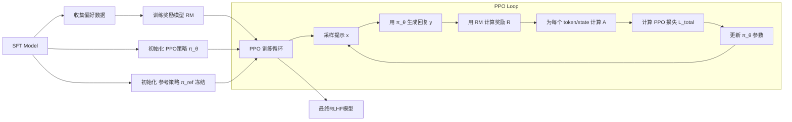

# LLM后训练需结合SFT与RLHF

### 🧑‍💻 User

为什么llm后训练阶段，不能只进行sft微调？

---

### 🤖 Assistant

这是一个非常专业的问题！**后训练阶段不能只进行SFT（监督微调）微调，主要是因为SFT虽然能提升模型在特定任务上的表现，但它存在一些关键局限性，无法解决大型语言模型（LLM）部署前必须处理的核心问题，尤其是“对齐”问题。** 需要结合 RLHF（基于人类反馈的强化学习）或其他对齐技术来让模型更安全、有用、符合人类意图和价值观。

以下是详细解释为什么不能只依赖 SFT：

1.  **SFT 的核心局限：模仿而非理解偏好与价值观**
    *   **学习目标单一：** SFT 的目标是让模型尽可能模仿给定示范数据（通常是高质量输入-输出对）中的行为。它学会了“**做什么**”，但没有明确学习“**为什么做这个比做那个更好**”。
    *   **无法学习相对偏好：** 人类对模型输出的偏好往往是相对的、主观的，甚至是模糊的。例如：
        *   在多个都“正确”的回答中，哪个更有帮助、更无害、更简洁、更有趣？
        *   如何拒绝不恰当、有害或不安全的请求？
        *   如何在诚实、有帮助和无害之间取得平衡？
    *   **SFT 数据难以覆盖所有情况：** 提供覆盖所有可能输入（尤其是边缘、有害或对抗性输入）以及所有期望输出行为的完美 SFT 数据集几乎是不可能的。SFT 模型在面对未见过的、复杂的或微妙的场景时，可能表现不佳或产生不符合期望的输出。

2.  **关键问题：安全性与“对齐”**
    *   **产生有害或偏见内容：** 仅经过预训练和 SFT 的模型，即使 SFT 数据是“干净”的，也可能因为预训练数据中存在的偏见和有害信息，或在面对新颖的有害指令时，生成冒犯性、歧视性、虚假或危险的内容。SFT 本身没有机制来主动抑制这些行为或学习“**不应该做什么**”。
    *   **无法可靠拒绝不当请求：** 模型需要学会识别并安全地拒绝执行不道德、非法或危险的指令（如生成仇恨言论、制作武器指南）。仅仅模仿 SFT 数据中的“好”行为，不足以让模型在面对“坏”指令时做出稳健的拒绝响应。
    *   **“胡说八道”与事实准确性：** 虽然 SFT 可以在一定程度上提高事实性，但它无法从根本上解决模型“自信地编造事实”的问题。模型需要学习对不确定的事物保持诚实，避免编造信息。

3.  **表现力与有用性**
    *   **无法学习复杂、微妙的偏好：** 人类的偏好往往不是非黑即白的。RLHF 等技术允许模型学习更细腻的、基于比较的偏好信号（比如，A 比 B 稍微好一点，C 比 D 更有趣但不够严谨）。SFT 难以捕捉这种细微差别。
    *   **“过于安全”或呆板：** 如果 SFT 数据过于强调安全，模型可能会变得过于保守，拒绝回答许多本可以安全回答的问题，或者输出过于模板化、缺乏创造力和趣味性。需要在安全性和有用性之间取得平衡。
    *   **长格式内容生成的一致性：** 在生成长文本（如故事、论文、代码）时，保持一致性、连贯性和整体质量是一个挑战。SFT 可以提供示例，但学习如何根据逐步的反馈优化长程一致性是 RLHF 等方法的强项。

4.  **RLHF 的核心优势：从偏好中学习**
    *   **学习“更好”而非“正确”：** RLHF 的核心是利用人类对模型不同输出进行**比较**（A > B）的反馈数据。这直接让模型学习人类的**相对偏好**。它不仅仅知道“某个输出是对的”，还知道“在多个可能的输出中，哪个/哪些更符合人类的期望（包括有帮助、无害、诚实、有趣等维度）”。
    *   **优化复杂目标：** RLHF 框架允许定义复杂的奖励函数（可以融合多个目标，如流畅性、信息量、安全性、趣味性），并通过强化学习算法（如 PPO）去优化模型以实现这个综合目标。这是 SFT 的简单最大似然目标无法做到的。
    *   **处理未见情况：** 通过从偏好比较中学习到的奖励模型，RLHF 可以泛化到训练数据未直接覆盖的输入上，指导模型在面对新情况时选择更符合人类偏好的响应策略。
    *   **显式抑制不良行为：** 奖励模型可以对有害、不安全或不诚实的输出给出低分，RL 优化过程会主动降低模型产生这类输出的概率。

5.  **数据效率与规模化**
    *   **偏好数据可能更高效：** 收集高质量、多样化的 SFT 示范数据（尤其是针对复杂任务或边缘情况）成本高昂。收集人类对不同输出的**偏好判断**（A 比 B 好）通常比创作完美的示范输出更容易、更快、成本更低，尤其是在需要覆盖广泛场景时。
    *   **奖励模型的可复用性：** 训练好的奖励模型可以在后续的 RL 微调中重复使用，用于持续改进模型或微调不同版本。

**总结：**

| 特性               | SFT (监督微调)                                      | RLHF (基于人类反馈的强化学习)                      |
| :----------------- | :-------------------------------------------------- | :------------------------------------------------- |
| **核心目标**       | 模仿给定示例行为 (“做什么”)                           | 学习人类偏好 (“为什么做这个比做那个更好”)            |
| **学习信号**       | 输入-输出配对 (绝对正确)                            | 输出对比较 (相对偏好 A > B)                        |
| **解决对齐问题**   | 有限。提升任务能力，但对安全性、诚实性、拒绝不当请求等关键对齐目标作用有限。 | **核心优势。** 直接优化模型行为以符合复杂的人类价值观（安全、诚实、有帮助、无害）。 |
| **处理偏好/价值观** | 困难。难以捕捉细微、相对、主观的偏好。              | **擅长。** 专门设计用于从比较中学习偏好。           |
| **泛化能力**       | 依赖示范数据覆盖度。对未见/边缘情况泛化能力有限。     | 更好。通过奖励模型泛化，指导模型在新情况下选择更优响应。 |
| **抑制不良行为**   | 被动。依赖训练数据避开不良行为，无主动抑制机制。      | **主动。** 奖励模型惩罚不良行为，RL 优化降低其概率。 |
| **长文本一致性**   | 提供示例，但优化长程一致性能力弱。                  | 更强。RL 可以优化多步生成的累积奖励。               |
| **数据效率/成本**  | 创作高质量示范输出成本高（尤其复杂任务/边缘情况）。   | 收集偏好判断通常比创作完美输出更容易、成本更低。     |
| **结果倾向**       | 可能过于保守、模板化（如果数据强调安全）。          | 更可能在安全性、有用性、趣味性等之间取得更好平衡。 |

**结论：**

SFT 是后训练阶段非常重要的一步，它有效地将通用预训练模型引导到特定任务或对话格式上，显著提升了模型在目标领域的初始表现和能力。**然而，仅靠 SFT 不足以解决 LLM 部署的核心挑战——确保模型安全、可靠、诚实、无害，并且其行为（尤其是在开放域交互中）深度符合人类复杂、细微的偏好和价值观。**

**RLHF（或其替代方案，如 DPO、RLAIF 等）是解决“对齐”问题的关键。** 它利用人类对模型输出的相对偏好信号，让模型学习“什么是更好的行为”，从而显著提升模型的安全性、有用性和与人类意图的一致性。因此，在现代 LLM（如 ChatGPT, Claude, Gemini 等）的开发流程中，SFT 和 RLHF 通常被视为**互补且必需**的两个阶段，共同构成了模型后训练和对齐的核心。不能只进行 SFT 微调，是因为它无法独立完成让模型真正变得“有用且安全”这一艰巨任务。

---

### 🧑‍💻 User

sft之后的rlhf阶段的ppo和rm分别是什么，整个流程大致是怎么样的？

---

### 🤖 Assistant

RLHF（基于人类反馈的强化学习）是让大型语言模型（LLM）行为与人类偏好和价值观对齐的核心技术。在SFT（监督微调）之后，RLHF阶段主要涉及两个关键组件：**奖励模型（Reward Model, RM）**和**使用近端策略优化（Proximal Policy Optimization, PPO）的强化学习微调**。

以下是整个RLHF流程的详细拆解：

---

### **一、 核心组件：RM 和 PPO**

1.  **奖励模型 (Reward Model, RM)**
    *   **是什么？** 一个经过训练的**判别式模型**，它的任务是为LLM生成的任何一段文本（通常是对某个提示的回复）**打出一个标量分数**（即奖励值）。这个分数代表了该回复在**符合人类偏好**（如帮助性、无害性、真实性、趣味性等）方面的**相对好坏程度**。
    *   **输入：** 一个`(提示, 回复)`对。
    *   **输出：** 一个单一的标量数值 `(reward)`。数值越高，代表该回复越符合人类偏好。
    *   **如何训练？**
        *   **数据收集：**
            1.  使用当前的LLM（通常是经过SFT后的模型）为**大量不同的提示**生成**多个（通常是4-9个）回复**。
            2.  将这些`(提示, 回复1, 回复2, ..., 回复K)`组提交给**人类标注员**。
            3.  标注员对这些回复进行**排序**（指出哪个最好，哪个次好，...，哪个最差），或者进行**成对比较**（对于每一对回复，指出哪个更好）。
        *   **模型训练：**
            *   使用**排序数据**或**成对比较数据**来训练RM。
            *   **常用损失函数：** **Bradley-Terry 模型**损失（最常用）或**Plackett-Luce** 模型损失。
            *   **Bradley-Terry 损失 (用于成对比较)：** 对于一对回复`(y_w, y_l)`（其中`y_w`是标注员认为更好的回复，`y_l`是较差的回复），损失函数鼓励RM给`y_w`的打分 `r_w`显著高于给`y_l`的打分 `r_l`：
                `loss = -log(σ(r_w - r_l))`
                其中 `σ` 是sigmoid函数。最小化这个损失等价于最大化`r_w - r_l`的概率。
            *   **模型选择：** RM通常是一个**比待对齐LLM小得多的模型**（例如，6B LLM 可能用 1B 或更小的 RM）。它接受`(prompt, response)`作为输入，输出一个标量。RM的架构通常基于预训练的LM（如BERT、RoBERTa或一个小型LLM），在顶部添加一个线性层输出标量分数。

2.  **近端策略优化 (Proximal Policy Optimization, PPO)**
    *   **是什么？** 一种**强化学习算法**，用于直接**优化LLM的生成策略**。它的目标是找到一个策略（即LLM的参数），使得该策略生成的回复能**最大化从RM那里获得的期望累积奖励**。
    *   **关键思想：** 在策略更新的每一步，PPO会计算一个“改进”的目标函数（替代损失），这个函数鼓励策略向能获得更高奖励的方向更新，但同时**严格限制每次更新的幅度**，避免新策略偏离旧策略太远（导致训练不稳定或崩溃）。这是通过一个称为**KL散度惩罚**的机制来实现的。
    *   **核心公式 (简化版 PPO-Clip 目标)：**
        ```
        L(θ) = E[min(
                    ratio * A,
                    clip(ratio, 1-ε, 1+ε) * A
                )]
        ```
        *   `θ`: 待优化的策略（LLM）参数。
        *   `ratio = π_θ(a|s) / π_old(a|s)`: 新策略产生动作`a`（即token）的概率除以旧策略产生该动作的概率。
        *   `A`: **优势函数**，估计在状态`s`（即当前的提示和已生成的部分回复）下采取动作`a`（生成下一个token）相对于平均水平的“好坏程度”。在实践中，`A`通常近似为`r + γ * V(s') - V(s)`（时序差分误差），但在LLM RLHF中常被简化为**从RM获得的最终奖励减去一个基线值**（通常是状态值函数`V(s)`的估计）。
        *   `clip(ratio, 1-ε, 1+ε)`: 将`ratio`限制在`[1-ε, 1+ε]`范围内（`ε`是一个小超参，如0.1或0.2）。
        *   `min(...)`: 取原始目标和裁剪后目标两者的最小值。这形成了一个**悲观的下界估计**，确保策略更新不会因某个`ratio * A`特别大而剧烈变化。
    *   **KL 散度惩罚：**
        *   除了PPO-Clip目标，通常会添加一个额外的项：`-β * KL[π_θ || π_ref]`。
        *   `π_ref`: 一个**参考策略**，通常是**SFT后的初始模型**（其参数在PPO训练过程中被冻结）。
        *   `β`: 控制惩罚强度的超参数。
        *   **目的：** 防止优化后的策略`π_θ`过度偏离原始的、表现尚可的`π_ref`。偏离太远可能导致模型：
            *   生成语法不通、无意义的文本（退化）。
            *   过度优化RM分数而牺牲语言的基本质量（“奖励黑客”）。
            *   忘记在预训练和SFT中学到的通用知识和能力。

---

### **二、 RLHF 完整流程详解 (SFT 之后)**

1.  **训练奖励模型 (RM):**
    *   使用**经过SFT的LLM**作为**采样模型**。
    *   收集大量多样化的提示`(x)`（可以是用户查询、指令、对话开场白等）。
    *   对每个提示`x`，用采样模型生成`K`个不同的回复`(y1, y2, ..., yK)`（通常使用采样而非贪心解码以增加多样性）。
    *   将`(x, y1, y2, ..., yK)`提交给人类标注员进行**偏好排序**或**成对比较**。
    *   使用收集到的偏好数据训练RM。训练完成后，RM应能可靠地判断给定`(x, y)`的好坏。

2.  **使用PPO优化LLM策略 (RL Fine-tuning):**
    *   **初始化：**
        *   **待优化策略 `π_θ`：** 复制一份**SFT模型**的参数。
        *   **参考策略 `π_ref`：** 复制一份**SFT模型**的参数并**冻结**。
        *   **奖励模型 RM：** 使用步骤1训练好的RM（冻结）。
        *   **Critic 模型 (可选但常用)：** 一个用于估计状态值`V(s)`的模型。它通常与`π_θ`共享主干网络（在最后一层分叉出一个值函数头），或者是一个独立的小模型。它的训练目标是最小化`(V(s) - (r + γ * V(s')))^2`（时序差分误差）。
    *   **PPO 训练循环：**
        1.  **数据收集 (Rollout)：**
            *   从提示分布中采样一批提示`x`。
            *   使用**当前策略 `π_θ`** 为每个提示`x`生成完整的回复`y`（通常使用采样解码）。
            *   对于生成过程中产生的**每一个状态（即部分序列）** 和 **每一个生成的token（动作）**，记录`(prompt, partial_response, generated_token, log_prob)`。
        2.  **计算奖励：**
            *   对于一个生成的完整回复`y`（对应一个提示`x`），使用**RM**计算最终奖励`R = RM(x, y)`。
            *   **关键点：** 这个**最终奖励`R`会被分配给生成`y`过程中产生的每一个(token, state)对**。这是RL中处理稀疏奖励的常用技巧（`reward-to-go`或`credit assignment`）。更精细的做法会使用Critic估计中间状态值。
        3.  **计算优势 (A) 和回报 (Return)：**
            *   对于每个状态（部分序列）`s_t`和在该状态下生成token的动作`a_t`：
                *   **回报 (Return) `G_t`：** 通常是从`t`时刻到序列结束获得的累积折扣奖励（`G_t = r_t + γ * r_{t+1} + γ² * r_{t+2} + ...`）。在LLM RLHF中，由于只有序列结束时有奖励`R`，且折扣因子`γ`常设为1，所以`G_t ≈ R`（对于该序列中的所有`t`）。
                *   **优势 (Advantage) `A_t`：** 估计动作`a_t`比在该状态`S_t`下的平均动作好多少。常用`A_t = G_t - V(s_t)`，其中`V(s_t)`由Critic模型估计（如果用了Critic）。如果没单独训练Critic，有时简单设`A_t = R - baseline`（`baseline`可以是批次平均奖励）。
        4.  **计算 PPO 目标损失：**
            *   对于每个`(s_t, a_t)`数据点：
                *   计算`ratio_t = π_θ(a_t | s_t) / π_old(a_t | s_t)`（`π_old`是生成该数据时策略的参数快照）。
                *   计算裁剪目标：`L_clip_t = min( ratio_t * A_t, clip(ratio_t, 1-ε, 1+ε) * A_t )`。
                *   计算KL散度惩罚项：`L_KL_t = KL[π_θ(. | s_t) || π_ref(. | s_t)]`（通常用采样的token近似）。
                *   总损失：`L_total_t = -L_clip_t + β * L_KL_t + c * L_value_t`（如果用了Critic，`L_value_t`是Critic的MSE损失）。
        5.  **参数更新：**
            *   使用梯度下降（如AdamW）优化策略`π_θ`的参数`θ`，以最小化这批数据上所有`L_total_t`的平均值。
        6.  **迭代：**
            *   定期（或在收集足够新数据后）用更新后的`π_θ`作为新的采样策略，回到步骤1收集新的数据。旧数据通常会被丢弃或与新数据混合。

3.  **模型选择与评估：**
    *   在PPO训练过程中，定期在**验证集**上评估模型：
        *   使用RM计算验证集回复的平均奖励。
        *   计算生成文本相对于参考策略`π_ref`的平均KL散度（监控偏离程度）。
        *   进行人工评估（黄金标准）：让标注员比较不同检查点模型生成的回复质量。
    *   选择在验证集上综合表现（奖励高、KL散度在可接受范围内、人工评估好）最佳的模型检查点作为最终输出。

---

### **三、 流程关键点总结与图示**



1.  **基础：** SFT模型提供起点和能力。
2.  **RM：** 学习将人类偏好量化为分数。
3.  **PPO：** 利用RM的分数作为信号，在参考策略（SFT模型）的约束下，安全、稳定地优化LLM的生成策略，使其输出获得更高的期望奖励（即更符合人类偏好）。
4.  **KL 惩罚：** 防止模型为了“刷分”而偏离正常语言或忘记基础能力（至关重要！）。
5.  **迭代：** PPO是一个数据收集（用当前策略生成回复）和策略更新的循环过程。

---

### **四、 为什么需要这么复杂？**

*   **直接优化不可行：** 无法直接对海量离散动作空间（所有可能的token序列）和稀疏的最终奖励进行优化。
*   **PPO的优势：** 提供了稳定、高效的策略梯度优化方法，通过限制更新幅度（clip）和约束策略偏移（KL惩罚）解决了传统策略梯度方法（如REINFORCE）的不稳定性问题。
*   **RM的作用：** 将昂贵且难以实时获得的人类偏好判断，转化为一个可以快速、自动打分的代理模型，使强化学习训练成为可能。
*   **π_ref的作用：** 防止模型在追求高奖励的路上“走火入魔”，保持生成文本的基本质量。

**替代方案：** 近年来也出现了如**DPO (Direct Preference Optimization)** 等方法，它绕开了显式的RM训练和PPO步骤，直接在偏好数据上优化策略，理论上更简单高效，但PPO-RLHF仍是目前工业界最主流、最成熟、效果经过验证的方案。