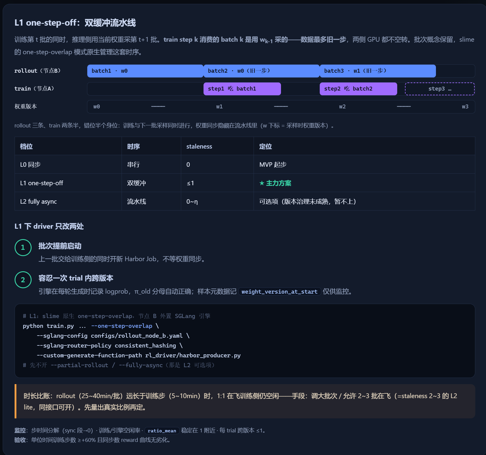

# 双缓冲一步错位方案

## 🧑‍💻 User

解读这张图



---
## 😀 默认助手 (7)

# 解读：L1 one-step-off 双缓冲流水线方案

这是一张 **RL（强化学习）后训练流水线的架构/排期设计图**，核心是讲清楚一个叫 **"L1 one-step-off"（单步错位 / 双缓冲）** 的并行训练模式：**推理采样与训练同时进行，但数据只允许"旧一步"**。下面分层拆解。

---

## 一、核心思想（一句话）

> **训练第 $t$ 批的同时，推理端用当前权重去采第 $t+1$ 批。**

即 `train step k` 消费的 `batch k`，是用 **上一版权重** $w_{k-1}$ 采出来的，因此：

- 数据 **最多旧一步**（staleness $\le 1$）
- **两侧 GPU 都不空转**（训练与采样重叠）
- **批次概念保留**，由 `slime` 框架的 `one-step-overlap` 模式原生管理时序

关键点在于：**权重同步被"藏"进流水线里**，而不是像同步训练那样停下来等权重广播。

---

## 二、甘特图时序（错位"半个身位"）

```
rollout(B节点) │ batch1·w0 │ batch2·w0（Ⅲ一步）│ batch3·w1（Ⅲ一步）
train  (A节点) │           │ step1⊗batch1      │ step2⊗batch2   │ step3…
权重版本        │   w0      │      w1           │      w2        │  w3
```

- **rollout 三条、train 两条半**，故意错开半个身位
- `w` 下标 = **采样时所使用的权重版本**
- `⊗` 表示训练步骤消费对应的数据批
- `step3 …` 用虚线 = 尚未发生（前面在飞）

⚠️ 图中**编号的竖线（Ⅰ、Ⅱ、Ⅲ）是重要细节**：`batch2·w0` 的第三步和 `batch3·w1` 的第一步是在同一时间点切换的——这正是"错位"发生的位置。

---

## 三、三档策略对比（这张图的定位意义）

| 档位 | 时序 | staleness | 定位 |
|------|------|-----------|------|
| **L0 同步** | 串行 | 0 | MVP 起步（最稳，但慢） |
| **L1 one-step-off** | 双缓冲 | $\le 1$ | ★ **主力方案** |
| **L2 fully async** | 流水线 | $0 \sim \eta$ | 可选项（**版本治理未成熟，暂不上**） |

> 这张图的本质是：**在"稳态"（L0）与"激进异步"（L2）之间，选了一个风险可控的中间档 L1 作为主推。**

---

## 四、L1 落地只改两处 driver

<details>
<summary><b>展开：driver 的两处改动</b></summary>

**① 批次提前启动**
> 上一批交给训练侧的同时，**就开新的 Harbor Job**，不等权重同步。

即生产（rollout）与消费（train）解耦，靠"提前起 job"制造重叠。

**② 容忍一次 trial 内跨版本**
> 引擎在每轮生成时记录 `logprob`，$\pi_{old}$ 分母自动正确；样本元数据记 `weight_version_at_start`，**仅供监控**。

这是 L1 能成立的关键安全阀——因为一个 trial 可能横跨两个权重版本，必须保证重要性采样比的分母 $\pi_{old}$ 是"当时生成时"的旧策略，而不是训练时的当前策略。

</details>

---

## 五、启动命令（代码块）

```bash
# L1: slime 原生 one-step-overlap，节点 B 外置 SGLang 引擎
python train.py ... --one-step-overlap \
  --sglang-config configs/rollout_node_b.yaml \
  --sglang-router-policy consistent_hashing \
  --custom-generate-function-path rl_driver/harbor_producer.py
# 先不开 --partial-rollout / --fully-async（那是 L2 可选项）
```

要点：
- `--one-step-overlap` 是 L1 的开关
- **节点 B 外置 SGLang 引擎** + `consistent_hashing` 路由 → 让算力落在独立节点做推理
- `harbor_producer.py` 是自定义的生产函数（对应上面"提前起 Job"）
- **明确暂不开启** `--partial-rollout` / `--fully-async`（那是 L2 的东西）

---

## 六、⚠️ 时长比账（图底部橙色框，最容易被忽略的风险）

> **rollout（$25\sim40$ min/批）远长于训练步（$5\sim10$ min）时，$1{:}1$ 在飞训练侧仍空闲。**

也就是说：**瓶颈在推理侧**，1 步错位可能还不够填满训练 GPU。对策有两个：

1. **调大批次**
2. **允许 $2\sim3$ 批在飞**（= staleness $2\sim3$ 的 **"L2 lite"**，同接口可开）

结论：**先量出真实的时间比例，再定参数**——不要拍脑袋。

---

## 七、监控与验收指标

| 指标 | 要求 |
|------|------|
| **步时间分解** | sync 段 = 0（证明没有同步停顿） |
| **训练/引擎空闲率** | `ratio_mean` 稳定在 $1$ 附近 |
| **每 trial 跨版本数** | $\le 1$ |
| **验收：单位时间训练步数** | $\ge +60\%$ |
| **验收：reward** | 同步数下曲线**无劣化** |

即"**快了 60% 以上，且效果不掉**"才算通过。

---

## 总结：这张图在说什么

| 维度 | 结论 |
|------|------|
| **要解决什么** | 训练与推理串行导致的 GPU 空转 |
| **方案** | 双缓冲 + 单步错位（L1） |
| **代价** | 数据 staleness $\le 1$，需处理 trial 跨版本 |
| **为什么不直接上 L2** | 版本治理未成熟，风险不可控 |
| **最大隐患** | rollout 远慢于 train 时，训练侧仍空闲 → 需升到 "L2 lite" |
| **成功标准** | 步数 +60% 且 reward 不劣化 |

一句话：**这是一份"用可控的 $\le1$ 步陈旧度，换取推理/训练全重叠"的主力落地方案设计图，并附带了明确的开关、监控和验收口径。**
