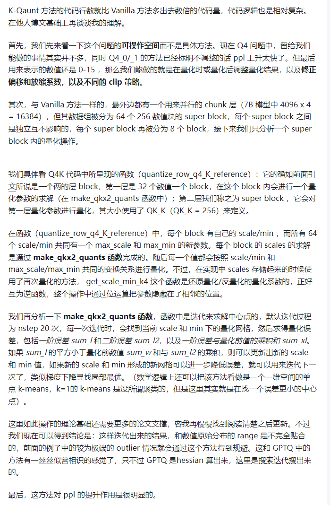

# GGUF K-Quant Parameters Explained

### 🧑‍💻 User

gguf的k-quant量化中，per block的min（zeropoint）和scale是如何确定的？

---

### 🤖 Assistant

## Unraveling the K-Quants: How GGUF Determines Per-Block Mins and Scales

In the gguf k-quantization scheme, the determination of the per-block minimums (zero-points) and scales is a sophisticated iterative process designed to minimize quantization error, rather than a simple calculation of the minimum and maximum values within a block. This method, particularly for quantization types like Q4_K, employs a search algorithm to find the optimal quantization parameters for each block of weights.

At the heart of this process are functions like `quantize_row_q4_K_reference` and the core logic encapsulated within `make_qkkx_quants`. These functions work in concert to find the best `scale` and `min` for a given block of floating-point numbers (weights) that are to be quantized into lower precision integers.

Here's a breakdown of the key steps involved in determining these per-block parameters:

**1. Block-Level Optimization:** The fundamental idea is to treat each block of weights independently. For each block, the goal is to find a `scale` (a floating-point number) and a `min` (also a floating-point number, representing the zero-point) that will result in the least amount of information loss when the original weights are converted to their quantized integer representations.

**2. Iterative Search for Optimal Parameters:** Instead of a one-shot calculation, the process involves an iterative search. This is where the concepts of `sum_l` and `sum_sl` mentioned in the provided text come into play. The algorithm iteratively tests different potential values for `scale` and `min`.

**3. The Role of `sum_l` and `sum_sl`:**
   - For a given `scale` and `min`, each floating-point weight `x` in the block is quantized to an integer `l` using a formula akin to: `l = round((x - min) / scale)`.
   - The algorithm then calculates two crucial sums:
     - `sum_l`: The sum of the products of the de-quantized value and the quantized integer for each weight in the block. Essentially, `sum((scale * l + min) * l)`.
     - `sum_sl`: The sum of the squares of the de-quantized values, `sum((scale * l + min)^2)`.

By analyzing these sums, the algorithm can assess the error introduced by the current `scale` and `min`. The objective is to find the pair of `scale` and `min` that minimizes a loss function, which is typically the mean squared error between the original and de-quantized weights.

**4. Refining the Search:** The process described as a "20-step iteration" in the user's text refers to this search. The algorithm will systematically adjust the `scale` and `min` in each step, recalculate the quantized values and the corresponding error, and move towards the parameters that yield the lowest error. This can be conceptualized as a form of local search or a simplified gradient descent-like approach to find the optimal quantization parameters for that specific block.

**5. Super-blocks and Hierarchical Quantization:** The k-quantization scheme also introduces the concept of "super-blocks," which are collections of smaller blocks. While the primary optimization of `scale` and `min` happens at the individual block level, there can be a second level of quantization applied to the scales and mins themselves across the super-block. This is done to further reduce the storage overhead of these quantization parameters. For example, the `scale` and `min` values for each block within a super-block might be quantized to a lower precision, such as 6-bits, as seen in the Q4_K format.

**In summary, the determination of per-block mins and scales in gguf's k-quantization is not a straightforward min/max calculation. It is an iterative optimization process performed for each block of weights. This search algorithm methodically explores different scaling and offset values to find the combination that minimizes the quantization error, thereby preserving model accuracy as much as possible while significantly reducing the model's memory footprint.** This sophisticated approach is a key reason why k-quants often provide a better balance between model size and performance compared to simpler quantization methods.

---

### 🧑‍💻 User

翻译成中文

---

### 🤖 Assistant

好的，请看这篇关于GGUF K-quant量化中如何确定per-block `mins`和`scales`的中文翻译。

---

## 揭秘K-Quants：GGUF如何确定每区块的Mins和Scales

在gguf的k-quant量化方案中，每个区块（per-block）的最小值（`min`，即零点/zeropoint）和缩放因子（`scale`）的确定过程是一个复杂的迭代过程，其设计目标是最小化量化误差，而不是简单地计算一个区块内的最大值和最小值。该方法，特别是对于像Q4_K这样的量化类型，采用了一种搜索算法来为每一块权重找到最优的量化参数。

这个过程的核心是像 `quantize_row_q4_K_reference` 这样的函数，以及封装在 `make_qkkx_quants` 内部的核心逻辑。这些函数协同工作，为给定的浮点数权重块找到最佳的 `scale`（一个浮点数）和 `min`（也是一个浮点数，代表零点），从而在将原始权重转换为低精度整数时导致最少的信息损失。

以下是确定这些per-block参数所涉及的关键步骤：

**1. 区块级优化 (Block-Level Optimization):** 基本思想是独立处理每个权重区块。对于每个区块，目标是找到一个 `scale` 和一个 `min`，当原始权重被转换成量化后的整数表示时，这对参数能带来最小的信息损失。

**2. 迭代搜索最优参数 (Iterative Search for Optimal Parameters):** 这个过程并非一次性计算，而是涉及迭代搜索。这正是您提供的文本中提到的 `sum_l` 和 `sum_sl` 概念发挥作用的地方。该算法会迭代地测试 `scale` 和 `min` 的不同潜在值。

**3. `sum_l` 和 `sum_sl` 的作用:**
   - 对于给定的 `scale` 和 `min`，区块中的每个浮点权重 `x` 会通过一个类似于 `l = round((x - min) / scale)` 的公式被量化为一个整数 `l`。
   - 接着，算法会计算两个至关重要的和：
     - `sum_l`: 区块内每个权重的反量化值与量化整数 `l` 的乘积之和。本质上是 `sum((scale * l + min) * l)`。
     - `sum_sl`: 反量化值的平方和，即 `sum((scale * l + min)^2)`。

通过分析这些总和，算法可以评估当前 `scale` 和 `min` 所引入的误差。其目标是找到能使损失函数（通常是原始权重与反量化后权重之间的均方误差）最小化的那对 `scale` 和 `min`。

**4. 细化搜索过程 (Refining the Search):** 您提供的文本中描述的“20步迭代”指的就是这个搜索过程。算法会在每一步中系统地调整 `scale` 和 `min`，重新计算量化值和相应的误差，并朝着产生最低误差的参数方向前进。这可以被看作是一种局部搜索或简化的类梯度下降方法，用以为该特定区块找到最优的量化参数。

**5. 超级区块和分层量化 (Super-blocks and Hierarchical Quantization):** k-quant方案还引入了“超级区块”（super-blocks）的概念，它是更小区块的集合。虽然 `scale` 和 `min` 的主要优化发生在单个区块的层面上，但对于这些 `scale` 和 `min` 值本身，可能还存在第二层级的量化。这样做是为了进一步减少这些量化参数的存储开销。例如，在一个超级区块内，每个小区块的 `scale` 和 `min` 值本身可能会被量化到更低的精度，比如在Q4_K格式中看到的6位（6-bit）。

**总而言之，gguf k-quant量化中per-block `mins`和`scales`的确定并非简单的最大/最小值计算，而是一个对每个权重区块执行的迭代优化过程。这种搜索算法系统地探索不同的缩放和偏移值，以找到能最小化量化误差的组合，从而在显著减小模型内存占用的同时，尽可能地保持模型的准确性。** 这种复杂精密的处理方式，正是k-quants量化方法相比于更简单的量化方法，通常能在模型大小和性能之间提供更好平衡的关键原因。

---

### 🧑‍💻 User

K-Quant通过迭代搜索最优Scale和Min，而非直接使用极值。这个迭代优化方法具体是怎么样的？

---

### 🤖 Assistant

好的，我们来深入探讨一下K-Quant中这个迭代优化的具体过程。

您理解得非常准确，K-Quant的核心优势在于它不满足于使用简单的最大/最小值来定义量化参数，而是通过一个迭代过程去“寻找”能让量化误差最小的`scale`和`min`。这个过程在本质上是一个**为每个权重块（block）独立进行的、旨在最小化均方根误差（RMSE）的优化算法**。

我们可以将这个迭代过程分解为以下几个步骤，这在`llama.cpp`的`make_qkkx_quants`（或类似）函数中实现：

### 迭代优化方法的具体步骤

这个过程可以被看作是为一批数据点（区块中的原始浮点权重）寻找最佳的线性映射关系 `x ≈ scale * l + min`，其中 `x` 是原始权重，`l` 是量化后的整数。目标是让等式右侧（反量化值）尽可能地接近左侧（原始值）。

**1. 初始化 (Initialization)**

* 算法首先需要一个初始的`scale`和`min`作为起点。这个初始值通常就是通过区块中所有权重的最大值（max）和最小值（min）计算得出的。
    * `scale = (max - min) / (2^n - 1)` (其中n是量化位数，例如4-bit就是15)
    * `min = min_val`

**2. 迭代循环 (The Iterative Loop)**

算法会进行固定次数的迭代（如您在图片中看到的`nstep=20`），在每一步都试图找到比当前更好的`scale`和`min`。

**核心思想：** 整个优化过程可以理解为一个两阶段的循环。外层循环负责“探索”不同的量化网格，内层循环则在给定的网格下“优化”出最佳参数。

* **阶段一：探索不同的量化可能性 (Grid Exploration)**
    * 算法并不认为初始的`scale`就是最好的。它会围绕这个初始`scale`进行小范围的探索。例如，它会尝试 `scale * 0.9`, `scale * 0.95`, `scale * 1.0`, `scale * 1.05`, `scale * 1.1` 等一系列微调过的`scale`值。
    * 每一次尝试一个新的`scale`，都会导致区块内所有浮点权重被映射到一组**不同**的整数`l`上。这相当于在尝试不同的“量化网格”。

* **阶段二：在当前网格下计算最优参数 (Optimal Parameter Calculation)**
    * 对于每一次探索所产生的特定整数集合 `{l}`，算法现在要回答一个问题：“假设权重必须被量化成这些整数`l`，那么能让反量化误差最小的`scale`和`min`应该是什么？”
    * 这变成了一个经典的**线性回归**问题。我们有一系列的对应数据点 `(l, x)`，需要找到一条直线 `x = scale * l + min` 来最好地拟合这些点。
    * 通过最小二乘法，可以精确地计算出这个最佳的`scale`（直线的斜率）和`min`（直线的截距）。这正是您在图片中看到的 `sum_l` 和 `sum_sl` 等变量发挥作用的地方，它们是计算线性回归参数所需的中间量。
        * `scale = (N * Σ(x*l) - Σx * Σl) / (N * Σ(l^2) - (Σl)^2)`
        * `min = (Σx - scale * Σl) / N`
        (其中 N 是区块中的权重数量, Σ 代表求和)

* **阶段三：评估与选择 (Evaluation and Selection)**
    * 在计算出这对新的`scale`和`min`后，算法会用它们来计算当前这次探索的**总误差**（通常是原始权重`x`与反量化后权重 `scale * l + min` 之间的平方差之和）。
    * 算法会记录下产生最低总误差的那一次探索，以及与之对应的`scale`和`min`。

**3. 终止 (Termination)**

* 在完成所有预设的迭代次数后（例如20次），算法会选出在整个搜索过程中产生误差最小的那一对`scale`和`min`，作为这个区块最终的量化参数。

### 总结与类比

这个过程有点像**带有搜索策略的K-Means聚类**。

* **K-Means类比**：你可以把 `2^n` 个量化整数（例如4-bit的0到15）看作是`k`个聚类的中心。算法的目标是将区块中的所有浮点权重分配给这些“中心”，使得总的组内平方和（误差）最小。
* **不同之处**：与标准K-Means不同的是，这些“聚类中心”（即反量化后的值）的位置不是固定的，它们由`scale`和`min`这两个参数动态定义，形成一个等距的网格。算法不仅在分配权重给网格点，同时也在**移动和缩放整个网格**（通过调整`scale`和`min`），以找到让所有权重到其对应网格点的距离之和最小的那个网格。

因此，K-Quant的迭代优化是一个更加智能和彻底的搜索过程，它通过反复试验和最小二乘拟合，为每个权重块量身定制了最优的量化方案，从而在压缩模型的同时，最大程度地保留了模型的精度。

---

### 🧑‍💻 User

结合gguf K-Quant中的Super Block结构说说，相较于传统的Vanilla方法，K-Quant迭代法是如何解决Outlier问题的？

---

### 🤖 Assistant

好的，我们来结合GGUF K-Quant的超级区块（Super Block）结构，深入探讨K-Quant的迭代法相较于传统的“原版”（Vanilla）量化方法，是如何更有效地解决离群值（Outlier）问题的。

### 传统Vanilla量化方法及其离群值困境

首先，我们需要理解传统量化方法（如按层或按简单区块的`absmax`或`min-max`量化）的痛点。

  * **工作方式**：这种方法会在一个较大的权重范围（例如整个网络层或一个较大的权重块）内，找到绝对值的最大值（`absmax`）或最大/最小值（`min/max`）。然后，它使用这个极值来确定一个全局的`scale`（缩放因子）。例如，`scale = absmax / 127` (对于8-bit量化)。
  * **离群值的破坏性**：神经网络的权重分布通常是类似高斯分布的，大部分权重都集中在零附近的一个小范围内。然而，其中可能存在一两个绝对值非常大的“离群值”。对于Vanilla方法而言，**一个离群值就足以“污染”整个量化范围**。为了能表示这个离群值，`scale`会被迫变得非常大。结果是，绝大多数“正常”的权重值在反量化后，都被映射到了非常有限的几个整数上，导致它们的精度严重损失。

**一个形象的比喻是**：为了给一个身高2.5米的篮球运动员和一群平均身高1.7米的人拍集体照，摄影师必须站得非常远才能把所有人都框进去。结果，那个篮球运动员是清晰了，但其他所有人在照片里都变得面目模糊，细节尽失。这里的离群值就是那个篮球运动员。

### K-Quant的“双重防御”策略

K-Quant通过其核心的**迭代优化**和**超级区块结构**，构建了一套双重防御机制来应对离群值问题。

#### 第一重防御：迭代优化算法“孤立”离群值

这是在\*\*最小的量化单元（小区块）\*\*内部发生的微观防御。

如我们之前讨论的，K-Quant的迭代法**目标是最小化整个区块的均方根误差（RMSE），而不是保证每个值都能被完美表示**。当一个区块内包含一个离群值时：

1.  **“民主”决策，而非“独裁”**：如果算法为了迁就一个离群值而选择一个很大的`scale`，那么其他几百个正常值的量化误差会急剧增大，导致总误差非常高。
2.  **牺牲个体，保全整体**：优化算法会“计算”出，给予那个离群值一个较大的量化误差，但同时为其他所有正常值选择一个更合适的、更小的`scale`，所得到的**总体误差会更低**。
3.  **结果**：算法最终会选择一个能最好地拟合那群“正常”值的`scale`和`min`。离群值虽然会被量化，但其精度损失较大。这相当于算法承认了它的“特立独行”，并选择在优化过程中边缘化它的影响力，从而保护了区块内大多数值的精度。

这就像拍照时，摄影师决定聚焦于那群平均身高的人，让他们纤毫毕现，而只让那个最高的运动员的头顶稍微出框。最终的照片对大多数人来说质量更高。

#### 第二重防御：超级区块结构“隔离”离群值

这是在**区块之间**发生的宏观防御，也是K-Quant设计的精髓之一。

1.  **精细的量化粒度**：K-Quant将权重分成“超级区块”（例如，一个包含256个权重的Super Block）。但关键在于，这个超级区块内部又被分成了更小的区块（例如，Q4\_K中是8个或16个32/16权重的小区块）。
2.  **独立的量化参数**：**每一个小区块都拥有自己独立计算出的一对`scale`和`min`**。这些参数是前述迭代法为这个小区块量身定做的。
3.  **伤害隔离机制 (Damage Containment)**：现在，假设一个离群值出现。它只会存在于某一个具体的小区块中。
      * 该小区块的迭代算法会为它计算出一套特定的`scale`和`min`，这个`scale`可能会因为离群值而变得较大。
      * 然而，这**完全不会影响到同一个超级区块内的其他任何小区块**。邻近的小区块们会根据它们自己的、没有离群值的权重分布，计算出各自的、更优的`scale`和`min`。

**这解决了Vanilla方法最大的问题：误差传播。** 在K-Quant中，离群值的影响被完美地“隔离”在了它所在的一个非常小的社区（例如仅32个权重）之内，避免了“一颗老鼠屎坏了一锅汤”的悲剧。

### 总结对比

| 特性 | 传统Vanilla方法 | GGUF K-Quant方法 |
| :--- | :--- | :--- |
| **处理方式** | 基于全局或大区块的极值（Min/Max, Absmax） | **双重防御** |
| **离群值影响** | 一个离群值会拉大整个大区块的量化范围，**污染**所有其他值的精度。 | 1. **迭代法**在小区块内部**孤立**离群值的影响，优先保证多数值的精度。\<br\>2. **超级区块结构**将离群值的破坏力**隔离**在单个小区块内，不影响邻居。 |
| **量化粒度** | 粗粒度（Per-Tensor 或 Per-Large-Block） | 极细粒度（Per-Small-Block，例如16或32个权重） |
| **结果** | 整体精度损失严重 | 在大幅压缩模型的同时，能更好地保留模型在存在离群值时的性能和准确度。 |

综上所述，K-Quant的迭代法和超级区块结构协同工作，使得它在处理包含离群值的真实世界模型权重时，表现得远比传统的Vanilla量化方法更加稳健和高效。它通过在微观和宏观层面上的精心设计，实现了对量化误差的精准控制和隔离。

---

### 🧑‍💻 User

gguf的kquant量化这种看上去虽然很“暴力”的算法，但是确实可以有效提升低位量化性能，能不能分析下？

---

### 🤖 Assistant

当然，我们来深入分析一下为什么GGUF K-Quant这种看似“暴力”的算法，却能实实在在地提升低位（low-bit）量化模型的性能。

您用“暴力”来形容这个算法非常贴切，因为它摒弃了寻求单一、优雅数学公式的思路，而是采用了一种计算密集型的搜索方法。但这恰恰是它成功的关键，尤其是在2-bit到5-bit这样的极低位量化场景下。

### 低位量化的核心挑战：精度的“悬崖”

当量化位数非常低时（例如4-bit只有16个可用整数等级），我们面临一个核心挑战：**量化参数的微小变动会引起模型性能的巨大变化**。

* **稀疏的“安全岛”**：你可以想象，在连续的浮点数海洋中，只有16个离散的“安全岛”（可表示的值）。你的`scale`和`min`参数决定了这些岛屿的位置。
* **错误的代价极高**：如果参数设置稍有不当，可能会导致大量权重从一个“本应降落的岛”被错误地映射到旁边的岛。由于岛屿之间相距甚远，这种“映射错误”带来的精度损失是巨大的，远比8-bit量化中的情况严重。

传统的Vanilla方法（如min-max）就像是简单地用一个大木框把所有岛屿都框起来，如果某个岛（离群值）离得特别远，整个木框就会被撑得巨大，导致中间的岛屿挤作一团，失去了区分度。

### K-Quant“暴力”搜索的有效性分析

K-Quant的迭代搜索算法之所以有效，是因为它深刻理解并解决了上述挑战。它并非盲目暴力，而是**带有明确目标的、系统性的暴力搜索**。

#### 1. 直接为最终目标优化：最小化误差

传统方法计算`scale`和`min`是一个间接过程，它希望通过框定极值来间接控制误差。而K-Quant的目标函数就是**直接最小化最终的量化误差**（原始浮点数与反量化浮点数之间的均方差）。

这是一种“结果导向”的务实做法。算法不在乎中间过程是否“优雅”，它只关心哪组`scale`和`min`能让最终的误差最小。通过20次左右的迭代，它不断地测量和比较实际误差，确保最终选出的参数就是那个能让模型精度损失最小的“最优解”。

#### 2. 探索不同的“量化网格”，避免局部最优

这是该算法最“暴力”也最关键的一步。算法不满足于在单一的量化方案下进行优化，而是**主动探索多种可能性**。

* **“暴力”的尝试**：算法会尝试一系列微调过的`scale`（例如，`scale*0.9`, `scale*1.0`, `scale*1.1`等）。每一种尝试都会生成一个全新的“量化网格”，即一种全新的将浮点数映射到16个整数等级的方案。
* **发现更优的离散化方案**：某些权重可能在A方案下被不合理地归为一类，但在B方案下就能被更好地区分开。这种看似暴力的搜索，**实质上是在寻找一种能最好地保留权重分布结构和相对关系的离散化方法**。它不是在解一个平滑的数学方程，而是在一个充满“台阶”和“断崖”的、不连续的误差空间里寻找全局最低点。

#### 3. 找到“最佳拟合网格”，而非“最大包围盒”

这个过程的本质，是为每个区块的数据点找到一个**最佳拟合（Best-Fit）**的等距网格，而不是一个简单地将其全部包住的**包围盒（Bounding-Box）**。

* **迁就大多数**：它会自然地倾向于那个能最好地服务于数据最密集区域的网格方案，即使这意味着要牺牲掉离群值的表示精度。对于模型性能而言，保留绝大多数普通权重的精度远比完美表示少数离群值更重要。
* **提升信噪比**：通过这种方式，它极大地提升了量化过程的“信噪比”。“信号”是密集的权重分布，“噪声”是稀疏的离群值。K-Quant的算法专注于放大信号，抑制噪声的影响。

### 结论：一次性的计算成本 vs. 持久性的性能收益

K-Quant的“暴力”计算发生在**模型量化阶段**，这是一个一次性的、离线的准备过程。虽然这个过程比传统方法要慢得多，但它带来的好处是持久性的：

* **一次计算，永久受益**：一旦最优的`scale`和`min`被找到并固化在gguf文件中，之后每一次模型的加载和推理都将享受到这个优化带来的好处——**更高的精度、更稳定的性能**。

因此，K-Quant的算法可以被看作是一种**明智的投资**。它通过在模型准备阶段投入更多的计算资源，换取了在实际应用中更小、更快且更准确的模型表现，这对于追求极致性能的低位量化而言，是非常值得的。