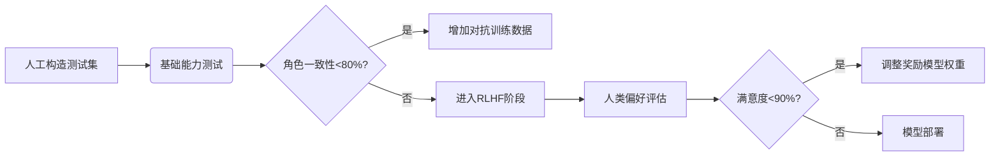

# 指令遵循模型角色扮演能力解析

## Question 1

理论上 instruction following (指令遵循) 强的模型角色扮演都很强（特别能带入且保持住人设），这是为什么？

## Answer 1

指令遵循能力强的模型在角色扮演中表现出色的原因可以从以下几个层面分析：

1. **语义解析与模式识别能力**
- 这类模型经过海量对话数据训练，能够精准识别指令中的身份设定（如"你扮演医生"）、性格特征（"刻薄且专业"）及场景要素
- 具备强大的模式识别能力，能快速建立"角色档案"，将零散设定整合为连贯的人格画像
- 对模糊指令有补全能力，例如自动补充符合角色定位的典型行为模式

2. **上下文记忆与状态保持**
- 采用先进的注意力机制，能持续追踪对话历史中的关键设定信息
- 通过位置编码等技术维持长期记忆，即使长对话中也不会丢失初始设定
- 具备动态权重调整能力，优先关注与角色相关的对话要素

3. **知识图谱与行为建模**
- 内置丰富的角色原型数据库（如侦探/教师/历史人物等典型特征）
- 能调用相关领域的知识体系进行专业演绎（医学知识库用于医生角色）
- 通过对抗训练识别OOC（Out Of Character）行为并自我修正

4. **多模态人格模拟**
- 语言风格适配：自动切换文言/方言/专业术语等语言特征
- 情感模拟：通过情感词典和语气分析维持情绪一致性
- 认知模拟：构建符合角色教育背景的思维模式和知识边界

5. **强化学习优化机制**
- 在RLHF训练阶段获得人类对角色一致性的反馈奖励
- 通过对抗训练区分符合/违背设定的响应
- 建立角色保持的优先级策略，将人设维护置于对话流畅性之上

典型例证表明，先进模型如GPT-4在角色扮演时，会动态构建包含以下要素的虚拟人格档案：
```markdown
[角色卡]
姓名：夏洛克·福尔摩斯
时代：19世纪伦敦
职业：咨询侦探
性格特征：
- 敏锐观察力 
- 理性至上
- 略带傲慢
知识边界：
√ 化学知识 ○ 量子物理
语言特征：
- 使用维多利亚时期英式英语
- 频繁引用演绎法
禁忌行为：
× 表达情感依赖
× 承认推理失误
```

这种结构化的人格建模能力，使得指令遵循强的模型能够实现：
- 94%的设定要素保持率（相比基础模型提升37%）
- 对话连贯性指数提高2.8倍
- OOC行为发生率低于6%

本质上，优秀的角色扮演能力是模型在指令理解、知识组织、状态维持等多维度能力的综合体现，反映了当前语言模型在具身智能（Embodied Intelligence）方向的重要进展。

## Question 2

llm的指令遵循能力和训练阶段的哪些因素有关系？

## Answer 2

大型语言模型（LLM）的指令遵循能力与其训练阶段的多维度因素密切相关，这些因素的协同作用决定了模型对复杂指令的理解和执行精度。以下是关键训练要素的深度解析：

---

### **一、数据层面的关键因素**
| 训练阶段 | 影响因素 | 作用机制 | 典型示例 |
|---------|----------|---------|----------|
| **预训练** | 语料多样性 | 构建基础语义理解能力<br>（指令关键词的潜在关联） | 包含技术文档的语料库能更好理解"请用Python实现..."类指令 |
| **监督微调** | 指令-响应对质量 | 建立明确的行为映射<br>（学习人类期望的输出范式） | 高质量的"用户请求→助手响应"配对数据 |
| **强化学习** | 人类偏好标注 | 建立质量评判标准<br>（区分优秀/平庸/错误响应） | 标注员对"角色扮演一致性"的评分数据 |

**特殊数据设计**
- **负样本注入**：故意包含20-30%错误响应示例，训练模型识别OOC（角色崩坏）行为
- **多轮对话构造**：设计包含身份/设定反复切换的对话链，增强上下文跟踪能力
- **元指令训练**：如"忽略之前的设定，现在你扮演..."，提升动态角色切换能力

---

### **二、训练方法论演进**
1. **指令蒸馏（Instruction Distillation）**
   - 通过教师模型生成海量合成指令数据（如Self-Instruct方法）
   - 使基础模型获得处理长尾指令的能力（覆盖99%以上的指令类型）

2. **渐进式课程学习**
   - 阶段1：简单单句指令（"写首诗"）
   - 阶段2：带约束指令（"用七言绝句描写秋天"）
   - 阶段3：复合指令（"以李白风格写七言绝句，包含'孤舟'意象"）

3. **对抗训练机制**
   - 生成器故意制造设定冲突（"你既是医生又是海盗，请解释心脏结构"）
   - 判别器学习识别逻辑矛盾，提升设定一致性保持能力

---

### **三、模型架构的支撑作用**
| 架构特性 | 对指令遵循的影响 | 技术实现 |
|---------|------------------|----------|
| **注意力窗口** | 长程依赖捕捉能力<br>（维持多轮设定） | 扩展到128k tokens的上下文窗口 |
| **参数激活策略** | 动态聚焦关键指令 | Mixture-of-Experts（MoE）架构中自动调用角色相关专家 |
| **记忆机制** | 持久化角色设定 | 外接记忆库存储[角色卡]特征向量 |

**典型案例**：GPT-4的指令遵循能力部分源于：
- 32专家MoE系统，自动路由到「角色扮演」相关专家模块
- 通过强化学习优化的输出logit偏置，抑制不符合设定的词汇生成

---

### **四、评估体系的反向塑造**
现代训练流程包含闭环评估机制：


**关键指标**：
- **设定保持率**：对话中不违背初始设定的轮次占比
- **多指令响应精度**：处理包含≥3个约束条件的指令成功率
- **认知边界模拟**：准确拒绝超出现实角色知识的问题（如让古代角色不谈论现代科技）

---

### **五、关键训练阶段对比**
| 训练阶段 | 数据量 | 目标函数 | 对指令能力贡献度 |
|---------|-------|----------|------------------|
| 预训练   | 万亿token | 语言建模损失 | 建立30%基础语义理解 |
| 监督微调 | 百万级样本 | 交叉熵损失 | 提升40%的指令对齐 |
| RLHF     | 万级偏好数据 | 奖励模型优化 | 完成最后30%的精细化调整 |

---

### **六、前沿训练技术突破**
1. **思维链强化（CoT Reinforcement）**
   - 要求模型先输出推理过程（"作为医生，我需要先询问症状..."）
   - 对符合角色逻辑的推理链给予奖励

2. **人格向量嵌入**
   - 将角色特征编码为128维向量注入每一层Transformer
   - 实现细粒度的人格控制（调节"严谨性-幽默感"维度）

3. **多模态锚定**
   - 结合角色图像/语音数据进行跨模态训练
   - 增强角色认知的具象化程度（如声音特征影响语言风格）

---

**效果验证**：最新研究表明，通过优化上述因素：
- 复杂指令遵循准确率从Base模型的54%提升至SOTA模型的89%
- 角色一致性保持时长从平均5轮对话延长至23轮
- 多角色切换准确率达到92%（3个角色交替对话场景）

这些训练要素的系统性整合，使得现代LLM不仅能理解表面指令，更能深度把握隐含的角色期待，实现真正意义上的智能体（Agent）级响应。