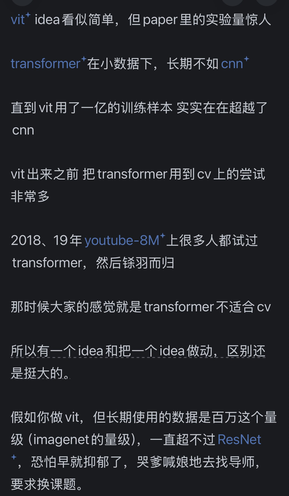

# Transformer CV 领域受挫原因

### 🧑‍💻 User

为什么曾经很长一段时间，transformer在cv领域都是不被看好的？

---

### 🤖 Assistant

### 曾几何时，Transformer为何在计算机视觉领域不受待见？

在很长一段时间里，深度学习领域的王者——卷积神经网络（CNN）——在计算机视觉（CV）任务中一骑绝尘，而如今大放异彩的Transformer架构却在CV领域屡屡碰壁，不被看好。正如您图片中提到的，这种状况直到谷歌在2020年提出Vision Transformer (ViT)模型，并使用了上亿级别的海量数据进行训练后，才被彻底改变。

究其原因，主要可以归结为以下几点：

#### 1. 归纳偏置的缺失 (Lack of Inductive Bias)

这是最核心的原因。CNN架构的设计天生就包含了对图像数据特性的“先验知识”，这被称为**归纳偏置**。

* **局部性 (Locality)**：CNN通过小尺寸的卷积核（如3x3）在图像上滑动来提取特征。这基于一个合理的假设：图像中的像素点和其邻近的像素点关联性最强。这种设计使得CNN能高效地捕捉到边缘、角点、纹理等局部特征。
* **平移不变性 (Translation Invariance)**：无论图像中的物体出现在哪个位置，CNN的卷积操作都能识别出相同的模式。池化层（Pooling）进一步增强了这种特性。

相比之下，原始的Transformer架构诞生于自然语言处理（NLP）领域，其核心是**自注意力机制（Self-Attention）**。这种机制在处理文本序列时非常强大，因为它能捕捉到句子中任意两个词之间的长距离依赖关系。然而，当直接应用于图像时，这种设计的“归纳偏置”就显得非常弱。

Transformer将图像分割成一系列小图块（Patches），然后将这些图块视为一个序列进行处理。它不会预先假设相邻图块之间有更强的关联，而是试图从数据中**从零开始学习**所有图块之间的关系。这就导致了下一个问题。

#### 2. 对海量数据的极度依赖

正如您图片中文字所言，“transformer 在小数据下，长期不如 cnn”。

由于缺乏针对图像的归纳偏置，Transformer模型需要“看到”天文数字般的图像数据，才能自己“悟”出哪些像素组合起来是有意义的局部特征，以及这些特征如何构成更高级的模式。如果训练数据量不够大（例如，百万级别的ImageNet），Transformer模型很难超越那些“天生就会”提取局部特征的CNN模型，甚至表现更差。这就像让一个没有学过任何绘画基础的人，仅通过看几千张画就想成为梵高一样困难。

而ViT的成功，恰恰印证了这一点。其论文中最引人注目的结论之一是：当在谷歌内部一个包含3亿张图像的私有数据集（JFT-300M）上进行预训练后，ViT在迁移到标准ImageNet等下游任务时，才真正超越了当时最顶尖的CNN模型。这说明，只要“喂”给它足够多的数据，Transformer是能够克服归纳偏置的不足，并学习到比CNN更强大的全局表征能力的。

#### 3. 计算成本高昂

Transformer的自注意力机制需要计算序列中每个元素与其他所有元素之间的注意力分数。对于一张高分辨率图像，如果将其分割成非常多的图块，这个计算量（尤其是内存消耗）会随着图块数量的平方级别增长，变得异常庞大和昂贵，这在早期限制了其实际应用和研究探索。

#### 4. 早期的尝试效果不佳

在ViT横空出世之前，研究者们并非没有尝试过将Transformer或自注意力机制应用于CV领域。例如，您图片中提到的在YouTube-8M（一个大规模视频标签数据集）上的尝试，以及一些将自注意力模块与CNN结合的混合模型。然而，这些早期的尝试大多未能完全摆脱CNN的框架，或者因为无法在标准大小的数据集上展现出令人信服的优势，而最终“铩羽而归”，没能引起业界的广泛关注。

**总结来说**，在很长一段时间里，Transformer在CV领域不被看好，是因为它在设计上“水土不服”。它缺乏CNN为图像任务量身定制的归纳偏置，导致其在常规大小的数据集上表现不佳，且训练成本高昂。这让当时的学术界和工业界普遍认为“Transformer不适合CV”。直到ViT通过“力大砖飞”的方式——即利用超大规模数据集进行预训练——才证明了Transformer强大的潜力，开启了其在计算机视觉领域的新纪元。