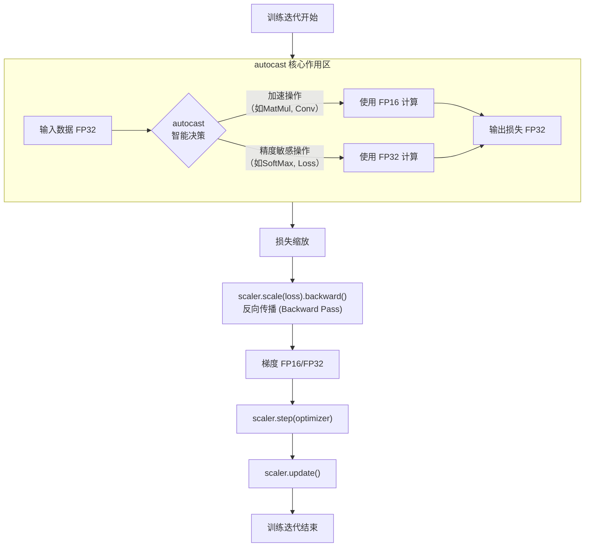

# PyTorch自动混合精度训练作用解析

### 🧑‍💻 User

以 PyTorch 为例，autocast在机器学习中的作用有哪些？

---

### 🤖 Assistant

好的，我们以 PyTorch 为例，详细解释 `autocast` 的作用、原理和使用场景。

`autocast` 是 PyTorch 中实现**自动混合精度（Automatic Mixed Precision, AMP）** 训练的核心工具。它的主要目标是在保持模型精度（最终准确率）的同时，**显著提升训练速度并减少 GPU 内存占用**。

### 核心作用

`autocast` 的核心作用是作为一个**上下文管理器（context manager）或装饰器（decorator）**，在其作用域内，它会自动为你的运算选择合适的数据类型（FP16 或 FP32），从而实现混合精度训练。

---

### 1. 提升训练速度

*   **硬件优势**：现代 GPU（如 NVIDIA 的 Volta 和 Ampere 架构的 V100, A100, RTX 系列等）配备了称为 **Tensor Cores** 的特殊计算单元。这些 Tensor Cores 在执行 FP16（半精度浮点数）矩阵乘法和卷积运算时，速度远超传统的 FP32（单精度浮点数）运算，通常能带来 **1.5x 到 3x 甚至更高的速度提升**。
*   `autocast` 会自动将适合在 FP16 中进行的操作（如线性层、卷积层等）转换为 FP16 进行计算，以利用 Tensor Cores 的加速优势。

---

### 2. 减少 GPU 内存占用

*   **内存减半**：FP16 数据类型占用的内存是 FP32 的一半（2字节 vs 4字节）。
*   这意味着：
    *   你可以**使用更大的批次大小（batch size）** 进行训练，从而更好地利用 GPU 资源。
    *   或者，在相同的批次大小下，你可以**训练更大的模型**，否则可能会因为显存不足（OOM, Out-Of-Memory）而无法运行。

---

### 3. 保持模型精度（“混合”精度的由来）

如果简单地将所有计算都转换为 FP16，可能会带来一些问题，导致模型无法收敛或精度损失：
*   **数值表示范围**：FP16 的表示范围（～5.96e-8 ～ 65504）远小于 FP32（～1.4e-45 ～ ～3.4e38）。在计算中很容易出现**数值下溢（Underflow）**（数字太小变成0）和**数值溢出（Overflow）**。
*   **精度损失**：尤其是计算梯度时，很多梯度值非常小，用 FP16 表示会丢失精度，从而影响权重更新。

`autocast` 的“聪明”之处就在于它的**自动性**和**混合性**：
*   **自动选择数据类型**：它会根据操作的类型自动决定使用 FP16 还是 FP32，以在速度和精度之间取得平衡。
    *   **使用 FP16 的操作**：计算密集型的操作，如矩阵乘法（`matmul`）、卷积（`convolution`）等。这些操作能从 Tensor Cores 中获得最大加速。
    *   **使用 FP32 的操作**：那些对数值精度敏感的操作，如 softmax、层归一化（LayerNorm）、损失函数（如 CrossEntropyLoss）等。这可以防止数值不稳定。

---

### 工作原理简述

1.  在 `with autocast():` 代码块内，PyTorch 会监视其中的操作。
2.  当遇到一个支持 AMP 的操作（如 `nn.Linear`）时，它会自动将输入张量转换为 FP16 再进行计算。
3.  当遇到对精度敏感的操作（如 `nn.Softmax`）时，它会保持使用 FP32 进行计算。
4.  最终的计算结果可能会被转换回原有的数据类型，以确保代码其他部分的兼容性。

### 如何使用

通常，`autocast` 需要与 `GradScaler` 配合使用，因为 FP16 表示的范围有限，在反向传播中梯度值可能会很小，导致下溢为0。`GradScaler` 的作用是在反向传播前对损失值进行放大（缩放），然后在优化器更新权重前再将梯度缩小回去，从而避免梯度下溢。

一个典型的使用示例：

```python
import torch
from torch.cuda.amp import autocast, GradScaler

# 初始化模型和优化器
model = MyModel().cuda()
optimizer = torch.optim.SGD(model.parameters(), lr=0.001)
# 初始化 GradScaler
scaler = GradScaler()

for data, target in dataloader:
    data, target = data.cuda(), target.cuda()
    optimizer.zero_grad()

    # 1. 前向传播：在autocast上下文内
    with autocast():
        output = model(data)
        loss = criterion(output, target)

    # 2. 反向传播：使用scaler.scale进行梯度缩放
    scaler.scale(loss).backward()

    # 3. 优化器步进：使用scaler.step和scaler.update
    scaler.step(optimizer)
    scaler.update()
```

### 注意事项

*   **硬件要求**：AMP 主要受益于 NVIDIA 的 Volta 及之后架构的 GPU（如 V100, A100, RTX 20/30/40系列）。旧款 GPU 可能无法获得速度提升，但依然可以节省显存。
*   **操作支持**：并非所有 PyTorch 操作都能在 `autocast` 下正常工作。大多数常见的神经网络层都已支持，但一些自定义的操作可能需要手动指定数据类型。
*   **CPU 不支持**：`torch.cuda.amp.autocast` 仅适用于 GPU。PyTorch 从 1.10 版本开始提供了 `torch.cpu.amp.autocast` 用于 CPU 上的 BFloat16 混合精度训练，但目的和实现与 GPU 版本不同。

### 总结

| 作用 | 描述 | 带来的好处 |
| :--- | :--- | :--- |
| **加速训练** | 利用 GPU Tensor Cores 加速 FP16 计算 | 缩短模型训练和实验迭代时间 |
| **节省显存** | FP16 占用内存是 FP32 的一半 | 能使用更大的 batch size 或训练更大的模型 |
| **保持精度** | 自动对敏感操作使用 FP32，保持数值稳定性 | 在获得上述好处的同时，最终模型的精度损失极小或没有损失 |

总而言之，**`autocast` 是 PyTorch 提供的一个几乎“免费”的性能提升工具**。通过自动管理计算精度，它让开发者只需添加几行代码，就能轻松获得训练加速和显存节省，而无需担心复杂的精度转换细节。在现代深度学习实践中，它已成为标准配置。

---

### 🧑‍💻 User

autocast在训练阶段的前向传播和反向传播中分别发挥了哪些作用？

---

### 🤖 Assistant

好的，这是一个非常核心的问题。我们来详细分解 `autocast` 在训练流程的前向传播和反向传播中分别扮演的角色。

总的来说，`autocast` 的**主要作用发生在前向传播期间**，它通过智能选择数据类型来为后续步骤奠定基础。反向传播则“继承”了前向传播的数据类型选择，并与 `GradScaler` 协同工作以确保稳定性。

下图直观地展示了 `autocast` 和 `GradScaler` 在训练流程中各自负责的环节及它们的协同作用：



---

### 在前向传播 (Forward Pass) 中的作用

这是 `autocast` **最核心、最主动**的工作阶段。它的职责是**智能地为计算图中的每个操作选择合适的数据类型（FP16 或 FP32）**。

1.  **自动类型转换**：
    *   在 `with autocast():` 块内，PyTorch 会监视所有操作。
    *   当遇到一个操作（如 `torch.mm`（矩阵乘法）、`torch.conv2d`）时，它会检查该操作是否在 AMP 的“白名单”上。这些通常是计算密集型、对精度相对不敏感且能从 FP16 和 Tensor Cores 中获得巨大加速的操作。
    *   **对于这些“加速友好”的操作**：`autocast` 会自动将它们的 **输入张量从 FP32 转换为 FP16**，然后再执行计算。这是速度提升和内存节省的关键来源。

2.  **保持精度关键操作**：
    *   对于一些对数值精度非常敏感的操作，如 softmax、layer normalization、损失函数等，`autocast` 会检查它们是否在“黑名单”或“参数列表”上。
    *   **对于这些“精度敏感”的操作**：`autocast` 会**保持其输入和计算在 FP32** 中进行，以防止数值下溢/溢出（例如，softmax 在 FP16 中很容易出现 Inf/NaN）并保证计算的准确性。

3.  **输出处理**：
    *   经过混合精度计算后，`autocast` 会确保将最终输出（通常是损失值 `loss`）**转换回 FP32**。这样做的目的是为了保证与后续步骤的兼容性，因为优化器中的参数和优化状态（如动量）通常都是 FP32 的。

**前向传播小结**：`autocast` 在前向传播中扮演了一个**智能调度员**的角色，其核心作用是 **“该快的时候用FP16快，该稳的时候用FP32稳”**，在速度和精度之间找到了最佳平衡。

---

### 在反向传播 (Backward Pass) 中的作用

反向传播阶段 `autocast` 本身**并不主动进行新的工作**，而是**前向传播决策的延续和体现**。

1.  **梯度计算的数据类型继承**：
    *   反向传播（`loss.backward()`）的核心是计算每个参数的梯度（`parameter.grad`）。
    *   计算梯度时，PyTorch 的自动求导机制（Autograd）会遵循前向传播时 `autocast` 制定的“规则”。
    *   具体来说：**某个在前向传播中用 FP16 计算的操作，其在反向传播中计算梯度时也会使用 FP16**。同理，在前向中用 FP32 计算的操作，反向传播也会用 FP32。
    *   因此，在反向传播中，`autocast` 的作用是**被动**的。它之前在前向传播中设置的数据类型“蓝图”直接决定了反向计算时的数据类型。

2.  **与 GradScaler 的协同**：
    *   虽然 `autocast` 负责数据类型，但解决 FP16 梯度可能下溢（值太小变成0）的问题是 `GradScaler` 的任务。
    *   如流程图所示，反向传播的调用是通过 `scaler.scale(loss).backward()` 进行的。
    *   `GradScaler` 会在反向传播开始前，将一个缩放因子（`scale factor`）乘以损失值（`loss`）。这个放大操作**将整个损失函数向上“平移”到 FP16 更能有效表示的范围**，从而使得计算出的梯度也不易下溢。
    *   这些缩放后的梯度（可能是 FP16 或 FP32）会存储在 `parameter.grad` 中。

**反向传播小结**：`autocast` 在反向传播中**没有新的主动行为**，其作用是通过前向传播的决策间接体现的。反向传播的稳定性和有效性是 **`autocast` 的前向数据类型规划** 与 **`GradScaler` 的梯度缩放技术** 共同作用的结果。

---

### 总结对比

| 阶段 | `autocast` 的主要作用 | 关键点 |
| :--- | :--- | :--- |
| **前向传播** | **主动地、智能地**为每个操作选择计算精度（FP16 或 FP32）。 | 核心工作区，直接实现加速和省内存，同时维护数值稳定性。 |
| **反向传播** | **被动地**延续前向传播的精度选择，由 Autograd 根据前向的“蓝图”进行计算。 | 本身不主动工作，但其前向的决策至关重要。需与 `GradScaler` 协同防止梯度下溢。 |

可以这样理解：**`autocast` 是一位建筑师，在前向传播阶段画好了详细的施工蓝图（指定了每个操作用什么精度）。在反向传播阶段，施工队（Autograd）和监理（GradScaler）则严格按照这张蓝图来施工和确保安全。**