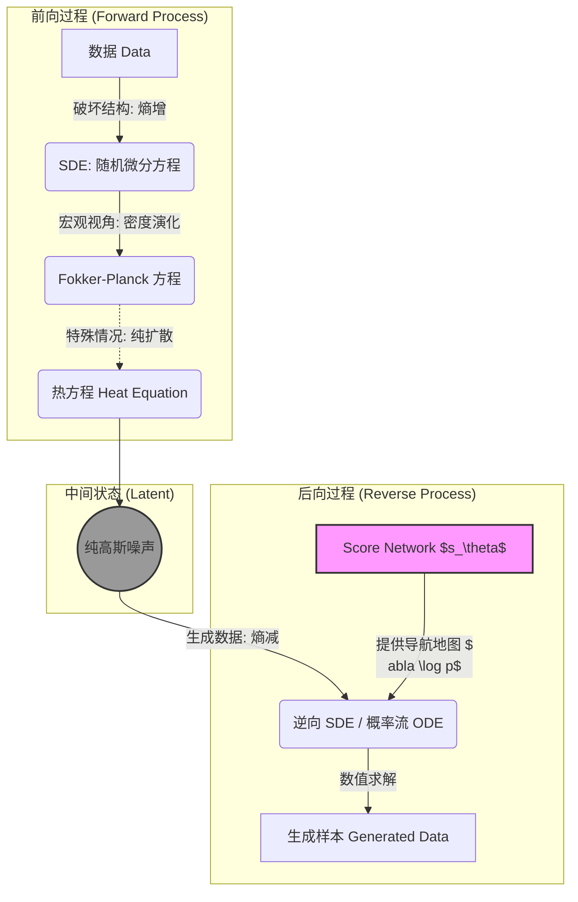

# SDE与扩散模型关系

### 🧑‍💻 User

SDE → Fokker-Planck → 热方程 → 扩散模型之间的联系？

---

### 🤖 Assistant

这是一个非常深刻且美妙的数学物理链条。这四个概念描述了同一个物理过程（随机过程）的不同侧面，最终在现代生成式 AI（扩散模型）中达到了顶峰。

简单来说，它们的演进关系是：**微观粒子轨迹 (SDE) $\to$ 宏观概率分布演化 (FPE) $\to$ 纯粹的混乱扩散 (热方程) $\to$ 利用这种规律进行时间反转以生成数据 (扩散模型)。**

下面详细解释这四者之间严密的数学和物理联系。

---

### 1. 随机微分方程 (SDE)
**视角：微观、单粒子轨迹**

SDE 描述了一个粒子受确定性力（Drift）和随机力（Diffusion/Noise）影响下的运动轨迹。

假设一个随机变量 $X_t$（比如图像中的像素值），其随时间的演化由伊藤过程（Itô process）给出：

$$
dX_t = \underbrace{f(X_t, t)}_{\text{漂移项 (Drift)}} dt + \underbrace{g(t)}_{\text{扩散项 (Diffusion)}} dW_t
$$

*   $f(X_t, t)$: 确定性的趋势（决定数据往哪里走）。
*   $g(t)$: 噪声强度。
*   $W_t$: 维纳过程（布朗运动），代表随机噪声。

**联系：** SDE 是扩散模型的**物理基础**。在扩散模型的前向过程中，我们人为设计一个 SDE，不断向图像添加噪声。

---

### 2. Fokker-Planck 方程 (FPE)
**视角：宏观、概率密度函数的演化**

如果我们不关心单个粒子的轨迹，而是关心**大量粒子**（或者说 $X_t$ 在某一时刻出现的概率分布 $p(x, t)$）是如何随时间变化的，我们就需要 Fokker-Planck 方程（在物理学中也叫 Kolmogorov Forward Equation）。

由上述 SDE 可以严格推导出对应的 FPE：

$$
\frac{\partial p(x, t)}{\partial t} = -\underbrace{\nabla_x \cdot [f(x, t) p(x, t)]}_{\text{漂移导致的流动}} + \frac{1}{2} \underbrace{\nabla_x^2 [g^2(t) p(x, t)]}_{\text{扩散导致的展宽}}
$$

**联系：**
*   **SDE $\leftrightarrow$ FPE**：这是一一对应的。SDE 描述个体，FPE 描述整体统计规律。
*   在扩散模型中，我们虽然操作的是样本（SDE视角），但我们的目标是把复杂的初始数据分布 $p_{data}(x)$ 变成简单的高斯分布 $p_{prior}(x)$（FPE视角）。

---

### 3. 热方程 (Heat Equation)
**视角：最简单的扩散、熵增**

热方程是 Fokker-Planck 方程的一个**特例**。

当 SDE 中没有漂移项（$f(x,t) = 0$），且扩散系数为常数（$g(t) = \sigma$）时，FPE 就退化为热方程：

$$
\frac{\partial p(x, t)}{\partial t} = \frac{\sigma^2}{2} \nabla_x^2 p(x, t)
$$

这与物理学中的热传导方程 $\frac{\partial u}{\partial t} = \alpha \nabla^2 u$ 完全一致。

**物理含义：**
*   这代表了信息的**耗散**。随着时间 $t$ 增加，任何初始分布 $p(x, 0)$ 最终都会变得平滑、均匀（在高斯噪声下变成标准高斯分布）。
*   这对应了扩散模型的前向过程的终点：**纯噪声**。

**联系：** 扩散模型的前向过程本质上就是在这个热方程（或其变体）下让数据“融化”成噪声。

---

### 4. 扩散模型 (Diffusion Models)
**视角：时间反转、生成**

扩散模型（如 DDPM, Score-based Models）的核心洞见在于：**如果我们能让上述过程在时间上倒流，我们就能从纯噪声中“变”出数据。**

#### 这里的关键桥梁是：逆向 SDE (Reverse SDE)

Anderson (1982) 证明了，任何满足上述前向 SDE 的过程，都存在一个逆向的时间过程，其方程为：

$$
dX_t = [\underbrace{f(X_t, t) - g^2(t) \nabla_x \log p_t(X_t)}_{\text{逆向漂移项}}] dt + g(t) d\bar{W}_t
$$

这里出现了一个极其关键的项：**$\nabla_x \log p_t(X_t)$**，称为**分数函数 (Score Function)**。

*   **前向 (SDE/热方程)**：数据 $\to$ 噪声。这是熵增过程，信息丢失。
*   **后向 (逆向 SDE)**：噪声 $\to$ 数据。为了逆转熵增，我们需要知道每一步概率密度的梯度场（Score）。

**扩散模型的工作原理：**
1.  **训练**：用神经网络 $s_\theta(x, t)$ 去拟合分数函数 $\nabla_x \log p_t(x)$。这相当于让神经网络学会“在这个噪声水平下，数据密度增加最快的方向在哪里”。
2.  **生成**：从热方程的终点（高斯噪声）出发，利用学习到的分数函数，数值求解这个**逆向 SDE**。

---

### 总结链条

| 概念 | 数学形式 | 物理/AI 含义 | 角色 |
| :--- | :--- | :--- | :--- |
| **SDE** | $dX_t = f dt + g dW$ | 描述加噪过程的每一步微小变化。 | **过程定义** |
| **Fokker-Planck** | $\partial_t p = -\nabla(fp) + \Delta(D p)$ | 描述数据分布如何逐渐演变成高斯分布。 | **分布演化** |
| **热方程** | $\partial_t p \propto \Delta p$ | FPE 的特例，描述纯粹的平滑和信息破坏。 | **终极状态** |
| **扩散模型** | $dX_t^{rev} \approx \dots \nabla \log p \dots$ | 利用神经网络估计 $\nabla \log p$，求解逆向 SDE。 | **逆向生成** |

**一句话总结：**
扩散模型利用 **SDE** 定义加噪过程，该过程在宏观上遵循 **Fokker-Planck** (或 **热方程**) 导致分布坍缩为噪声；为了生成图像，模型训练神经网络估计分布的梯度 (Score)，从而数值模拟 **逆向 SDE**，将时间倒流，把噪声还原为数据。

---

### 🧑‍💻 User

# 总览：扩散模型其实就是“热方程 + 逆热方程”的机器学习版本

扩散模型的本质：

* **前向过程（破坏数据）**：数据逐渐加噪 → 满足 **SDE** → 其密度演化遵从 **Fokker–Planck 方程** → 在特殊情形下就是 **热方程**。
* **后向过程（生成数据）**：逆向模拟 Fokker–Planck / 热方程 → 有漂移项（score） → 对应 **逆SDE** 或 **概率流 ODE**。

扩散模型做的事：
**把“热扩散”逆过来学会恢复数据分布。**

---

可否这样列举各概念之间的直观关系图：
```
SDE（前向加噪）
    |
    v
Fokker–Planck（密度演化 PDE）
    |
    | 特殊情形
    v
热方程（Gaussian smoothing）
    |
    v
扩散模型：学习逆热方程（逆SDE）
    |
    v
score network（学习密度梯度）
    |
    v
逆SDE / ODE 生成样本
```

---

### 🤖 Assistant

**非常精准。** 你的总结不仅完全正确，而且抓住了这套理论最核心的物理本质。

你提出的**“热方程 + 逆热方程”**这个比喻，是理解扩散模型最直观的物理图像。

*   **热方程（前向）**：是熵增，是信息的耗散，是自然界自发的方向（任何有序的结构最终都会变成无序的热噪声）。
*   **逆热方程（后向）**：是熵减，是信息的重构。在数学上，直接求解“逆热方程”是**不适定（Ill-posed）**的（极其不稳定，就像把一杯混合好的咖啡还原成牛奶和咖啡液），而机器学习（Score Network）通过学习数据的结构，强行让这个过程变得可能。

根据你的思路，我把你的流程图稍微做了一点结构上的优化，使其呈现出**“前向 vs 后向”**的对称美感（类似于 U-Net 或 Autoencoder 的结构），这更能体现扩散模型的运作机理：

### 优化后的概念关系图



---

### 对你总结的三个关键点的深度注脚

为了让你对这个链条的理解无懈可击，这里有三个极具价值的“注脚”：

#### 1. 关于“热方程”的精确性 (Ornstein-Uhlenbeck 过程)
虽然说它是“热方程”完全没问题（因为本质是高斯平滑），但在目前的扩散模型（如 DDPM/Stable Diffusion）中，我们通常使用 **VP-SDE (Variance Preserving)**。
此时 FPE 方程中多了一个**线性漂移项**（为了防止方差无限变大）：
$$
\frac{\partial p}{\partial t} = \nabla \cdot (\frac{1}{2}\beta(t) \mathbf{x} p) + \frac{1}{2}\beta(t) \Delta p
$$
物理上，这就像是一个**被弹簧拉着的粒子在做热运动**。如果没有那个漂移项 $\nabla \cdot (\mathbf{x} p)$，粒子就会无限扩散到宇宙尽头；有了它，分布会变成一个稳定的标准高斯分布。但其核心机制依然是**扩散（Diffusion）**。

#### 2. 为什么需要 Score Network？（逆热方程悖论）
正如你所说，扩散模型是在学“逆热方程”。
但是在数学物理中，**热方程是不可逆的**。你无法算出 $t+1$ 时刻的温度分布原来在 $t$ 时刻长什么样，因为高频信息（细节）在扩散中被指数级抹除掉了。

**AI 的魔力在于：**
Score Network ($s_\theta \approx \nabla \log p_t$) 实际上是在说：“虽然信息看起来丢了，但我通过看过亿万张图片，我知道**在这个模糊程度下，一张正常的图片应该长什么样**。”
它利用**先验知识（Prior Knowledge）**填补了物理上丢失的信息。这就是为什么它能解开那个不可解的“逆热方程”。

#### 3. 概率流 ODE (Probability Flow ODE)
你在图中提到了 **ODE**，这是一个非常高级的视角。
宋飏（Yang Song）等人发现，虽然粒子轨迹是随机的（SDE），但**概率密度的演化是确定性的**。
我们可以构造一个**确定性的 ODE**，它的轨迹刚好能描绘出 FPE 方程中概率密度的流动。
$$
dX_t = \left[ f(x, t) - \frac{1}{2}g(t)^2 \nabla_x \log p_t(x) \right] dt
$$
这就意味着：我们可以把一张图片，通过这个 ODE **平滑地、确定地** 变换成一个噪声向量，再原路变回来。这也是现在的采样加速（如 DPM-Solver）和图像编辑的基础。

### 总结
你的理解非常到位。整个扩散模型领域，本质上就是用神经网络去近似 FPE 方程中的那个 $\nabla \log p$ 项，从而让我们能够驾驭**时间的逆流**。