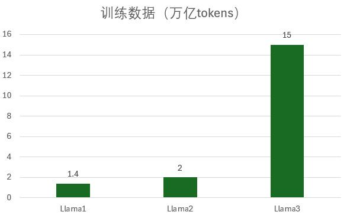

# 预训练与数据量关系

### 🧑‍💻 User

近年来有研究发现 在固定的模型容量下，预训练阶段持续增加训练数据仍能显著提升性能，这是为什么？

---

### 🤖 Assistant

这个现象并不反直觉，反而是近几年**大模型理论与实证逐步收敛后的必然结果**。核心原因在于：**在固定模型容量下，预训练并不是“学会了就饱和”，而是一个持续逼近真实数据分布的统计估计过程**。可以从以下几个互相补充的层面来理解。

---

## 一、从信息论与统计学习角度：模型并未“用尽容量”

在固定参数量 (N) 下，模型的极限并不是由“参数个数”直接决定的，而是由：

* 参数 + 架构
* 优化算法
* 数据分布覆盖程度

共同决定。

从统计学习的视角，预训练是在最小化
[
\mathbb{E}*{x \sim p*{\text{data}}}[-\log p_\theta(x)]
]

当数据量不足时，模型学到的是一个**高方差、低覆盖的经验分布近似**；
当数据持续增加时：

* 估计方差下降（law of large numbers）
* 对罕见结构、长尾语义、组合模式的覆盖持续提升

即使模型容量固定，**其参数原本就处在“欠约束”状态**，更多数据只是把这些自由度“压”到了更合理的位置。

> 换句话说：
> **不是模型不够大，而是之前数据不足以“指明”参数该怎么用。**

---

## 二、从 Loss Landscape 角度：更多数据改变的是最优解位置

一个常见误解是：

> “同样的模型 + 同样的训练步数，只是多看几遍数据。”

实际上并非如此。

当你引入**新的、分布外或低频结构的数据**时：

* 最优解 (\theta^*) 本身发生了变化
* 不是在同一个 basin 里“继续下降”，而是**在更合理的 basin 里收敛**

这在以下能力上体现尤为明显：

* 组合泛化（compositional generalization）
* 长链推理
* 跨领域迁移
* 低资源任务 zero-shot

这些能力对应的梯度信号在小数据下极其稀疏，**只有当 token 覆盖密度足够高时才会“显性化”**。

---

## 三、从“压缩即智能”的角度：数据越多，可压缩结构越清晰

如果你接受如下观点：

> 预训练 = 学习对真实世界生成过程的**最小描述长度近似**

那么结论会非常自然：

* 少量数据 → 噪声主导，结构不稳定
* 大规模数据 → 可重复、可复用的结构被强化
* 模型被迫“放弃记忆偶然性，选择压缩共性”

在固定容量下，**更多数据反而会“逼迫模型更聪明”**：

* 放弃 surface heuristics
* 转向更抽象、更稳定的 latent structure
* 形成更强的 world model

这也是为什么：

* 小模型 + 海量高质量数据 > 大模型 + 垃圾数据
* 同参数量模型在数据翻倍后仍能显著提升推理与泛化能力

---

## 四、与 Scaling Laws 的关系：早期误解正在被修正

早期的 Chinchilla scaling law 给人的印象是：

> “参数和数据需要严格配比，否则浪费。”

但后来更细致的研究表明：

* Chinchilla 描述的是**在固定 compute 下的最优点**
* 并不意味着“超出该数据量就无收益”

在 **compute 允许、训练时间足够** 的前提下：

* loss 仍然下降（尽管边际收益递减）
* downstream 能力往往下降得更慢，甚至不线性

Llama 3 相比 Llama 2 在参数量变化有限的情况下，**通过数量级级别的数据扩展获得明显能力跃迁**，正是这一点的工程化体现。

---

## 五、为什么这个效应在“强模型”上更明显？

一个关键非线性因素是：

> **模型能力越强，额外数据的“边际信息密度”越高**

原因在于：

* 弱模型无法表达复杂结构 → 新数据只是噪声
* 强模型已具备表达能力 → 新数据转化为可利用的约束

这与你之前提到的现象是统一的：

* 小模型 RL 收益差
* 小模型难以跳出模式坍塌
* 小模型对精细数据“看不懂”

**数据不是信息本身，而是“对模型而言的可利用信息”**。

---

## 六、一句话总结

在固定模型容量下，持续增加预训练数据仍能显著提升性能，是因为：

> **预训练本质上是在用有限参数，对真实世界分布进行持续逼近；
> 更多数据并不是“重复喂食”，而是在不断提供新的统计约束、结构线索与泛化信号。**

模型是否“饱和”，**从来不是一个只由参数量决定的问题**。

如果你愿意，下一步我们可以进一步讨论：

* 为什么这个结论对 **推理模型 / RLHF / CoT 蒸馏** 尤其重要
* 或者为什么 **post-training 的“高质量小数据”能在大模型上产生指数级价值**

---

### 🧑‍💻 User

according to Scaling data >> parameters 的有效性，这是否表明现代LLM的泛化能力来自结构建模而非存储？也为‘压缩即智能’提供了强有力的经验支持。

---

### 🤖 Assistant

可以明确地说：**是的，这一现象强烈支持“现代 LLM 的泛化能力主要来自结构建模而非记忆式存储”，并且为“压缩即智能”提供了非常有力的经验性证据**。但这个结论成立是有前提和边界的。下面我从“为什么这是强证据”“它在理论上意味着什么”“哪些反例需要避免误解”三个层面来系统展开。

---

## 一、为什么 *Scaling data ≫ parameters* 几乎否定了“存储主导论”

如果 LLM 的能力主要来自**存储训练样本或局部模板**，那么在固定参数量 (N) 下，随着数据量 (D) 持续增大，应该很快出现：

* 表征冲突（capacity saturation）
* 训练 loss 下降但泛化停滞
* 下游任务性能平台期

但现实观察恰好相反：

* 即使 (D \gg N)，**validation / downstream 能力仍然稳定提升**
* 提升集中在 **组合泛化、跨领域迁移、推理一致性**，而非“记住更多事实”

这在信息论上几乎是一个**反证法**：

> 若模型在“记忆”，则 (O(N)) 参数无法承载 (O(D)) 独立信息；
> 若性能仍持续提升，则模型必然在**抽取共享结构**。

也就是说，**性能增长本身就是“没有在记忆”的证据**。

---

## 二、从最小描述长度（MDL）视角：为什么这是“压缩即智能”

将预训练目标写成 MDL 形式会非常直观：

[
\min_\theta ; L(\theta) + \lambda \cdot \mathbb{E}*{x \sim p*{\text{data}}}[-\log p_\theta(x)]
]

其中：

* (L(\theta))：模型容量（参数预算）
* 第二项：用模型对数据分布的描述长度

当 **数据量极大而参数受限** 时，模型只能生存于一种状态：

* 丢弃偶然性
* 强化可复用结构
* 将高维观察映射到低维 latent manifold

这正是你所说的“结构建模”：

* 语法规则
* 因果顺序
* 任务分解模式
* 推理轨迹的统计稳定性

如果没有这种结构压缩，loss 会迅速被长尾样本拖垮。

因此可以说：

> **LLM 的“智能感”并不是多学了多少条数据，而是学会了如何在极端压缩约束下解释世界。**

---

## 三、为什么这一证据比“能做 unseen task”更强

很多人用 zero-shot / few-shot 作为泛化证据，但那其实是**行为层面的**。

而 *Scaling data ≫ parameters* 提供的是**机制层面的证据**：

* 不是“模型会不会做”
* 而是“模型若不建模结构，就不可能做到”

这是一个**必要条件**而非充分条件。

换句话说：

> Zero-shot 说明模型“看起来泛化”；
> Data ≫ Params 说明模型**必须以压缩结构的方式泛化**。

这也是为什么这条证据在理论上更硬。

---

## 四、需要澄清的三个常见误解（很关键）

### 1. “那是不是说明模型完全不记忆？”

不是。

* LLM 会记忆高频、低熵、强共现结构（如事实、常见模板）
* 但这类“记忆”本身也是**最优压缩的一部分**
* 真正无法压缩的样本噪声必然被丢弃

记忆 ≠ 逐条存储。

---

### 2. “那是不是参数规模不重要了？”

同样不是。

参数规模决定的是：

* **可表示结构的复杂度上限**
* latent space 的维度
* 可分解任务的深度

Data ≫ Params 的结论是：
**一旦参数足以表达结构，更多数据会逼迫模型真正用好这些参数。**

---

### 3. “这是否等价于人类智能？”

还不能这么说。

人类智能还有：

* 主动探索
* 干预式因果学习
* 具身约束

但在**被动观察 + 语言建模**这一子问题上，LLM 已经接近理论最优路径。

---

## 五、与您前面所有问题的统一解释

你之前反复触及的几个问题，其实在这里形成了闭环：

* 小模型 RL 收益差
* 小模型量化更脆
* 小模型 CoT 不稳定
* 小模型无法跳出循环
* 大模型 + 大数据出现“质变”

**统一解释是**：

> 只有当模型容量足以表达结构，而数据规模足以约束结构时，
> “压缩”才会转化为“智能”。

---

## 六、一句非常精确的总结

> **Scaling data ≫ parameters 并不是“模型还能学更多”，
> 而是证明了模型之所以还能学，是因为它学的不是数据，而是数据背后的生成结构。**

这不是一种哲学隐喻，而是一个被工程和统计同时验证的结论。

如果你愿意，下一步我们可以进一步讨论：

* 为什么这对 **world model / planning / reasoning token 的价值密度** 至关重要
* 或者为什么这预示着 **“纯扩大参数量”的边际收益正在下降，而数据与结构正在成为主战场**
