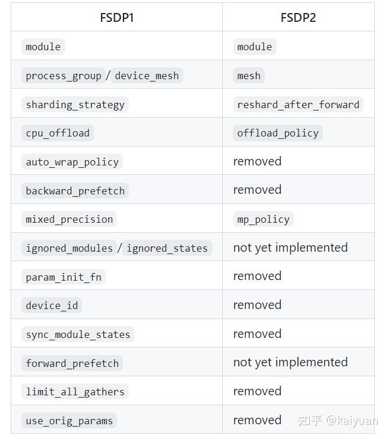

# FSDP2简化API源于底层架构革新

### 🧑‍💻 User

为什么FSDP2在API使用上面简化了不少？

---

### 🤖 Assistant

从你提供的 FSDP1 和 FSDP2 的 API 对比图可以看出，FSDP2 的 API 确实发生了大幅度的精简。这并非简单的“重命名”，而是因为 **FSDP2 在底层架构上进行了一次彻底的重写**。

FSDP2 简化的核心原因可以总结为：**全面拥抱 PyTorch 原生的 `DTensor` (Distributed Tensor) 和 `DeviceMesh` 生态，放弃了 FSDP1 中侵入性极强的 Module Wrapping (模块包装) 和 Flatten (参数展平) 机制。**

以下是导致 API 大幅简化的几个关键技术原因：

<b>1. 引入 DTensor：消灭了 <code>use_orig_params</code> 相关的痛点</b>

*   **FSDP1 的痛点：** FSDP1 默认会将模型参数展平（Flatten）成一个巨大的一维 Tensor。这破坏了参数的原始形状，导致与优化器、`torch.compile`、以及很多依赖原始参数形状的 Hook 完全不兼容。后来为了打补丁，加入了 `use_orig_params=True`，但这让内部逻辑变得极其复杂。
*   **FSDP2 的解决：** FSDP2 原生基于 **`DTensor` (分布式张量)** 构建。`DTensor` 在底层天然保留了张量的原始形状和语义（即全局看来还是原来的形状，只是在不同设备上分片）。因此，在 FSDP2 中，**“使用原始参数形状”成为了默认且唯一的行为**，`use_orig_params` 这个参数自然就被废弃了。

<b>2. 抛弃递归的模块包装：不再需要 <code>auto_wrap_policy</code></b>

*   **FSDP1 的痛点：** FSDP1 通过侵入式地修改和包装 `nn.Module` 来实现分布式。为了不让所有参数都在同一时间通信从而导致显存爆炸，用户必须通过极其复杂的 `auto_wrap_policy`（比如按 Transformer Layer 包装）来告诉 FSDP 如何把模型切分成一个个小的 FSDP Unit。
*   **FSDP2 的解决：** FSDP2 改变了 API 的使用范式。它不再使用复杂的类包装机制，而是提供了一个函数式的 `fully_shard` 接口。用户（或更高层的框架）只需直接遍历并对需要的 Layer 调用 `fully_shard(layer)` 即可。这种解耦使得繁琐的自动包装策略成为历史。

<b>3. 原生支持多维并行：<code>process_group</code> 升级为 <code>mesh</code></b>

*   **演进：** 现代大模型训练几乎都是 3D 并行（DP/FSDP + TP + PP）。FSDP1 的 `process_group` 概念太底层，难以优雅地表达多维度的设备拓扑结构。
*   **FSDP2 的解决：** 强制使用 `DeviceMesh`。用户先定义一个多维的硬件网格（例如 2D mesh，一维用于 TP，一维用于 FSDP），然后直接把 `mesh` 传给 FSDP2。这不仅让 API 更清晰，也让 FSDP2 与 Tensor Parallelism (TP) 的组合变得极其简单（两者现在都基于 `DTensor` 和 `DeviceMesh`）。

<b>4. 更清晰的显存/通信心智模型：<code>sharding_strategy</code> 的重命名</b>

*   **改变：** FSDP1 的分片策略（如 `FULL_SHARD`, `SHARD_GRAD_OP`）对新手来说比较抽象（通常对应 ZeRO-3 和 ZeRO-2）。
*   **FSDP2 的解决：** FSDP2 将其重命名为 `reshard_after_forward` (前向传播后是否重新分片)。这直接描述了底层的显存行为：
    *   `reshard_after_forward=True`：前向传播结束后，收集起来的完整参数会被立刻释放并重新分片（省显存，对应 ZeRO-3 / FULL_SHARD）。
    *   `reshard_after_forward=False`：前向传播结束后，保留完整参数供反向传播使用（省通信但费显存，对应 ZeRO-2 / SHARD_GRAD_OP）。
    这种命名更加直观。

<b>5. 现代化的初始化机制：干掉 <code>device_id</code>, <code>sync_module_states</code>, <code>param_init_fn</code></b>

*   **FSDP1 的痛点：** 在加载百亿参数模型时，如果你先在 CPU 初始化再搬到 GPU，CPU 内存会直接爆炸。FSDP1 为此提供了复杂的 `param_init_fn` 等参数来控制设备初始化和多卡同步。
*   **FSDP2 的解决：** 随着 PyTorch 生态的成熟，现在标准做法是使用 **`meta` device**（元设备，不占显存）初始化模型，然后再通过 `DTensor` 机制加载真实的权重。因为初始化流程在框架层面已经有了更好的最佳实践，FSDP2 不再需要自己维护这些臃肿的初始化 API。

<b>6. 统一的底层调度器：移除 <code>backward_prefetch</code> 和 <code>limit_all_gathers</code></b>

*   **FSDP1 的痛点：** 这两个是 FSDP1 中的性能调优“黑魔法”，需要用户手动控制通信和计算的重叠时机，非常考验工程师的经验。
*   **FSDP2 的解决：** FSDP2 内部重构了通信调度器（Comm Scheduler），能够更智能、更自动地处理 All-Gather 和 Reduce-Scatter 的流水线掩盖（Overlapping）。底层做聪明了，上层自然就不需要暴露这些繁琐的旋钮了。

### 总结

FSDP2 的 API 简化，本质上是 **PyTorch 分布式架构从“打补丁”走向“原生设计”** 的结果。它摆脱了 FSDP1 沉重的历史包袱，利用 `DTensor` 统一了数据结构，把复杂的通信和内存调度下沉到框架内部，让用户只需关心最核心的逻辑：**在什么硬件拓扑 (`mesh`) 上，使用怎样的显存策略 (`reshard_after_forward`, `offload_policy`)，以及怎样的精度 (`mp_policy`)。**