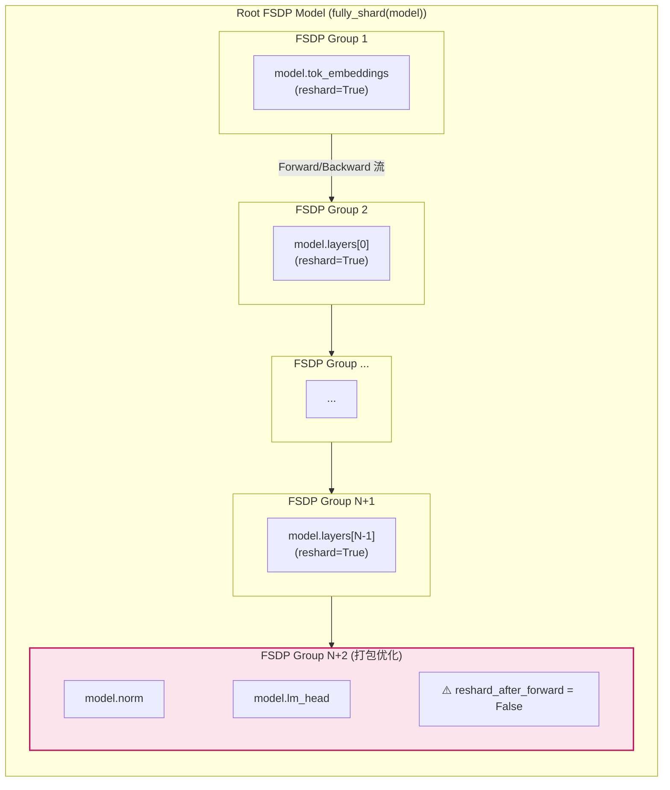
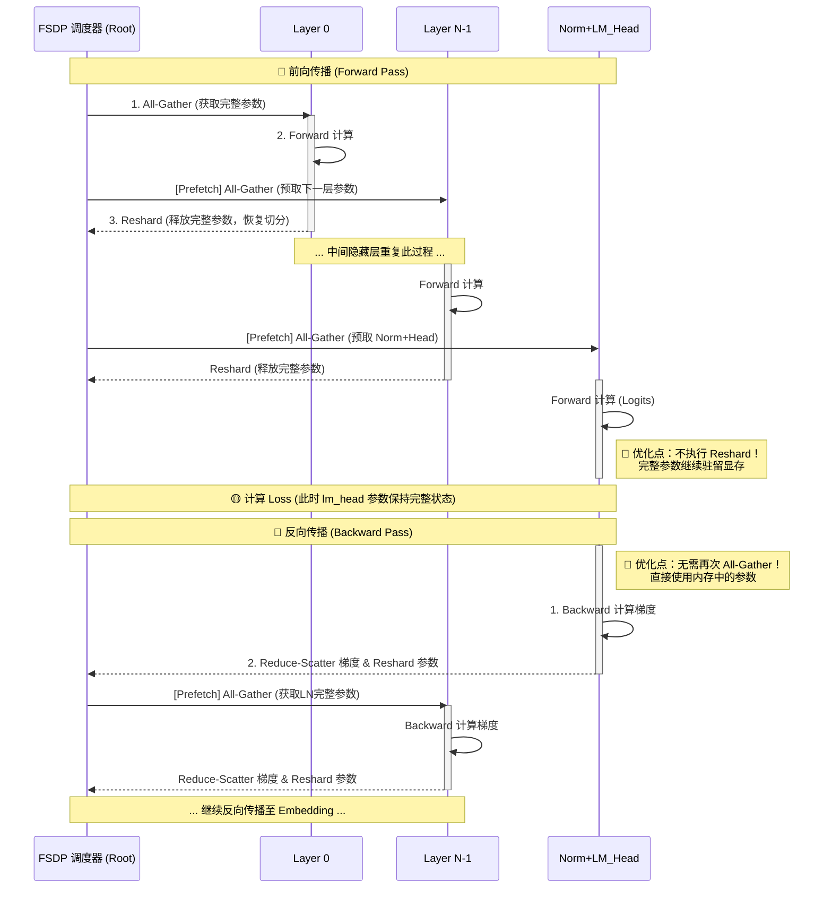

# 优化norm和lm_head通信性能

### 🧑‍💻 User

在我们使用torch fsdp2时候，为什么transformer层的`norm + lm_head`需要做特殊处理？
```
if model.tok_embeddings is not None:
    fully_shard(
        model.tok_embeddings,
        **fsdp_config,
        reshard_after_forward=reshard_after_forward,
    )

for transformer_block in model.layers:
    fully_shard(
        transformer_block,
        **fsdp_config,
        reshard_after_forward=reshard_after_forward,
    )

# As an optimization, do not reshard_after_forward the last layers by default
# since FSDP would prefetch them immediately after the forward pass
if model.norm is not None and model.lm_head is not None:
    fully_shard(
        [model.norm, model.lm_head],
        **fsdp_config,
        reshard_after_forward=reshard_after_forward_policy == "always",
    )

fully_shard(model, **fsdp_config)
```
例如这里把`fully_shard([model.norm, model.lm_head], ..., reshard_after_forward=...)`作为一个 FSDP group，并且默认对最后层关闭 reshard。

---

### 🤖 Assistant

在使用 PyTorch FSDP2 训练 Transformer 模型时，对最后的 `norm` 和 `lm_head` 进行打包（组合成一个 FSDP Group）并默认关闭 `reshard_after_forward`，是一个非常经典且重要的**性能优化手段**。

这样做的核心目的有两个：**合并通信降低延迟（针对打包）** 和 **避免冗余的显存分配与通信（针对关闭 reshard）**。

以下是详细的原因拆解：

### 1. 为什么要将 `norm` 和 `lm_head` 打包在一个 FSDP Group？

在 FSDP 中，每次执行 `fully_shard` 包裹的模块时，都会触发一次 All-Gather 操作来收集该模块的完整参数。

*   **`model.norm` 的参数极小：** 最后的 LayerNorm 或 RMSNorm 通常只有一个权重向量，参数量为 $d_{model}$（例如 Llama-7B 中只有 4096 个参数）。
*   **`model.lm_head` 的参数极大：** 最后的线性分类层包含巨大的权重矩阵，参数量为 $vocab\_size \times d_{model}$（例如 $32000 \times 4096$）。

如果在底层的网络通信中，为 `norm` 这种极小尺寸的张量单独发起一次 All-Gather，**通信延迟（Latency）会远大于数据传输时间**，导致带宽利用率极低。
通过 `fully_shard([model.norm, model.lm_head], ...)` 将它们放入同一个 FSDP 通信组，FSDP 会将它们的参数展平（Flatten）并拼接在一起。这样在执行时，只需要**发起一次 All-Gather** 就能同时取回两者的参数，极大地提高了 GPU 间的通信带宽利用率。

### 2. 为什么对最后一层默认关闭 `reshard_after_forward`？

这是为了**消除前向传播（Forward）和反向传播（Backward）交界处的冗余操作**。

在标准的 FSDP 流程中，`reshard_after_forward=True` 意味着：模块前向计算完成后，立刻释放（切分）收集来的完整参数，以节省显存。

但是，`norm` 和 `lm_head` 是 Transformer 前向传播的**最后一层**，同时也是反向传播的**第一层**。我们来看看它们在整个训练步（Step）中的时间线：

<details>
<summary>展开查看：开启与关闭 reshard 的时间线对比</summary>

**如果开启 reshard (`reshard_after_forward=True`)：**
1. **[前向]** All-Gather 获取 `norm` 和 `lm_head` 的完整参数。
2. **[前向]** 计算 `lm_head` 的输出（Logits）。
3. **[前向结束]** FSDP 释放 `norm` 和 `lm_head` 的完整参数（Reshard）。
4. **[计算 Loss]** 根据 Logits 计算 Loss。
5. **[反向开始]** 准备计算 `lm_head` 的梯度。
6. **[反向]** FSDP **必须立刻再次 All-Gather** 获取 `norm` 和 `lm_head` 的完整参数。

**如果关闭 reshard (`reshard_after_forward=False`)：**
1. **[前向]** All-Gather 获取 `norm` 和 `lm_head` 的完整参数。
2. **[前向]** 计算 `lm_head` 的输出（Logits）。
3. **[前向结束]** FSDP **保留**完整参数在显存中。
4. **[计算 Loss]** 根据 Logits 计算 Loss。
5. **[反向开始]** 参数已经存在，**直接开始计算梯度**，省去了一次庞大的 All-Gather 和显存重新分配。
6. **[反向结束]** 反向传播完成后，正常释放参数。
</details>

**核心结论：**
由于前向传播结束后立刻就会计算 Loss 并开始反向传播，此时释放 `lm_head` 的参数是毫无意义的。它会导致显卡在极短的时间内经历 `分配显存 -> All-Gather -> 释放显存 -> 分配显存 -> 再次All-Gather` 的冗余循环。

关闭最后两层的 reshard 操作，是用极短暂的峰值显存（反正计算 Loss 时这部分显存空着也是空着）换取了**省去一次庞大的 `lm_head` All-Gather 通信开销**，这能显著提升训练的吞吐量。

---

### 🧑‍💻 User

画一张 FSDP2 封装结构图，展示 embedding → transformer → norm+lm_head 的分层 wrapper 和 prefetch/reshard 流程

---

### 🤖 Assistant

这里我为你绘制了两张图：第一张展示 **FSDP2 的网络封装层级结构**，第二张展示 **前向/反向传播中的 Prefetch（预取）与 Reshard（释放切分）时间线**。

### 1. FSDP2 封装层级与 Group 结构图

在 FSDP2 中，每一次 `fully_shard` 调用都会创建一个单独的 FSDP 单元（通信组）。底层的 Root 容器会负责编排这些子单元。



### 2. Prefetch 与 Reshard 生命周期时序图

这张图重点展示了为什么 `norm + lm_head` 关闭 `reshard_after_forward` 能带来巨大的性能收益。注意看 `Norm+LM_Head` 在前向和反向交界处的行为。



<details>
<summary>点击展开：关于 Prefetch (预取) 机制的额外说明</summary>

*   **通信与计算重叠 (Overlap)：** FSDP 调度器极其聪明。当 GPU 正在计算当前层（例如 `Layer 0`）时，调度器会在后台通过网络并发执行下一层（`Layer 1`）的 `All-Gather` 通信。这就叫 **Prefetch（预取）**。
*   **如果不关闭最后一层的 Reshard：** FSDP 会在前向传播结束时释放 `lm_head` 的参数。当计算完 Loss 开始反向传播时，由于当前显存里没有 `lm_head` 的完整参数，必须**阻塞式**地等待 `lm_head` 的 `All-Gather` 完成后才能开始计算梯度（因为它是反向的第一层，无法被预取掩盖）。这会导致 GPU 计算单元出现明显的空闲气泡（Bubble）。
</details>