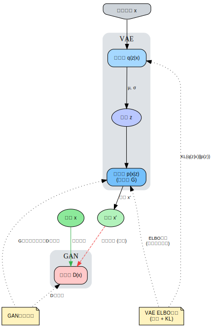

# VAE-GAN对抗训练类比强化学习

### 🧑‍💻 User

```
### VAE-GAN：将VAE结构与GAN的真实感相结合

有人也许想问：在SD VAE或AE（自编码器）的训练中为什么要引入GAN呢？

传统的VAE/AE通常使用均方误差（MSE）或L1 Loss作为重构损失。这些损失计算的是生成图像与真实图像在像素数值上的差异。

问题在于：对于一个给定的潜变量 $z$，可能对应着现实中多种合理的像素图像（多模态）。例如，一个模糊的边缘在现实中可能对应向左偏一点的头发，也可能对应向右偏一点的头发。

当我们使用MSE Loss时，模型为了最小化误差，倾向于生成所有可能解的**平均值**（Mean）。
$$ L_{MSE} = \mathbb{E}_{x, \hat{x}} [||x - \hat{x}||^2] $$

**结果**：这种“平均值”在图像上表现为模糊、缺乏纹理。因为两张锐利但位置稍有不同的图取平均，得到的图就是模糊的。

总之，由于压缩率很高（例如8倍或16倍），如果只用MSE，解码出来的图像会非常糊，因为高频细节（纹理、发丝）在压缩中丢失，且MSE无法强迫模型“脑补”出锐利的细节。

LDM论文的做法是引入了基于Patch的判别器，使用 GAN Loss（通常是Hinge Loss或Non-saturating Logistic Loss）配合 Perceptual Loss（感知损失，基于VGG特征）和 KL Loss。其核心思想是，用判别器网络提供的学到的特征级损失，替换或增强VAE的像素级重建损失（如均方误差或二元交叉熵），既保证了内容的整体结构，又能重建出锐利、真实的纹理。

VAE-GAN本质上将VAE的解码器 $p(x∣z)$ 视为GAN设置中的生成器。随后引入判别器网络 $D(x)$，并训练它以区分训练集中的真实数据样本 $x$ 和由VAE解码器生成的样本 $x ′ =p(x∣z)$。

整体架构包括：

1. 一个**编码器** $q(z∣x)$：将输入数据 $x$映射到潜在分布（通常是均值为 $μ(x)$、方差为 $σ ^2 (x)$ 的高斯分布）。
2. 一个**解码器（生成器）** $p(x∣z)$：将潜在样本 $z$ 映射回数据空间，生成 $x ′$ 。
3. 一个**判别器** $D(x)$：一个二元分类器，输出样本 $x$ 是真实样本而非解码器生成的样本的概率。

整个VAE-GAN训练流程如下：


<center>*VAE-GAN架构图。VAE的编码器和解码器构成基础，解码器也充当GAN组件的生成器。判别器旨在区分真实数据和解码器生成的数据。*</center>
```
能不能将这种对抗训练类比成强化学习？

---

### 🤖 Assistant

# GAN对抗训练 vs 强化学习：一个深层类比

这是一个非常好的问题！确实可以将GAN的对抗训练与强化学习（RL）进行类比，而且这种类比在一定程度上非常有启发性。但同时也存在根本性的差异。让我们逐层展开。

---

## 核心类比表

| 概念 | 强化学习 (RL) | GAN 对抗训练 |
|---|---|---|
| **智能体 (Agent)** | 策略网络 $\pi_\theta(a \mid s)$ | 生成器/解码器 $G(z)$ |
| **环境 (Environment)** | 游戏/物理世界 | 判别器 $D(x)$ |
| **动作 (Action)** | 选择一个动作 $a$ | 生成一张图像 $x' = G(z)$ |
| **奖励信号 (Reward)** | 环境给出的标量奖励 $r$ | 判别器的输出 $D(G(z))$（"像不像真的"） |
| **目标** | 最大化累积奖励 $\sum \gamma^t r_t$ | 最大化 $D(G(z))$（骗过判别器） |
| **对手/评估者的进化** | 环境通常是固定的（或自博弈） | 判别器 $D$ 也在同步学习、变强 |

---

## 类比成立的地方

### 1. **"信号"的本质相似**

在RL中，智能体做出动作后，环境返回一个**标量奖励信号** $r$，告诉智能体"你做得好不好"。智能体根据这个信号调整策略。

在GAN中，生成器生成一张图 $x'$ 后，判别器返回一个**标量概率** $D(x')$，告诉生成器"你生成的图像有多真实"。生成器根据这个信号调整参数。

$$\underbrace{D(G(z))}_{\text{GAN中的"奖励"}} \quad \longleftrightarrow \quad \underbrace{r(s, a)}_{\text{RL中的奖励}}$$

两者都是**非可微的（或间接可微的）评价信号**驱动的学习过程。

### 2. **"评判标准"是学出来的，不是手工定义的**

这是最精髓的类比点，也是你的问题的核心洞察：

- **MSE Loss** = 手工设计的"奖励函数"（像素级对齐）→ 就像RL中手工设计一个稀疏的、不太好的reward
- **GAN判别器** = **学出来的奖励函数**（从数据中学习什么是"真实"）→ 就像RL中用**奖励模型 (Reward Model)** 替代手工奖励

这恰恰对应了现代RL（尤其是RLHF）的发展思路：

$$\text{手工reward} \xrightarrow{\text{不够好}} \text{学习一个reward model} \xrightarrow{\text{用它指导策略优化}}$$

### 3. **博弈论视角**

- RL中的**自博弈 (Self-play)**：两个智能体互相对弈，双方都在进步（如AlphaGo）
- GAN中的**对抗训练**：生成器和判别器互相对抗，双方都在进步

两者都可以用**纳什均衡**来描述理想收敛点：

$$\min_G \max_D V(D, G) = \mathbb{E}_{x \sim p_{\text{data}}}[\log D(x)] + \mathbb{E}_{z \sim p_z}[\log(1 - D(G(z)))]$$

---

## 类比不完全成立的地方

### 1. **梯度传播方式不同**

这是最根本的技术差异：

| | RL | GAN |
|---|---|---|
| **梯度来源** | 通过**REINFORCE**等策略梯度估计（采样+奖励加权） | 通过**反向传播**直接从 $D$ 传梯度到 $G$ |
| **可微性** | 环境通常**不可微**（你无法对"俄罗斯方块"求导） | 判别器 $D$ **完全可微**，梯度可以无缝流过 |

```
RL:     Agent → Action → [环境, 不可微] → Reward → REINFORCE估计梯度
GAN:    G(z) → x' → [D(x'), 可微] → Loss → 直接反向传播梯度到G
```

GAN可以直接算 $\frac{\partial L}{\partial \theta_G}$，而RL通常需要用方差很大的蒙特卡洛估计。这使得GAN训练效率远高于RL（当然也有自己的不稳定性问题）。

### 2. **没有"时间序列"和"状态转移"**

RL的核心特征是**序列决策**（Markov Decision Process）：

$$s_0 \xrightarrow{a_0} s_1 \xrightarrow{a_1} s_2 \xrightarrow{a_2} \cdots$$

每一步的动作影响未来的状态，存在**延迟奖励**和**信用分配**问题。

GAN中生成器的每次生成是**一次性的**：输入 $z$，输出 $x'$，获得反馈。没有时间维度，没有状态转移。这更像RL中的**单步Bandit问题**，而非完整的MDP。

### 3. **对手的性质不同**

- RL中的环境（即使是自博弈对手）通常有**明确定义的规则**
- GAN中的判别器没有"规则"，它本身也在被训练，可能会出现**模式崩溃 (mode collapse)**、**梯度消失**等GAN特有的问题

---

## 一个更深刻的连接：RLHF

你的这个类比在**RLHF (Reinforcement Learning from Human Feedback)** 中得到了最完美的体现：

```
RLHF Pipeline:
┌─────────────┐     ┌──────────────────┐     ┌─────────────────┐
│  SFT Model   │────→│  Reward Model    │────→│  PPO/GRPO优化    │
│  (预训练LLM)  │     │  (学出来的评价器)  │     │  (策略优化)       │
└─────────────┘     └──────────────────┘     └─────────────────┘
       ↕                     ↕                        ↕
   GAN的生成器G         GAN的判别器D            GAN的对抗训练
```

| RLHF | GAN |
|---|---|
| LLM生成回答 | 生成器生成图像 |
| Reward Model打分 | 判别器给出真假概率 |
| PPO优化LLM策略 | 对抗Loss优化生成器 |
| 人类偏好数据训练RM | 真实/生成图像训练判别器 |

实际上，GAN的训练可以被严格形式化为一种特殊的RL：
- **状态** $s$：潜变量 $z$
- **动作** $a$：生成的图像 $G(z)$（整张图像作为一个动作）
- **奖励** $r$：$\log D(G(z))$
- **策略** $\pi$：生成器 $G$

---

## 回到VAE-GAN的语境

在你文中描述的VAE-GAN结构中，这个类比特别形象：

```
VAE解码器（生成器G）的学习信号来源：

1. MSE/L1 Loss      → 手工设计的"奖励"（像素级）→ 导致模糊
2. Perceptual Loss   → 基于预训练VGG的"奖励"（特征级）→ 更好但仍是固定的
3. GAN Loss (D)      → 学出来的"奖励"（对抗训练）→ 锐利、真实的纹理
4. KL Loss           → 正则化（与RL中的entropy bonus类似）
```

判别器 $D$ 扮演的角色就是一个**自适应的、可学习的奖励函数**，它迫使解码器不仅仅在数值上接近真实图像，而且在**人眼感知的真实感**上也要达标。这比手工的MSE Loss强大得多——正如在RL中，学到的Reward Model往往比手工设计的奖励函数更能捕捉任务的本质。

---

## 总结

> **可以类比，但不等价。**

- ✅ **核心思想一致**：用一个"评判者"提供学习信号来指导"行动者"改进
- ✅ **"学到的评价函数"这一洞察是共通的**，也是GAN和RLHF最深层的联系
- ❌ **技术实现不同**：GAN靠可微的反向传播，RL靠策略梯度估计
- ❌ **问题结构不同**：GAN是单步生成，RL是序列决策

如果要用一句话总结这个类比：

> **GAN的判别器对生成器的作用，就像RL中一个"可微的、不断进化的奖励模型"。它告诉生成器"你的输出看起来有多真实"，而不是简单地告诉它"你的输出和答案差了多少像素"。**

---

### 🧑‍💻 User

标准 RL 通常环境是不可微的（non-differentiable），在gan语境下既然gen可以看到disc梯度，优化难度是不是比模型探索容易得多？

---

### 🤖 Assistant

# GAN的可微梯度 vs RL的不可微探索：优化难度对比

你说得完全正确。这是两者最本质的技术差异，直接决定了优化效率的天壤之别。

---

## 核心论点：GAN的优化确实比标准RL容易得多

### 直觉

```
RL:   "我蒙着眼睛在山上走，只有到了某个位置才有人喊一声'冷/热'"
GAN:  "我在山上走，有人给我一个精确的指南针，告诉我每一步该往哪个方向迈"
```

---

## 逐层对比

### 1. 梯度信息量的本质差异

**RL（策略梯度，如REINFORCE）：**

$$\nabla_\theta J(\theta) = \mathbb{E}_{\tau \sim \pi_\theta} \left[ \sum_{t=0}^{T} \nabla_\theta \log \pi_\theta(a_t|s_t) \cdot R(\tau) \right]$$

这里有一个根本问题：奖励 $R(\tau)$ 是一个**标量**，它只告诉你"这整条轨迹总体好不好"，不告诉你：
- 哪一步好、哪一步差（信用分配问题）
- 具体该怎么改（方向信息极度稀疏）

而且这个梯度估计是通过**采样**得到的——方差极大。

**GAN（反向传播）：**

$$\nabla_{\theta_G} L_G = \nabla_{\theta_G} \left[ -\log D(G(z)) \right] = -\frac{1}{D(G(z))} \cdot \underbrace{\frac{\partial D}{\partial G(z)}}_{\text{判别器对每个像素的梯度}} \cdot \underbrace{\frac{\partial G(z)}{\partial \theta_G}}_{\text{生成器参数的梯度}}$$

这里的关键是 $\frac{\partial D}{\partial G(z)}$——判别器对生成图像**每一个像素**都给出了明确的梯度方向：

```
RL 奖励:     一个标量 r = 0.73
             → "总体还行，但我不知道哪里好哪里差"

GAN 梯度:    一个与输出同维度的梯度张量 ∂D/∂G(z) ∈ ℝ^(H×W×C)
             → "第(32,45)像素偏亮了，第(100,200)处纹理不够锐利..."
```

> **信息量差异：1个标量 vs 数百万维的梯度向量。**

### 2. 用一个具体的数值例子感受差距

假设生成器输出一张 $256 \times 256 \times 3$ 的图像（约 196,608 个像素值）：

| | RL (REINFORCE) | GAN (Backprop) |
|---|---|---|
| **每次反馈信息量** | 1 个标量 | 196,608 个偏导数 |
| **信噪比** | 极低（需要大量采样降方差） | 高（确定性计算，精确梯度） |
| **每次更新的参数调整精度** | 粗糙、随机 | 精确、有方向性 |
| **需要的样本数量级** | $10^6 \sim 10^9$（暴力试错） | $10^4 \sim 10^6$（高效利用每个样本） |

### 3. 为什么RL必须"探索"而GAN不需要

**RL的困境——必须通过试错探索：**

```python
# RL 的学习循环（伪代码）
for episode in range(1000000):  # 需要海量episode
    trajectory = []
    state = env.reset()
    for step in range(max_steps):
        action = policy.sample(state)      # 随机采样一个动作
        next_state, reward, done = env.step(action)  # 环境是黑箱！
        trajectory.append((state, action, reward))
        # env.step() 内部发生了什么？不知道。无法对它求导。
        state = next_state
  
    # 只能用整条轨迹的总回报来估计梯度
    policy.update(trajectory)  # 高方差、低效
```

环境 `env.step()` 是一个黑箱函数。你无法计算 $\frac{\partial \text{reward}}{\partial \text{action}}$。唯一的办法是：**反复尝试不同的动作，统计哪些动作平均回报高**。这就是"探索"。

**GAN的优势——直接链式求导：**

```python
# GAN 的学习循环（伪代码）
for iteration in range(100000):  # 远少于RL
    z = torch.randn(batch_size, latent_dim)
    fake_images = generator(z)             # 可微 ✓
    d_score = discriminator(fake_images)   # 可微 ✓
    loss_G = -torch.log(d_score)
  
    loss_G.backward()  # 梯度一路畅通地从D流回G的每一个参数
    # 不需要探索！不需要采样多条轨迹！
    # 一次前向+反向就能精确告诉G每个参数该怎么调
    optimizer_G.step()
```

整个计算图是**端到端可微**的：

$$z \xrightarrow[\text{可微}]{G_\theta} x' \xrightarrow[\text{可微}]{D_\phi} \text{score} \xrightarrow[\text{可微}]{-\log(\cdot)} L_G$$

---

## 那为什么GAN训练还是很难？

既然GAN有如此巨大的优势，为什么实践中GAN的训练仍然以"不稳定"著称？

### GAN独有的困难

| 问题 | 描述 | RL中有没有类似问题 |
|---|---|---|
| **模式崩溃 (Mode Collapse)** | 生成器只学会生成几种"安全"的输出，忽略数据的多样性 | 类似——RL中策略过早收敛到次优策略 |
| **训练不稳定 (Oscillation)** | G和D互相追逐，参数来回震荡不收敛 | 类似多智能体RL的非平稳性 |
| **梯度消失/爆炸** | 当D太强时，$D(G(z)) \approx 0$，$\log(D(G(z))) \to -\infty$，梯度信号消失 | 不太一样，这是GAN特有的 |
| **评价标准在变** | D本身在被训练，G优化的目标函数每一步都在变 | 类似RL中reward shaping不当 |

用一个形象的比喻：

> **RL的难处**：蒙着眼睛在陌生城市找路，只有偶尔路人说一声"方向大致对/不对"。
>
> **GAN的难处**：你有GPS导航，信号很精确——但**地图本身每隔10秒就会变一次**（因为判别器在更新），而且有时GPS会指向局部最优的死胡同（模式崩溃）。

---

## 可微RL：弥合差距的尝试

学界也一直在尝试让RL获得类似GAN的"可微优势"：

```
标准RL（不可微环境）
   ↓ 优化效率低
   ↓
可微RL的各种尝试：
   ├── 可微物理引擎 (Differentiable Physics)
   │     → 直接对物理模拟求导，如 DiffTaichi, Brax
   │     → 效果：样本效率提升 10-100x
   │
   ├── 世界模型 (World Models / Dreamer)
   │     → 学一个可微的环境模型，在"梦中"用反向传播训练
   │     → 本质上就是把RL问题变得更像GAN！
   │
   ├── Gumbel-Softmax / 重参数化技巧
   │     → 让离散动作的采样过程变得可微
   │
   └── 直接策略优化 (DPO)
         → RLHF中用DPO替代PPO，某种意义上是
           "把RL问题转化为可微的监督学习问题"
```

### 特别值得注意：World Models ≈ 学一个"可微环境"

```
World Models 思路：
  真实环境 (不可微)
       ↓ 收集数据
  训练一个世界模型 M(s,a) → s' (可微的神经网络)
       ↓
  在 M 里用反向传播训练策略 (像GAN一样高效!)
       ↓
  部署到真实环境
```

这本质上就是：**既然不能对真实环境求导，那就学一个可微的替代环境**——和GAN中判别器作为"可微的评价函数"如出一辙。

---

## 最终总结

$$\boxed{\text{可微性} \implies \text{精确梯度} \implies \text{高效优化（无需探索）}}$$

| 维度 | RL | GAN |
|---|---|---|
| **梯度获取** | 采样估计（高方差） | 解析计算（精确） |
| **信息密度** | 1个标量/轨迹 | 每个输出维度都有梯度 |
| **样本效率** | 极低 | 高几个数量级 |
| **是否需要探索** | 必须（试错是唯一途径） | 不需要（梯度直接指路） |
| **训练难点** | 探索-利用、信用分配、稀疏奖励 | 训练稳定性、模式崩溃、动态目标 |

一句话回答你的问题：

> **是的，GAN因为可微性，优化效率比标准RL高出数个数量级。RL靠"反复试错+统计平均"来猜梯度方向，GAN直接用链式法则精确计算。代价是GAN面对的是一个不断变化的优化目标（判别器在同步更新），但这比RL的"蒙眼探索"仍然要容易得多。**


---

### 🧑‍💻 User

为什么对于llm这种离散的符号处理模型，需要使用rewardmodel给信号+大量rollout而不是rewardmodel提供梯度做对抗训练？

---

### 🤖 Assistant

# 为什么LLM不能像GAN一样做对抗训练？

这个问题直击要害。答案归结为一个字：**离散**。

---

## 根本原因：采样操作不可微

LLM生成文本的核心操作是从概率分布中**采样一个离散token**：

$$x_t = \arg\max \ \text{或} \ \text{sample from} \ \ p_\theta(x_t | x_{<t})$$

这一步是**不可微的**。让我们和GAN做一个精确对比：

```
GAN生成器（连续输出）:
  z → [神经网络] → 像素值 0.731, 0.234, 0.887 ...  (连续的浮点数)
       ↑                    ↑
     可微 ✓              可微 ✓    → 梯度畅通无阻

LLM生成器（离散输出）:
  prompt → [Transformer] → logits → softmax → [采样] → token "猫"
              ↑              ↑         ↑         ↑
            可微 ✓         可微 ✓    可微 ✓   ✗ 不可微！！
```

问题精确地出在**采样（sampling）**这一步。`argmax` 或 `multinomial sampling` 是不可微的操作——你无法计算"如果我选了token '猫'而不是'狗'，损失函数变化了多少"的梯度。

### 用计算图看断裂点

```
假设词表大小 V = 50000

GAN:
  G(z) = [0.73, 0.24, 0.88, ...] ∈ ℝ^(196608)    ← 连续向量
     ↓ (直接送入D，全程可微)
  D(G(z)) = 0.82
     ↓
  Loss = -log(0.82)
     ↓ backward()
  ∂Loss/∂θ_G  ← 精确梯度 ✓


LLM "理想中的对抗训练":
  LLM(prompt) → logits ∈ ℝ^V → softmax → probs ∈ ℝ^V
     ↓
  ┌─────────────────────────────────┐
  │  sample: token_id = 3827  "猫"  │  ← 离散操作，梯度断裂！
  └─────────────────────────────────┘
     ↓
  token "猫" → embedding → 下一步生成 → ... → 完整句子
     ↓
  RewardModel(句子) = 0.95
     ↓
  Loss = -log(0.95)
     ↓ backward()
  ∂Loss/∂θ_LLM = ???  ← 梯度传不回去！
```

梯度在采样步被**彻底截断**。Reward Model再可微也没用——梯度过不了那道"离散采样"的墙。

---

## 为什么GAN没有这个问题？

因为图像像素是**连续值**。

$$\underbrace{\text{像素} = 0.731}_{\text{连续，可微}} \quad \text{vs} \quad \underbrace{\text{token} = \text{"猫"}}_{\text{离散，不可微}}$$

GAN的生成器输出直接就是最终结果（一个连续向量），不需要经过任何离散采样步骤。所以判别器的梯度可以一路畅通地反传到生成器的每一个参数。

---

## 那为什么不绕过这个问题？

学界尝试过各种方法，但每种都有严重缺陷：

### 方案1：直接传softmax概率分布（不采样）

```
不采样token，直接把概率分布送给Reward Model：

LLM → softmax probs [0.01, 0.003, ..., 0.72, ..., 0.002] ∈ ℝ^V
                              ↓
                    Reward Model 接收概率向量
```

**问题**：

| 困难 | 解释 |
|---|---|
| **Reward Model不是为概率向量设计的** | RM训练时看到的是离散token序列，不是模糊的概率混合。输入分布不匹配 (distribution mismatch)。 |
| **指数级爆炸** | 一个句子有 $T$ 步，每步 $V$ 个选择。传概率 = 隐式考虑 $V^T$ 种可能句子。信号极度模糊。 |
| **自回归的耦合问题** | 第2个token的概率依赖于第1个token的选择。如果第1步传概率而非确定token，第2步该条件在哪个token上？ |

对第三点展开说明——这是最致命的：

```python
# 正常自回归生成（离散）
token_1 = sample(LLM(prompt))        # "我"
token_2 = sample(LLM(prompt + "我"))   # "喜欢"  ← 条件在确定的"我"上
token_3 = sample(LLM(prompt + "我喜欢")) # "猫"

# 如果传概率（连续）
prob_1 = softmax(LLM(prompt))         # [0.3"我", 0.2"你", 0.1"他", ...]
prob_2 = softmax(LLM(prompt + ???))    # 条件在什么上？？？
# "我"对应的下一个词分布 ≠ "你"对应的下一个词分布
# 你需要对 V 个可能的 token_1 各算一遍 → 指数爆炸
```

### 方案2：Gumbel-Softmax（可微近似采样）

用Gumbel-Softmax trick生成"近似one-hot"的可微向量：

$$y_i = \frac{\exp((\log \pi_i + g_i) / \tau)}{\sum_j \exp((\log \pi_j + g_j) / \tau)}$$

其中 $g_i$ 是Gumbel噪声，$\tau$ 是温度。

```
τ → 0:  接近真实的离散采样（但梯度又消失了）
τ → ∞:  接近均匀分布（可微但信号无意义）
```

**问题**：

- **$\tau$ 的困境**：温度低→梯度估计方差大；温度高→采样不像真实离散token
- **暴露偏差 (Exposure Bias)**：训练时用软分布，推理时用硬采样，分布不匹配
- **实践效果差**：在50000+词表、数百步序列上，Gumbel-Softmax的梯度估计噪声太大，几乎不可用
- **SeqGAN等早期工作**尝试过这条路，效果远不如后来的RLHF

### 方案3：Straight-Through Estimator (STE)

前向用离散采样，反向"假装"可微直接传梯度：

```
前向: token = argmax(logits)     ← 离散
反向: ∂Loss/∂logits ≈ ∂Loss/∂softmax(logits)  ← 假装没有argmax
```

**问题**：梯度是**有偏的**（biased estimator），在长序列上偏差累积，训练不稳定。

### 方案4：早期的文本GAN（SeqGAN, LeakGAN等）

这些工作确实尝试了对抗训练，但最终被RLHF路线超越：

```
SeqGAN (2017):
  生成器: LSTM/RNN 自回归生成
  判别器: CNN/RNN 判断真假
  训练: 用REINFORCE（策略梯度）训练生成器
        ↑ 注意！最终还是用了RL，因为离散采样绕不过去

  结果: 只能生成短句（<20 tokens），质量差，模式崩溃严重
```

> 讽刺的是，**文本GAN最终也不得不用RL来训练生成器**——因为离散性问题无法回避。既然都用RL了，还不如直接用RL+Reward Model（即RLHF），因为这样Reward Model不需要做二分类（真/假），而是可以给出更细致的标量奖励。

---

## 所以RLHF为什么work？

RLHF的巧妙之处在于：**它接受了离散性这个现实，用策略梯度绕过了不可微的采样步骤。**

$$\nabla_\theta J(\theta) = \mathbb{E}_{y \sim \pi_\theta(\cdot|x)} \left[ R(x, y) \cdot \nabla_\theta \log \pi_\theta(y|x) \right]$$

```
RLHF 的工作流:

1. LLM生成完整句子 y ~ π_θ(·|prompt)    ← 正常离散采样，没问题
2. Reward Model 对完整句子打分 r = RM(y)  ← 只需要一个标量
3. 用策略梯度更新 LLM 参数               ← 不需要穿过采样步的梯度

关键洞察：RL不需要对环境求导！
它只需要：(采样的动作, 获得的奖励) → 梯度估计
```

虽然效率不如GAN的直接反传，但它**理论上正确**，而且通过以下技巧大幅降低了方差：

| 技巧 | 作用 |
|---|---|
| **Baseline / Value Function** | 减去基线值 $(R - b)$ 降低梯度方差 |
| **PPO / GRPO** | 限制更新步长，防止策略崩溃 |
| **KL 惩罚** | $R' = R - \beta \cdot \text{KL}(\pi_\theta \| \pi_{\text{ref}})$，防止偏离太远 |
| **大batch rollout** | 通过大量采样平均降低方差 |
| **Group Relative (GRPO)** | 同一prompt生成多个回答互相比较，进一步降方差 |

---

## 一张图总结全貌

```
                    输出空间
                   ┌─────────┐
                   │  连续的？ │
                   └────┬────┘
                   ╱         ╲
                 是            否
                ╱               ╲
        ┌──────┴──────┐   ┌─────┴───────┐
        │   图像/音频   │   │  文本/代码   │
        │  连续像素值   │   │ 离散token   │
        └──────┬──────┘   └─────┬───────┘
               │                │
        梯度可直接反传      梯度被采样截断
               │                │
        ┌──────┴──────┐   ┌─────┴───────┐
        │  GAN对抗训练  │   │   只能用RL    │
        │  (高效可微)   │   │ (策略梯度估计) │
        └──────┬──────┘   └─────┬───────┘
               │                │
          VAE-GAN            RLHF
          StyleGAN           PPO/GRPO
          Diffusion GAN      DPO (绕过RL)
```

---

## 最后的最后：DPO——一种"消灭RL"的尝试

DPO (Direct Preference Optimization) 的核心思想是：

> 既然RL方差大、效率低，**能不能把RL问题重新推导成一个纯监督学习问题？**

$$L_{\text{DPO}}(\theta) = -\mathbb{E}_{(x, y_w, y_l)} \left[ \log \sigma \left( \beta \log \frac{\pi_\theta(y_w|x)}{\pi_{\text{ref}}(y_w|x)} - \beta \log \frac{\pi_\theta(y_l|x)}{\pi_{\text{ref}}(y_l|x)} \right) \right]$$

DPO直接用偏好对 $(y_w, y_l)$ 训练，**完全不需要Reward Model，也不需要rollout采样**。它在数学上等价于一种特定的RL目标，但实现上变成了可微的监督损失。

这可以看作是LLM领域对"GAN式可微训练"的一种精神继承——**既然不能让梯度穿过采样，那就换一种数学形式，让整个优化过程重新变得可微。**

---

> **一句话总结：LLM不能用GAN式对抗训练，根本原因是token采样是离散的、不可微的操作，梯度无法从Reward Model穿过采样步传回LLM。所以只能退而求其次，用RL的策略梯度（REINFORCE/PPO）来估计梯度——代价是需要大量rollout来降低方差。DPO则试图从数学上绕开这个问题。**