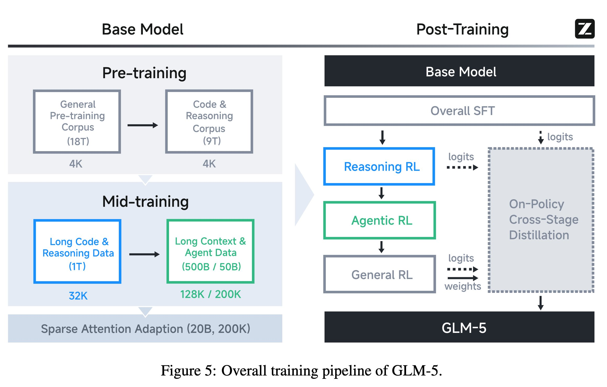

# 基模中训练扩展上下文与推理能力

### 🧑‍💻 User

基模的中训练阶段一般做什么？

---

### 🤖 Assistant

根据您提供的 GLM-5 训练流程图（Figure 5），基模（Base Model）的**中训练（Mid-training）阶段**主要目的是在基础预训练之后，**逐步扩展模型的上下文窗口长度（Context Length），并针对性地注入复杂推理、长代码和智能体（Agent）能力。**

它可以看作是从海量通用数据预训练（Pre-training）到指令微调与对齐（Post-Training）之间的一个“拔高”和“长文本适应”的过渡阶段。

具体到这张图表，中训练阶段被明确划分为两个递进的步骤：

### 1. 第一阶段：扩展至 32K 长度与强化代码/推理
*   **训练数据**：Long Code & Reasoning Data（长代码与推理数据）
*   **数据量**：1T（1万亿 tokens）
*   **上下文长度**：由预训练阶段的 4K 扩展到了 **32K**
*   **主要目的**：在初步扩展上下文窗口的同时，利用大量高质量的长篇代码和逻辑推理数据，强化模型处理复杂逻辑和较长依赖关系的能力。

### 2. 第二阶段：扩展至超长上下文与注入 Agent 能力
*   **训练数据**：Long Context & Agent Data（长上下文与智能体数据）
*   **数据量**：500B / 50B（5000亿 / 500亿 tokens）
*   **上下文长度**：进一步大幅扩展至 **128K / 200K**
*   **主要目的**：将模型的上下文处理能力推向极限（200K）。同时，通过引入智能体（Agent）专属数据，让模型学会在超长上下文中进行多轮交互、工具调用、任务规划和状态保持，为后续的 Agentic RL（智能体强化学习）打下坚实的基础。

---

💡 <b>扩展理解：为什么大模型需要“中训练 (Mid-training)”阶段？</b>（点击展开）

结合该图表和业界大模型的训练范式，中训练阶段（也常被称为 Continual Pre-training 或 Context Extension 阶段）之所以独立出来，主要基于以下原因：

1.  **课程学习机制（Curriculum Learning）**：直接在几十万长度的上下文中进行从零开始的预训练，计算成本极高且模型极难收敛。因此，通常先在较短长度（如 4K）下进行海量数据（如 18T+9T）的预训练学习通用知识，然后再通过“中训练”**阶梯式**地拉长上下文（4K $\rightarrow$ 32K $\rightarrow$ 128K/200K），这样训练更稳定、更经济。
2.  **数据配比的转换**：预训练侧重于“广”（General Corpus），而中训练侧重于“精”和“深”。中训练阶段会大幅提高高质量、高信息密度数据（如代码、数学、长篇逻辑文章、Agent 轨迹）的比例，以激发模型的高级认知能力。
3.  **为 Post-Training 做准备**：如图右侧所示，Post-Training 阶段包含了复杂的强化学习（Reasoning RL, Agentic RL）。如果在中训练阶段没有把基础的长文本处理和 Agent 基础能力注入到基座模型（Base Model）中，后续的强化学习将很难探索到正确的路径（即奖励极其稀疏）。

