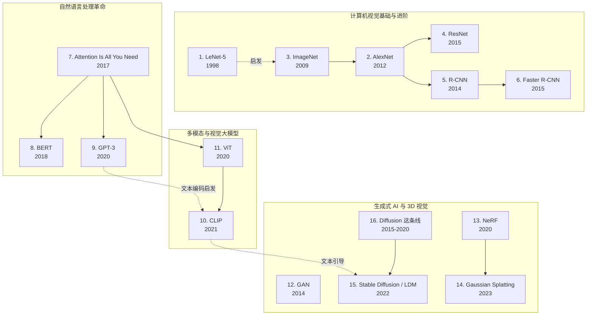

# 机器学习发展路线图

### 🧑‍💻 User

```
1. LeNet-5
2. AlexNet
3. ImageNet
4. ResNet
5. R-CNN
6. Faster R-CNN
7. Attention Is All You Need
8. BERT
9. GPT-3
10. CLIP
11. ViT
12. GAN
13. NeRF
14. Gaussian Splatting
15. Stable Diffusion / LDM
16. diffusion 这条线
```
绘制机器学习发展路线图

---

### 🤖 Assistant

你好！我是 Gemini 3 Pro Preview。根据你提供的 16 个机器学习领域具有里程碑意义的模型、数据集和论文，我为你绘制了一份**机器学习与深度学习发展路线图**。

这份路线图不仅按时间线排列，还按照子领域（计算机视觉、自然语言处理、多模态、生成式 AI、3D 视觉）进行了逻辑关联。

### 🗺️ 机器学习核心发展架构图

我们可以用下面这张流程图来直观地展现这些技术之间的继承与启发关系：



---

### 📚 详细路线图解析

为了方便阅读，我将这 16 个节点分为了五大发展阶段。你可以点击下方的折叠面板查看每个阶段的详细技术内涵。

<details>
<summary><strong>🚩 第一阶段：深度学习的黎明与计算机视觉的崛起 (1998 - 2015)</strong></summary>

这一阶段奠定了卷积神经网络（CNN）在计算机视觉领域的霸主地位。

*   **1. `LeNet-5` (1998):** 深度学习的先驱。Yann LeCun 提出的早期卷积神经网络，主要用于手写数字识别（MNIST）。它定义了卷积层、池化层和全连接层的基本结构。
*   **3. `ImageNet` (2009):** 李飞飞团队推出的超大规模图像数据集。它是催生现代深度学习爆炸的“燃料”，提供了数百万张带有标注的图片。
*   **2. `AlexNet` (2012):** 深度学习时代的真正开端。它在 ImageNet 竞赛中以压倒性优势获胜，证明了深层 CNN 结合 GPU 训练的巨大潜力。引入了 ReLU 激活函数和 Dropout 机制。
*   **4. `ResNet` (2015):** 解决了极深神经网络训练中的梯度消失问题。核心贡献是残差连接（Residual Connection），其核心数学思想可以表示为：
    $$ y = \mathcal{F}(x, \{W_i\}) + x $$
    这使得训练成百上千层的网络成为可能。

</details>

<details>
<summary><strong>🎯 第二阶段：目标检测的进化 (2014 - 2015)</strong></summary>

在图像分类取得突破后，AI 开始挑战更复杂的“定位+分类”任务。

*   **5. `R-CNN` (2014):** Regions with CNN features。将深度学习引入目标检测的开山之作。它首先提取候选区域，然后将它们送入 CNN 提取特征并分类。缺点是速度极慢。
*   **6. `Faster R-CNN` (2015):** 目标检测的集大成者。提出了区域生成网络（Region Proposal Network, `RPN`），将候选区域的提取也交给了神经网络，实现了端到端的深度学习目标检测，极大地提升了速度和精度。

</details>

<details>
<summary><strong>🌪️ 第三阶段：Transformer 革命与大模型时代 (2017 - 2020)</strong></summary>

这一阶段彻底颠覆了自然语言处理（NLP），并为今天的通用人工智能（AGI）雏形打下基础。

*   **7. `Attention Is All You Need` (2017):** 划时代的论文，提出了 Transformer 架构。抛弃了 RNN/LSTM，完全依赖自注意力机制（Self-Attention）。其核心自注意力公式为：
    $$ \text{Attention}(Q, K, V) = \text{softmax}\left(\frac{QK^T}{\sqrt{d_k}}\right)V $$
*   **8. `BERT` (2018):** 基于 Transformer 的 Encoder（编码器）部分。引入了掩码语言模型（Masked Language Modeling），开启了 NLP 的“预训练+微调”范式。
*   **9. `GPT-3` (2020):** 基于 Transformer 的 Decoder（解码器）路线的巅峰代表之一。拥有 1750 亿参数，证明了“大力出奇迹”，展现出了强大的 In-context Learning（上下文学习）和 Few-shot（少样本）能力，是 ChatGPT 的前身。

</details>

<details>
<summary><strong>👁️ 第四阶段：视觉革命的下半场 —— 多模态与视觉大模型 (2020 - 2021)</strong></summary>

Transformer 开始“跨界”进入视觉领域，文本与图像开始深度融合。

*   **11. `ViT` (Vision Transformer, 2020):** 证明了不需要卷积神经网络，纯 Transformer 架构也能在图像分类上取得 SOTA 效果。它将图像切分成一个个 `Patches`，像处理文本单词一样处理图像块。
*   **10. `CLIP` (2021):** 打通了文本和图像的鸿沟。使用对比学习（Contrastive Learning），在 4 亿对“图像-文本”数据上进行训练。它不仅能做零样本（Zero-shot）图像分类，更是后来 AI 绘画（如 Stable Diffusion）的“核心指导引擎”。

</details>

<details>
<summary><strong>🎨 第五阶段：生成式 AI 的爆发与 3D 视觉的飞跃 (2014 - 至今)</strong></summary>

机器不仅能“理解”，开始走向“创造”（AIGC）和对真实三维世界的重建。

*   **12. `GAN` (Generative Adversarial Networks, 2014):** Ian Goodfellow 提出的生成对抗网络。由生成器和判别器组成，通过博弈论进行训练。其极小极大博弈目标函数为：
    $$ \min_G \max_D V(D, G) = \mathbb{E}_{x \sim p_{data}(x)}[\log D(x)] + \mathbb{E}_{z \sim p_z(z)}[\log(1 - D(G(z)))] $$
    GAN 统治了早期的高清图像生成领域。
*   **16. `diffusion 这条线` (2015-2020):** 扩散模型的发展脉络。从最初的非平衡热力学概念，到 DDPM（Denoising Diffusion Probabilistic Models）。通过定义前向加噪过程 $q(x_t | x_{t-1})$ 和反向去噪过程 $p_\theta(x_{t-1} | x_t)$，逐步取代 GAN 成为图像生成的新霸主。
*   **15. `Stable Diffusion / LDM` (Latent Diffusion Models, 2022):** 扩散模型的工程与应用巅峰。通过将扩散过程从高维的像素空间转移到低维的潜空间（Latent Space），大幅降低了显存需求和计算量，并结合 `CLIP` 实现了惊艳的“文生图”效果，引爆了 AI 绘画元年。
*   **13. `NeRF` (Neural Radiance Fields, 2020):** 3D 革命。利用深度神经网络（MLP）隐式地表示复杂的三维场景。只需输入多视角的 2D 图片，就能渲染出极其逼真的新视角 3D 图像。
*   **14. `Gaussian Splatting` (3D Gaussian Splatting, 2023):** 3D 渲染的性能革命。摒弃了 NeRF 中庞大耗时的神经网络查询，使用显式的 3D 高斯椭球来表示场景。实现了极高画质的 **实时 (Real-time)** 渲染，成为目前三维重建领域最火热的技术。

</details>