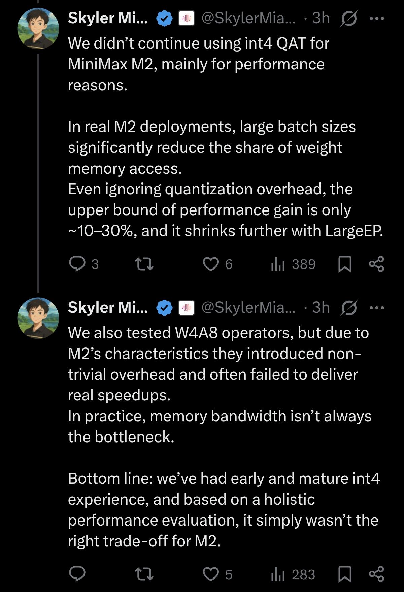

# Roofline模型与大batch推理

### 🧑‍💻 User

这段话似乎有些违背直觉，large batch size 下的inference，瓶颈为什么不是mem bandwidth，结合roofline model解释。

---

### 🤖 Assistant

这段话**并不违背 roofline model**，恰恰相反，它是一个非常“教科书级”的 roofline 结论，只是很多人对 *LLM inference* 的直觉还停留在 **小 batch / decode-only / KV-heavy** 的情形。下面我用 roofline 的语言把这件事完整拆开。

---

## 1. 先把 roofline 的核心变量写清楚

Roofline 模型的核心只有一句话：

[
\text{Performance} = \min\left(
\text{Peak FLOPs},
; \text{Memory Bandwidth} \times \text{Arithmetic Intensity}
\right)
]

其中：

* **Arithmetic Intensity (AI)**
  = FLOPs / Bytes (从 DRAM 读写的字节数)

决定你是：

* **memory-bound**（左下角，斜线段）
* **compute-bound**（右上角，平顶）

---

## 2. 小 batch inference：为什么“直觉上”是 memory-bound？

以最常见的 **batch=1 / small batch decode** 为例：

* 权重：每个 token 都要 **完整扫一遍**
* 激活：很小
* KV cache：大量随机访存
* FLOPs/token：固定
* Bytes/token：≈ 权重大小 + KV

于是：

[
AI_{\text{small batch}} \approx
\frac{\text{FLOPs/token}}{\text{Bytes(token)}} ;;\text{很低}
]

→ 点落在 roofline 左侧
→ **memory bandwidth 是瓶颈**
→ 这时：

* int8 / int4
* 权重量化
* KV 压缩

都很“香”

这是大家熟悉的世界。

---

## 3. Large batch inference：发生了什么根本性变化？

### 3.1 权重访存被 batch amortize（这是关键）

设：

* 权重矩阵大小：`W bytes`
* batch size：`B`
* hidden size：`d`

**一次 GEMM**：

[
Y_{B \times d} = X_{B \times d} \cdot W_{d \times d}
]

* 权重 `W` **只从 DRAM 读一次**
* 但参与了 **B 次向量乘**

于是：

[
\text{Bytes per token} \approx \frac{W}{B} + \text{activation}
]

[
\text{FLOPs per token} \approx O(d^2)
]

所以：

[
AI_{\text{large batch}} \approx
\frac{O(d^2)}{W/B}
;\propto; B
]

**Arithmetic Intensity 随 batch size 线性上升**

---

### 3.2 在 roofline 上的“物理意义”

* batch=1：
  点在左下角 → memory-bound

* batch → 32 / 64 / 128：
  点 **向右移动**

* 到某个 batch 后：
  [
  AI \ge \frac{\text{Peak FLOPs}}{\text{BW}}
  ]
  → **撞上 compute roof**

此时：

* 你已经 **不再受 DRAM 带宽限制**
* 而是受：

  * Tensor Core / SIMD 吞吐
  * pipeline efficiency
  * instruction mix
  * quant/dequant 指令

限制

这正是 Skyler 说的那句话：

> large batch sizes significantly reduce the share of weight memory access

---

## 4. 为什么这时 int4 / W4A8 的收益上限只有 10–30%？

### 4.1 用 roofline 直接看“理论上限”

假设已经 compute-bound：

[
\text{Perf} \approx \text{Peak FLOPs}
]

你把：

* fp16 → int4
* 带宽减半 / 减四

**roofline 根本不变**

唯一能提升的是：

* **单位 FLOP 的执行效率**
* 或 **Tensor Core mapping**

但现实是：

* int4 需要：

  * unpack
  * scale
  * dequant
* W4A8 需要：

  * extra instructions
  * 更多寄存器压力
  * kernel 更复杂

→ **有效 FLOPs/s 并不会线性提升**

所以 Skyler 说的是：

> Even ignoring quantization overhead, the upper bound is only ~10–30%

这是 **roofline 给你的硬上限**，不是实现问题。

---

## 5. 为什么 LargeEP（MoE / Expert Parallel）会让收益更小？

这是一个容易被忽略但非常关键的点。

### 5.1 LargeEP 的 effect

* 每个 token 只激活 **k 个 expert**
* 单 expert 的 batch size：
  [
  B_{\text{expert}} = \frac{B \times k}{#experts}
  ]

结果：

* **权重复用下降**
* GEMM 规模变小
* kernel launch & sync 比例上升

这会导致两个后果：

1. **算力利用率下降**
2. quant / dequant overhead 占比上升

于是：

> it shrinks further with LargeEP

完全符合 roofline + kernel efficiency 的预期。

---

## 6. 为什么 “memory bandwidth isn’t always the bottleneck” 是一句非常严谨的话？

因为 bottleneck 取决于 **AI 所在区间**：

| 场景                     | AI | Bottleneck        |
| ---------------------- | -- | ----------------- |
| batch=1 decode         | 低  | DRAM bandwidth    |
| 小 batch prefill        | 中  | L2 / shared mem   |
| 大 batch prefill        | 高  | Compute           |
| MoE small expert batch | 中低 | Kernel efficiency |

量化只在 **memory-bound 区域** 才是“第一性优化”。

---

## 7. 一句话总结（roofline 版本）

> **int4/W4A8 的前提假设是 inference 位于 roofline 的 memory-bound 区域；
> 而 large-batch M2 inference 已经系统性地进入 compute-bound 区域，因此量化只能带来有限、甚至不可兑现的收益。**

这不是“反直觉”，而是**直觉更新滞后于系统规模变化**。

如果你愿意，下一步我们可以：

* 把这个分析量化成一个 **具体的 A100/H100 roofline 点位**
* 或结合你之前关心的 **AVX2 / bf16 / int8 CPU inference** 对比说明为什么 CPU 上直觉又是“对的”
