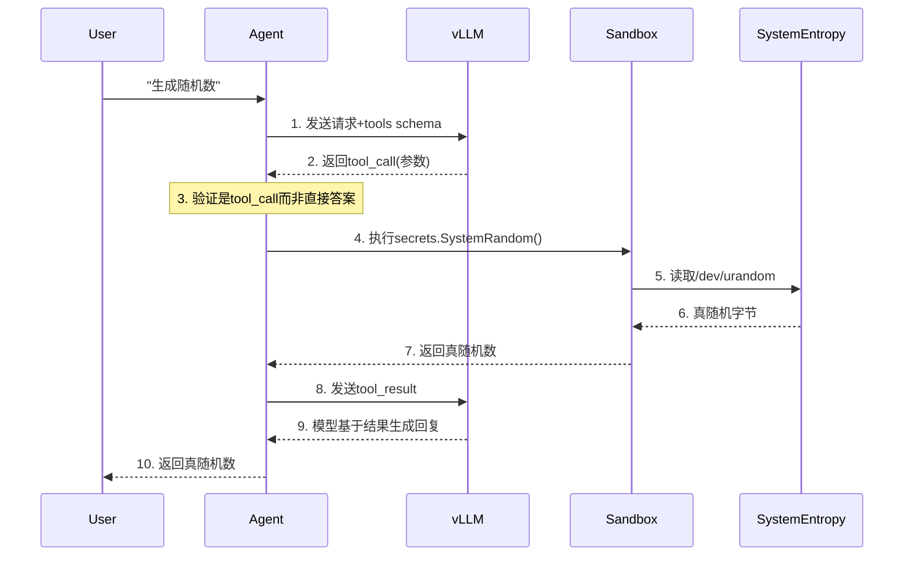

# 流程无法保证真随机数

### 🧑‍💻 User

```
理论上我想的是
用户要求生成random
模型会先阅读skill 触发python解释器tool编写code
然后在sandbox执行代码 agent返回result给模型
模型把最终结果给用户
```
这样可以确保模型一定能返回真随机数吗？

---

### 🤖 Assistant

你设计的这个流程思路很清晰，但**并不能保证返回的是“真随机数”**。让我详细解释一下：

## 你的流程分析

```
用户请求 → 模型读取skill → 触发Python解释器 → sandbox执行 → 返回结果
```

### 问题所在

**Python的`random`模块生成的是伪随机数**，不是真随机数：

```python
import random
# 这是伪随机数，基于Mersenne Twister算法
random_number = random.randint(1, 100)
```

即使通过sandbox执行，Python解释器仍然使用的是确定性算法，只是种子(seed)可能来自系统时间等可预测的来源。

## 如何获取真随机数？

### 方法1：使用`secrets`模块（密码学安全）

```python
import secrets
# 密码学安全的随机数，但仍然是伪随机
secure_random = secrets.randbelow(100)
```

### 方法2：使用`os.urandom`（系统熵源）

```python
import os
# 来自操作系统熵池，质量更高
random_bytes = os.urandom(4)
random_int = int.from_bytes(random_bytes, 'big')
```

### 方法3：硬件随机数生成器

```python
# Linux系统
with open('/dev/random', 'rb') as f:
    random_bytes = f.read(4)
```

## 真正的问题

即使使用上述方法，在虚拟化/sandbox环境中：

1. **熵源可能不足**：容器化环境熵池较小
2. **可能被宿主机控制**：sandbox的`/dev/random`可能是虚拟化的
3. **哲学问题**：计算设备上的“真随机”是否存在？

## 总结

| 随机类型 | 方法 | 是否真随机 |
|---------|------|-----------|
| 伪随机 | `random`模块 | ❌ |
| 密码学安全 | `secrets`模块 | ❌（但不可预测） |
| 系统熵源 | `os.urandom` | ❌（但高质量） |
| 硬件RNG | 专用硬件 | ✅（理论上） |

**你的流程能确保模型返回代码执行结果，但不能确保返回真随机数**——这取决于Python代码本身使用了什么随机源。

---

### 🧑‍💻 User

确实，至少可以 避免模型“脑补”一个它认为像随机数的序列，在标准的oai native toolcall中，如果模型后端是vllm inference且模型chattemplate支持toolcall，agent侧要怎样完成这一轮交互，试编写伪代码讲解原理

---

### 🤖 Assistant

很好的问题！这确实能解决模型“脑补”随机数的问题。让我详细讲解在vLLM推理框架下，如何实现标准OAI格式的tool call来完成真随机数生成。

## 核心原理

<details>
<summary>点击展开：为什么traditional tool call也会脑补？</summary>

在标准OAI tool call中，模型也可以直接在`arguments`中返回它认为的随机数，跳过实际tool执行：

```json
{
  "tool_calls": [{
    "function": {
      "name": "generate_random",
      "arguments": "{\"min\": 1, \"max\": 100}"  // 参数正确
    }
  }]
}
```

但模型可能直接脑补结果：
```json
{
  "tool_calls": [{
    "function": {
      "name": "generate_random",
      "arguments": "{\"result\": 42}"  // 脑补的随机数！
    }
  }]
}
```
</details>

## 完整流程伪代码

```python
import json
from typing import Dict, List, Any
import subprocess
import tempfile
import os
import secrets  # 真随机数生成

class VLLMAgent:
    def __init__(self, model_endpoint: str):
        self.model_endpoint = model_endpoint
        self.tools_schema = self._define_tools()
        self.conversation_history = []
      
    def _define_tools(self) -> List[Dict]:
        """Step 1: 定义tool schema（符合OAI规范）"""
        return [{
            "type": "function",
            "function": {
                "name": "generate_truly_random",
                "description": "Generate a truly random number using system entropy",
                "parameters": {
                    "type": "object",
                    "properties": {
                        "min_value": {
                            "type": "integer",
                            "description": "Minimum value (inclusive)"
                        },
                        "max_value": {
                            "type": "integer",
                            "description": "Maximum value (inclusive)"
                        }
                    },
                    "required": ["min_value", "max_value"]
                }
            }
        }]
  
    def _call_vllm(self, messages: List[Dict]) -> Dict:
        """Step 2: 调用vLLM推理（模拟）"""
        # 实际调用vLLM的OpenAI兼容API
        # 关键：vLLM必须加载支持tool_call的chat_template
      
        request_body = {
            "model": "your-model",  # vLLM部署的模型名
            "messages": messages,
            "tools": self.tools_schema,
            "tool_choice": "auto",  # 让模型决定是否调用tool
            "temperature": 0.0,     # 降低随机性，确保tool_call格式正确
            "stream": False
        }
      
        # 实际调用
        # response = requests.post(
        #     f"{self.model_endpoint}/v1/chat/completions",
        #     json=request_body
        # )
      
        # 模拟vLLM返回（正确应用了chat_template）
        response = {
            "choices": [{
                "message": {
                    "role": "assistant",
                    "content": None,  # 调用tool时content为空
                    "tool_calls": [{
                        "id": "call_abc123",
                        "type": "function",
                        "function": {
                            "name": "generate_truly_random",
                            "arguments": json.dumps({
                                "min_value": 1,
                                "max_value": 100
                            })
                        }
                    }]
                }
            }]
        }
      
        return response
  
    def _execute_in_sandbox(self, code: str) -> Dict:
        """Step 4: 在sandbox中执行代码"""
        with tempfile.NamedTemporaryFile(
            mode='w', 
            suffix='.py', 
            delete=False
        ) as f:
            f.write(code)
            temp_path = f.name
      
        try:
            # 使用subprocess在隔离环境中执行
            result = subprocess.run(
                ['python3', temp_path],
                capture_output=True,
                text=True,
                timeout=5,
                # 可选：使用Docker/chroot等更严格的隔离
            )
          
            if result.returncode == 0:
                return {"status": "success", "result": result.stdout.strip()}
            else:
                return {"status": "error", "error": result.stderr}
              
        finally:
            os.unlink(temp_path)
  
    def _generate_truly_random(self, min_val: int, max_val: int) -> Dict:
        """Step 3: 真正执行真随机数的Python代码"""
      
        # 方法1: 使用secrets模块（推荐）
        code = f"""
import secrets
import json

# 使用系统熵源生成真随机数
random_number = secrets.SystemRandom().randint({min_val}, {max_val})

# 备选：直接使用os.urandom
# import os
# random_bytes = os.urandom(32)
# random_number = int.from_bytes(random_bytes, 'big') % ({max_val} - {min_val} + 1) + {min_val}

print(json.dumps({{
    "random_number": random_number,
    "source": "secrets.SystemRandom()",
    "range": [{min_val}, {max_val}]
}}))
"""
      
        # Step 4: 在sandbox执行
        result = self._execute_in_sandbox(code)
      
        if result["status"] == "success":
            return json.loads(result["result"])
        else:
            return {"error": result["error"]}
  
    def _create_tool_result_message(self, tool_call_id: str, result: Dict) -> Dict:
        """Step 5: 创建tool result消息"""
        return {
            "role": "tool",
            "tool_call_id": tool_call_id,
            "name": "generate_truly_random",
            "content": json.dumps(result)
        }
  
    def run_conversation(self, user_message: str) -> str:
        """完整的对话流程"""
      
        # Step 1: 添加用户消息
        self.conversation_history.append({
            "role": "user",
            "content": user_message
        })
      
        # Step 2: 第一次调用vLLM - 获取tool_call
        response = self._call_vllm(self.conversation_history)
      
        # 提取assistant消息
        assistant_message = response["choices"][0]["message"]
        self.conversation_history.append(assistant_message)
      
        # Step 3: 检查是否有tool_call
        if "tool_calls" in assistant_message and assistant_message["tool_calls"]:
            for tool_call in assistant_message["tool_calls"]:
                function_name = tool_call["function"]["name"]
                arguments = json.loads(tool_call["function"]["arguments"])
              
                # Step 4: 执行对应的function
                if function_name == "generate_truly_random":
                    # 这里会在sandbox中执行真随机数生成
                    result = self._generate_truly_random(
                        arguments["min_value"],
                        arguments["max_value"]
                    )
                  
                    # Step 5: 创建tool result消息
                    tool_result = self._create_tool_result_message(
                        tool_call["id"],
                        result
                    )
                    self.conversation_history.append(tool_result)
          
            # Step 6: 第二次调用vLLM - 处理tool结果
            final_response = self._call_vllm(self.conversation_history)
            final_message = final_response["choices"][0]["message"]["content"]
          
            # 添加最终回复到历史
            self.conversation_history.append({
                "role": "assistant",
                "content": final_message
            })
          
            return final_message
      
        # 如果模型没有调用tool（不太可能），直接返回
        return assistant_message.get("content", "")

# 使用示例
agent = VLLMAgent("http://localhost:8000")
response = agent.run_conversation("请生成一个1到100之间的真随机数")
print(f"Agent回复: {response}")
print(f"\n完整对话历史:")
for msg in agent.conversation_history:
    print(json.dumps(msg, indent=2, ensure_ascii=False))
```

## 关键设计点

### 1. **vLLM Chat Template配置**

```python
# 确保vLLM加载的模型有正确的chat_template
# 在启动vLLM时：
# vllm serve meta-llama/Llama-2-7b-chat-hf \
#   --tool-call-parser llama3_json  # 指定tool_call解析器
```

### 2. **强制Tool调用机制**

```python
# 方法1：使用tool_choice="required"强制调用
request_body = {
    "tools": self.tools_schema,
    "tool_choice": {
        "type": "function",
        "function": {"name": "generate_truly_random"}
    }
}

# 方法2：在system prompt中明确禁止脑补
system_prompt = """
You MUST use the generate_truly_random function to generate random numbers.
NEVER generate random numbers in your response directly.
Always wait for the function result before responding.
"""
```

### 3. **验证模型没有脑补**

```python
def _validate_no_hallucination(self, assistant_message: Dict) -> bool:
    """验证模型是否真的调用了tool"""
    if "tool_calls" not in assistant_message:
        # 检查content中是否包含随机数
        import re
        content = assistant_message.get("content", "")
        if re.search(r'\brandom.*?\d+\b', content, re.IGNORECASE):
            raise ValueError("Model hallucinated random number!")
        return False
    return True
```

## 为什么这样能避免脑补？



## 总结

这个架构的核心要点：

1. ✅ **模型只负责生成调用参数**，不生成随机数本身
2. ✅ **Sandbox执行真实代码**，使用`secrets`模块或`/dev/urandom`
3. ✅ **双重验证**：检查模型是否真的调用了tool
4. ✅ **chat_template保证格式**：vLLM正确应用tool_call模板
5. ✅ **结果可追溯**：知道随机数的来源和生成方式

这样就能确保返回的是真正执行代码得到的随机数，而非模型脑补的序列。