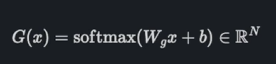
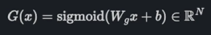

# Softmax vs sigmoid MoE

### 🧑‍💻 User

一般来说，在选取 top-K 专家时，我们会对 gating layer 的输出进行归一化，通常我们会使用 softmax function，但是，在 deepseek 的 Loss-Free Balancing 中，作者通过实验发现，使用sigmoid作为激活函数效果更好，实验结果显示，sigmoid function 对于超参数更加 robust，且表现也更好一些。两者作为moe router的activation function有什么区别，有哪些moe模型分别使用softmax or sigmoid？

---

### 🤖 Assistant

你的问题可以拆成三个层次来看：**（1）softmax vs sigmoid 作为 MoE router 激活在“数学与优化层面”的根本差异；（2）这种差异为什么会直接影响 load balance / 超参数敏感性；（3）主流 MoE 模型在工程上各自的选择与取舍。**
下面我按这个逻辑系统性回答。

---

## 1. softmax vs sigmoid：路由建模假设的根本不同

### 1.1 softmax：**“单分布 + 竞争式分配”**

[
G(x) = \text{softmax}(W_g x + b),\quad \sum_i G_i(x)=1
]

softmax router 隐含的建模假设是：

> **所有专家在同一个概率 simplex 中竞争 token 的解释权**

其核心特征：

* **强耦合（coupled）**
  任意一个 expert 的 logit 变化，都会影响所有其他 expert 的分配概率。
* **相对排序驱动**
  只关心“谁更大”，而不关心绝对尺度。
* **归一化约束**
  token 的“专家质量”被强制压缩为总和 1 的分布。

这在理论上非常优雅，但在 MoE 场景中会带来几个后果：

* 路由退化到 **winner-takes-most**
* 极易出现 **expert collapse / routing imbalance**
* load balance 对 temperature、aux loss 权重极其敏感

---

### 1.2 sigmoid：**“独立 Bernoulli gate + 非竞争式选择”**

[
G(x) = \sigma(W_g x + b),\quad G_i(x)\in(0,1)
]

sigmoid router 的隐含假设完全不同：

> **每个 expert 独立判断“我是否适合这个 token”**

核心差异：

* **解耦（decoupled）**
  每个 expert 的 gate 是独立 Bernoulli 变量
* **绝对尺度有意义**
  logit 绝对大小决定激活概率
* **不要求归一化**
  总 gate mass 可以变化（稀疏性自然出现）

这在 MoE 中非常重要：
**token-to-expert 是多对多的“匹配问题”，而不是单分布分类问题。**

---

## 2. 为什么 sigmoid 在 DeepSeek 的 Loss-Free Balancing 中更稳？

你提到的 **Loss-Free Balancing** 是关键，这里 sigmoid 的优势是“结构性”的，而不是调参技巧。

---

### 2.1 softmax 的不稳定性来自“全局耦合梯度”

softmax 的梯度形式（对 logit (z_i)）：

[
\frac{\partial G_i}{\partial z_j} = G_i(\delta_{ij} - G_j)
]

意味着：

* 提升一个 expert ⇒ **必然压制其他 expert**
* imbalance 会形成 **正反馈回路**
* 需要 **显式的 load balancing loss** 来抵消

这也是为什么经典 MoE（GShard / Switch / GLaM）都需要：

* importance loss
* load loss
* entropy regularization
* careful temperature tuning

---

### 2.2 sigmoid 的梯度是“局部 + 可饱和”的

sigmoid 梯度：

[
\frac{\partial G_i}{\partial z_i} = G_i(1 - G_i)
]

性质非常关键：

* **不影响其他 expert**
* 高置信度后自动饱和（梯度变小）
* 自然抑制极端 routing

这意味着：

* expert 不会通过“压制别人”来获得更多 token
* load 分布更接近 **Poisson-like 独立采样**
* 不需要额外 balancing loss 也能稳定

👉 **这正是 DeepSeek 能“Loss-Free Balancing”的根本原因**

---

### 2.3 对超参数更 robust 的本质原因

sigmoid 的鲁棒性来自三点：

1. **无 temperature 依赖**

   * softmax 温度 = routing sharpness
   * sigmoid 本身已是 bounded gate
2. **top-K 是后处理，不影响 gate 学习**

   * 先学“是否适合”
   * 再选 K 个最大的
3. **极端 logit 不会破坏全局分布**

   * 不会把所有 token 吸走

---

## 3. Top-K 行为：softmax vs sigmoid 的本质差异

| 维度           | softmax + top-K | sigmoid + top-K |
| ------------ | --------------- | --------------- |
| 排序依据         | 相对大小            | 绝对置信度           |
| K 变化影响       | 改变概率分布          | 只改变激活数量         |
| expert 竞争    | 强               | 弱               |
| collapse 风险  | 高               | 低               |
| balancing 需求 | 显式              | 可隐式             |

一句话总结：

> **softmax 是“选最好的 K 个”；sigmoid 是“所有觉得自己行的 expert 中选 K 个最自信的”。**

---

## 4. 典型 MoE 模型的选择对比

### 4.1 使用 softmax router 的代表

**第一代 / 经典 MoE：**

* **GShard (Google)**
* **Switch Transformer**
* **GLaM**
* **PaLM-MoE**
* **Mixtral（变体仍然是 softmax + aux loss）**

特征：

* 强依赖 load balancing loss
* 对 temperature / loss 权重非常敏感
* 工程复杂度高，但理论清晰

---

### 4.2 使用 sigmoid / 非 softmax router 的代表

**新一代 / 工程驱动 MoE：**

* **DeepSeek-MoE / DeepSeek-V2/V3**

  * sigmoid + loss-free balancing
* **Qwen2-MoE（后期实验分支）**
* **一些 Routing-as-Matching / Independent Gate MoE**
* **部分多标签 / sparse activation MoE（研究模型）**

趋势非常明显：

> **越大的模型、越长的训练、越追求稳定性 → 越倾向 sigmoid / 独立 gate**

---

## 5. 更深一层的理解（关键结论）

### 5.1 softmax router 本质上在做“单标签分类”

* token → expert 是 mutually exclusive 的假设
* 这与实际语义不匹配（一个 token 可以适合多个 expert）

### 5.2 sigmoid router 更像“多标签匹配 + 稀疏激活”

* expert 表达的是能力子空间
* token 激活的是能力集合

这在 scale-up 时明显更合理。

---

## 6. 一句话总结

> **softmax router 把 MoE 当成“竞争分类问题”，sigmoid router 把 MoE 当成“独立匹配问题”。**
> 在大规模训练下，后者天然更稳定，也更符合 loss-free balancing 的目标。

如果你愿意，下一步我们可以进一步讨论：
**sigmoid router + capacity constraint + dispatch kernel 实现细节**，以及它对 fused MoE kernel（如你之前关心的 up/gate 融合）的影响。
