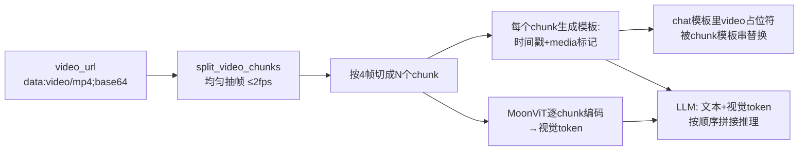

# K25共享压缩优势

### 🧑‍💻 User

kimi k2.5模型的视频模态输入是怎么实现的 是图片（关键帧）加打时间轴吗，是的话模板是怎么组合的？

---

### 🤖 Assistant

我来搜索关于 Kimi K2.5 视频模态输入实现

搜索结果很有价值，我已经找到了关键线索。让我深入获取 Kimi-K2.5 的官方仓库和视觉处理代码：


让我获取视觉处理的核心代码和 vLLM 实现文档，以确认视频输入的具体

拿到了视觉处理核心代码。现在让我获取 `media_utils.py`（含时间戳格式化和 NaViT 布局逻辑）以及模型配置参数：


核心代码已经拿到。再确认 `preprocessor_config.json` 里的 `media_proc_cfg` 默认参数和 API 层的视频输入格式（README 的 Video Input 部分）：


核心代码已经确认。让我再获取 processor（模板组合逻辑）和 tokenizer 的 chat template，把"模板怎么组合"这最后一块拼图补全：


让我最后确认 chat template 是如何渲染视频占位符的，把完整链路闭合：


已经拿到了官方仓库的全部关键代码（`kimi_k25_vision_processing.py`、`media_utils.py`、`kimi_k25_processor.py`、`chat_template.jinja`、`preprocessor_config.json`、`config.json`、`tokenizer_config.json`）。下面给出确凿的结论和完整机制。

---

## 结论

**是的，你的判断基本正确。** Kimi K2.5 的视频输入 = **均匀抽帧（关键帧）+ 时间轴文本**，把视频切成若干个"4 帧一组"的视觉 chunk，每个 chunk 前面拼一段该 chunk 起始时间戳的文本，整个序列由 LLM 直接吃掉。它不是把整段视频压缩成一个 embedding，而是**把视频"翻译"成一串带时间戳的视觉 token 块**。

---

## 1. 完整处理链路



- **API 层**：视频以 `video_url` 类型传入，base64 编码成 `data:video/mp4;base64,...`（官方 API 专属的 experimental 功能，vLLM/SGLang 第三方部署暂不支持）。
- **chat 模板层**：Jinja 模板里，`video_url` 内容会先渲染成一个特殊占位符 `<|kimi_k25_video_placeholder|>`。
- **processor 层**：`KimiK25Processor` 把视频拆成 chunk，并用每个 chunk 的 prompt 串**替换**掉这个占位符，得到最终输入文本；同时逐 chunk 编码出 `pixel_values` + `grid_thws`。

---

## 2. 抽帧与切块（`split_video_chunks`）

默认参数来自 `preprocessor_config.json` 的 `media_proc_cfg`：

| 参数 | 默认值 | 含义 |
|---|---|---|
| `sample_fps` | 2 | 目标采样帧率 2 fps |
| `temporal_merge_kernel_size` | 4 | 每个 chunk 最多 4 帧 |
| `timestamp_mode` | `hh:mm:ss.fff` | 时间戳格式 |
| `patch_size` | 14 | 视觉 patch 大小 |
| `in_patch_limit_each_frame` | 4096 | 每帧 NaViT token 预算 |
| `merge_kernel_size` | 2 | 2×2 patch 合并 |

处理过程（核心代码）：

```python
sample_fps = min(self.media_proc_cfg['sample_fps'], video_spec.fps)     # ≤2fps
sampled_nframes = max(round(video_spec.num_frames * sample_fps / video_spec.fps), 1)
frame_inds = np.linspace(0, video_spec.num_frames - 1, sampled_nframes).round().astype(int)
# ↑ 在整个视频时间轴上均匀取 N 个关键帧索引

# 每 temporal_merge_kernel_size=4 帧切成一个 chunk
for i in range(0, len(frame_inds), 4):
    # 记录 chunk 起始帧的播放时间
    start_time = frame_inds[i] / float(video_spec.fps)
    timestamp_text = timestamp_as_str(start_time, "hh:mm:ss.fff")       # → "00:00:02.000"
    # 模板拼接
    video_chunk = VideoChunkInput(video_chunk=这4帧, prompt=make_chunk_prompt(timestamp_text))
```

即：**先按 2fps 均分时间轴取关键帧**，再**每 4 帧打包成一个 chunk**（约覆盖 2 秒视频），时间戳 = 该 chunk 第一帧对应的播放时刻。

---

## 3. 模板组合（你要的重点）

每个 chunk 的 prompt 由 `make_chunk_prompt` 生成：

$$ \text{chunk prompt} = \underbrace{\{timestamp\_text\}}_{\text{时间轴}} + \texttt{<|media\_begin|>video<|media\_content|><|media\_pad|><|media\_end|>} $$

具体代码：

```python
@classmethod
def make_chunk_prompt(cls, timestamp_text: str) -> str:
    return f"{timestamp_text}<|media_begin|>video<|media_content|><|media_pad|><|media_end|>"
```

然后，同一个视频的所有 chunk prompt 按时间顺序**拼接**，整体替换掉文本里的 `<|kimi_k25_video_placeholder|>`：

```python
video_prompts.append("".join([vc['prompt'] for vc in video_chunks]))  # 各chunk串接
text = self.update_raw_text(text, video_prompts)                      # 替换占位符
```

### 具体例子

一个 10 秒、30fps 的视频 → 采样 N = round(300×2/30)=20 帧 → 切成 5 个 chunk，最终模型看到的输入文本为：

```
00:00:00.000<|media_begin|>video<|media_content|><|media_pad|><|media_end|>
00:00:02.000<|media_begin|>video<|media_content|><|media_pad|><|media_end|>
00:00:04.000<|media_begin|>video<|media_content|><|media_pad|><|media_end|>
00:00:06.000<|media_begin|>video<|media_content|><|media_pad|><|media_end|>
00:00:08.000<|media_begin|>video<|media_content|><|media_pad|><|media_end|>
Describe the video in detail.
```

时间轴上 0s / 2s / 4s / 6s / 8s 恰好是各 chunk 的起始时刻——`<|media_pad|>`（token id 163605）就是 config 里的 `media_placeholder_token_id`。

> 对比：**图片** 的模板由 chat 模板直接生成，不带时间戳：`<|media_begin|>image<|media_content|><|media_pad|><|media_end|>`。视频特有的"时间轴"能力正是靠 chunk prompt 里的时间戳文本实现的。

---

## 4. 视觉 token 怎么进去（`<|media_content|>` 与 `<|media_pad|>` 的分工)

- **抽出的帧**经 `navit_resize_video` + `navit_patchify` 变成 patch 序列（NaViT 变分辨率处理：每帧限制 4096 个 patch、单侧 512，2×2 patch 合并后每个 token 覆盖 28×28 像素），输出 `pixel_values` 和 `grid_thw = [T, H/14, W/14]`。
- **MoonViT**（400M 参数视觉编码器，27 层，`video_attn_type=spatial_temporal`，初始时间位置编码 `init_pos_emb_time=4`——正好对应 4 帧 chunk）对每个 chunk 做**时空注意力**编码，产出该 chunk 的一串视觉 token，经 patchmerger/投影层映射到 LLM 的 7168 维空间。
- 建模时 `<|media_content|>` 位置被**展开成该 chunk 的视觉 token 数**，每个 patch embedding 替换掉对应位置的 `<|media_pad|>` embedding；多余的 `<|media_pad|>` 在 attention 里被 mask 掉，从而支持**同一 batch 内不同 chunk 变长打包**（config 里的 `use_unified_vision_chunk: true`，NaViT 式 packing）。

### 时间语义如何维持

| 时间尺度 | 机制 |
|---|---|
| chunk 内部（<2s） | MoonViT 的 temporal attention + 时间位置编码（4 帧） |
| chunk 之间（跨时间轴） | LLM 注意力 + 每个 chunk 前的**时间戳文本** |

---

## 5. 关键出处（可自行核对）

| 文件 | 内容 |
|---|---|
| `kimi_k25_vision_processing.py` | `split_video_chunks`、`make_chunk_prompt`、NaViT resize/patchify |
| `media_utils.py` | `timestamp_as_str`（`hh:mm:ss.fff` 等 3 种格式）、`navit_resize_video`、`navit_patchify` |
| `kimi_k25_processor.py` | `preprocess_medias` / `update_raw_text`（占位符替换）、`_extract_medias_from_messages` |
| `chat_template.jinja` | `video_url` → `<|kimi_k25_video_placeholder|>` |
| `preprocessor_config.json` | `sample_fps=2`、`temporal_merge_kernel_size=4`、`timestamp_mode=hh:mm:ss.fff` 等 |
| `config.json` | `use_unified_vision_chunk=true`、`media_placeholder_token_id=163605`、MoonViT 配置 |

> ⚠️ 补充两点：① README 明确说明视频输入是 **experimental**，目前**仅官方 API**（`api.moonshot.cn`）支持，vLLM/SGLang 部署不支持；② 仓库 changelog 提到早期用过 `<|media_start|>`，已统一为 `<|media_begin|>`。

---

**一句话总结**：Kimi K2.5 的视频模态 = **按 ≤2fps 均匀取关键帧 → 每 4 帧一个 chunk → 每个 chunk 前插入 `HH:MM:SS.mmm` 时间戳 → 用 `<|media_begin|>video<|media_content|><|media_pad|><|media_end|>` 模板把相邻 4 帧"打包"成一个带时间标签的视觉 token 块**，多个块按时间顺序与文本混合送入 1T 参数的 MoE 大模型，实现带明确时间轴的视频理解。

---

### 🧑‍💻 User

我知道了，K2.5 的视频输入是采样后的图片帧序列加每帧的文本时间戳，通过MoonViT视觉编码器把图片帧转成视觉token，时间戳作为文本token穿插在帧之间。
首先，MoonViT确实不是简单地把每帧当独立图片处理。源码里navit_patchify的输入是(T, H, W, C)四维张量，输出grid_thw是(T, H//patch, W//patch)。这个T维度是时间维度，说明视觉编码器是知道帧间时序关系的，不是把T展平当batch处理。
但关键问题是MoonViT内部到底是3D tubelet embedding还是2D patch加时序注意力？它会不会导致一定会丢失部分帧的信息？

---

### 🤖 Assistant

好问题，这确实是理解 MoonViT 的关键。`grid_thw` 里的 T 维度到底只是"包装"还是真被编码器利用了，必须看 MoonViT 的前向实现。让我拉取视觉编码器的源码来确认：

让我先查看可用的工具：

fetch 工具在 Cherry 服务器下，让我用正确的名称调用：

现在获取 MoonViT 的模型实现代码：

404，说明视觉编码器的文件名不同。让我列出仓库文件树找正确文件名：

GitHub API 被限流了，换 HuggingFace 的 API：


视觉编码器应该在 `modeling_deepseek.py`（MoonViT 是 DeepSeek-VL2 同源的视觉编码器，patch merger / grid_thw 架构一致）或 `modeling_kimi_k25.py` 里。让我拉取这两个文件：

两个建模文件都拿到了，MoonViT 的完整实现就在 `modeling_kimi_k25.py` 里。让我再确认一下 `config.json` 里的视觉配置精确数值，然后给出最终结论：

拿到了全部源码和配置。你的两个判断中，有一个是完全正确的，另一个需要精确修正。下面是基于 `modeling_kimi_k25.py` 逐行核实的结论。

---

## 直接回答

| 你的问题 | 答案 |
|---|---|
| 是 3D tubelet embedding 还是 2D patch + 时序注意力？ | **2D patch embedding + 全3D双向注意力**，不是 3D tubelet |
| 会不会必然丢失部分帧的信息？ | **会，而且是"三重"必然丢失**，其中一重就在视觉编码器内部（时间平均池化） |

你说"不是把 T 展平当 batch"——**这个判断是对的**，但实现的细节比想象的更微妙：**T 在注意力里确实是 3D 全连接的，但到了编码器出口，T 被平均池化彻底折叠掉了**。下面展开。

---

## 1. Patch Embedding：纯 2D，共享权重，无 tubelet

```python
class MoonVision3dPatchEmbed(nn.Module):
    def __init__(...):
        self.patch_size = patch_size                      # (14, 14) —— 2D!
        self.proj = nn.Conv2d(in_dim, out_dim, kernel_size=patch_size, stride=patch_size)
```

`pixel_values` 的 shape 是 $(L, 3, 14, 14)$（`navit_patchify` 输出的每个 patch 一行），`Conv2d(k=14, s=14)` 作用在单个 patch 上等价于一个**逐 patch 的线性投影**，参数在时间维度上**完全共享**。没有任何 `Conv3d`、没有帧间卷积——**tubelet 不存在**。

### 位置编码：`pos_emb_type: "divided_fixed"` —— "分体式"（2D 可学习 + 1D 固定）

```python
class Learnable2DInterpPosEmbDivided_fixed(nn.Module):
    self.weight = nn.Parameter(torch.empty(height=64, width=64, dim=1152))   # 2D 可学习空间PE
    self.register_buffer('time_weight',
        get_1d_sincos_pos_embed(self.dim, num_frames=4))                     # 1D 固定sincos时间PE
    ...
    if t == 1:
        pos_emb_3d = pos_emb_2d                                   # 图片: 无时间PE
    else:
        pos_emb_3d = pos_emb_2d.unsqueeze(0).repeat(t,1,1) + self.time_weight[0:t]
        #            同一套2D空间PE在t帧上重复 + 每帧加上不同的sincos时间PE
```

关键点：**2D 空间 PE 在 4 帧上重复使用（完全相同），只有固定 sincos 时间 PE 随帧变化**。所以编码器"知道"帧的先后，靠的是那个 `time_weight`（帧0~3 各不相同的正弦编码），而不是 3D tubelet。

---

## 2. 注意力：`video_attn_type: "spatial_temporal"` 到底是什么？

源码里这个配置是**硬断言**的，且实现很直接：

```python
assert video_attn_type == 'spatial_temporal', ...
...
lengths = grid_thws[:, 0] * grid_thws[:, 1] * grid_thws[:, 2]   # 每个chunk = t*h*w 个token
cu_seqlens = lengths.cumsum(0)
# flash_attn_varlen_func(..., causal=False)  —— chunk内全双向注意
```

也就是说：**每个 chunk 的 $t \times h \times w$ 个 token 组成一个独立的注意力段，段内任意 token（任意帧、任意位置）可以互相注意，因果掩码关闭**。这就是"空间+时间"双层含义：

- **空间**：同一帧内 patch 之间相互注意（2D RoPE，`Rope2DPosEmbRepeated`，最大 512×512，`freqs_cis[:h,:w].repeat(t,1)`——**每帧重复同样的 2D RoPE**）；
- **时间**：不同帧的同一位置/不同位置 patch 也在同一注意力段内交互，帧间区分只靠加法式 sincos 时间 PE。

所以你的表述"2D patch 加时序注意力"**基本正确**——准确的说是：**2D patch（共享权重）+ 2D 可学习空间 PE 逐帧重复 + 固定 sincos 时间 PE + chunk 内全 3D 双向自注意力**。注意"divided"修饰的是**位置编码**，不是注意力本身——注意力是全 3D 的，并没有拆成"先空间后时间"两层。

---

## 3. 关键发现：出口处 T 被"时间平均池化"彻底折叠（必失帧信息之源）

这才是你问题的核心。注意 `merge_type: "sd2_tpool"` → `tpool_patch_merger`：

```python
seq = x[pre_sum:pre_sum + t*h*w]                       # 该chunk的 (t*h*w, 1152)
reshaped_seq = seq.view(t, new_h, 2, new_w, 2, d)      # t帧 × 2×2空间组
reshaped_seq = reshaped_seq.permute(0,1,3,2,4,5).contiguous().mean(dim=0)  # ← 对t求均值!
padded_seq  = reshaped_seq.view(new_h*new_w, 2*2, -1)  # (h/2*w/2, 4, 1152)
```

**`.mean(dim=0)` 把 chunk 内的 t=4 帧逐元素平均掉了**——时间维度在编码器出口被完全折叠。每个 chunk 最终只向 LLM 输出 $(\frac{h}{2} \times \frac{w}{2})$ 个 token（纯空间网格），4 帧之间的**均值差异被洗掉**，只剩"平均帧"特征。接着 `PatchMergerMLP` 把每个 2×2 组的 $4\times1152=4608$ 维投影到 7168 维（文本隐藏维）。

> 所以"视觉编码器知道帧间时序"只对了一半：**3D 注意力阶段帧间确实交互，但最后的 mean pooling 把所有帧压成一个均值**。4 帧间极短暂的运动/瞬变差异，恰恰是均值最擅长抹掉的。

---

## 4. 必然丢失帧信息的三处（按损失量排序）

1. **时间降采样（最狠）**：`sample_fps = min(2, 视频fps)` 均匀抽帧——30fps 视频只留 2fps，**28/30 的帧直接被丢弃**，这是设计使然的压缩，不是缺陷。
2. **tpool 时间平均池化（编码器内部）**：如上，chunk 内 4 帧被 `mean(dim=0)` 平均，帧间快变信息被平滑掉；且 `init_pos_emb_time=4` + `assert t <= 4` 硬性限制每 chunk ≤4 帧。**这是"一定会丢失部分帧信息"的铁证**。
3. **NaViT 空间降采样**：`in_patch_limit_each_frame=4096` 个 patch 预算、`patch_limit_on_one_side=512`，分辨率自适应压缩；`merge_kernel_size=2` 又让每 2×2 patch 合并成 1 个 token（28×28 像素/token）。

**不丢失的部分**：27 层 3D 注意力在平均之前已经把跨帧信息写进了特征（attention 不等同于逐帧独立），所以"平均帧"不是简单叠加——只是仍旧有损。

---

## 5. 一个 chunk 的完整数据流（数字版）

以 4 帧 672×672 输入（约 48×48=2304 patch/帧，在 4096 预算内）为例：

```
t=4, h=48, w=48                                                      # grid_thws=[4,48,48]
  │  navit_patchify → pixel_values (4×48×48=9216, 3, 14, 14)
  ▼
MoonVision3dPatchEmbed: 共享Conv2d(14×14) 逐patch映射 → 9216×1152
                        + 2D可学习空间PE(64×64插值到48×48, 逐帧重复)
                        + 固定sincos时间PE(帧0~3)
  ▼
MoonViT3dEncoder ×27层: 全3D双向注意力(causal=False, 段长9216, 2D-RoPE逐帧重复)
                        + MLP(1152→4304→1152), 16头, flash_attn_varlen
  ▼
tpool_patch_merger:  2×2空间分组 → 对t=4帧求均值 → (24×24, 4, 1152)
  ▼
PatchMergerMLP:  LayerNorm → Linear(4608→4608) → GELU → Linear(4608→7168)
  ▼
每个chunk输出 576 个 7168 维token → LLM（61层 MoE, 384专家/激活8, 上下文262144）
```

---

## 6. 两个你需要修正/补充的认知

- **图片和视频共用同一个 MoonViT**：当 t=1 时跳过时间 PE 分支，编码器退化为标准 2D ViT——这正是 `navit_patchify` 输出 `grid_thw`（注意首维 T）里 t 的意义。
- **chunk 之间没有任何视觉时序交互**：每个 chunk 是 MoonViT 的独立注意力段，**跨 chunk 的时间推理 100% 交给 LLM**，靠两个信号：(a) 每个 chunk 前插入的 `HH:MM:SS.mmm` 时间戳文本 token；(b) LLM 自身的绝对位置（YaRN-RoPE）。这与你第一轮的理解一致，值得强调的是——**视觉编码器只负责"chunk 内"的微时序，宏时序全靠文本时间轴**。

| 出处 | 代码位置 |
|---|---|
| 2D patch embed | `MoonVision3dPatchEmbed`（Conv2d, k=s=14） |
| divided PE | `Learnable2DInterpPosEmbDivided_fixed`（2D learnable + sincos time) |
| 全3D注意力 | `MoonViT3dEncoder` + `MoonViTEncoderLayer`（varlen, causal=False） |
| 时间平均池化 | `tpool_patch_merger` 的 `mean(dim=0)` |
| 投影到文本维 | `PatchMergerMLP`（4608→7168） |
| 配置 | `config.json` 的 `vision_config`（`merge_type=sd2_tpool`、`pos_emb_type=divided_fixed`、`init_pos_emb_time=4`） |

**一句话总结**：MoonViT = **2D patch embedding（跨帧共享）+ "分体式"位置编码（2D可学习逐帧重复 + 1D固定sincos时间）+ chunk 内全3D双向自注意力 + 出口处 2×2 空间合并并"对时间求均值"**；帧信息必然丢失发生在三处——`≤2fps` 抽帧、编码器出口的时间平均池化、NaViT 空间压缩，其中时间平均池化意味着最终给 LLM 的每个 chunk 其实只有一个"平均帧"的 token 网格，粗粒度时序交给文本时间戳。

---

### 🧑‍💻 User

从代码看patchify用的是2D patch即patch_size乘patch_size，不是tubelet即patch_size乘patch_size乘time_patch_size。所以不是VideoMAE那种3D卷积做时空联合patch。
Kimi的做法更接近Qwen2-VL那套NaViT路线：每帧独立2D patch化，但通过grid_thw保留时序结构信息，视觉编码器内部可能有时序注意力层让帧间patch交互。这跟纯3D tubelet的区别是不做时间维度上的patch压缩，时间分辨率等于帧采样率。
有没有Vit专门有time维度做3D patch然后送进transformer backbone的方案？

---

### 🤖 Assistant

你的判断完全正确，而且这个问题问到了点子上——你说的"时间分辨率等于帧采样率"正是 2D-tubelet 这两条路线的分水岭。先快速确认你的理解，再系统回答"有没有真正的 3D patch 方案"。

**注意一个常见的认知陷阱**：TimeSformer（ICML 2021）经常被误以为用了 3D patch，其实它的 patch embedding 是 `Conv3d(kernel=(1,16,16), stride=(1,16,16))`——**时间维 kernel=1，不压缩**，每帧独立 2D patch，只是注意力做成了"先空间后时间"的 divided 形式。所以 TimeSformer 和 Kimi 属于**同一条路线**（2D patch + 时间注意力），它俩都不是 tubelet。真·tubelet 是下面这些。

---

## 1. 真·3D tubelet（时间维做 patch 压缩）的代表方案

定义：token 化阶段用 $\text{Conv3D}(kernel=(t_p, h_p, w_p), stride=(t_p, h_p, w_p))$，一个 token 同时覆盖 $t_p$ 帧，时间分辨率被压到 $T/t_p$。

| 方案 | 年份/会议 | tubelet 尺寸 | backbone 注意力 | 时间压缩 | 定位 |
|---|---|---|---|---|---|
| **ViViT**（Arnab et al.） | ICCV 2021 | $(t_p,16,16)$，常用 $t_p=2$ | 三个变体：spatial-only / **factorised encoder**（先空间 Transformer 再时间 Transformer）/ factorised decoder | 16帧→8 tokens/tubelet，去冗余 | 首次系统提出 video ViT 的 tubelet 设计空间 |
| **VideoMAE** | NeurIPS 2022 | $(2,16,16)$ | 标准 ViT，1568 个 tubelet token 全局 3D 注意力 + 掩码重建预训练 | 16帧→8 | 自监督预训练路线，被广泛用作下游 backbone |
| **VideoMAE V2** | ICCV 2023 | $(2,16,16)$ | 同上，更大规模 + object-aware masking | 同左 | 视频预训练 SOTA 之一 |
| **Video Swin Transformer** | CVPR 2022 | $(2,4,4)$ | **3D shifted window attention**（时间也在窗口内），32帧→16×56×56 tokens | 时间窗内交互，tubelet 时间2 | 视频检测/分割主力 |
| **MViT / MViTv2**（SlowFast 团队） | ICCV 2021 / CVPR 2022 | 3D conv stem + **逐 stage 时空联合池化** | 多尺度 ViT，每 stage 对 T×H×W 同时下采样 | 时间金字塔式压缩 | 视频识别/检测/MAE-scale 最强 backbone 之一 |
| **Omnivore**（Meta） | CVPR 2022 | 视频支路 3D patch（tubelet） | 单 backbone 同时吃 image/video/3D | stem 处压缩 | 模态统一探索 |
| **X-ViT** | 2022 | $(2,16,16)$ | 局部空间注意力 + **跨时间交叉注意力**（以中间帧为 query） | 16→8 | 显式"时间建模"消融研究 |
| **VideoGPT** | 2021 | 3D VQVAE（Conv3D 时空联合） | 离散 video tokens → GPT 自回归 transformer | 时间+空间 VQ 压缩 | 视频生成；证明"时间压缩 token + transformer"可行 |
| **Unified-IO 2**（Allen AI） | 2024 | **3D VQGAN** tokenizer | T5-XL LLM backbone | 时间 4× 压缩 | **唯一在"多模态 LLM"语境里坚持时空联合压缩的主流方案** |

**共同特征**：token 数量 = $\frac{T}{t_p} \times \frac{H}{h_p} \times \frac{W}{w_p}$，时间下采样是**刚性、固定粒度**的——tubelet 切在哪，事件的时序边界就被定死在哪，快速动作（< $t_p$ 帧内发生的）在进网络前就已混叠。

---

## 2. 两条路线的本质差异（回答"为什么"）

| 维度 | 3D tubelet（VideoMAE/Swin/ViViT） | 2D patch + 时间注意力（Kimi/Qwen2-VL/TimeSformer） |
|---|---|---|
| 时间压缩 | **进网络前刚性压缩**（$t_p$ 帧合并），时间分辨率 = 采样率 ÷ $t_p$ | **不压缩**，每个采样帧各出 token，时间分辨率 = 采样率（你的原话） |
| 帧间交互 | 邻域时间信息**在 patch 内**先融合，再进 attention | 帧间**只在 attention 层**交互（Kimi 靠加性 sincos 时间PE；Qwen2-VL 靠 M-RoPE 把时间做成 RoPE 的独立轴） |
| backbone 权重 | 不能直接复用 CLIP/DINOv2 等图像预训练（维度不匹配），一般从 Kinetics 预训练起步或图像蒸馏 | **可直接复用图像 ViT 权重**（Kimi 的 MoonViT、Qwen2-VL 的 ViT 都源自图像预训练） |
| 变长视频 | 刚性 $T/t_p$ 网格，帧数必须对齐 tubelet | 任意帧数都能吃（Kimi 的 chunk 上限 4 帧、NaViT 预算都是软约束） |
| 快速运动 | **混合在 tubelet 内**，细节损失在 token 化阶段 | **保留到 attention**，但 token 数爆炸（长视频要靠 frame merging / 均匀采样缓解） |
| 代表性预训练 | Kinetics-400/600/700、Something-Something | CLIP/DINOv2 + 自建（MoonViT 400M 从头训了 2.5B 图文视频数据） |

**为什么 Kimi / Qwen2-VL / InternVL 都选了 2D patch？** 核心原因是**权重复用 + token 灵活性**：多模态 LLM 要的是"图片和视频共用一个视觉编码器"，而 2D patch 天然让视频退化为"图片序列"（Kimi 的 `t==1` 分支正是这个退化点）。3D tubelet 若进 LLM，就得为视频单开一套 Conv3D 编码器，和图片权重割裂，且 batch 内变长视频的 padding 复杂度陡增。

---

## 3. 一个值得注意的"中间态"

**ViViT 的 factorised encoder**：输入仍是 3D tubelet（时间压缩），但 backbone 拆成两段 Transformer——先对每个 tubelet 做空间建模、再对时间轴建模。这属于"3D patch 输入 + 2D 化 attention 分解"，是 3D-tubelet 家族里最接近"时间注意力"概念的方案。

而 **Qwen2-VL 的 M-RoPE** 是 2D-patch 家族里把时间建模做到极致的：给 RoPE 设计**三个独立维度（时间 + H + W）**，每帧 token 在时间轴上获得递增的旋转位置——这比 Kimi 的"固定 sincos 加性时间PE"更强，因为它让时间序进入注意力分数计算本身。如果你在对比"2D patch 路线谁的时间建模最彻底"，M-RoPE 是标杆。

---

## 4. 一句话总结

- **有，且不少**——VideoMAE（V1/V2）、Video Swin、MViT/MViTv2、ViViT、Omnivore、X-ViT 都是"时间维做 3D patch（tubelet）后进 transformer backbone"的正统方案，集中在**视频理解（非 LLM）**领域，预训练数据是 Kinetics 系列。
- 但在**多模态 LLM** 场景，3D tubelet 反而罕见（Unified-IO 2 用 3D VQGAN 是少数派），因为权重复用、变长兼容、图文统一这三个需求都和刚性时间压缩冲突。Kimi/K2.5 选 2D patch + chunk 内全 3D 注意力 + 时间平均池化，是在"复用图像编码器"和"保留微时序"之间取的工程折中——时间分辨率确实等于采样率（2fps），而帧间快变信息最终牺牲在 `tpool_patch_merger` 的平均池化里，宏时序交给文本时间戳。

---

### 🧑‍💻 User

MoonViT确实通过grid_thw保留了时间维度让帧间patch能交互，不是纯独立图片拼接。既然这类3D tubelet Vit有一个time的维度把每几十frame的video patch成token去让模型能理解每一帧，对比2d patch+时间戳的方案能否更加完整的保留视频的时空信息，同时更省token（假设一个长视频有几千甚至上万帧，即使patch化了还是会导致vision token爆炸）？

---

### 🤖 Assistant

这是整条讨论线里最值得深挖的问题。直接说结论：**"更省 token"成立但只是线性收益、治标不治本；"更完整保留时空信息"在多数场景不成立，甚至是反着来的**。下面分三层论证。

---

## 1. 先算账：3D tubelet 省 token 吗？省，但省出来的量级救不了长视频

设视频 $T$ 帧，每帧 $h\times w$，patch 尺寸 $p$：

| 方案 | token 数 | 10,000 帧视频（每帧 14×14=196 patch） |
|---|---|---|
| 2D patch | $\dfrac{T \cdot h \cdot w}{p^2}$ | $10{,}000 \times 196 \approx 2{,}000{,}000$ |
| tubelet $t_p=2$ | $\dfrac{T}{2} \cdot \dfrac{h \cdot w}{p^2}$ | $\approx 980{,}000$ |
| tubelet $t_p=16$ | $\dfrac{T}{16} \cdot \dfrac{h \cdot w}{p^2}$ | $\approx 122{,}000$（勉强进 128K 窗口） |
| Kimi 路线（2fps 采样 + NaViT 预算） | $\dfrac{T}{\text{采样间隔}} \times \text{每帧预算}\approx 667 \times 30\text{–}100$ | ${\approx} 2\text{–}7\text{万}$（能进 262K 窗口） |

两个冷事实：

1. **tubelet 只是把分母从 1 变成 $t_p$**，token 数与时长仍是**线性增长**（$O(T/t_p)$）。几万帧下 $t_p=16$ 也才勉强塞进 128K——而这是用"时间分辨率只剩 1/16、tubelet 内高频动作全部混叠"换来的。
2. **token 爆炸的真正瓶颈在 LLM 注意力**，不只是 tokenizer。即使 tubelet 把 vision token 压到 12 万，LLM 的注意力矩阵 $O((V+T)^2)$ 照样爆。所以"更粗的 patch"解决不了问题，真正要解决的是"**token 数与时长成正比**"这个结构。

---

## 2. "更完整保留时空信息"？反直觉：tubelet 是时间低通滤波，不是时间保真

信息论视角：时空信息 = 空间纹理 + 帧间运动 + 事件时序。三种方案对这三种信息的保留完全不同：

| 信息类型 | 2D patch + 时间戳（Kimi/Qwen） | 3D tubelet（VideoMAE/Swin） |
|---|---|---|
| **空间纹理** | 每采样帧全保留 | 同左（patch 内无损失） |
| **局部运动**（相邻几帧的变化） | 靠 attention 跨帧比较来榨取，编码器无时间先验 | **更强**——tubelet 相当于时间局部卷积，运动模式在 token 化阶段就被显式编码（这正是 3D-CNN 的看家本领） |
| **精确时序**（"第 $k$ 秒发生什么"） | **强**：每帧有精确时间戳文本，LLM 可精确指认 | **弱**：时间分辨率降 $t_p$ 倍，只能定位到"某个 tubelet 覆盖的区间"；tubelet 内部帧顺序被线性投影**混叠**（无法恢复"这 2 帧里哪帧先爆闪"） |
| **远距离事件结构**（因果、先后、长程依赖） | LLM 全序列注意力 + 时间戳定位 | 同样靠注意力，但时间粒度更粗，且 tubelet 边界会**硬性切断**跨 tubelet 的连续事件 |

**核心机制**：$\text{Conv3D}(t_p, h_p, w_p)$ 本质是对时间轴做一个**局部有损压缩（带混叠的低通）**——它把 $t_p$ 帧"平均折叠"进一个特征，能提炼"这里有运动"，但**丢掉了"运动内部的先后顺序和瞬变细节"**（采样定理：小于 2 倍 tubelet 间隔的时变信号信息不可恢复）。所以：

> tubelet 是"**把时间信息压缩进特征**"，不是"**保留时间信息**"。
> 2D patch + 时间戳是"**每帧精确入册、时间轴显式标注**"。

对"动作识别/风格/整体内容"类任务，tubelet 的高效局部运动特征占优；对"时间线问答/精确定位/长程事件推理"（视频 LLM 的核心卖点），tubelet 反而是负资产。

---

## 3. 长视频 token 爆炸的真正解法：变"时长成正比"为"有上界"

这就是工业界（包括 Kimi 自己）实际在做的事，靠的都是**压缩手段的组合**，没有任何一家靠死磕 patch 粒度：

| 手段 | 思路 | 代表性实现 |
|---|---|---|
| **非均匀/稀疏采样** | 内容自适应挑选关键帧，冗余帧直接丢弃，而不是均匀采样 | Qwen2.5-VL 动态帧采样；Kimi 的 2fps 均匀采样是它的朴素特例 |
| **定长压缩（resampler）** | 每段视频经 cross-attention/Qformer 压成**固定 K 个 token**——token 数不随时长增长 | Flamingo 的 Perceiver Resampler；MiniCPM-V 等把图像压到固定 256 token |
| **分层/金字塔** | 全局低帧率全貌 + 局部高帧率细节，按需取用 | LLaVA-Video 官方分层采样+分块；MViT 逐 stage 时间×空间池化（金字塔在 backbone 内部完成） |
| **时间码率控制** | 视频 token 按"每秒几个 token"的码率流入上下文 | Gemini 1.5 明确按 ~1 token/秒的视频 token 配置（配合 1M 窗口） |

注意 MViT 的启示：**单独一层 tubelet 不够，它是把时间压缩分散到每一层**（stage 间持续时空下采样）——这其实把"tubelet"升级成了"时间金字塔"。这是 3D-primitive 路线里唯一能扛住长视频的结构，但它本质仍是"渐进降分辨率"，不是"保留全部细节"。

---

## 4. 综合结论

- **"3D tubelet 更省 token"**：对，但只是 $t_p$ 倍线性收益，几万帧照样爆，且在 LLM 里不解决根本矛盾。
- **"3D tubelet 更完整保留时空信息"**：只对**局部运动特征**成立；对**精确时序和长程事件结构**是明显劣化（时间混叠 + 粒度量化）。
- **长视频的正确组合拳**：2D patch（复用图像权重）+ **非均匀采样**（筛关键帧）+ **分层/定长压缩**（token 有上界）+ **时间戳文本**（精确时序定位）。Kimi/Qwen2.5-VL/Gemini 走的都是这条路的变体；3D tubelet 的价值集中在**非 LLM 的视频理解模型**（VideoMAE/Swin/MViT，它们对 token 成本不敏感、需要最佳运动特征）以及**生成模型**的时间 tokenizer（VideoGPT/Unified-IO 2 的 3D VQGAN）里。

一句话：**tubelet 解决的是"token 太多"的下限问题，而长视频要解决的是"token 无限增长"的上限问题——前者靠更粗的粒度和混叠，后者靠稀疏采样和定长压缩。两者不是一个量级的方案。**

---

### 🧑‍💻 User

是的，K2.5 的底层 patchify 确实是 2D patch，不是 VideoMAE 式 Conv3d(Pt,Ph,Pw) tubelet embedding；但它又通过 MoonViT-3D 将最多 4 个连续 frame 作为一个 spatiotemporal pack，在视觉 encoder 内做 temporal attention，之后再进行 temporal pooling。因此它本质上是“2D patchification + 3D temporal modeling + post-encoder temporal compression”，而不是纯粹的 2D frame 拼接。
这是否可以解释 K2.5 能在保持 image/video encoder 完全共享参数的同时，把视频长度扩展到原来的约 4 倍：它把 temporal compression 放到了 MoonViT 的 temporal reasoning 之后，而不是在进入视觉 Transformer 之前就把时间维度压掉。

---

### 🤖 Assistant

你的这个推论方向是对的，而且把整条设计链的"因果"关系抓得很准。但"4 倍"这个数字需要精确化，且"共享参数"的机制值得讲得更严谨。逐条验证：

---

## 1. 你的三段式分解：与源码逐行吻合

```
2D patchification  → MoonVision3dPatchEmbed (Conv2d, k=s=14, 时间维共享)
3D temporal modeling → MoonViTEncoderLayer 内 causal=False 的 varlen attention（chunk 内 t·h·w token 全连接）
post-encoder temporal compression → tpool_patch_merger 的 .mean(dim=0)（t=4 帧折叠）
```

这确实是 K2.5 的完整数据流，且顺序**不可颠倒**——这正是它与 tubelet 路线最根本的分野：**压缩发生在"信息已充分融合"之后，而不是"信息进入网络之前"**。

---

## 2. "共享参数"为什么只有 2D patchify 能做到

这是你论证里最关键的一环，机制如下：

| | 权重共享的前提 | K2.5 (2D patch) | VideoMAE (3D tubelet) |
|---|---|---|---|
| patch 层输入 | 图片 $(1,h,w)$ 与视频 $(t,h,w)$ 必须**同构** | ✅ 逐帧 Conv2d，时间维天然是"可循环轴" | ❌ Conv3d 的 kernel $(P_t,P_h,P_w)$ 时间维在 t=1 时无意义，权重无法降级 |
| 时间建模 | 必须是**条件式**的（t=1 时优雅关闭） | ✅ `if t==1: pos_emb_3d = pos_emb_2d`，时间 PE/注意力自动跳过 | ❌ 时间维是结构性的，无法"关闭" |
| 位置编码 | 2D 空间 PE 可重复、时间 PE 可旁路 | ✅ `pos_emb_2d.repeat(t) + time_weight[0:t]` | — |

所以严格说，K2.5 共享的是**空间路径**：图片是"t=1 的特例"，时间路径是条件激活的旁路。而 tubelet 的时间卷积是**结构性**的——它把时间信息"焊死"在 patch 层的权重里，图片/视频自然无法共权。**"2D patchification"不是共享参数的附带结果，而是共享参数的必要条件**——你的因果方向正确。

---

## 3. "4 倍"的精确化：成立，但它是被硬编码设计的

"扩展约 4 倍"在**token 预算维度**成立，且证据是架构里三处显式对齐的硬编码：

```python
# preprocessor_config.json / config.json
temporal_merge_kernel_size = 4   # 采样后每 4 帧打成一个 chunk
init_pos_emb_time = 4            # 时间位置编码长度 = 4（硬上限）
assert t <= 4                    # 建模时断言 chunk 帧数 ≤ 4
```

算术验证（设每帧 NaViT 预算缩放到 $64\times64=4096$ patch）：

| 方案 | 每 4 帧的 token 数 |
|---|---|
| 每帧独立编码（t=1，无 chunking） | $4 \times (32\times32) = 4096$ |
| K2.5（t=4 chunk + tpool 时间平均池化） | $32\times32 = 1024$（4 帧折叠成 1 套空间 token） |

$$
\text{压缩比} = \frac{4 \times (h/2 \cdot w/2)}{(h/2 \cdot w/2)} = 4
$$

所以**同样大小的 LLM 上下文窗口，能容纳约 4 倍时长的视频**——这个"4 倍"是架构显式设计的目标，不是巧合。

---

## 4. 为什么"reasoning 后压缩"优于"进入前压缩"（tubelet）

这是你推论里最深刻的一点，值得展开。两种方案都在"压 4 倍"，但**损失结构完全不同**：

```
tubelet（VideoMAE）:   压缩 → 融合
                       Conv3d 先把 P_t 帧平均成 1 个 token，
                       帧间信息在进网络前就已混叠（低通+丢顺序），
                       transformer 只能"无中生有"地尝试恢复 → 信息先失后补

K2.5:                 融合 → 压缩
                       3D attention 先让 4 帧的 patch 充分交互
                       （每个输出 patch 的特征已经"看遍"了全部 4 帧），
                       再 mean pooling 折叠成 1 套 token → 信息先交织后浓缩
```

用信号处理的类比：tubelet 是"**先有损编码、后靠解码器脑补**"；K2.5 是"**先全信道通信、后写会议纪要**"。后者的每个输出 token 携带的是**跨帧融合后的语义**，而前者的每个 token 携带的是**混叠前的原始均值**——同样的 4 倍压缩，K2.5 损失的更多是"帧间差分细节"，tubelet 损失的是"可恢复性"。

**代价也精确对应**：
- 时间精度退化为 chunk 粒度（@2fps 即约 2 秒/token，类比 Gemini 的 ~1 token/秒）；
- `mean(dim=0)` 均值化会抹掉帧间瞬变（比如 4 帧里只有 1 帧闪过的内容，均值后只剩 1/4 强度）；
- chunk 内时序只能靠"注意力融合后的隐式特征"，无法显式指认"第 2 帧"。

---

## 5. 必须泼的冷水：4 倍不是"扩展视频长度"的全部答案

- **"4 倍"只在 token 预算维度成立**，且 token 数仍与 chunk 数线性相关（$O(\text{时长}/4)$）。几千 chunk 照样爆——真正扛住长视频的是三层叠加：**2fps 均匀采样（时间降采样）+ NaViT 空间预算（空间降采样）+ tpool 4×（chunk 内压缩）**，缺一不可。
- **tpool 压缩发生在视觉编码器出口，意味着 LLM 看到的是"平均帧网格"**——视频的"连续运动感"在进入 LLM 前已经消失，LLM 的时序推理只能依赖时间戳文本和 chunk 间顺序。
- 共享参数的另一个隐含代价：图片和视频共用同一套空间特征空间，视频的"运动先验"完全由时间注意力在运行时临时构建，没有专门的运动特征通道——这正是它相对 3D-CNN/tubelet 家族（如 MViT）的短板。

---

## 一句话总结

你的表述可以升级为一条精确的设计律：**K2.5 用"2D patchification"换共享参数，用"encoder 内 3D temporal attention"换信息融合质量，用"post-encoder temporal pooling"换 4 倍 token 效率——把时间压缩放在融合之后，是在"共享权重"和"长视频可扩展性"之间找到的折中，但这个折中是显式设计出来的（4 帧上限三处对齐），且代价是 chunk 内时序细节的均值化损失。** 它与 tubelet 的差异不是"压缩 4 倍 vs 不压缩"，而是"**融合后压缩 vs 压缩后融合**"——后者在压缩前已混叠，前者在压缩前已充分通信。