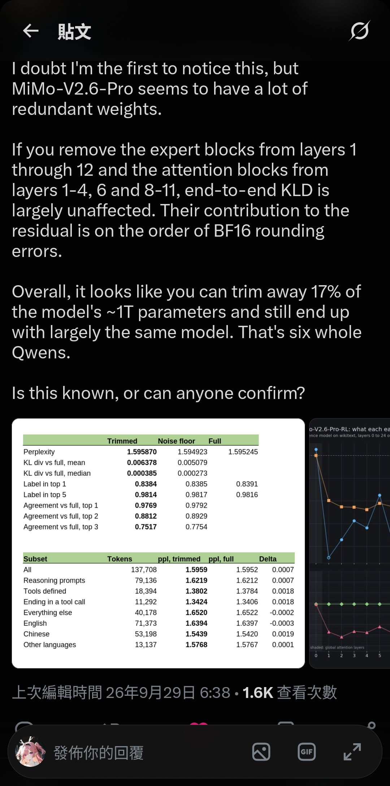

# 层无意义轻剪参数

## 🧑‍💻 User

https://x.com/turboderp_/status/2104702394718150834
这是怎么回事？
什么叫这些层对residual的影响在bf16的一个bit以内（

---
## 😀 默认助手 (7)

## TL;DR

turboderp（ExLlamaV2 / exllamav3 的作者，本地推理圈的知名人物）发现 **MiMo-V2.6-Pro（一个约 1T 参数的 MoE）里有一大批"死层"**：把第 1–12 层的 expert 块、以及第 1–4、6、8–11 层的 attention 块整个删掉，端到端的输出几乎不变。他用的描述是"**这些层对 residual 的贡献在 BF16 的舍入误差量级**"——这句话不是修辞，是一个很硬的技术断言。

---

## 1. 帖子在说什么

> If you remove the expert blocks from layers 1 through 12 and the attention blocks from layers 1-4, 6 and 8-11, end-to-end KLD is largely unaffected. Their contribution to the residual is on the order of BF16 rounding errors.

- 删掉 **第 1–12 层的 MoE 专家块**
- 删掉 **第 1–4、6、8–11 层的注意力块**
- 结果：端到端 KL 散度（相对于完整模型）基本没变
- 总共砍掉 **约 17% 的参数**（~1T 的 17% ≈ 170B，他调侃说"相当于六个完整的 Qwen"）

证据是图里的两张表：

| 指标 | Trimmed | Noise floor | Full |
|---|---|---|---|
| Perplexity | 1.595870 | 1.594923 | 1.595245 |
| KL div vs full, mean | 0.006378 | 0.005079 | — |
| KL div vs full, median | 0.000385 | 0.000273 | — |
| Label in top 1 | 0.8384 | 0.8385 | 0.8391 |
| Agreement vs full, top 1 | 0.9769 | 0.9792 | — |
| Agreement vs full, top 3 | 0.7517 | 0.7754 | — |

关键在 **"Noise floor" 这一列**：它是"数值噪声下限"对照——即模型自身由于浮点不确定性/批处理差异等原因，跟"自己"比较时的固有偏差。**Trimmed 和 Noise floor 几乎完全重合**（0.9769 vs 0.9792 的 top-1 一致率、0.0064 vs 0.0051 的 KL）。也就是说，剪掉 17% 权重带来的差异，**比测量噪声还小**。

下面那张按子集拆的表（All / Reasoning / Tools / Chinese / English…）delta 都在 ±0.002 以内，正负都有（说明是噪声不是系统性退化）。

---

## 2. "对 residual 的影响在一个 bit 以内"是什么意思

### 背景：残差流

标准 Transformer 的每一层都是往 residual stream 里**加一个增量**：

$$
x_{l+1} = x_l + \underbrace{\mathrm{Attn}(x_l)}_{\delta^{a}} + \underbrace{\mathrm{MoE}(x_l)}_{\delta^{m}}
$$

整个网络可以看成一条"主干高速公路"（residual），每层只是往上面写一小段 $\delta$。

### BF16 的精度

BF16 的格式是：**1 符号位 + 8 指数位 + 7 尾数位**，即有效位数 8 bit。

对于量级为 $|x|$ 的数，两个相邻可表示浮点数之间的距离（ULP）是：

$$
\mathrm{ULP}(x) = 2^{\lfloor \log_2 |x| \rfloor - 7}
\quad\Longrightarrow\quad
\frac{\mathrm{ULP}(x)}{|x|} \approx 2^{-8} \approx 0.39\%
$$

而 round-to-nearest 的最大误差是半个 ULP，所以 BF16 的**相对舍入误差约为 $2^{-9}$ 量级**。

### 关键推论：加法会被"吃掉"

计算 $x + \delta$ 时，如果

$$
|\delta| \lesssim \tfrac{1}{2}\mathrm{ULP}(x) \approx 2^{-8}|x|
$$

那么 $x + \delta$ **在 BF16 里四舍五入后就直接还原成 $x$**——这个增量根本没法被表示出来。

所以 turboderp 的意思不是"这些层影响很小"，而是：

> **这些块的输出 $\delta$ 的幅度 ≤ residual 自身在 BF16 里的最小可分辨颗粒度。加不加它，残差张量在数值上是同一个值。**

换句话说，这些层在 BF16 下**就是恒等映射（no-op）**。删掉它们，不只是"效果差不多"，而是后续的张量流基本逐位相同——所以下游 KL 散度才会小到跟噪声下限重合。

> 补充：实际推理/训练中残差累加可能用 FP32 累加器，那么这一步不会字面丢失，但这个 $\delta$ 依然会在下一次归一化 / 后续层的舍入里被彻底淹没。所以工程上的表述是：**它引入的扰动 ≤ 模型自身的数值噪声**。

---

## 3. 为什么会这样？（这不是偶然）

回复区直接给出了最可能的解释。@BrandonMusicKy 引用并指出：这是 **"silent expert death"（静默专家死亡）**。

被引用的原文来自 Hongye Jin (COLM) 的博客 *Save Lower Layer MoE Experts*：

- 在**超高稀疏 MoE**（top-8 / 768 experts）训练中，**浅层专家会变成功能性无用**，而训练/验证 loss 和负载均衡**看起来完全正常**——所以叫"静默"死亡。
- 这些层的专家**权重范数会塌缩**，学习信号本身消失：浅层专家的 momentum（累积梯度）和二阶矩的平方根**下降了约 3 个数量级**，而深层保持稳定。
- 审计公开的 MoE 后，作者发现 **MiMo-v2.5-Pro 和 Qwen3.5-397B-A17B 都有同样的浅层塌缩特征**。
- 他们的修复方案是 **LLAL（LM Loss as Auxiliary Loss）**：前几千步把早期 MoE 层临时接到 LM head 上，然后再断开。

评论区的推测是：**v2.6 主要是在 v2.5 基础上做 RL 后训练，所以这个架构级的问题根本没被修**。

至于 attention 块也能删——这就更让人意外了，可能是同样的"浅层被模型学到接近恒等"的现象，也可能是训练配方导致深度的冗余。

---

## 4. 为什么这事儿值得关注

<turboderp 显然关心的是本地推理成本：>

- **这是纯赚的**：删掉的如果本来就是没人路由到的死专家（dead experts），那么**推理时既不省算力也不损质量**。删掉它反而**省 17% 的显存/权重体积**——对本地部署（显存是硬瓶颈）是巨大的收益。
- 这也说明 **MiMo-V2.6-Pro 的"有效规模"远小于标称的 1T**。宣称的参数量里有一大块是"僵尸参数"。
- 更广义地讲，这暴露了 **MoE 的 benchmark 会掩盖无用容量**：标称参数量、路由负载均衡指标都可能是健康的，但实际能力远低于账面。

---

## 5. 需要注意的地方

这是一个待验证的观察，不是定论（展开）

- **作者自己在问 "Is this known, or can anyone confirm?"** 帖子有编辑历史（3 个版本），说明还在迭代。属于社区观察，非正式论文。
- **KLD / perplexity 不能穷尽所有能力**。长上下文、罕见语言、agentic 长链等不一定能被这类评估覆盖。不过他确实拆了中/英/其他语言和 reasoning / tool-calling 子集。
- **"Noise floor" 的定义很关键**。结论的强度完全取决于这个对照组定义得是否合理（如果它是"同一模型不同 batch"的差异，那对比才成立）。
- **表中的 perplexity ≈ 1.59 异常低**，说明评估集大概率是模型高度熟悉/自生成的数据——这类数据上"小扰动无影响"比在真实分布上更容易成立，所以结论向"乐观"方向偏。
- **删层会改变残差流的微小轨迹**，在分布外输入上是否仍无影响，需要更广的测试。

---

**一句话总结**：他发现的不是"这些层不太重要"，而是**这些层写进残差流的增量小到在 BF16 里根本无法被表示——加不加都一样**。这几乎可以确定是超高稀疏 MoE 的 **"静默专家死亡"** 故障模式（上层 v2.5 就有，且 Qwen3.5 也有），意味着这个 1T 模型里有约 17%（~170B）是僵尸参数，剪掉它是免费的午餐。

---
## 😀 默认助手 (7)

## 先说结论

这条推文说的是：**MiMo-V2.6-Pro 这个约 1T 参数的 MoE 模型里，前面一批层（layer 1–12 的专家模块、layer 1–4/6/8–11 的注意力模块）几乎是"摆设"**——把它们整个删掉，模型的输出分布几乎不变。

而那句"它们对 residual 的贡献在一个 BF16 bit 以内"，意思是：**这些层往残差流里"加"的那点东西，小到还不到 BF16 浮点数本身的最低位精度，等价于"加了等于没加"。**下面详细拆解。

---

## 一、背景：推文到底做了什么

turboderp（ExLlama 作者）做的是**结构化剪枝 / 层消融（layer ablation）**：

- 删掉 **expert blocks**（MoE 里的专家 FFN）—— layer 1~12
- 删掉 **attention blocks**（注意力模块）—— layer 1–4、6、8–11

然后对比完整模型，发现端到端 KL 散度（KLD）、困惑度（perplexity）、top-1/top-5 预测几乎没变化，**只掉了约 17% 的参数（约 170B），相当于"六个 Qwen"**。

<b>为什么一个"1T 参数"的模型删掉 170B 还能不变？（点开看解释）</b>

因为它是 **MoE（专家混合）** 架构。1T 是**总参数量**，但每个 token 只激活一小部分专家（比如 top-8/768）。所以被删掉的 170B 如果本来就是"几乎不被激活、或者激活了也输出≈0"的专家，删掉对推理就没有实际影响。

这也解释了为什么删的是 **expert blocks** 和 **早期 attention**——恰恰是这类"沉默"组件。

---

## 二、什么是 "residual"（残差流）

现代 Transformer 是一个**残差网络**，每一层的实际运算是：

$$
x_{l+1} = x_l + \text{Attn}_l(x_l) + \text{FFN}_l(x_l)
$$

这里 $x_l$ 就是所谓的 **residual stream（残差流）**，它是一个贯穿所有层、不断被"读"和"写"的共享向量，像一条总线。每一层只是往这条总线上**加一个增量**。

**删掉某个 block，就等于把这个增量项置零。** 所以"这个 block 对 residual 的贡献"，指的就是它加进去那一项的幅度：

$$
\Delta = \text{Attn}_l(x_l) \quad \text{或} \quad \Delta = \text{FFN}_l(x_l)
$$

---

## 三、BF16 的精度是多少

BF16（Brain Float 16）的位分配是：

| 符号位 | 指数位 | 尾数位 |
|:---:|:---:|:---:|
| 1 bit | 8 bit | **7 bit** |

关键点：尾数 7 位 + 1 个隐含前导 1 = **有效精度只有 8 位**（$p = 8$）。

所以在数值 $v$ 附近，**相邻两个 BF16 可表示数之间的间距（ULP）**大致是：

$$
\mathrm{ulp}(v) \approx v \cdot 2^{-7}
$$

换算成百分比：

$$
2^{-7} = 0.0078125 \approx 0.78\%, \qquad 2^{-8} = 0.00390625 \approx 0.39\%
$$

也就是说，BF16 最多只能分辨到约 **0.4%~0.8%** 的相对差异，再小的变化在存储/累加时会被直接舍入掉。

---

## 四、核心："贡献在一个 BF16 bit 以内"是什么意思 ⭐

把上面两点合起来看：

> 如果 $\|\Delta\| / \|x_l\|$（这一层的增量相对于残差流本身的幅度）**小于一个 BF16 ULP**，那么把 $x_l$ 和 $x_l + \Delta$ 分别存成 BF16 后，**得到的几乎是同一个数**。

用公式表达就是：

$$
\frac{\|\Delta\|}{\|x_l\|} \lesssim 2^{-7} \sim 2^{-8}
\quad\Longleftrightarrow\quad
\text{round}_{BF16}(x_l + \Delta) = \text{round}_{BF16}(x_l)
$$

- **"一个 bit"** = 二进制浮点数尾数的**最低有效位（1 ULP）**。BF16 尾数就 7~8 位有效，所以"一个 bit"≈ 0.4%~0.8% 的相对量级。
- 换句话说，**这些层往残差流里加的贡献，比 BF16 的量化步长还小**，所以在 BF16 精度下，它们的存在与否在数值上不可区分——这就是"on the order of BF16 rounding errors（在 BF16 舍入误差量级）"的含义。

反过来理解：这些层**理论上**确实算出了一个输出，但这个输出**太微弱了**，一落到 BF16 就被四舍五入抹平了，于是模型"感知不到"它们。

<b>用一个具体数字感受一下（点开）</b>

假设残差流某一维的值 $x_l \approx 1.0$，则：

- 1 ULP $= 2^{-7} \approx 0.0078$
- 如果这一层的贡献 $\Delta = 0.003$，小于半个 ULP，那么 $1.0 + 0.003 = 1.003$ 四舍五入回 BF16 后**还是 $1.0$**（或最多变成 $1.0078$）。

整条残差流向量上，这种"加了没变"的维度占绝大多数 → 整个 block 等效于空操作。

---

## 五、为什么会这样：可能是"静默专家死亡"

推文下面的回复把原因点出来了。用户 @BrandonMusicKy 指出这像是 **"silent expert death"（静默专家死亡）**，并引用了 @serendip410（HongyeJin）的一篇 MoE 研究博客：

<b>静默专家死亡（silent expert death）是怎么回事（点开）</b>

那篇博客（对超稀疏 MoE，top-8/768 的研究 + LLAL 方法）发现：

1. **训练/验证 loss 和负载均衡都正常**，但**低层（early-layer）的专家已经在功能上死掉了**；
2. 这些"死专家"的**权重范数（weight norm）远小于健康层的专家**——它们的输出本来就接近 0；
3. 原因是**学习信号本身消失了**：浅层专家的梯度动量、以及二阶矩的平方根，比深层衰减了约 **3 个数量级**；
4. 他们审计了公开 MoE，发现 **MiMo-v2.5-Pro** 和 Qwen3.5-397B-A17B **都有早期层坍塌的特征**。

博客提出的补救手段是 **LLAL（LM Loss as Auxiliary Loss）**：训练早期把某个浅层 MoE 临时接到 LM head 上，几千步后再移除，能把浅层专家"救活"。

**所以 turboderp 观察到的现象，很可能就是 MiMo-V2.6-Pro 继承了 v2.5 的"低层专家已死"问题**：这些专家权重还在（占了参数量、占了显存），但输出≈0，删掉自然无影响。这也解释了为什么他能在 HF 上"看出权重冗余"——因为**参数量 ≠ 有效容量**。

---

## 六、那张表格怎么读

| 指标 | 含义 |
|---|---|
| **Trimmed** | 剪枝后的模型 |
| **Noise floor** | 完整模型自己的"数值噪声底"——同一模型因 BF16 非确定性/不同 kernel 产生的 KLD，代表"最小可分辨差异" |
| **Full** | 完整模型（基准） |

关键解读：

- **Perplexity**：Trimmed `1.595870` vs Full `1.595245` vs Noise floor `1.594923` —— 三者几乎完全一样。
- **KL div vs full**：Trimmed 的中位数 `0.000385`，Noise floor 是 `0.000273` —— 剪枝带来的差异**和纯数值噪声同一量级**。
- **Agreement top-1**：`0.9769`（约 97.7% 的 token 预测和完整模型完全一致），top-5 高达 `0.9814`。
- 下方按子集（推理/工具调用/中英文等）拆分，Delta 全都在 **±0.002** 以内。

这一切都指向：**剪枝后的模型和原模型在 BF16 下"行为几乎等价"**。

---

## 七、几个需要注意的 caveat ⚠️

1. **这是经验性结论，不是数学等价**。"几乎不变"是在特定评测集上、用 KLD/perplexity/top-k 一致率衡量的，不代表所有下游任务 / 长序列生成都无差异。
2. **KLD 小 ≠ 一定安全**。某些对早期特征敏感的任务、或需要精确复现的场景，微小差异可能被放大。
3. **"17% 参数"是显存/容量的巨大节省**，但如果这些专家本就没被激活，剪掉主要省的是**显存和加载时间**，对**单 token 计算量（FLOPs）**的影响要看具体路由。
4. **这更像是一个 bug 级发现**，而不是"设计如此"。社区倾向认为是训练问题（silent expert death），厂商本可以用类似 LLAL 的方法避免。
5. **"六个 Qwen"**是修辞：170B 参数大致相当于 6 个 ~30B 的 Qwen 模型加起来，突出"被浪费的容量有多大"。

---

### 一句话总结

> 这些层确实算了输出，但**输出小到低于 BF16 的最低有效位**，一舍入就没了——所以删掉它们，模型在 BF16 下"看起来一模一样"。这背后很可能是 MoE 训练中一个已知的隐性故障：**低层专家静默死亡**。
