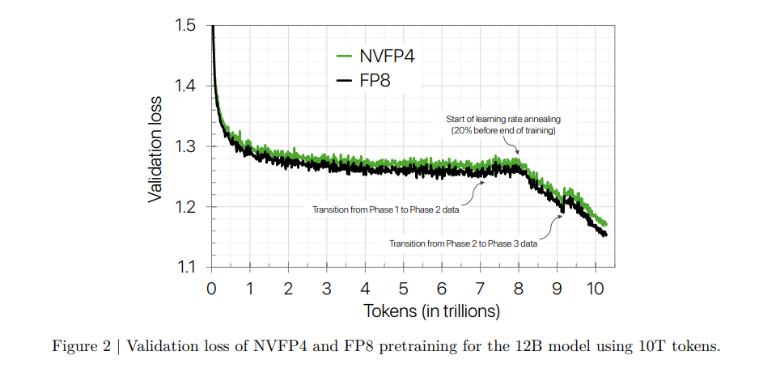

# 预训练loss变化原因

### 🧑‍💻 User

为什么预训练阶段loss会经历这样的过程

---

### 🤖 Assistant

这张图展示的是大语言模型（LLM）预训练过程中非常典型的一种**验证损失（Validation Loss）曲线**。它主要反映了现代大模型训练中广泛采用的**学习率调度策略（Learning Rate Schedule）**和**数据课程学习（Curriculum Learning）**。

这个曲线的形状并不是模型学习能力突然变强了，而是**人为设定的训练策略**导致的。我们可以将这个过程分为三个主要阶段来理解：

### 1. 初始阶段：极速下降（0 ~ 1T Tokens）
*   **现象：** 损失从极高的值瞬间垂直跌落，随后下降速度逐渐放缓。
*   **原因：** 模型在 $0$ 时刻的权重是完全随机初始化的，此时它输出的概率分布纯粹是噪音。在最初接触到数据的几千到几万步里，模型会迅速学到语言中最简单、最基础的规律（例如：高频词汇、空格的用法、基本的语法结构）。因为“进步空间”巨大，且这些基础规律很容易学，所以 Loss 下降极其迅速。

### 2. 稳定阶段：漫长的平台期（~1T ~ 8T Tokens）
*   **现象：** 损失曲线变得非常平缓，只是在极缓慢地下降，并且伴随着一定的上下震荡。
*   **原因：** 
    *   **学习深层知识：** 此时模型已经掌握了基础语法，开始学习更难的常识、逻辑推理、复杂的上下文关联。这些知识密度高，学习难度大，因此 Loss 很难快速下降。
    *   **高且稳定的学习率（最关键原因）：** 在这个阶段，为了让模型在广阔的参数空间中充分探索，防止陷入局部最优解，算法工程师会维持一个**较高且相对恒定的学习率**。较高的学习率就像一个人迈着大步子在山谷里寻找最低点，虽然能跨过小坑，但也导致他无法在一个小坑底停稳，因此 Loss 会一直维持在一个较高的水平并伴有震荡。

### 3. 退火阶段：断崖式下跌（8T ~ 10T Tokens）
*   **现象：** 在 8T 处（图中明确标注了 `Start of learning rate annealing`），Loss 突然改变趋势，开始陡峭下降。
*   **原因：学习率退火（Learning Rate Annealing/Decay）**。在训练接近尾声时（图中设定为最后 20% 的阶段），调度器会将学习率迅速降低（通常降至最高学习率的 $10\%$ 甚至 $1\%$ 以下）。
    *   随着步伐（学习率）变小，模型终于可以“沉淀”下来，精确地滑向它之前找到的那个最优解的谷底。
    *   由于参数更新变得极其精细，模型在验证集上的表现会迅速提升，表现出来的就是 Loss 的断崖式下跌。这种训练策略在目前被称为 **WSD (Warmup-Stable-Decay)** 调度，被广泛应用于当前顶尖大模型（如 Llama 3 等）的训练中。

---

<b>深入解析：图中的数据阶段切换（Phase 1 -> 2 -> 3 Data）</b>

 
图中标注了两次数据转换，这是**课程学习（Curriculum Learning）**的体现。大模型通常不是一上来就把所有数据混合在一起学，而是“先易后难，先杂后精”：

1.  **Phase 1 Data（基础阶段）：** 通常是海量的、经过初步清洗的网页数据（Web Crawl）。主要目的是让模型见识足够多的词汇和基础表达，建立通用语言能力。
2.  **Phase 2 Data（提升阶段）：** 图中在 7T 左右切换。这类数据往往质量更高，可能增加了维基百科、书籍、学术论文的比例，减少了低质量网页。模型开始学习更严谨的知识。
3.  **Phase 3 Data（冲刺阶段）：** 图中在 9T 处切换。在学习率极低的最后阶段，通常会喂给模型**最高质量、高密度**的数据（例如：纯数学、代码、逻辑推理题、教科书级别的数据）。配合极低的学习率，模型会在这类高质量数据上进行“微调”式的预训练，极大地榨干模型的潜力，这也是为什么在 9T 之后 Loss 依然保持着陡峭的下降趋势。

<b>补充背景：这篇论文（图中绿线与黑线）在说明什么？</b>

 
图中的主角其实是 `NVFP4`（NVIDIA 的 4-bit 浮点数格式）和 `FP8`（8-bit 浮点数格式）的对比。
虽然曲线的*形状*是由学习率和数据决定的，但这幅图的核心结论是：**绿线（4-bit极低精度）几乎完美贴合了黑线（8-bit较高精度）**。这证明了在预训练整个极其复杂的 10万亿 Token 过程中，使用更节省显存和算力的 FP4 精度，并不会导致模型性能（Loss）的崩塌，它取得了和 FP8 几乎一样的学习效果。

