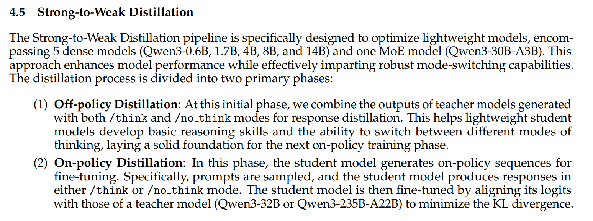

# Strong-to-Weak 蒸馏优势与局限

### 🧑‍💻 User

[link](https://arxiv.org/pdf/2505.09388) qwen3这种针对小尺寸模型的蒸馏训练"strong-to-weak distillation"方式有什么优势和局限性？

---

### 🤖 Assistant

Qwen3 提出的 **Strong-to-Weak Distillation**（强到弱蒸馏）本质上是一个**面向小模型能力结构化迁移**的训练范式，而不是单纯的“把大模型答案喂给小模型”。它在工程与学习论层面都有明确取舍。下面从优势与局限两方面系统分析。

---

## 一、主要优势

### 1. 明确区分 *能力获得* 与 *策略对齐*

该方法将蒸馏拆成 **off-policy → on-policy** 两阶段，本质上是：

* **Off-policy**：学习“怎么想”
* **On-policy**：学习“什么时候、如何用这种想法”

这避免了传统 logits / response distillation 中常见的问题：

> 小模型被迫在 *错误的 token 轨迹分布* 上拟合教师。

尤其对 **0.6B–4B 量级模型**而言，这是非常关键的稳定性改进。

---

### 2. 显式引入 *mode-switching* 作为可学习能力

Qwen3 的一个核心创新并不是蒸馏本身，而是**把 /think 与 /no_think 作为“显式可切换策略”**：

* Off-policy 阶段：让学生看到 **两种思考风格的分布**
* On-policy 阶段：让学生在**自身生成的 token 分布**上，对齐教师 logits

这带来的好处是：

* 小模型不会被迫“全程 CoT”
* 形成一种 **条件计算（conditional computation）的弱形式**
* 对 token efficiency 非常友好（你之前也特别关注这一点）

从工程角度看，这是比“隐式学会少想点”要**稳定得多**的做法。

---

### 3. 规避“小模型学不会长 CoT”的结构性问题

小模型的核心瓶颈不是知识，而是：

* 状态空间容量不足
* 长序列依赖难以稳定建模

Strong-to-Weak 的做法是：

* **先给短、干净、可压缩的 reasoning pattern**
* 再通过 KL 对齐，让模型学“在自己 capacity 范围内最像老师的分布”

相比直接蒸馏完整 CoT，这更符合 **information bottleneck** 视角。

---

### 4. 工程可控性强，适合工业化落地

相比黑盒蒸馏或纯 RLHF：

* 不依赖 reward hacking
* 不要求人类标注 reasoning
* 教师固定，训练目标明确（KL）

这对 **轻量模型大规模生产**非常友好，尤其是 Qwen3 覆盖 0.6B → 14B + MoE 的统一 pipeline。

---

## 二、核心局限性

### 1. 本质仍是 *teacher policy imitation*，不是能力突破

Strong-to-Weak 蒸馏解决的是：

> **如何把“已有能力”压缩进小模型**

而不是：

> **如何让小模型学会教师都不稳定的能力**

因此它的上限明确受限于：

* 教师在 think / no_think 模式下的策略质量
* 教师是否真的在“思考”，还是在“语言化推理”

一旦 teacher 的 reasoning 是 *post-hoc rationalization*，学生只是在模仿表象。

---

### 2. Mode-switching 是显式 token 约定，而非内生机制

/think 与 /no_think 的切换：

* 是 **协议化的 prompt control**
* 而不是模型内部形成的自适应计算路径

这意味着：

* 推理深度仍然是 **人类或上游系统决定**
* 模型本身并不会真正“判断是否需要深度推理”

从 AGI / 自主 agent 角度看，这是一个**明显的人工先验注入点**。

---

### 3. On-policy KL 对齐在小模型上存在梯度噪声问题

对于 <2B 的模型：

* 自身生成分布偏差很大
* KL 对齐 teacher logits 容易出现：

  * 梯度高噪声
  * 模式坍缩到 teacher 的“高置信 token”

这在 reasoning-heavy task 上尤其明显，往往需要：

* temperature tuning
* token-level masking
* 或只对部分 token 蒸馏

否则会出现“看起来像老师，但关键步骤错位”。

---

### 4. 无法解决“隐式世界模型缺失”问题

你之前提到过一个非常关键的观点：

> **反事实推断和世界模型不是靠语言蒸馏就能学到的**

Strong-to-Weak 仍然是：

* token → token 的条件建模
* 缺乏环境交互、因果干预、反事实监督

因此在需要 **真实状态建模** 的任务（复杂规划、工具使用、长 horizon agent）中，提升有限。

---

## 三、与其他蒸馏范式的对比定位

| 方法                  | 解决什么            | 解决不了什么 |
| ------------------- | --------------- | ------ |
| 黑盒蒸馏（合成数据）          | 知识覆盖            | 推理稳定性  |
| Logits distillation | 局部策略对齐          | 分布偏移   |
| RLHF                | 行为对齐            | 能力迁移   |
| **Strong-to-Weak**  | 小模型可控 reasoning | 能力上限突破 |

一句话总结其定位：

> **这是目前“把大模型 reasoning 以最低 token / 最低工程风险压缩进小模型”的最优工程解之一，但不是通往更高智能层级的路径。**

---

## 四、一个关键判断

如果你的目标是：

* **低参数量**
* **高性价比推理**
* **明确的企业/产品场景**

Strong-to-Weak 非常合理。

如果你的目标是：

* 自主 agent
* 反事实推断
* 世界模型内生化

它只能算 **压缩器（compressor）**，而不是 **生成器（generator）**。

如果你愿意，下一步我们可以从你关心的 **token efficiency / KV cache / BS=1 推理** 的角度，分析这种蒸馏方式在真实推理成本上的收益是否“值得”。
