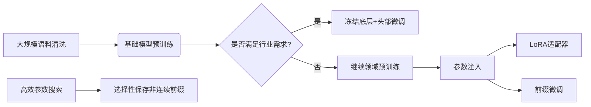

# 模型学习领域知识预训练与微调选择

### 🧑‍💻 User

想让模型学习某领域或行业知识，是应该预训练还是应该微调？

---

### 🤖 Assistant

在让模型学习特定领域或行业知识时，是否选择预训练（pre-training）或微调（fine-tuning）需要根据具体场景和目标来判断。以下是一个系统的分析框架，帮助你理解何时选择预训练、何时选择微调，以及它们的协同关系：

---

### **一、核心区别**
| **维度**          | **预训练（Pre-training）**                          | **微调（Fine-tuning）**                          |
|-------------------|---------------------------------------------------|------------------------------------------------|
| **目标**           | 学习通用的语言表示和先验知识（如语法、语义、常识）           | 在预训练基础上，针对特定任务或领域调整模型参数         |
| **数据**           | 大规模通用语料（如维基百科、网页文本）                  | 特定任务的小规模标注数据（如分类、问答、对话等）      |
| **模型容量**       | 通常需要从头开始训练，计算量极大（如LLaMA的训练过程）        | 在已有模型参数基础上调整，计算量相对较小             |
| **适用阶段**       | 模型开发初期（如训练基座模型）                          | 模型应用阶段（如适配到具体业务场景）                |
| **知识注入方式**    | 模型通过大规模语料隐式学习先验知识                            | 模型通过特定数据学习任务相关模式，但依赖预训练阶段的通用知识保留 |

---

### **二、决策矩阵**
#### **1. 选择预训练（或持续预训练）的场景**
- **目标**：让模型系统性掌握某个新领域或行业的深度知识
  - **示例**：训练医疗、法律、金融等专业领域模型
- **数据规模**：需要大量未标注的领域语料（如论文、专利、行业报告）
- **硬件资源**：拥有高性能计算（HPC）集群或分布式训练能力
- **灵活性需求**：需模型具备领域内延伸生成能力，而非简单模式匹配
- **知识覆盖范围**：领域知识无法通过简单微调注入（如需要重新定义物理规律）
- **典型方法**：
  - 在通用语料基础上继续训练（继续预训练）
  - 混合原始数据与领域数据进行增量训练

#### **2. 选择微调的场景**
- **目标**：快速适配具体任务（如分类、抽取、对话），利用已有知识
  - **示例**：客服工单分类、法律条款解析、金融事件抽取
- **数据规模**：标注数据量有限（通常几百到几千条样本）
- **硬件约束**：仅需单机多卡或分布式微调集群
- **迭代速度**：需要快速验证业务可行性
- 典型方法**：LoRA、Adapter Tuning、Prompt Tuning等参数高效微调技术

---

### **三、进阶考量**
#### **1. 数据与知识的边界**
- **预训练的局限性**：无法覆盖动态或非常识性知识（如内部政策、私有数据库）
- **微调的局限性**：可能覆盖预训练模型中未包含的关键事实（如实时事件）

#### **2. 效率与效果的权衡**
- **参数高效场景**：当标注数据量<1万条时，LoRA调优（如100B参数冻结）往往优于继续预训练
- **知识持久性**：持续预训练可能引发"灾难性遗忘"，需通过课程学习（Curriculum Learning）缓解

#### **3. 工程实践建议**
- **冷启动场景**：建议在通用大模型（如Llama3, Qwen）基础上先做领域微调（LoRA），再结合RAG构建系统
- **垂直领域构建**：如选择继续预训练，需监控验证集perplexity曲线，防止过拟合

---

### **四、混合方案示例**

---

### **五、关键结论**
1. **从0到1构建**：当目标领域知识在通用数据中占比不足10%时，建议从头训练（如BioGPT的医学预训练）
2. **渐进式优化**：对已有模型优先使用参数高效微调技术（如LoRA），节省时间和算力
3. **知识互补**：可将预训练（获取通用性）与任务微调（获取确定性）结合，通过MoE架构融合
4. **长期维护**：持续预训练需定期更新领域数据，而微调可更专注于当前任务的分布偏移问题

最终决策应基于 **知识复杂度-数据规模-计算资源** 的三角关系动态平衡，没有放之四海而皆准的"最佳方案"。建议从微调开始快速验证，当确有需要时再转向深度预训练方案。