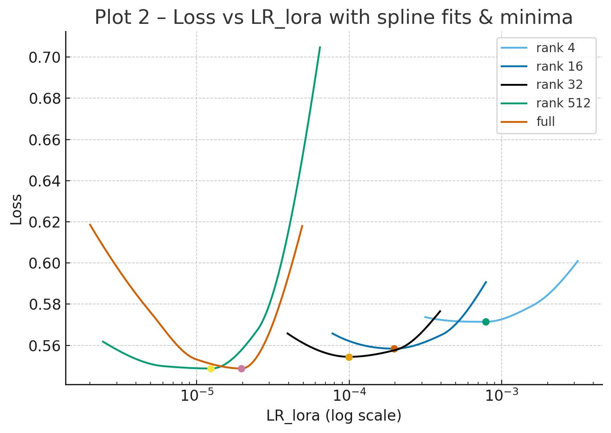
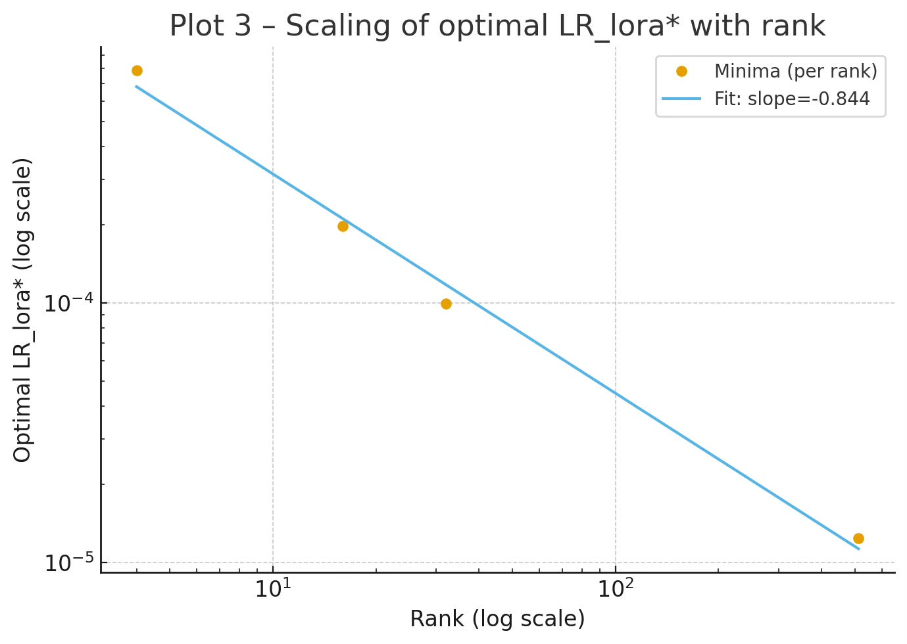

# 高LoRA对学习率敏感因方差放大

### 🧑‍💻 User




```
In LoRA fine-tuning, that learning rate is scaled for the adapters by alpha / r . As such, the learning rate seen by the adapters is actually the learning rate LR (the x axis), multiplied by 32 / r. An interesting alternative way to view Figure 2 is therefore to put - on the x axis - the actual learning rate seen by the LoRA adapters, which I’ll call LR_lora, and is just the product of the learning rate times the scaling factor 32 / r. I have digitised the original plot and then scaled the x-axis and then fitted splines to the points.

There appears to be a clear relationship between the optimal learning rate (seen by LoRA) and the rank, and that relationship is r^-0.84. that this is between two values used in practice:
1. Traditional LoRA, using alpha / r, i.e. r^-1
2. Rescaled LoRA, using alpha / r^0.5, i.e. r^-0.5
```
为什么高lora对学习率参数非常敏感？

---

### 🤖 Assistant

从您提供的图表（特别是 **Plot 2**）和 LoRA 的底层数学原理来看，高秩（High Rank, 例如 rank=512）LoRA 对学习率极度敏感的原因可以从**损失函数的曲率（Loss Landscape）**和**参数更新的非线性耦合**两个主要维度来解释。

在 Plot 2 中，我们可以直观地看到：低秩（如 rank 4, 16）的损失曲线呈现宽阔的“U”型，而高秩（rank 512，绿色曲线）的损失曲线呈现极其陡峭的“V”型。这意味着对于高秩 LoRA，学习率稍微偏离最优值，损失就会急剧上升（甚至导致发散）。

以下是导致这种高敏感性的核心原因：

### 1. 损失空间的高曲率（Loss Landscape Curvature）
随着秩 $r$ 的增加，LoRA 引入的可训练参数量（$A$ 和 $B$ 矩阵）线性增加。
* **高维度的陡峭性**：在深度学习优化中，参数空间维度的增加通常会导致损失平原变得更加复杂，某些方向上的曲率（Hessian 矩阵的特征值）会变得非常大。
* **极窄的收敛盆地**：从 Plot 2 可以看出，rank=512 时的最优学习率被限制在一个非常窄的区间内。如果在高曲率空间中使用过大的学习率，优化器会轻易“跨过”最优解（Overshooting），导致损失值剧烈震荡甚至梯度爆炸。

### 2. $A$ 和 $B$ 矩阵更新的乘法耦合效应
LoRA 的核心公式是 $\Delta W = \frac{\alpha}{r} B A$。在反向传播和参数更新时，矩阵 $A$ 和 $B$ 是同时更新的。

假设学习率为 $\eta$，更新后的增量矩阵可以近似表示为：
$$ \Delta W_{new} \propto (B - \eta \nabla B)(A - \eta \nabla A) $$
展开后得到：
$$ \Delta W_{new} \propto B A - \eta (B \nabla A + \nabla B A) + \eta^2 (\nabla B \nabla A) $$

* 当 $r$ 很小时，参数少，梯度 $\nabla A$ 和 $\nabla B$ 的范数相对较小，$\eta^2$ 带来的非线性交叉项影响不大。
* **当 $r$ 很大时**（高秩），内部累加的维度变长，梯度范数可能变大。此时，**$\eta^2 (\nabla B \nabla A)$ 这一项会急剧放大**。如果学习率 $\eta$ 没有被极其精确地控制，这个二阶交叉项会导致权重更新量彻底失控，这就是为什么高秩模型对 $\eta$ (即学习率) 的容错率极低。

<details>
<summary><b>展开查看：关于 Scaling Factor (缩放因子) 与 $r^{-0.84}$ 的影响</b></summary>

您提供的文本中提到了一个非常关键的实证发现：最优学习率与秩的关系是 $r^{-0.84}$。

1. **传统的 LoRA 缩放 ($\frac{\alpha}{r}$)**：相当于对学习率施加了 $r^{-1}$ 的惩罚。对于高秩来说，这种惩罚可能**过于严厉**，导致有效学习率过低，模型训练缓慢。
2. **重缩放 LoRA ($\frac{\alpha}{\sqrt{r}}$)**：相当于施加了 $r^{-0.5}$ 的惩罚。对于高秩来说，这种惩罚又可能**不够**，导致实际作用于矩阵乘积上的有效学习率过高，引发崩溃。

因为真实的物理规律（$r^{-0.84}$）介于两者之间，这意味着在实际操作高秩 LoRA 时，无论你使用哪种默认的缩放策略，默认计算出的有效学习率（LR_lora）都很容易偏离那个极其陡峭的“V”型谷底。因此，**缩放因子无法完美抵消高秩带来的不稳定性**，必须依赖人工极其精细地调整基础学习率。

</details>

### 总结
高秩 LoRA 对学习率极其敏感，是因为**庞大的参数量导致了极度陡峭的损失函数空间（Plot 2 中的 V 型曲线）**，并且 **$B$ 和 $A$ 矩阵相乘的机制在参数更新时会产生放大效应**。因此，在训练高秩 LoRA 时，必须使用比低秩小得多且极其精准的学习率，通常需要配合严密的学习率预热（Warmup）和细致的网格搜索。

---

### 🧑‍💻 User

分别解释以下3点
```
When you look at the learning rate seen by the adapters:
1. The optimal learning rate (again, as seen by the adapters) for a large rank (512) is not all that far from full fine-tuning. You might call the rank at which the optimal learning rate is the same as for full fine-tuning the “crossover rank”, about 256 in the graph above, which we’ll use later when setting alpha and r.
2. As you move to lower ranks, you find that a higher learning rate is optimal. My intuition around this is that you can move faster when you are in lower dimensions [maybe that’s bad intuition?!?].
3. At the same time, if you extrapolate out to a rank size close to the model’s hidden dimension (say 4096), you find yourself at a learning rate that is significantly lower than full fine-tuning. As such, at rank values like 1-512, you can train faster, but at higher ranks (which you likely would never choose), you would have to train slower. Possibly part of this is because you have two LoRA matrices, A and B.
```

---

### 🤖 Assistant

这里对作者提出的三个观察点进行详细的逐一解释。这些观点将 LoRA 的行为与**全量微调 (Full Fine-tuning, FFT)** 进行了对比，并深入探讨了模型优化的底层逻辑。

### 1. 交叉秩 (Crossover Rank)：当 LoRA 逼近全量微调
> **原文核心：** 在 Rank 较大（如 512）时，LoRA 的最佳学习率与全量微调的最佳学习率相差无几。两者学习率完全相等的那个 Rank 点被称为“交叉秩”（图表中大约为 256）。

**解释：**
* **概念定义：** 我们知道 LoRA 的最佳学习率随着 Rank ($r$) 的增加而下降。与此同时，针对同一个模型进行全量微调（更新原始的完整权重矩阵 $W$）也有一个固定的最佳学习率。当 LoRA 的学习率下降曲线与全量微调的学习率水平线相交时，对应的秩就是**交叉秩 (Crossover Rank)**。
* **物理意义：** 当 $r \approx 256$ 时，从优化器（如 AdamW）的视角来看，更新 LoRA 适配器的步长动态，与直接更新整个庞大模型权重的步长动态达到了某种“等效平衡”。
* **实践价值：** 这个点提供了一个极佳的超参数锚点。在设置缩放因子 $\alpha$ 和 $r$ 时，我们可以参考这个“交叉秩”。它意味着在这个维度规模下，LoRA 的优化难度和动态特性最接近传统的全量微调。

---

### 2. 低维度与大步长：为什么小 Rank 可以用大特定的学习率？
> **原文核心：** 随着 Rank 降低，最佳学习率会变高。作者的直觉是：“在低维空间中，你可以移动得更快”。

**解释：**
作者的直觉是非常准确的，这在优化理论 (Optimization Theory) 中有很好的解释：
* **参数空间的自由度：** 当 $r$ 很小（例如 $r=4$ 或 $8$）时，你要优化的参数量极少，这是一个受到严格限制的**低维子空间**。
* **优化地形 (Optimization Landscape) 更平滑：** 在高维空间（全量微调）中，存在大量的鞍点 (Saddle Points)、尖锐的峡谷和复杂的曲率。如果学习率过大，极其容易“一步跨错”掉入局部极劣解或导致梯度爆炸。
* **低维的容错率：** 相反，在低维空间中，更新方向的自由度被极大压缩，梯度噪声较小。这就好比你在一条笔直的窄巷子里开车，不需要考虑太复杂的变道，因此你可以安全地把油门踩到底（**使用更大的学习率**）来加速收敛，而不用担心模型崩溃。

---

### 3. 极高 Rank 下的“双矩阵惩罚”：为什么比全量微调还慢？
> **原文核心：** 如果把 Rank 外推到接近模型的隐藏层维度（如 4096），LoRA 的最佳学习率会比全量微调**低得多**。这意味着极高 Rank 下训练速度反而更慢，作者猜测这与 LoRA 使用了 $A$ 和 $B$ 两个矩阵有关。

**解释：**
作者的猜测完全击中了要害。这涉及**线性更新与非线性（乘法）更新**的区别。

* **全量微调是线性更新：**
  当你全量微调一个维度为 $4096 \times 4096$ 的矩阵 $W$ 时，更新公式是简单的加减法：
  $$W_{new} = W_{old} - \eta \cdot \nabla W$$
  学习率 $\eta$ 直接控制步长，没有放大效应。

* **LoRA 是乘法更新：**
  当 $r = 4096$ 时，LoRA 引入了两个巨大的矩阵 $A$ 和 $B$。虽然其理论表达能力等同于全量微调，但它的更新形式是：
  $$\Delta W = B \times A$$
  当优化器同时更新 $A$ 和 $B$ 时（假设变化量为 $\Delta A$ 和 $\Delta B$），实际对权重的改变包含了**二次项**（即 $\Delta B \cdot \Delta A$）。
* **方差爆炸 (Variance Explosion)：**
  在维度高达 4096 的矩阵乘法中，成千上万个元素的乘积相加。如果学习率不够小，$\Delta B \times \Delta A$ 产生的微小扰动会在 4096 次累加中被**指数级放大**，导致严重的数值不稳定。
* **结论：** 为了抑制这种两个矩阵相乘带来的爆炸效应，在极高 Rank 时，你必须使用比全量微调**更小、更保守的学习率**，这就导致了训练速度变慢。

<details>
<summary>💡 核心总结 (点击展开)</summary>

这三点构成了一个完整的优化图景：
1. **$r < 256$ (常规 LoRA 区间)**：因为在低维空间，你可以安全地使用**比全量微调更高**的学习率，享受快速训练的红利。
2. **$r \approx 256$ (交叉秩)**：LoRA 的优化动态与全量微调达到等效。
3. **$r > 512 \to 4096$ (极端高秩)**：由于 $B \times A$ 双矩阵乘法带来的方差放大效应，你不得不使用**比全量微调更低**的学习率来维持稳定，从而丧失了训练速度的优势。这也解释了为什么在实践中，极高 Rank 的 LoRA 是没有意义的。
</details>