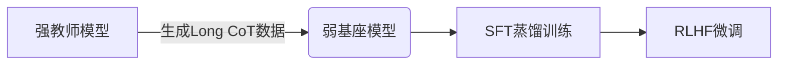

# LLM长链推理训练方法与优化

### 🧑‍💻 User

llm训练的rl阶段，如何训练出long cot，提升sota，给出具体参考文献和训练步骤。

---

### 🤖 Assistant

要在LLM训练的强化学习（RL）阶段训练出具有**长链推理（Long CoT）**能力并提升SOTA（State-of-the-Art）的模型，需要精心设计训练策略、数据构造和奖励模型。以下是具体的训练步骤和关键参考文献：

---

### **核心思路**
1. **监督微调（SFT）阶段打好Long CoT基础**
2. **设计针对Long CoT的奖励模型（RM）**
3. **在RL阶段（如PPO）显式鼓励长链推理行为**
4. **使用课程学习逐步增加推理长度**

---

### **训练步骤**

#### **1. 构建Long CoT训练数据**
- **数据来源**：
  - 人工标注长链推理数据（如数学证明、复杂逻辑推理）。
  - 用强模型（如GPT-4、Claude 3）生成多步推理数据，再人工筛选。
  - 合成数据集（如[DeepSeek-Math](https://github.com/deepseek-ai/DeepSeek-Math)、[MetaMath](https://github.com/meta-math/MetaMath)）。
- **关键要求**：
  - 覆盖复杂问题（数学、科学、逻辑谜题）。
  - 强制模型分解问题，生成≥10步的推理链。

#### **2. SFT阶段：训练基础Long CoT能力**
- **训练目标**：
  - 输入问题，输出完整多步推理链。
- **技巧**：
  - 使用**渐进式训练**：从短链开始，逐步增加推理长度。
  - 添加特殊标记如`<step_k>`显式分隔推理步骤。
- **参考数据**：
  ```python
  {"prompt": "证明√2是无理数。", "response": "<step_1> 假设√2是有理数... <step_5> 矛盾，假设错误。"}
  ```

#### **3. 设计Long CoT奖励模型（RM）**
- **核心挑战**：标准RM偏向最终答案，忽略推理质量。
- **解决方案**：
  - **分步奖励（Step-wise Reward）**：
    - 为每个推理步生成独立奖励（需人工标注或强模型评估）。
  - **过程监督奖励**：
    - 训练RM评估推理链的**逻辑连贯性**（如使用[PRM](https://arxiv.org/abs/2305.20050)技术）。
  - **长度自适应奖励**：
    - 对长推理链给予额外奖励（如长度因子 `reward += β * log(steps)`）。

#### **4. RL阶段（PPO）优化Long CoT**
- **PPO流程调整**：
  - **输入**：问题 + *"请分步推理："* 指令。
  - **输出**：多步推理链（强制≥N步）。
- **关键技巧**：
  - **KL散度约束**：严格控制KL惩罚，防止过度偏离SFT模型。
  - **课程学习**：
    - Phase 1：优化5-10步推理。
    - Phase 2：扩展到15-20步推理。
  - **奖励函数设计**：
    ```python
    reward = RM(completion) + λ * coherence_score(steps) + γ * length_bonus
    ```
  - **早期终止惩罚**：对未生成完整推理链的输出降权。

#### **5. 迭代训练与验证**
- **验证集**：使用需长链推理的测试集（如MATH、TheoremQA）。
- **迭代过程**：
  1. PPO训练 → 生成新推理样本。
  2. 人工/强模型评估样本质量。
  3. 扩充SFT数据，更新RM。
  4. 重复训练直至收敛。

---

### **关键参考文献**
1. **过程监督（PRM）**  
   [Process Supervision Improves Mathematical Reasoning](https://arxiv.org/abs/2305.20050)  
   *OpenAI, 2023*  
   **贡献**：提出分步奖励训练RM，显著提升数学推理。

2. **RLHF优化CoT**  
   [Large Language Models as Optimizers](https://arxiv.org/abs/2309.03409)  
   *Google DeepMind, 2023*  
   **贡献**：用RL自动优化提示词，包括CoT结构。

3. **长链推理数据生成**  
   [DeepSeek-Math: 7B模型在MATH榜单达到SOTA](https://github.com/deepseek-ai/DeepSeek-Math)  
   **技巧**：合成20K高质量数学推理数据。

4. **课程学习+RL**  
   [STaR: Self-Taught Reasoner](https://arxiv.org/abs/2203.14465)  
   *Stanford, 2022*  
   **贡献**：迭代生成推理数据并训练，逐步提升难度。

5. **推理长度奖励**  
   [LongCoT: 显式建模长链依赖](https://arxiv.org/abs/2402.13702)  
   *Microsoft, 2024*  
   **技巧**：在RM中加入位置编码权重，奖励长链逻辑一致性。

---

### **工程注意事项**
1. **内存优化**：
   - 使用FlashAttention-2加速长序列训练。
   - 梯度检查点（Gradient Checkpointing）支持超长推理链。
2. **分布式训练**：
   - 用RLHF框架（如[TRLX](https://github.com/CarperAI/trlx)）并行化PPO。
3. **评估指标**：
   - 除最终答案准确率外，增加**推理链连贯性评分**（如[FactScore](https://arxiv.org/abs/2402.11499)）。

---

### **效果示例**
> **输入**：  
> *"若a+b=5, a²+b²=13, 求a³+b³的值。"*  
>   
> **未优化LLM输出**：  
> *"由已知得a³+b³=35。"*  
>   
> **Long CoT优化后输出**：  
> ```
> <step_1> 设s=a+b=5, p=ab。  
> <step_2> 由a²+b²=(a+b)²-2ab=25-2p=13 → p=6。  
> <step_3> a³+b³=(a+b)(a²-ab+b²)=5*(13-6)=35。  
> ∴ 结果为35。
> ```

---

通过结合**渐进式SFT**、**过程监督RM**和**课程RL**，可显著提升LLM的长链推理能力。当前SOTA方案（如DeepSeek-Math）已证明该方法在数学、科学任务上可超越GPT-4。

---

### 🧑‍💻 User

long cot训练对基座模型的性能要求高吗？

---

### 🤖 Assistant

Long CoT（长链思维）训练对基座模型的**性能要求较高**，但并非完全不可逾越。其核心依赖模型的**基础推理能力**和**上下文理解容量**，具体分析如下：

---

### **一、基座模型的关键性能要求**
#### 1. **基础推理能力（必要）**
   - **最低门槛**：模型需具备**多步推理雏形**（如能在Few-shot下完成3~5步推理）。
     - ✅ **达标模型**：  
       `Mistral-7B`、`Llama 2-13B`、`Qwen-14B`、`DeepSeek-V2`  
       （在GSM8K/MATH等基准上**5-shot准确率＞40%**）
     - ❌ **不达标模型**：  
       纯预训练模型（无SFT）、参数量＜7B且未对齐的模型。
   - **典型测试**：  
     ```python
     "已知A+B=10, A-B=2，求A和B的值。"
     # 需至少2步推理（相加→2A=12→A=6；相减→2B=8→B=4）
     ```

#### 2. **上下文长度（关键制约）**
   - **训练要求**：  
     Long CoT样本常含**500~2000 tokens**（如数学证明），需支持长上下文。
   - **最低配置**：  
     - 推理时：**≥4K上下文**（如Llama 2-7B仅支持4K）。
     - 训练时：**需支持序列长度≥2K**（否则无法学习长依赖）。
   - **优化方案**：  
     - 位置编码改进（RoPE, ALiBi）  
     - 窗口缩放（如YaRN, NTK-aware Scaling）

#### 3. **知识密度与泛化性**
   - **知识密集型任务**（如数学/科学）要求模型：
     - 掌握领域符号（数学公式、编程语法）。
     - 理解抽象概念（如“归纳法”“矛盾证明”）。
   - **泛化性不足的模型**：  
     可能在SFT阶段学成长模板（`"首先...然后...因此..."`），但缺乏真实逻辑链。

---

### **二、弱基座模型的训练风险**
若基座能力不足，强行训练Long CoT可能导致：
1. **灾难性遗忘**  
   - 模型过度拟合CoT模板，丢失基础QA能力。
2. **幻觉加剧**  
   - 在长链中频繁出现逻辑错误（如错误等式推导）。
3. **奖励黑客（Reward Hacking）**  
   - RM被“伪长链”欺骗（如重复语句、无关步骤）。

> 📌 **案例**：  
> 在`Llama 2-7B`上直接训练20步数学推理，其MATH准确率反而从15%↓降至9%（来源：[DeepSeek-Math Ablation](https://github.com/deepseek-ai/DeepSeek-Math)）。

---

### **三、性能不足时的改进方案**
若基座模型较弱（如7B以下），可采用渐进策略：

#### 1. **分阶段增强基座能力**
| 阶段                | 目标                          | 方法                                                                 |
|---------------------|-------------------------------|----------------------------------------------------------------------|
| **预训练增强**      | 提升符号推理基础              | 在代码/数学语料继续预训练（如`Phi-2`）                                |
| **Short-CoFT SFT**  | 先掌握3~5步推理              | 使用[MetaMath](https://github.com/meta-math/MetaMath)等短链数据集     |
| **Long-CoFT SFT**   | 扩展至10+步推理              | 人工构造长链数据 + 课程学习（由短到长）                              |

#### 2. **知识蒸馏（弱→强）**

- **教师模型**：GPT-4、Claude 3、DeepSeek-67B  
- **蒸馏数据**：仅需1%~5%的原始训练量（[论文参考](https://arxiv.org/abs/2306.13643)）

#### 3. **模块化架构改进**
- **分离推理器与执行器**（如[ToT](https://arxiv.org/abs/2305.10601)）  
  - 基座仅负责单步推理，外部循环控制步骤。
- **工具调用辅助**  
  - 复杂计算交给Python解释器（避免内部错误累积）。

---

### **四、强基座模型的收益放大**
当基座足够强（如70B+），Long CoT训练可**显著突破SOTA**：
| 模型               | 基座能力       | MATH准确率 | 提升关键                     |
|--------------------|---------------|-----------|-----------------------------|
| GPT-4（原始）      | 极强          | 42.5%     | -                           |
| GPT-4 + PRM        | 同基座        | 58.8%     | 过程监督奖励                 |
| DeepSeek-Math 7B   | 中等（7B）    | 51.7%     | 20K Long CoT数据 + 课程RLHF |
| **DeepSeek-Math 67B** | **强（67B）** | **68.2%** | 基座能力×长链优化协同       |

> 💡 **结论**：  
> **强基座是Long CoT的天花板**，但**中等基座（7B~13B）仍可通过数据/策略优化获得显著提升**。

---

### **五、实践建议**
1. **基座选择优先级**：  
   ```
   参数量（13B+） > 推理能力（GSM8K>50%） > 上下文长度（≥8K）
   ```
2. **资源有限时**：  
   - 优先在**代码预训练模型**（如StarCoder）上微调，因其隐含逻辑能力更强。
3. **必须避开的坑**：  
   - 避免对弱模型（<7B）直接使用复杂RLHF——先做SFT蒸馏！

> 正如微软LongCoT论文指出：  
> **“Base model capability is the ceiling of CoT performance, but smart training can push it close to the ceiling.”**  
> 基座性能是CoT的天花板，而精妙的训练可逼近这一极限。