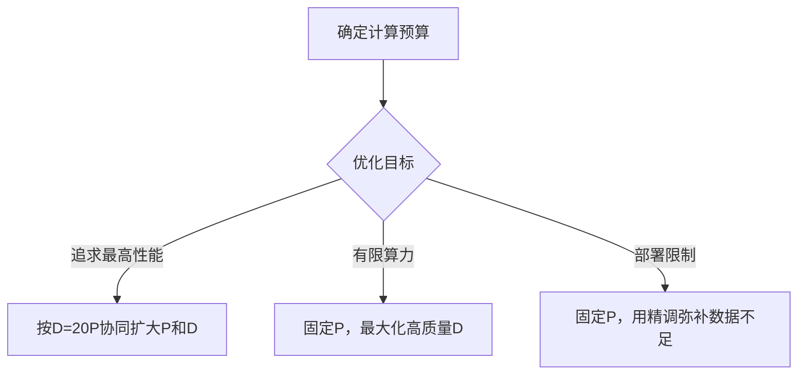

# LLM训练：模型参数量与数据量同等重要

### 🧑‍💻 User

llm训练，到底是模型参数量更重要还是训练数据量更重要？

---

### 🤖 Assistant

在LLM（大语言模型）训练中，**模型参数量（模型规模）和训练数据量都非常重要，且两者是相互依赖、共同决定模型能力的核心要素，无法孤立地说哪一个“更重要”**。它们的关系更像是“木桶效应”的两块主要木板，任何一块过短都会限制模型最终的性能上限。

不过，我们可以从不同角度分析它们的角色和相互作用：

1.  **“Scaling Laws”（缩放定律）的启示：**
    *   大量的研究（如OpenAI、DeepMind、Google等机构）表明，**在计算资源充足、模型架构合理、数据质量有保证的前提下，模型性能（如损失函数值）会随着模型参数量、训练数据量和计算量的幂律关系而平滑提升。**
    *   这意味着：
        *   **增大模型规模（参数量）：** 允许模型学习更复杂的模式和更细粒度的知识表示。更大的模型容量可以吸收更多的信息。
        *   **增大训练数据量：** 为模型提供更广泛、更丰富的知识和语言模式样本，减少过拟合，提高泛化能力。
        *   **两者需要匹配：** **一个过小的模型无法有效利用海量数据（欠拟合），而过大的模型如果数据不足则会严重过拟合。** 理想情况下，模型规模和训练数据量需要按比例协同增长。

2.  **具体角色分析：**
    *   **模型参数量（模型规模）的核心作用：**
        *   **决定模型的理论容量上限：** 参数越多，模型能存储和表示的信息量越大，能建模的函数越复杂。这是模型具备强大理解、推理、生成能力的物理基础。
        *   **影响模型的学习能力和复杂性：** 更大的模型通常能学习到更微妙的模式、更长的上下文依赖关系、更复杂的推理链。
        *   **是实现“涌现能力”的关键：** 许多在小型模型上不存在的复杂能力（如复杂推理、指令遵循、代码生成等）往往在模型规模达到某个临界点（如百亿、千亿参数）后“涌现”出来。
    *   **训练数据量的核心作用：**
        *   **决定模型实际学到的知识广度和深度：** 数据是知识的来源。没有足够多、足够好的数据，再大的模型也“巧妇难为无米之炊”。
        *   **影响模型的泛化能力和鲁棒性：** 更大量、更多样化的数据有助于模型学习到更普适的规律，减少在特定任务或领域上的过拟合，使其在面对新情况时表现更稳定。
        *   **数据质量至关重要：** 海量的低质量、重复、有偏见的数据反而有害。高质量、多样化、清洗过的数据比单纯追求数量更有价值（如LLaMA系列的成功部分归因于数据筛选）。

3.  **实践中的权衡与优先级：**
    *   **追求极限性能（SOTA）：** 要冲击最顶尖的性能（如GPT-4, Claude 3 Opus, Gemini Ultra），**必须同时最大化模型规模（数千亿甚至万亿参数）和训练数据量（数万亿Token）**，并投入巨大的计算资源。两者缺一不可。
    *   **资源有限时的策略：**
        *   **数据量是相对更“便宜”的资源（相对而言）：** 获取和清洗文本数据通常比训练一个超大模型所需的算力成本低。如果计算预算紧张，**在模型规模确定的前提下，尽可能使用更多、更高质量的数据进行充分训练通常是更划算、效果更好的选择。** 一个中等规模模型在大量优质数据上充分训练，往往能显著优于一个超大模型在少量数据上欠拟合或过拟合的结果。
        *   **模型架构与效率：** 采用更高效的架构（如Transformer的改进版本、Mixture of Experts）可以在同等参数量下提升性能，或者在同等性能下减少所需参数量/计算量。
        *   **训练技巧：** 更好的优化器、正则化技术、课程学习等可以提升数据利用效率，让模型在相同数据量下学得更好。
    *   **数据质量 vs 数量：** **高质量数据的价值常常超过单纯的数量堆砌。** 精心筛选、去重、平衡、增强的数据集（即使是较小规模）可能比数倍规模的“脏数据”训练效果更好。

4.  **总结与结论：**
    *   **基础重要性：** 两者都是大模型成功的基石，没有谁天生“更重要”。参数量定义了潜力，数据量（和质量）决定了潜力被开发的程度。
*   **相互依赖性：** 它们必须协同缩放。一个巨大的模型需要海量数据来“喂饱”，海量数据也需要足够大的模型来“消化”和有效利用。
*   **资源有限时的优先级：** **在固定计算预算下，相比于一味追求堆砌超大参数量，优先确保模型规模与可获得的*高质量*数据量相匹配，并充分利用这些数据进行充分训练，通常是更实际、更有效益的策略。** 即：**在保证模型有足够容量（不是过小）的前提下，投资于获取和处理更多、更高质量的数据，往往能获得更好的投资回报率（ROI）。**
*   **质量是倍增器：** 无论是模型架构设计（影响参数效率）还是数据本身的质量，都是提升“参数量”和“数据量”实际效能的倍增器。
*   **目标导向：** 对于特定应用（如部署在资源受限的设备上），可能更倾向于选择较小模型（通过蒸馏、剪枝、量化）在高质量领域数据上精调，此时数据质量和针对性比绝对数量更重要。

**简单来说：想造一个超强的LLM，大模型+大数据缺一不可。但如果你资源有限，与其砸钱堆一个可能“吃不饱”（数据不足）的巨无霸模型，不如把精力放在用足够大的模型（不是最大）去充分训练你能获取到的最好、最多的数据上。数据质量和有效利用同样关键。**

---

### 🧑‍💻 User

llm的参数量到底决定了哪些性能喵？

---

### 🤖 Assistant

喵～这个问题问得超关键！LLM的参数量就像大脑的神经元数量，它直接决定了模型的**容量上限**和**复杂任务处理潜力**。以下是参数量主要影响的性能方向（附具体解释和例子喵）：

---

### **1. 知识存储容量 → 更像“记忆图书馆”**
   - **作用**：参数本质是模型存储知识的“抽屉”，数量越多能记忆的**事实、概念、语言规则**越丰富。
   - **表现**：
     - 参数量大的模型能覆盖更广泛的知识领域（历史、科学、文化等）。
     - 举例：GPT-3（1750亿参数）比GPT-2（15亿参数）回答冷门问题的准确性显著提升。
   - **局限**：单纯堆参数≠知识正确性，还需高质量数据训练（否则记的是错误信息喵！）。

---

### **2. 模型复杂度能力 → 解锁“高级思维”**
   - **作用**：参数越多，模型能学习的**抽象模式、逻辑链条、上下文依赖**越复杂。
   - **关键能力提升**：
     - **长程推理**：理解超长文本中的因果链（如科研论文推导）。
     - **涌现能力（Emergent Abilities）**：参数量突破临界点（通常>100亿）时突然出现的能力：
       - 零样本学习（Zero-shot）  
       *（例：未训练过的任务也能推理：“如果所有猫都会飞，Tom是猫，那么Tom___？”）*
       - 复杂指令遵循  
       *（例：“写一首关于量子力学的俳句，每句提到一只猫”）*
     - **多模态理解**：大参数模型更容易融合文本、图像等跨模态信息（如GPT-4V）。

---

### **3. 泛化与鲁棒性 → 应对“刁钻问题”**
   - **作用**：参数冗余让模型对输入扰动更鲁棒，减少死记硬背（过拟合）。
   - **表现**：
     - 对同义改写、模糊表述的理解更强  
     *（例：将“苹果很甜”改写为“这种水果口感甘甜”仍能识别）*
     - 对抗攻击（Adversarial Attack）下的稳定性更高。

---

### **4. 上下文窗口（Context Window）→ 更大的“工作记忆”**
   - **间接关联**：支持长上下文（如128K tokens）的模型通常需要更多参数处理远距离依赖。
   - **举例**：Claude 3（200K上下文）依赖庞大参数量维持长文本一致性。

---

### **5. 多任务性能 → “通才”的基础**
   - **作用**：参数越多，模型内部可形成**模块化结构**，在不同任务间共享知识而不冲突。
   - **表现**：千亿级模型（如PaLM 2）能同时胜任翻译、编程、数学等任务且互不干扰。

---

### **重要注意事项！**
1. **参数量≠性能线性增长**：  
   - 当参数过大但**训练数据不足**时，模型会过拟合（表现反而下降）。  
   - 效率瓶颈：千亿参数后性能提升斜率降低（需指数级算力）。

2. **参数效率（Parameter Efficiency）更重要**：  
   - 优秀架构（如Mixture of Experts）能用更少参数达到同等性能  
     *（例：Mixtral 8x7B仅用47B激活参数媲美70B模型）*  
   - 算法优化（如LoRA微调）可低成本适配小参数模型。

3. **小参数模型也能逆袭**：  
   - 高质量领域数据精调（Fine-tuning）的小模型（如7B的Mistral）在特定任务可能击败大模型。

---

### **终极答案喵：**
> 参数量是**模型潜力的天花板**，但能否发挥取决于：  
> 🔹 **足够多+高质量的训练数据**（否则天花板再高也空荡荡）  
> 🔹 **先进的模型架构**（合理利用参数）  
> 🔹 **充足的算力**（撑起训练和推理）  

**用一个公式理解三者关系**👇  
`最终性能 = f(参数量, 数据量, 算力) × 架构效率 × 数据质量`

喵～希望这些解释帮你理清思路！ (ฅ´ω`ฅ)

---

### 🧑‍💻 User

per training 数据量和模型参数量为什么要相匹配，具体是如何匹配的？

---

### 🤖 Assistant

这是一个非常核心的问题喵！数据量与参数量的匹配本质是**防止模型“吃不饱”（欠拟合）或“消化不良”（过拟合）**，背后有深刻的数学和工程原理。具体匹配逻辑如下：

---

### **一、为什么必须匹配？失配的灾难性后果**
| **失配类型**       | **表现症状**                          | 根本原因                                                                 |
|---------------------|---------------------------------------|--------------------------------------------------------------------------|
| **数据量 << 参数量** | ✅ 训练损失快速下降<br>❌ 验证损失剧烈震荡/上升<br>❌ 输出胡言乱语、捏造事实 | 模型复杂度太高，仅靠少量数据就能完美拟合（甚至记住噪声），但完全不懂**泛化** → **过拟合** |
| **数据量 >> 参数量** | ✅ 验证损失平稳但偏高<br>❌ 训练损失下降缓慢<br>❌ 回答呆板、缺乏细节       | 模型容量太小，无法从海量数据中提取复杂模式 → **欠拟合**（潜力未被激发）              |

---

### **二、匹配的核心原则：缩放定律（Scaling Laws）**
由OpenAI和DeepMind等机构提出的**幂律关系**揭示了黄金比例（以Chinchilla定律为里程碑）：
```math
\text{最优训练Token数 } D ≈ 20 \times \text{ 模型参数量 } P 
```
▸ **经典案例**：
- **Chinchilla模型**（70B参数）  
  → 理论最优数据量：1.4 **万亿** Token  
  → 实际效果：**性能超越参数量5倍（280B）但数据不足的Gopher模型**  
- **LLaMA-2 70B**：使用 **2万亿 Token**（接近20×70B=1.4T的理想值）

> 💡 **关键公式**：  
> `验证损失 ∝ (计算量C)^-α`，其中计算量 `C ∝ P × D`  
> 当计算预算固定时，**P和D需按比例协同增长才能最小化损失**。

---

### **三、匹配的底层逻辑：参数如何“消化”数据？**
#### **1. 参数量（P）决定“消化酶”的种类和数量**
- **每个参数** ≈ 一个存储知识的“细胞”
- **参数结构**（如Attention头、FFN层）决定能提取哪种模式：
  ```mermaid
  graph LR
    A[输入Token] --> B[Attention层-捕捉依赖]
    B --> C[FFN层-组合特征]
    C --> D[输出预测]
  ```
  - **P不足**：网络无法构建足够特征提取器 → 模式识别能力弱
  - **P过量**：网络分裂出冗余结构 → 对噪声敏感

#### **2. 数据量（D）决定“营养丰富度”**
- **D < 模型容量需求**：模型只能学到**高频表面模式**（如简单语法），无法捕捉**长尾知识**  
  *（例：训练数据若缺少“量子纠缠”相关语料，模型必然在该领域胡编乱造）*
- **D ≥ 模型容量需求**：模型能学习**低概率复杂模式**  
  *（例：理解反讽：“您可真是天才” → 实际表达否定）*

#### **3. 动态平衡点：每个参数需要多少Token？**
- **参数激活效率实验**（DeepMind, 2022）：
  | 参数量（P） | 最优Token量（D） | 每个参数分配Token数（D/P） |
  |------------|-----------------|--------------------------|
  | 400M       | 8B             | 20                       |
  | 1B         | 20B            | 20                       |
  | 70B        | 1.4T           | 20                       |
  | 280B       | 5.6T           | 20                       |
- **为什么是20？**  
  → 20个Token/参数是让梯度稳定收敛的**经验临界值**  
  → 低于该值：权重更新噪声主导，模型学不到深层关联  
  → 高于该值：收益递减（但继续增加仍有微弱提升）

---

### **四、实际工程中的匹配策略**
#### **1. 计算受限时的妥协方案**
- **固定计算预算（FLOPs）**：  
  `FLOPs ≈ 6 × P × D` （Transformer的近似计算量）  
  → 需在`P`和`D`间权衡：  
  - **选择1**：大模型+少数据（P↑, D↓） → 过拟合风险高  
  - **选择2**：小模型+多数据（P↓, D↑） → 欠拟合但更鲁棒  
  → **实证结论：优先保证充足数据量（D）更划算！**  
  *（例：用7B模型+200B数据 优于 13B模型+100B数据）*

#### **2. 数据质量的补偿作用**
- **高质量数据可突破20倍限制**：  
  - LLaMA-2用 **40%高质量数据**（代码/学术论文）  
    → 仅用2T Token（D/P≈28）达到ChatGPT级别效果  
- **低质量数据需更大D**：  
  - 若数据重复率高/噪声大，需将D提升2-5倍补偿信息熵缺失

#### **3. 架构优化的降本增效**
- **稀疏模型**（如MoE）：  
  - Switch Transformer用 **1.6T参数**（实际激活仅 **107B/样本**）  
    → 数据需求按激活参数计算（D≈20×107B=2.14T）  
- **课程学习**（Curriculum Learning）：  
  逐步增加数据难度 → 让模型更高效吸收信息，降低D需求

---

### **五、失配案例警示**
| 模型           | 参数量（P） | 训练数据量（D） | D/P   | 结果                         |
|----------------|------------|----------------|-------|------------------------------|
| GPT-3          | 175B       | 300B Token     | 1.7   | ❌ 严重过拟合，事实错误频出       |
| Gopher         | 280B       | 300B Token     | 1.07  | ❌ 性能被Chinchilla（70B+1.4T）碾压 |
| LLaMA-1 65B    | 65B        | 1.4T Token     | 21.5  | ✅ 开源模型SOTA                 |

---

### **终极总结喵 🐾**
1. **黄金法则**：`D ≈ 20 × P` （Token数 vs 参数量）  
2. **底层逻辑**：每个参数需约20个Token才能稳定学习有效表征  
3. **工程实践**：  
   - **算力有限时**：优先保数据量（D↑），其次扩参数量（P↑）  
   - **质量＞数量**：1份高质量数据 ≈ 3-5份低质量数据  
   - **动态调整**：通过验证损失监控过拟合/欠拟合信号  



喵～理解这个匹配机制，你就掌握了LLM训练最底层的魔法！ (✧ω✧)