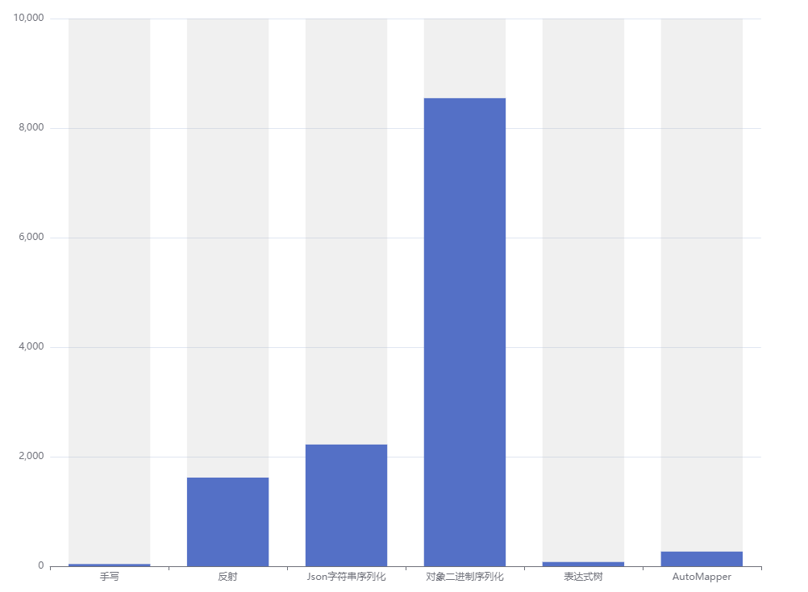

# C# 深拷贝

> https://www.quarkbook.com/?p=1210
>

本篇文章中所用部分源码（反射、表达式树）来源于博客：https://www.cnblogs.com/lsgsanxiao/p/8205096.html

之前在有篇博客中学习了设计模式原型模式，在原型模式中就提到了对象的深拷贝。深拷贝指的是拷贝一个对象时，不仅仅把对象的引用进行复制，还把该对象引用的值也一起拷贝。与浅拷贝不同的就是，深拷贝后的拷贝对象就和源对象互相独立，其中任何一个对象的改动都不会对另外一个对象造成影响。

在查询资料之后，探究了以下几种C#对象深拷贝方式，同时简单对比了以下列出的几种深拷贝方式的速度（简单测试，仅测试对象深拷贝速度，不考虑性能影响）。

测试平台：Intel 9700K+DDR4 3600 32G，框架为.NET 5.0。测试方式为创建100万次，比较执行时间。拷贝的对象如下：

```C#
[Serializable]
class UserInfo
    {
        public string Name { get; set; }

        public string UserId { get; set; }

        public int Age { get; set; }

        public string Address { get; set; }

        public long UpdateTime { get; set; }

        public long CreateTime { get; set; }
    }
```
1、手写创建对象

简单对象创建，不考虑有构造函数的情况。

```C#
NewUserInfo newInfo = new NewUserInfo()
{
    Name = info.Name,
    Age = info.Age,
    UserId = info.UserId,
    Address = info.Address,
    UpdateTime = info.UpdateTime,
    CreateTime = info.CreateTime,
};
```
100万次执行时间为39.4073ms，位居第一。当然，在这种不考虑构造函数的情况下，手写创建肯定是最快的。但是同时，如果遇到复杂对象，代码量也是最多的。

2、反射

这也是在日常代码中最常用的方式之一。
```C#
private static TOut TransReflection<TIn, TOut>(TIn tIn)
{
    TOut tOut = Activator.CreateInstance<TOut>();
    var tInType = tIn.GetType();
    foreach (var itemOut in tOut.GetType().GetProperties())
    {
        var itemIn = tInType.GetProperty(itemOut.Name); ;
        if (itemIn != null)
        {
            itemOut.SetValue(tOut, itemIn.GetValue(tIn));
        }
    }
    return tOut;
}
//调用

NewUserInfo newInfo = TransReflection<UserInfo, NewUserInfo>(info);
```
100万次执行时间为1618.4662ms，平均执行时间为0.001618，看起来还行。

3、Json字符串序列化

使用System.Text.Json作为序列化和反序列化工具。

UserInfo newInfo = JsonSerializer.Deserialize<UserInfo>(JsonSerializer.Serialize(info));
100万次执行时间为2222.2078ms，比反射慢一点点。

4、对象二进制序列化

首先不推荐使用这种方式，一是BinaryFormatter.Serialize微软已不推荐使用（据微软官网文档说是有漏洞，具体有什么漏洞没细究），二是必须在要序列化的对象上面写上Serializable的关键字，三是速度并不理想。

```C#
private static TOut ObjectMemoryConvert<TIn, TOut>(TIn tIn)
{
    using (MemoryStream ms = new MemoryStream())
    {
        BinaryFormatter formatter = new BinaryFormatter();
        formatter.Serialize(ms, tIn);
        ms.Position = 0;
        return (TOut)formatter.Deserialize(ms);
    }
}
```
100万次执行时间为8545.9835ms，讲道理应该是比Json序列化要更快的，但是实际上慢了许多。

5、AutoMapper

熟悉的AutoMapper，性能也没有让我们失望。
```C#
//循环外创建MapperConfig
var config = new MapperConfiguration(cfg => cfg.CreateMap<UserInfo, UserInfo>());
var mapper = config.CreateMapper();

//循环内调用
UserInfo newInfo = mapper.Map<UserInfo>(info);
```
100万次执行时间为267.5073ms，位居第三。

6、表达式树

重头戏来了，此处代码来源于文首中的博客中，性能让人大吃一惊。其原理是反射和表达式树相结合，先用反射获取字段然后缓存起来，再用表达式树赋值。
```C#
public static class TransExp<TIn, TOut>
{
    private static readonly Func<TIn, TOut> cache = GetFunc();
    private static Func<TIn, TOut> GetFunc()
    {
        ParameterExpression parameterExpression = Expression.Parameter(typeof(TIn), "p");
        List<MemberBinding> memberBindingList = new List<MemberBinding>();

        foreach (var item in typeof(TOut).GetProperties())
        {
            if (!item.CanWrite) continue;
            MemberExpression property = Expression.Property(parameterExpression, typeof(TIn).GetProperty(item.Name));
            MemberBinding memberBinding = Expression.Bind(item, property);
            memberBindingList.Add(memberBinding);
        }

        MemberInitExpression memberInitExpression = Expression.MemberInit(Expression.New(typeof(TOut)), memberBindingList.ToArray());
        Expression<Func<TIn, TOut>> lambda = Expression.Lambda<Func<TIn, TOut>>(memberInitExpression, new ParameterExpression[] { parameterExpression });

        return lambda.Compile();
    }

    public static TOut Trans(TIn tIn)
    {
        return cache(tIn);
    }
}
//调用

UserInfo newInfo = TransExp<UserInfo, UserInfo>.Trans(info);
```
100万次执行时间为77.3653ms，位居第二。仅比手写慢一点点。

简单整理成柱状图，可以很清晰的对比出这几种深拷贝方式之间的速度差距。总结来说就是，一般简单的对象深拷贝，推荐直接手写，复杂对象深拷贝，推荐使用表达式树。当然，如果创建对象中还涉及到构造函数初始化，那又是不同的情况，这里暂不讨论。



## 附上本次测试用的完整代码。

```C#
using AutoMapper;
using System;
using System.Collections.Generic;
using System.Diagnostics;
using System.IO;
using System.Linq.Expressions;
using System.Runtime.Serialization;
using System.Runtime.Serialization.Formatters.Binary;
using System.Text.Json;
using System.Threading.Tasks;

namespace TestObjectDeepCopy
{
    class Program
    {
        static void Main(string[] args)
        {
            UserInfo info = new UserInfo()
            {
                Name = "张三",
                Age = 18,
                UserId = Guid.NewGuid().ToString("N"),
                Address = "银河系地球中国",
                UpdateTime = 1615888888,
                CreateTime = 1615895454,
            };

            var config = new MapperConfiguration(cfg => cfg.CreateMap<UserInfo, UserInfo>());
            var mapper = config.CreateMapper();

            int count = 1000000;
            Stopwatch sw = new Stopwatch();
            sw.Start();

            for (int i = -0; i < count; i++)
            {
                //手写 39.4073ms
                //UserInfo newInfo = new UserInfo()
                //{
                //    Name = info.Name,
                //    Age = info.Age,
                //    UserId = info.UserId,
                //    Address = info.Address,
                //    UpdateTime = info.UpdateTime,
                //    CreateTime = info.CreateTime,
                //};

                //反射 1618.4662ms
                //UserInfo newInfo = TransReflection<UserInfo, UserInfo>(info);

                //Json字符串序列化 2222.2078ms
                //UserInfo newInfo = JsonSerializer.Deserialize<UserInfo>(JsonSerializer.Serialize(info));

                //对象二进制序列化 8545.9835ms
                //UserInfo newInfo = ObjectMemoryConvert<UserInfo, UserInfo>(info);

                //表达式树 77.3653ms
                //UserInfo newInfo = TransExp<UserInfo, UserInfo>.Trans(info);

                //AutoMapper 267.5073ms
                //UserInfo newInfo = mapper.Map<UserInfo>(info);
            }

            Console.WriteLine("总共花费{0}ms.", sw.Elapsed.TotalMilliseconds);
            sw.Stop();

            Console.ReadKey();
        }

        private static TOut TransReflection<TIn, TOut>(TIn tIn)
        {
            TOut tOut = Activator.CreateInstance<TOut>();
            var tInType = tIn.GetType();
            foreach (var itemOut in tOut.GetType().GetProperties())
            {
                var itemIn = tInType.GetProperty(itemOut.Name); ;
                if (itemIn != null)
                {
                    itemOut.SetValue(tOut, itemIn.GetValue(tIn));
                }
            }
            return tOut;
        }

        private static TOut ObjectMemoryConvert<TIn, TOut>(TIn tIn)
        {
            using (MemoryStream ms = new MemoryStream())
            {
                BinaryFormatter formatter = new BinaryFormatter();
                formatter.Serialize(ms, tIn);
                ms.Position = 0;
                return (TOut)formatter.Deserialize(ms);
            }
        }
    }

    public static class TransExp<TIn, TOut>
    {
        private static readonly Func<TIn, TOut> cache = GetFunc();
        private static Func<TIn, TOut> GetFunc()
        {
            ParameterExpression parameterExpression = Expression.Parameter(typeof(TIn), "p");
            List<MemberBinding> memberBindingList = new List<MemberBinding>();

            foreach (var item in typeof(TOut).GetProperties())
            {
                if (!item.CanWrite) continue;
                MemberExpression property = Expression.Property(parameterExpression, typeof(TIn).GetProperty(item.Name));
                MemberBinding memberBinding = Expression.Bind(item, property);
                memberBindingList.Add(memberBinding);
            }

            MemberInitExpression memberInitExpression = Expression.MemberInit(Expression.New(typeof(TOut)), memberBindingList.ToArray());
            Expression<Func<TIn, TOut>> lambda = Expression.Lambda<Func<TIn, TOut>>(memberInitExpression, new ParameterExpression[] { parameterExpression });

            return lambda.Compile();
        }

        public static TOut Trans(TIn tIn)
        {
            return cache(tIn);
        }
    }

    [Serializable]
    class UserInfo
    {
        public string Name { get; set; }

        public string UserId { get; set; }

        public int Age { get; set; }

        public string Address { get; set; }

        public long UpdateTime { get; set; }

        public long CreateTime { get; set; }
    }
}
```