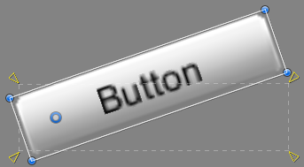

# User Interface 用户界面
  
## 【百日挑战94】unity教程之2D游戏开发初步（五十二）
  
前言：在上期教程中，我们学习了如何通过 ParticleSystem.Stop() 方法控制粒子系统的播放与暂停，该方法相较于直接Destroy对象不同之处在于Stop方法只会阻止粒子系统创建粒子，已经存在的粒子可以正常结束自己的生命周期。并对整个粒子系统组件做了很详细的介绍，今天我们将开始学习用户界面 - 抬头显示的相关内容，对UGUI的使用有个基本的了解，你将了解以下内容：
  
1. 什么是用户界面（UI）?
2. 游戏中关于用户界面有哪些具体例子？
3. ...
  
目标：通过本章节的学习，我们将实现在HUD中显示玩家头像和血条的效果，并通过代码实时控制玩家血量的显示。
  
开始之前，我们先学习关于UI的基本概念。

  

## 1. 概念

### 1.1 User Interface

User Interface（UI） 是用户和软件（当然包括游戏）沟通的界面，通过 UI，用户可以将指令发给软件，也可以获取软件的反馈信息。

UI 通常包含：图片、文字、按钮、开关、滑动条、下拉列表、表格、分页 等等，按使用场景的不同大致分为以下三类：

- Unity 用户界面：  
   指的是 Unity 编译器的用户界面，unity 编译器本身就是开源的，也可以根据项目开发需求随意更改，添加、自定义功能，比如说当你的项目中unity编辑器本身提供的功能不够用时，可以自定义特殊的功能窗口、功能模块等更改或扩充编辑器自身的功能，这也是 Unity 的一大特色
  

- Game（或用 Unity 创建的应用）起始界面：  
   以一款大家熟悉的游戏为例，开启游戏前的界面  
  

- 运行时（runtime）界面:  
  进入游戏后的游戏内操作界面（运行在游戏中的界面）  
  

### 1.2 和 UI 相关的职位

* User experience (UX) design 用户体验设计
    - Answers the question: 用户的使用经历
    - Goal: 确保一个产品从头到尾的使用体验.
* User interaction design (IxD) 用户交互设计
  - Answers the question: 如何满足用户的需求？
  - Goal: 确保用户通过最方便（舒适）的方式达到他们的目标. 
  - 用户交互设计是用户体验设计的一个子分支，包含在其中
* User interface (UI) design 用户界面设计
  - Answers the question: 屏幕上的UI元素应该如何布局和展示
  - Goal: 需要确保UI易懂易用，不能称为用户的负担（拦路石）.
  - 是用户交互设计的子元素.
* Information architecture 信息架构师
  - Answers the question: 信息如何组织，如何架构，是否需要用于交互等
  - Goal: 将内容结构化（分类分块，组织机构，相互链接），使用户可以很方便找到想要的信息
  - 影响上面三个职位，是其组织内容的基础.
* Visual design 视觉设计
  - Answers the question: 外观怎样看起来更好
  - Goal: 使产品外观更美观
  - 影响上面三个职位，是其组织外观的基础.

## 2. 最新 Unity 中的 3 大 UI 系统

### 2.1 UI 工具包

UI toolkit UI 工具包是 Unity 中最新的 UI 系统。它旨在优化跨平台的性能，并基于标准 Web 技术。您可以使用 UI 工具包为 Unity 编辑器创建扩展，并为游戏和应用程序创建运行时 UI（如果您安装了 UI 工具包软件包）。

Unity 打算让 UI 工具包成为新 UI 开发项目的推荐 UI 系统，但它仍然缺少 Unity UI (UGUI) 和 IMGUI 中的一些功能。

一句话总结：  
全能 UI 系统，而且是 unity 未来的 UI 发展方向，暂时还缺少部分功能，建议优先使用，遇到不足的，再选择别的 UI 系统补上

### 2.2 Unity UI 软件包 (UGUI)（必学）

Unity 用户界面 (Unity UI) 软件包（也称为 uGUI）是一个较旧的、基于游戏对象的 UI 系统，您可以使用它为游戏和应用程序开发运行时 UI。在 Unity UI 中，即可使用组件和 Game 视图来排列和定位用户界面并设置其样式。它支持高级渲染和文本功能。

现在使用 Unity 的公司，旧项目中大多数还在使用 UGUI ，甚至是它的前身 nGUI（第三方 ui），也是作为unity初学者必备的ui系统之一，Ruby's Adventure 教程中，使用的还是 uGUI。

### 2.3 NGUI

第三方 UI 系统（[AssetStore 链接](https://assetstore.unity.com/packages/tools/gui/ngui-next-gen-ui-2413)），需付费（现价$95），除非入职公司旧系统中，还在使用 NGUI，否则不推荐学习，uGUI 是模仿 NGUI 做出来的，很多模块有类似之处，但现在据说已经比 NGUI 更好用，功能更强

### 2.4 IMGUI（必学）

立即模式图形用户界面 (IMGUI) 是一个代码驱动的 UI 工具包，它使用 OnGUI 函数以及实现它的脚本来绘制和管理用户界面。它很少用于gameplay相关的模块，您可以使用 IMGUI 来创建脚本组件的自定义 Inspector，Unity 编辑器的扩展以及游戏内调试显示。不推荐用于构建运行时 UI。

纯代码驱动的 UI 系统，适合程序员做游戏内部测试系统、控制台的 UI，但与上面几种ui相比美术表现力稍逊（特效、动画等效果的欠缺）。

## 3. UI 系统的对比和选择

### 3.1 UI 系统对比：

对比请参考文档: [Unity 中 UI 系统的对比](https://docs.unity3d.com/cn/2021.2/Manual/UI-system-compare.html)

### 3.2 UI 系统选择依据建议

- 学习：  
  建议 unity 的三个都学习，首先掌握 UGUI（兼容旧项目），其次是 UI toolkit ，之后是 IMGUI；不建议再学 nGUI  

- 旧项目：  
  以保持原项目系统一至性为原则，使用 UGUI 或 NGUI
- 新项目：  
  根据自己需求选择使用 UGUI 或 Unity UI Toolkit，如果 UI Toolkit 够用，这个是 Unity 主推的方向，如果有它暂时不能实现的功能，再考虑使用 UGUI 或 IMGUI
- 游戏内测试系统（包括控制台）：  
  UGUI、Unity UI Tookit 不能实现的话，就使用 IMGUI
  
## 【百日挑战95】unity教程之2D游戏开发初步（五十三）
  
前言：在上期教程中，我们先学习了unity的UI系统入门知识，了解了UI系统的作用、内容、按照使用场景的类型，UI 相关的职位，对比了ui tookit，ugui，ngui，imgui几种常见UI系统的区别与UI 系统选择依据建议，今天我们将试着通过UGUI为Robot创建HUD系统，实时显示玩家的血量。
  
摘要：回到我们的项目，到目前为止，你一直在使用 Debug.Log 在主角受伤时输出当前的生命值。但是玩家不会有 Console 窗口，因此无法查看最终游戏中的日志。所以，为了给玩家提供反馈，交互式应用程序使用用户界面（简称 UI）将图像和文本叠加在场景上来显示信息。这种显示方式也称为抬头显示 (HUD)。
  
1. UI 画布
在本教程中，你将向你的项目添加 UI，用于显示主角的当前生命值。
  
Unity 中的 UI 使用一种称为画布 (Canvas) 组件的游戏对象来渲染特定于 UI 的组件，例如图像、滑动条和按钮。画布定义了每个 UI 元素应如何在屏幕上呈现，并负责渲染所有作为子对象的 UI 组件。
  
要创建 UI，请执行以下操作：
1.创建 UI 的第一步是创建一个画布。所有的GUI都在画布上进行操作与绘制，所有与ui相关的对象都需要在它的子节点创建。它的创建方式与任何其他游戏对象没有区别：在 Hierarchy 中右键单击一个空白位置，或使用 Hierarchy 顶部的 Create 按钮，然后选择 UI > Canvas。
  
执行此操作后，你会发现还会向场景中添加另一个游戏对象，名为 EventSystem。这是一个带有特殊组件的游戏对象，可以处理事件以及与 UI 的交互，例如单击鼠标。这个游戏对象在这里用不到，但需要保留在场景中，否则画布会记录警告。
  
2.选择新创建的 Canvas 游戏对象，可以看见一个白色矩形外框，代表UI的边界，即玩家显示器可见的最大范围，然后查看 Inspector：
  
可见Canvas对象上包含了4个组件，让我们介绍下他们。
  
2. Rect Transform
  
该游戏对象的第一个区别是具有 Rect Transform 组件，而不是在其他游戏对象上看到的 Transform 组件。
  
Rect Transform（矩形变换）仍然是一种 Transform（变换），因此可以在脚本中用作变换，但矩形变换具有额外的 UI 数据，稍后将进行介绍。目前，只需看成是一种特殊的变换。
  
画布定义了 UI 在游戏中的显示方式。画布可以处于以下任何一种模式：
  
- Screen Space - Overlay：这是默认模式，可以让 Unity 在始终在游戏的上层绘制 UI。大多数应用程序使用此模式，因为它们希望 UI 始终位于最上层以便提供所有信息。
- Screen Space - Camera：这种模式在与摄像机对齐的平面上绘制 UI。平面的大小确定为始终填充整个屏幕，这样你就可以四处移动摄像机，并且平面将随摄像机一起移动，从而显示与 Overlay 图形相同的形状。但是，由于平面是在世界中绘制的，而不是在屏幕上层绘制的，因此世界中的对象可以绘制在 UI 的上层。
- World Space：这种模式可在世界中的任何位置绘制平面。例如，你可以将此平面用作游戏中的计算机屏幕，或者用作墙壁，或者放在角色的上层。这在 3D 游戏中更有用，因为 UI 会随着距离变小。
  
在我们这种情况下，你需要保留默认模式 Screen Space - Overlay，因为你希望一直显示 Ruby 的生命值并处于最上层，以便无论摄像机面向什么方向，这个生命值都不会被世界中的对象隐藏。
  
你可以忽略游戏的其他参数。有关更多信息，请参阅画布 (Canvas) 文档。
提示：单击组件上带有问号的小书图标可以打开相应文档。
  
3. Canvas Scaler
  
Canvas 画布具有 Canvas Scaler 组件，用于定义 UI 在不同的屏幕大小下如何缩放。有些玩家可能以 800 x 600 的分辨率运行你的游戏，而其他玩家可能以 1920 x 1080 的分辨率运行。或者对于移动端应用程序，可能会在横向和纵向模式下使用应用程序。所有这些选项都要求具有不同的屏幕大小和比例。
  
可以将 Canvas Scaler 模式设置为以下选项之一：
  
1.Constant Size（Pixel 或 Physical）：无论屏幕大小或形状如何，UI 均保持大小不变。这样可以使 UI 在任何屏幕上都能看清楚，但在较小的屏幕上可能会被 UI 占据很大的空间，而且如果屏幕太小，元素也不能重叠。
  
2.Scale With Screen Size：让 UI 缩放取决于你设置为 Reference Resolution 的屏幕大小。
  
例如，如果将 Reference Resolution 设置为 800 x 600，并且屏幕宽度为 1600 像素，则 UI 会缩放为两倍大。这样，无论屏幕大小如何，UI 始终覆盖屏幕上的相同区域。
  
此模式的缺点在于，这可能会导致以下情况：如果你的基础大小很大，并且有玩家在较小的屏幕上玩游戏，那么 UI 会太小而看不清；如果你的 UI 是为小屏幕设计的，但玩家在大屏幕上玩游戏（放大很多），那么 UI 看上去会很模糊或像素化：
  
在你这种情况下，因为你的 UI 再简单不过，也更方便学习，所以将设置保留为 Constant Pixel Size。
3.最后，Canvas 画布上的最后一个组件是 Graphic Raycaster。在本教程中不会使用这个组件，但这个组件可以检测玩家是否点击了画布中的对象（比如按钮）。
  
4. 向 UI 中添加图像（生命值和头像）
我们将添加用户元素到Canvas中。现在，你已经完成了画布的设置，接下来可以将生命值计量表添加到 UI 中。这里将包含两部分：
  
第 1 部分：背景图像，即 Ruby 的肖像
第 2 部分：生命值计量表的字段。顶部绘制的蓝色计量表将根据角色当前生命值动态变化。
  
要添加图像，请执行以下操作：
  
1.在画布中单击右键，或者选择画布后在 Hierarchy 中单击  Create，然后选择 UI > Image。此时将创建一个 Image 游戏对象作为 Canvas 的子对象，因为需要在该画布上渲染这个图像，我们将其名字改为HealthFrame。
  
如果打开 Game 窗口，你会发现屏幕中间有一个白色正方形。你还没有为图像分配精灵，所以图像现在呈现为白色正方形：
  
但如果在 Scene 视图中查看，则看不到白色正方形。这是因为 Scene 视图 和 Game 视图对 UI 位置和大小的处理方式略有不同。
  
到目前为止，所有对象都是有“单位”的，因此沿一个轴将一个游戏对象移动 10 会将这个游戏对象在世界中移动 10 个单位，此处我们的 UI 元素的 Rect Transform 值以像素为单位。
因此，如果你的屏幕宽度为 800 像素，并且图像位于位置 400 处，那么这个图像就会位于 UI 的屏幕中间，但在 Scene 视图中位于 400 个单位处对我们来说太远（也太大）了，看不见。
  
5. 在编辑器中编辑 UI：
  
1.要在编辑器中编辑 UI，请在 Hierarchy 中选择 Canvas，然后可以执行下列操作之一：
  
- 双击
- 将鼠标悬停在 Scene 视图上并按 F 键
  
2.你现在应该可以看到白色正方形和带有四个蓝色圆点的矩形（作为画布的边界）。在左下角，可以看到非常小的游戏世界。
  
3.让我们将白色矩形更改为所需的图像，方法如下：在 Art > Sprites > UI 中，将名为 UIHealthFrame 的精灵拖入 Health 游戏对象（也就是 Canvas 的子对象）的 Source Image 设置中。
  
图像被完全压缩，因为要保持矩形的大小。
  
4.要将 Rect Transform 值更改为图像的大小，请在 Image Inspector 中单击 Set Native Size 按钮还原成Sprite原始大小。目前来说，图像对于屏幕而言应该太大了：
  
这是因为图像宽度为 1336 像素，而你的屏幕小于该像素值。但接下来你要将图像缩放到适当的大小。
  
6. 调整图像大小
  
1.选择图像，然后确保在工具栏中选择矩形工具（快捷键：T）。
2.拖动图像的角或边以调整图像大小。如果在拖动角时按住 Shift 键，则会在调整大小时保持正确的比例，并且图像将均匀缩放，避免变形。
3.也可以单击并拖动图像，这样图像会“贴靠”到画布的一个角。让我们将图像放在左上角：
  
可以随时打开 Game 视图来检查在游戏中的显示效果。放置图像只是我们工作的第一部分，最后将Image调整在合适的位置。
现在，如果调整屏幕大小（例如，通过调整 Game 视图的大小），元素的位置将发生变化：
  
但是我们还有问题没解决：用户的显示设备分辨率是不一样的，你可以通过更改Canvas大小模拟不同分辨率的设备，我们希望游戏UI大小根据分辨率自适应，比如说左上角的ui我们希望一直钉在左上角，其他位置的同理。我们将讲解UI自适应的原理。
  
7. 什么是锚点？
你的图像锚定在屏幕中央，但什么是锚点呢？在选择图像后，观察 Scene 视图.它由四个三角形组成，对应四个锚点的位置，顶点指向ui锚点位置：
  
屏幕中央的十字就是图像的锚点。这是计算对象位置时的起点（由绿色箭头显示，从图像的锚点到图像的轴心（即小蓝色圆圈））。
  
因此，在调整屏幕大小时，该位置将保持不变，并且图像不会随着屏幕边框移动。
  
要解决此问题，你需要将图像锚定到Canvas的一个角。这样，如果由于调整了屏幕大小而移动了该角，则图像将保持在相同的距离内并随之移动。
  
要将图像锚定到角，请执行以下操作：
  
1.你可以使用 Rect Transform 直接移动锚点，但是 RectTransform 允许我们直接将锚点锚定到一个角上。
2.单击 Rect Transform 左上角的正方形，打开轴心调整面板，然后选择左上角的选项快速调整Image的轴心，最后重新调整位置即可。
  
你可以在 Scene 视图中看到锚点已经移动到这个角，尝试改变Canvas尺寸，可以看到我们的始终钉在了左上角。
  
还要注意，Rect Transform 的 Pos X 和 Pos Y 已更改：现在是从画布的角（而不再是中心）开始计算的！
确保图像在这个角的位置，现在调整屏幕大小时，UI 会保持在这个角的位置！
还可以将游戏对象从 Image 重命名为 Health，这样我们就知道这是生命值的 UI。使用 Inspector 顶部包含“Image”的文本框，并将内容更改为 Health。
  
### 【百日挑战96】unity教程之2D游戏开发初步（五十四）
  
前言：在上期教程中，我们先学习了unity的UGUI系统入门知识，了解了UI 画布、Rect Transform、Canvas Scaler、向 UI 中添加图像（Image组件）、编辑 UI的Sprite并调整图像大小，最后我们学习了UI自适应的原理——锚点，通过设置不同的锚点解决不同分辨率下ui缩放和固定的问题，今天我们继续将头像添加到头像框内。
  
8. 添加肖像
  
现在，你需要添加 Ruby 的肖像以及蓝色条来完善我们的 Health UI。
要添加肖像，请执行以下操作：
  
1.在 Art > Sprites > UI 中找到肖像，名为 CharacterPortrait。
2.创建一个新图像作为 Health Image 的子对象，将它命名为CharacterPortrait，找到的肖像分配给这个子对象，单击 Set Native Size 并调整其大小（同时按住 Shift 键可保持相同的比例，不会压扁！）。尝试调整为不同大小，并移动到生命值条背景的蓝色圆圈中，直到对结果满意为止。
  
你这里实际上并不需要更改锚点，因为已经锚定在父级（在我们这种情况下为 Health 游戏对象）的中心。所以，在通过调整屏幕大小来移动 Health 游戏对象时，中心也会移动，并且肖像也将随之移动。
但是，如果水平调整生命值条对象的大小，中心位置将会更改，因此会移动肖像的位置，但不会调整肖像的大小：

这是因为锚点不仅定义位置，还定义大小。我们希望头像跟随血条一起缩放，如果按下 Rect Transform 组件中的锚点按钮，然后选择右下角的展开蓝色箭头，则会看到作为锚点的 4 个箭头移动到父图像的 4 个角。

让我们手动调整锚点：现在图像大小不是绝对值，而是相对于这些锚点之间的距离的值。因此，如果图像大小在左右锚点之间为 25%，若将锚点移近（例如通过调整大小），则图像将调整大小以保持在该比例之内：
  
3.要正确调整生命值条的大小，请更改 Rect Transform 以拉伸和移动锚点。为此，可以单击并拖动锚点，让锚点围住肖像，让锚点与锚点与血条的头像外框相匹配。

所以锚点是非常重要的工具，它可以帮助我们更好的定位ui组件，要根据工程实际需求选择对应的锚点
  
最终缩放血条时头像可以随头像框一起缩放并处于合适的位置。所以在UGUI中，锚点是非常重要的工具，它可以帮助我们更好的定位ui组件，要根据工程实际需求选择对应的锚点
  
### 【百日挑战97】unity教程之2D游戏开发初步（五十五）
  
前言：在上期教程中，我们通过为血条添加角色头像，解决了当血条位置变化时即头像跟随血条一起缩放时头像中心位置会移动的问题，练习了Rect Transform拉伸和移动锚点，让锚点与锚点与血条的头像外框相匹配，今天我们继续学习为血条栏加上生命值条。
  
9. 遮盖生命值条
  
现在，你需要添加蓝色的生命值条，并且需要添加一种方法让角色在受伤时缩短生命值条，蓝色部分代表角色当前的生命值，跟随脚本中的currentHealth实时变化，深褐色部分背景代表生命值上限。
你可以在 Ruby 的生命值满血时简单地将生命值条标定为 1，然后逐渐减少生命值条中的生命值，直到为空时减小为 0。但这种方法会将生命值条压得很扁：
  
因而，你需要改用遮罩技术。遮罩是 UI 系统中的一种技术，利用这种技术可以将一张图像用作其他图像的“遮罩”。我们可以看成是第一张图像充当一个模板。第二张图像中与第一张图像重叠的部分是可见的，但另一部分则是隐藏的。
  
10. 如何创建生命值条遮罩
  
要创建带遮罩的血条ui（进度条，滑块同理），我们需要先添加遮罩图像，然后将蓝色的血条作为遮罩层的子元素。
  
要创建生命值条遮罩，请执行以下操作：
1.首先创建 Health 游戏对象的 Image 游戏对象子对象，并将这个子对象命名为 healthMask。
2.调整这个对象的大小，调整位置到遮住血条区域并移动其锚点以适应 UI 中放置生命值条的空白位置：
  
3.最后一步是移动轴心，也就是左侧的蓝色空圆圈到Mask最左侧的中心。为什么呢？因为在稍后使用代码调整大小时，你将根据轴心调整大小。
注意：如果将轴心保留在中间，并减小血条，如 20% 的大小（此数字是举例），则会在每一侧调整 10% 的大小（两边都会往中间缩）。通过将轴心放在左侧，可以确保仅在右侧完成 20% 的大小调整（减血时血条从右向左减少）。
  
提示：注意这里如果轴心（小蓝圈）时灰色的话，就在Scene视图左上角把Center模式切换成Pivot模式就可以移动了。
  
不需要指定精灵，也不需要指定颜色，因为你是要用作模板，它仅仅是占位的，默认的白色矩形可以完美满足你的需求。
  
4.创建该遮罩的新图像子对象：HealthBar，该对象就是真正显示血条的Image，添加Image组件，并为这个对象分配 Art > Sprites > UI 文件夹中的 UIHealthBar 精灵。然后，调整HealthBar大小，使其填充父对象Mask，不要像以前那样单击 Set Native Size，而是通过单击图像的 Rect Transform 中的相应图标来打开锚点菜单：
  
5.现在，按住 Alt 键的同时，在出现的弹出窗口中单击右下角的图标，让锚点填充整个父区域：
  
此操作将同时设置锚点和新图像的大小以填充其父级，因此生命值条会自动设置为正确的大小。完成上述操作后，重新打开这个弹出窗口，这一次像之前一样选择左上方的图标，但不要按 Alt 键，仅将生命值条的锚点设置在左上角，而不调整大小，我们不希望血条大小随Mask大小缩放而缩放血条（HealthBar），否则如果使用填充锚点在调整Mask大小时，我们的血条形状也会跟着缩放，这不是我们想要的效果。
  
6.添加遮罩功能：现在，再次选中 Mask对象，选择 Add Component 并搜索 Mask。添加此组件，然后取消选中 Show Mask Graphic 以隐藏白色正方形。
7.测试：调整遮罩大小，观察我们的血条长度是否随着Mask长度被遮挡显示，正常情况下应该只显示被遮罩的区域，但请注意，这是你在 Hierarchy 中选择的 Mask 遮罩，而不是生命值条！
  
此时会隐藏生命值条。因为矩形是模板，所以在你缩小矩形时，生命值条上与较小遮罩不重叠的所有部分都将被隐藏。这也是为什么将生命值条的锚点设置在一个角处，而不是根据遮罩来缩放。如果生命值条根据重新缩放，无法达到目的。
  
### 【百日挑战98】unity教程之2D游戏开发初步（五十六）
  
前言：在上期教程中，我们通过为血条栏加上生命值条，学习了UGUI中遮罩（Mask）及其对应锚点的使用方法，避免了直接拉伸血条Image造成的变性的问题，现在已经完成了生命值条的可视部分，完成了血条部分UI界面、图形图像部分的设计，今天我们继续学习通过代码来控制血条栏上的生命值条，实现实时显示玩家（Ruby）当前血量。
  
思路：我们需要通过代码传值控制healthMask遮罩层的长短实现血条显示的效果。
  
11. 编写生命值条的脚本
  
我们在Scripts目录下创建一个名为 UIHealthBar 的新脚本，添加using UnityEngine.UI;的引用，其中包含以下代码行：
  
让我们来观察这段代码：
  
1.除了使用 rect.width 获取屏幕上的大小和使用 SetSizeWithCurrentAnchors 从代码中设置大小和锚点之外，这里没有其他新内容。
  
2.当生命值更改为介于 0 和 1 之间的值（1 表示生命值为满血，0.5 表示一半，以此类推）时，你的代码将调用 SetValue，这将更改我们的遮罩大小，进而隐藏生命值条的右侧部分。
  
3.现在，如果返回 Unity 编辑器来编译脚本，你会收到一条错误消息，提示“The type or namespace name 'Image' could not be found”。这是因为 Image 不是 UnityEngine 主代码“命名空间”的一部分（命名空间可将所有类似的内容分组在一起），而是在一个名为 UnityEngine.UI 的子类别中。
  
我们可以通过键入 UnityEngine.UI.Image 来解决此问题，但是 GameObject 是 UnityEngine 命名空间的一部分，并且到目前为止，我们还不必编写 UnityEngine.GameObject，为什么会这样呢？
  
实际上，在脚本的顶部，还记得在第一个教程中提到的带有“using”关键字的代码行吗？当时我们略过了这一个话题。这些关键字可以将命名空间中的所有内容“导入”到脚本中。
  
代码行 using UnityEngine; 让你无需在 UnityEngine 中的所有类（如 GameObject）前面键入 UnityEngine。所以，如果你在 using.UnityEngine; 代码行下面直接添加 using UnityEngine.UI; 代码行，你的代码将会正确编译，因为现在可以在该脚本内直接使用 Image 了。
  
为了更改生命值条，要做的最后一件事是告知脚本，生命值已经变了。你需要从 RubyController 脚本的 ChangeHealth 函数中调用 SetValue 来提供新的生命值。
可以像到先前一样，在 RubyController 脚本中公开 UIHealthBar 类型的公共变量，然后在 Inspector 中手动分配这个变量。但是你需要在创建的每个场景中执行此操作。
  
### 【百日挑战99】unity教程之2D游戏开发初步（五十七）

前言：在上期教程中，我们用到了一个叫做引用对象的新方法：使用静态成员。这期我们将单独为大家介绍静态成员（静态类）的概念、用法、声明、引用，帮助大家更好理解如何在以后实际项目开发中更好的使用它。
  
1. 静态成员
让我们研究一种引用对象的新方法：使用静态成员。到现在为止，当你在脚本中创建了成员（比如我们的 Enemy 脚本中的 public float speed）时，使用该成员的每个对象的每个实例都有一个该成员的副本。如果有十个敌人，则可以设置十个不同的速度，因为每个敌人都有自己的速度变量。
  
静态成员由该类型的所有对象共享。因此，如果在敌人脚本中将速度设为静态成员（通过在前面添加关键字 static），然后对一个敌人更改速度，则会更改所有敌人的速度。这是因为静态成员访问内存中的相同空间，而不是各自有自己的空间。静态成员还允许我们使用类名代替引用来访问该变量（因此使用 Enemy.speed 代替 myEnemy.speed，其中 myEnemy 是一个变量，包含对敌人的引用）。
  
你在前面使用过一个静态成员：还记得 Time.deltaTime 吗？是的，这就是 Time 类的静态成员，所以你不需要编写下面的代码：
  
Time myTime = gameObject.GetComponent<Time>();
myTime.deltaTime;
  
因为 deltaTime 是静态的，所以只需键入 Time.deltaTime。
当然，静态成员也可以是函数，并且你也一直在使用这样的一个静态成员函数：Debug.Log。同样，你不需要获取对 Debug 对象的引用，只需直接在类名上调用该函数即可。
  
在你这种情况下，你希望不必使用引用就直接能够从任何其他脚本访问 UIHealthBar 脚本。下面是对 UIHealthBar 脚本的修改：
  
让我们看一下修改内容：
  
- static UIHealthBar instance 属性表示是静态的公共属性，因此可以在任何脚本中编写 UIHealthBar.instance，都会调用该 get 属性。set 属性是私有属性，因为我们不希望其他人能够从脚本外部进行更改。
- 然后在你的 Awake 函数中（注意，一旦创建了对象，在我们这种情况下就是指游戏开始后，便会调用此函数），你在静态实例中存储了 this，这是一个特殊的 C# 关键字，表示“当前运行该函数的对象”。
  
现在，游戏开始后，生命值条脚本将获取其 Awake 函数调用，并将自身存储在名为“instance”的静态成员中。因此，如果在任何其他脚本中调用 UIHealthBar.instance，则返回给该脚本的值就是我们的场景中的生命值条。
  
现在，你可以直接引用场景中的生命值条脚本，不必在 Inspector 中手动分配。为什么以前不对其他所有内容都这样做？在前面可以看到，静态成员在脚本的所有实例之间共享，因此，在附加了相应脚本的所有游戏对象中，静态成员的值都是相同的。
  
如果场景中有两个生命值条，则第二个生命值条也会将自身存储在静态成员中，并替换第一个生命值条。因此，UIHealthBar.instance 将始终返回第二个生命值条，而始终不返回第一个。这就是为什么将这种特定设置称为单例，因为只能存在一个该类型的对象。这正是你这种情况下想要的结果：只有一个生命值条。

### 【百日挑战100】unity教程之2D游戏开发初步（五十八）

前言：在上期教程中，通过编写生命值条的脚本来控制血条栏上的生命值遮罩大小控制血量的显示，实现实时显示玩家（Ruby）当前血量。在之前的教程中，你一直在使用控制台的 Debug.Log 在主角受伤时输出当前的生命值，而现在我们希望将玩家当前的血量反馈到我们的血条UI上，我们需要在控制减血加血的函数块中添加缩放或移动遮罩层的方法。
  
13. 更新生命值条
现在，让我们在游戏过程中动态更新生命值条。只需打开 RubyHealthSystem 脚本，找到UI血量更改的方法，然后在 ChangeHealth 函数中在 Debug.Log 代码前加上一句话，用于更改血条遮罩的长度：
  
UIHealthBar.Instance.SetMaskValue(currentHealth / (float)maxHealth);
  
你现在将 currentHealth 相对于 maxHealth 的比值提供给 UIHealthBar SetValue 函数（将当前的生命值 currentHealth 除以生命上限 maxHealth）。maxHealth 前面的 (float) 让 C# 将 maxHealth 视为一个浮点值。
  
currentHealth 和 maxHealth 都是整数，将两个整数相除会被 C# 视为一个整数除法，因此 2/4 不会得到 0.5，而是 0。将其中一个数字强制转换为浮点数会将这个除法变为 2/4.0，这样就会得出的浮点结果等于 0.5。
  
整个调用流程大致为就是：currentHealth / maxHealth 得到当前玩家的生命值，传入 value 参数到 SetMaskValue 方法后，我们假设value 为 0.8，用0.8去乘以原始的遮罩层长度 originalSize，这里假设为1，通过 SetSizeWithCurrentAnchors()方法 设置到血条的mask 遮罩层的宽度上，整个血条的遮罩就缩短了20%，这样我们Ruby就显示只有80%的剩余血量了
  
现在，你可以将 UIHealthBar 脚本添加到生命值条游戏对象 healthMask 上，将遮罩拖入 Inspector 中的 Mask 属性中，保存，然后进入运行模式。如果你让 Ruby 受到敌人或伤害区域的伤害，她的生命值条便会相应更新。  
最终运行效果如下：
  
最后，让我们复习 RubyHealthSystem 和 UIHealthBar 组件中的代码，确保你尽量理解这其中的每一行代码。
章节总结：  
在本教程中，你了解了 Unity 如何渲染 UI，以及如何在编辑器中使用矩形工具放置元素并调整元素大小，从而确保在多种比例下都能正常显示。
你还学习了如何在脚本和单例中使用静态成员，使 UIHealthBar 脚本可从任何位置被访问。
在下一教程中，你将进一步强化你的 UI 以添加一个对话的角色，并将介绍视频游戏制作的重要概念：射线投射 (Raycasting)。
  
### 【百日挑战101】UGUI必备知识梳理汇总

当然我们也先不急着学习新的模块，下一张让我们来重新复习前面关于UGUI的知识梳理，让大家更好理清里边的思路

## 4. UGUi 入门

UGUI（Unity UI） 是一组用于为游戏和应用程序开发用户界面的工具。 它是一个基于游戏对象的 UI 系统，它使用组件和游戏视图来排列、定位和设计用户界面。

> 注意：  
>  UGUI 不能在 Unity 编辑器中创建或更改用户界面。

UGUI 的优势：

- 所见即所得（WYSIWYG）设计工具
- 支持多模式、多摄像机渲染
- 面向对象的编程

### 4.1 UGUI 基本使用步骤

1. 创建 画布 Canves
2. 在 画布 Canves 中添加 UI 组件（文本、文本框、按钮等等）
3. 设置好布局、动画，以及摄像机、特效等
4. 需要的话，再添加交互事件

### 4.2 UGUI 对象的特点

* 所有的 UGUI 对象，都是 Canves 的子对象
* 所有 UGUI 对象，都是一个 2D 的矩形
* 所有 UGUI 对象，和其他 Unity 对象不同，Transform 组件会被替换为 Rect Transform 组件

## 5. 教程中的核心知识点

### 5.1 Rect Transform 矩形变换

矩形变换像常规变换一样具有位置，旋转和比例，但它还具有宽度和高度表示矩形的尺寸。

注意：因为UI是实际上是2D元素，所以进行变换是需要用矩形工具 

Rect Transform Inspector 中各属性值：

* Pos X ，Pos Y，Pos Z: anchor锚点靠在一起时，显示这些属性，表示 锚点 沿着X轴和Y轴、Z轴 到 pivot 轴心点的距离
*  Width、Height：UI空间所在矩形的宽和高
*  Left/Right,Top/Bottom:当锚点不靠在一起时，就没有PosX和PosY、Width、Height（比如 Button），而是用上下左右边距来定位，就是各个边和父对象的距离
*  Anchors Min：左下方锚点所在相对位置，取值百分比转换成的小数，相当于父元素位置的百分比
*  Anchors Max：右上方锚点所在相对位置，取值百分比转换成的小数，相当于父元素位置的百分比
*  Pivot ：轴心点所在的相对位置，取值百分比转换成的小数，相当于自身原点（矩形左下角）位置的百分比
*  Rotation ：旋转，一般只有以轴心，相对Z轴旋转的角度值
*  Scale ：缩放，一般不使用，会影响子对象设置时的计算。通常只用在动画或过场时。 
*  BluePrint Mode ：蓝图模式，旋转和缩放对于当前矩形将失效（但对UI元素显示还是有效的，就是不再影响定位），同时会开启自动停靠
*  Raw Edit Mode：原始编辑模式，调整锚点和轴心点时，当前对象会跟通过改变自己的大小来进行适配当前中心点和对应锚点的位置。

### 5.2 Pivot 枢轴（轴心）

蓝色的甜甜圈按钮就是轴心

旋转、大小和缩放修改都是围绕轴心进行的，因此轴心的位置会影响旋转、大小调整或缩放的结果。

如果想要调整轴心位置，可以直接在 Inspector 中更改值，或者先把 Scene 工具栏上的 Handle Rotation 的按钮，由 Center 改为 Pivot，就在场景中可以随意拖动 Pivot 了

### 5.3 Anchors 锚点

锚点在场景视图中显示为四个小三角形手柄（四叶花）。

每个叶子位置对应矩形的四个顶点（四个实心蓝色圆点 ）。当描点随父对象变换时，矩形的顶点与对应的锚点绝对距离必须保持不变。

例如，子项可以锚定到父项的中心，或锚定到一个角。

注意：

* 锚点可操作范围是父对象的矩形，而非当前对象的矩形。因为锚点就是用于子对象相对于父对象定位用的
* 锚点在一起，就不会在该方向上随着父对象缩放而缩放；反之则会。

### 5.4 遮罩

两个图像，一个是原图像，一个是遮罩图像，显示的是原图像，遮罩图像控制原图像的显示范围，只显示背遮罩区域的原图像，图层来看底层是原图，上面是这遮罩，说白了就是原图不动，根据遮罩图减少或扩大控制原图的显示区域。

所以可以通过更改遮罩图像的大小，来不失真地显示原图像的部分区域

### 5.5 静态成员

[菜鸟教程静态成员文档](https://www.runoob.com/csharp/csharp-class.html)

可以使用 static 关键字把类成员定义为静态的。当我们声明一个类成员为静态时，意味着无论有多少个类的对象被创建，只会有一个该静态成员，并且被所有类对象所共享。
  
例如，我们创建血条UI显示的脚本时，就用到了public static UIHealthBar Instance { get; private set; }来声明公有静态成员属性，获取当前血条本身，因为不论在哪个Scene中切换，玩家的生命值条在游戏中通常有且仅有一个。所以我们可以将该组件声明为静态对象，可以被直接调用而无需事先实例化该对象。

 

 

>参考资料
>
> - [创建用户界面 UI（官方手册）](https://docs.unity3d.com/cn/2021.2/Manual/UIToolkits.html)
> - [UGUI 包文档](https://docs.unity3d.com/Packages/com.unity.ugui@1.0/manual/index.html)
> - [其他 UI 资料- UI 系统学习](https://pmlpml.github.io/unity3d-learning/09-ui.html)

配套视频教程：
[https://space.bilibili.com/43644141/channel/seriesdetail?sid=299912](https://space.bilibili.com/43644141/channel/seriesdetail?sid=299912)

文章也同时同步微信公众号，喜欢使用手机观看文章的可以关注

