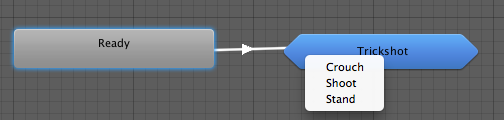
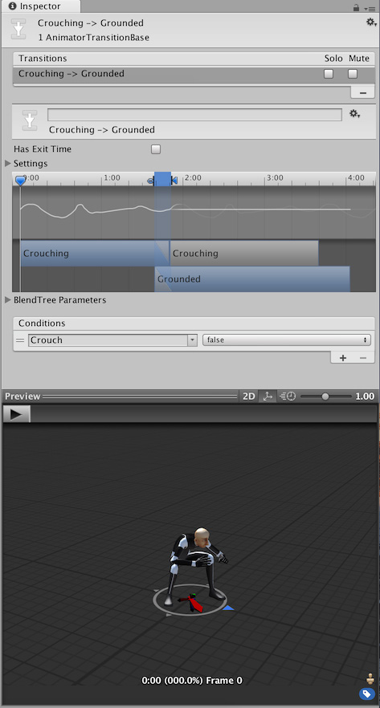
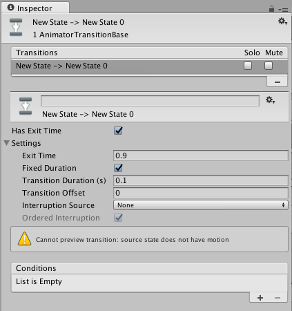
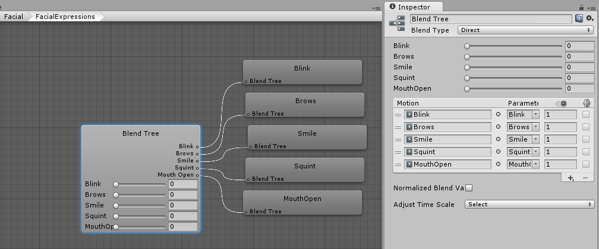

# Unity 动画控制器 Animation Controller
  
## 【百日挑战73】unity教程之2D游戏开发初步（三十六）
  
前言：在上期教程中，我们在官方一个新的2D的RPG游戏教程系列《RubyAdventure2DRpg》中，我们开始学习unity的动画模块中关于 2D 精灵动画 2D Sprite Animation的基础知识，了解了动画术语、unity 动画工作流程、Animation clip 动画剪辑、Animator Controller 动画控制器和 Animator Component 动画组件，今天我们将学习通过 Animator 组件控制物体移动和 Animation 窗口创建精灵动画。
  
背景：在先前的教程中，你创建了一个世界，其中包含大量对象、可四处走动的角色以及要避开的敌人。但是到目前为止，所有这些都是静态的。在本教程中，你将向角色添加动画。
  
目标：1. 为Robot添加动画系统，并通过脚本控制 2. 为Ruby添加技能动画，并通过脚本控制
  
一、基础知识讲解 —— 2D 精灵动画 2D Sprite Animation
  
二、步骤：
  
1. 为Robot添加 Animator 组件：  
  1.1 进入机器人预制件的预制件模式（提醒：请双击 Project 窗口中的预制件，或双击 Hierarchy 窗口中的 Robot 右侧的箭头）。
  1.2 在  Inspector 中，单击Add Component 按钮并搜索 Animator 组件。
  
  Animator 组件用于管理对象的动画状态，其最重要的设置是 Controller 设置。
  Controller 组件负责基于你定义的规则来选择要播放的动画（例如，当角色的速度大于 0 时，使角色从站立变为奔跑动画）。你稍后将探索这些规则。
2. 创建新的 Controller并添加组件到对象：  
  现在，我们创建一个新的 Controller 并在 Robot Animator 上设置这个 Controller：
  2.1 在 Project 窗口中，在 Assets\2DBeginnerTutorialResources\Art\ 找到 Animations 文件夹。此文件夹包含项目的预制动画和动画控制器，可用于加快后续的工作速度。我们试着自己创建一个Robot的动画控制器。我们在 Assets\Art\ 路径下创建一个 Animations 目录，在其中再创建一个 Robot 文件夹，存放与Robot相关的动画切片和控制器。

  2.2 在 Animations/Ruby 文件夹中，右键单击并从上下文菜单中选择 Create > Animator Controller。将此 Controller 命名为 Robot。
  2.3 现在，为了方便统一管理，在你添加到机器人预制件上的 Animator 中（如果你已退出预制件模式，请确保再次进入该模式），将你刚创建的 Controller 分配到 Controller 设置中（单击小圆圈并在随后打开的窗口中找到 Controller，或者将 Controller 从 Animation 文件夹拖放到 Controller 设置中）。
3. 创建动画剪辑：
   你现在已经有了 Animator Controller，接下来便需要创建供 Controller 使用的动画。动画是存储在 Project 文件夹中的资源。
  
   要在 Unity 编辑器中创建动画，请使用 Animation 窗口：
   3.1 选择 Window > Animation > Animation 来打开 Animation 窗口（或按快捷键 Ctrl+6），打开Animation窗口。
   如果在 Hierarchy 中选择 Robot，或者在机器人预制件上处于预制件模式，则 Animation 窗口将显示以下消息：“To begin animating [预制件/游戏对象名称], create an Animation Clip” 以创建动画片段。
   3.2 单击 Create 按钮。
   3.3 现在选择 Animations/Ruby 文件夹作为保存动画剪辑的位置，然后将该动画剪辑命名为“RobotLeft.anim”并自动保存在该文件夹。
  
  Animation 窗口被分为两个部分：  
  · 左侧用于动画化属性，配置动画剪辑  
  · 右侧的时间轴显示每个属性的关键帧  
4. 创建帧动画更改精灵：
   你可以使用 Animator 对游戏对象任何组件中的任何属性进行随时间变化的动画处理。此动画可以是你希望随时间推移而变化的精灵颜色，也可以是大小变化。在此示例中，你希望更改 Sprite Renderer 使用的精灵。
  你可以通过更改 Sprite Renderer 随时间推移而使用的精灵来产生移动的视觉效果。
   4.1 找到素材：你可以在 Art > Sprites > Characters 文件夹内（位于名为 MrClockworkSheet 的精灵图集 (Sprite Atlas)（也称为精灵图集 (Sprite Sheet)中）找到你的机器人的所有精灵。
  可以看到，单个图像上有多个精灵，就像你先前看到的瓦片面板 (Tile Palette) 一样。在此示例中，你已经将图像拆分为不同的精灵。
   4.2 单击图像旁边的箭头以查看所有精灵观察这些精灵，不同的运动形态对应不同的被切割的部分精灵素材：

   4.3 我们需要侧向行走的精灵，按住 Shift 键并单击第一个和最后一个行走动画精灵（面朝左）以选择以下全部四个精灵：
   · MrClockworkWalkSides1
   · MrClockworkWalkSides2
   · MrClockworkWalkSides3
   · MrClockworkWalkSides4
  4.4 将这些精灵的关键帧拖放到 Animation 窗口中。此时将使用四个精灵来创建一段动画。如果无法拖放则应该注意是否选中Prefab。
  
  4.5 在 Animation 窗口中按 Play 按钮以预览这个左向行走的动画：

  可以看到，这个动画运行得太快了。这是因为这个动画的样本大小为 60；该值是在 Animation 窗口内的动画属性上方的 Samples 设置中设定的。

  请注意，时间轴在 0:00 与 1:00 之间有 60 条垂线。因此，动画会以每秒 60 帧的速度运行，这意味着 Unity 每秒将精灵渲染 60 次。

  你还可以看到你的 4 个精灵只作为一行中的前 4 个条目，这意味着每个精灵仅在屏幕上停留 1/60（即 0.016）秒。要解决此问题，只需将 Samples 值设置为 4 即可使动画每秒仅更改 4 次，因此每个精灵会在屏幕上停留 ¼ 秒，相当于一秒钟4帧

注：在unity的2022版本中是在Animation界面中将Samples隐藏起来的，想要将Samples显示出来十分简单，点击右上角的三个点，再点击Show Sample Rate即可。

  你的动画现在应该会以恰当速度运行。请尝试将该值更改为所需的随意值，使动画以你想要的速度运行。

  这样就完成了一段动画！我们还需要再完成 3 段动画才能得到一套完整动画！
5. 为Robot创建更多动画：
  5.1 要创建动画，请单击窗口左上方的当前动画名称，选择 Create New Clip，输入名称 Right_Run，然后选择 Animation 文件夹，生成一个新的Animation Clip：

  你可能想知道我们将如何制作向右行走的动画，因为没有机器人向右行走的精灵。那是因为我们可以翻转向左行走的动画。
  Sprite Renderer 具有 Flip 属性，可以在指定方向上反转动画，请注意你可以将所有属性动画化。

  5.2 通过创建新剪辑、拖动 4 个向左的精灵并将 Samples 值设置为 4 来重新创建向左动画。
  5.3 单击 Add Property，然后单击 Sprite Renderer 旁边的三角形，再单击 Flip X 旁边的 + 图标：

  现在，你可以为每个帧更改属性的值。你要设置相应值的当前帧显示在 Animation 窗口顶栏前进按钮旁的框中，并在左侧用白色竖条表示。
  5.4 在帧 0 和帧 4 上的时候，选中属性名称旁的切换开关，即可将属性设置为 true，这样 Flip 在整个动画中将保持选中状态：

  请注意，对于第 0 帧和第 4 帧，有菱形会与 Flip 属性显示在同一行中。这些菱形表示该帧的值发生改变。如果没有菱形，则该帧将使用最后设置的值。

  预览动画，可以发现Robot已经可以向右走了。这个参数让Sprite沿着X轴方向反转。
6. 对向上奔跑和向下奔跑的动画重复上述操作（创建新剪辑、拖动帧、将 Samples 值设置为 4）。
  你现在已准备好机器人的所有行走动画，接下来便可以设置你在先前创建的 Controller 了！

作业：按照步骤5的方法，继续通过 Add Property 属性为Robot创建向上走和向下走的动画片段。
  
## 【百日挑战74】unity教程之2D游戏开发初步（三十七）
  
前言：在上期教程中，我们在官方一个新的2D的RPG游戏教程系列《RubyAdventure2DRpg》中，我们开始学习unity的动画模块中关于 2D 精灵动画 2D Sprite Animation的动画控制器创建和动画剪辑的创建，我们为Robot建立了动画控制器，通过调整Sample控制动画播放的速度，创建了分别往四个方向走到的帧动画剪辑，通过添加 Property 对 Sprite Renderer 进行调整，今天我们将继续学习通过代码配合 Animation Controller 来控制和管理动画各个状态。
  
目标：最终实现我们的Robot向上下左右四个方向的移动。对于玩家，除了各个方向的动画状态，我们还需要实现在不同的走路方向播放对应的动画剪辑。
  
步骤：
  
1. 构建 Controller：  
   Controller 定义动画之间的关系，比如如何从一段动画切换到另一段动画。
  
  要编辑 Controller，请执行以下操作：
  · 打开 Animator 窗口（菜单：Windows > Animation > Animator）再选中Asset中的 Animation Controller 或者双击 Asset 中的 Animation Controller。

  注意：确保在 Project 文件夹中选择了机器人预制件或 Robot Animator。
  Animator 分为两个部分，左侧是 Layers 和 Parameters，右侧是动画状态机 (Animation State Machine)：

让我们简单介绍下这个动画控制器面板中各个功能：

  · 第 1 部分：Layers 和 Parameters

  Layers 可用于 3D 动画，因为你可以将动画用于角色的不同部分。
  Parameters 由我们的脚本用来向 Controller 提供信息，我们需要使用不同的参数控制动画剪辑，如状态的转换，具体的做法是**在 Parameters 设置参数，然后与脚本进行对接，在 Controller 中将参数与状态进行配置，这样一来，我能就可以通过程序来控制参数，再通过 Controller 控制具体的动画状态。状态再对应相应的动画剪辑，**这就是unity动画管理机制的大致原理。

  · 第 2 部分：动画状态机

  **动画状态机以图形方式显示动画的所有状态以及如何从一段动画过渡到另一段动画。**
  
  现在，你已经创建四段动画，第一段动画 RobotLeft 链接到 Entry（入口，其指向的State是游戏开始时最先播放的动画剪辑），这表示此动画将在游戏开始时播放。

  如果我们保持这个属性直接点击Play话可以看到我们的Robot不断在反复播放向左走的动画，无论是向左移动还是向右移动，都只能播放一个向左走的动画，这并不符合我们的要求。

  你可以在所有动画之间创建链接来表示诸如“玩家使机器人向右转时，将机器人的方向从左更改为右”的目的。但是这意味着每段动画都将有三条链接，即每条链接指向其他的每段动画。
  要创建动画状态的过渡很简单，具体做法是：在一个状态中右键点击，然后选择"Make Transition"，会多出一个箭头，点击指向需要过渡到的另一个状态即可实现A状态到B状态的转换。如果需要转换回去做法也是同样的，在B状态 Make Transition 到 A状态即可，如图，你还可以配置动画过渡过程中的各种属性，实现较为麻烦，而且没有这个需求，我们不妨使用一种更加简单的思路。

  我们引入一种更简单的方法是使用混合树 (Blend Tree)，这种混合树允许你根据参数来混合多段动画，根据参数值的不同播放不同的动画剪辑。

  此处，你将根据机器人的移动方向来混合四段动画（说白了就是根据方向判断播放哪段动画），使 Controller 能够播放正确的动画。
2. 使用混合树：  
  背景：关于混合树，用更加通俗的方式讲，已知2D游戏中表示角色的的移动方向，我们需要一个具有两个参数的二维矢量（Vector2(x, y)），而这里表示方向的x,y值只有可能是1，0，-1，我们可以用Vector2表示的方向作为相应的参数挂接对应的动画剪辑，比如这张图中，向左移动，Vector2中的值应该是(-1. 0)，我们就可以用这个值对应Robot_Left对应的动画剪辑，以此类推，上，左，右也是Vector2参数挂接对应的参数值，方能通过这种不同方向赋予不同的Vector2值再去对应动画剪辑，来较好的描述角色移动的方式来选择对应的动画状态，最终实现根据移动方向选择播放对应的动画。

  既然blendtree可以将动画与参数对接，让我们试着使用混合树：  

  2.1 首先通过选择动画并按 Delete 或者通过右键单击动画并选择 Delete来删除所有动画。
  2.2 然后，在图中某处右键单击，然后选择 Create State > From New Blend Tree。

  现在，游戏开始时，Controller 将播放 Blend Tree。但是现在是空的，所以不会播放任何动画。

  2.3 双击 Blend Tree 以将其打开，通过鼠标中键拖曳移动视图。

  2.4 现在单击该“Blend Tree”节点，随即将在 Inspector 中显示相应设置：  

  Blend Type 设置可定义混合树将使用多少参数来选择要播放的动画。你希望 Blend Tree 使用两个参数来控制水平和垂直方向的更改，因此请将 Blend Type 设置为 2D Simple Directional。

  例如，当机器人的水平移动为 0 且垂直移动为 -1 时，Blend Tree 应选择 RobotDown 动画，而机器人的水平移动为 1 且垂直移动为 0 时，Blend Tree 应选择 RobotRight 动画。

  在 Blend Type 设置下，你现在将有两个 Parameters 设置。Controller 使用这些值来选择要播放的动画。

  目前，Controller 使用了自动创建的 Blend 参数，但是我们将用名为 Move X 和 Move Y（分别表示水平和垂直移动量）的 2 个参数来替换该参数。
3. 设置参数：Move X 和 Move Y：  
  blendtree显示 Parameters 左侧参数及其对应的值。要创建新参数，请执行以下操作：
  3.1 直接找到 Animator 窗口左侧的 Parameters 选项卡：

  你需要两个浮点型参数，因为你希望参数值的范围是 -1.0 到 1.0。

  3.2 选择并单击 Blend 参数（浮点型），然后将该参数重命名为 Move X，从而完成重命名操作。

  3.3 接下来，单击搜索栏旁边的 + 图标，选择 Float，并将新参数命名为 Move Y。

现在，当选择 Blend Tree 时，可以在 Inspector 顶部的下拉选单中选择这两个参数，Blend Type选择 2D Freeform Directional ，从而告诉你的 Blend Tree 应当观察这两个参数来选择要播放的动画。
4. 然后，单击 Motion 部分（用于添加参数和动画剪辑）底部的 +，然后选择 Add Motion 字段，此操作需要执行 4 次，因为你要混合四段动画。你的 Inspector 最后应如下所示：
5. 现在将四段动画（RobotLeft...）剪辑拖放到名为 Motion 的四个字段中，并将各个 Pos X 和 Pos Y 值设置为相应的方向，让值在不同区域播放不同动画，如下所示：
  
  · Left：Pos X = -0.5 Pos Y = 0
  · Right：Pos X = 0.5 Pos Y = 0
  · Up：Pos X = 0 Pos Y = 0.5
  · Down：Pos X = 0 Pos Y = -0.5

  你的 Inspector 应如下所示：

  该图像表示混合，其中每个motion对应一个区域，即蓝色菱形表示一个剪辑，红色点是由 2 个参数的值给出的位置。
6. 现在，这个点位于中心，相当于 Move X 和 Move Y 等于 0。但是你可以看到，例如，如果将 Move Y 设置为 1，则红点将移至正方形的顶部（因为 Y 是垂直位置），然后混合树将选择顶部动画（向上奔跑），因为这是最接近的动画。
  
你可以在 Animator 中的 Blend Tree 节点上看到针对 Move X 和 Move Y 模拟的值：
7. 或者，也可以直接移动红点。在 Inspector 的底部，你将看到 Controller 针对给定值选择的动画的模拟情况。按 Play 按钮可查看播放的动画效果。
8. 恭喜！你已完成对动画混合树 (Blend Tree) 的设置！
  
现在，只需将数据从 EnemyController 脚本发送到 Controller，即可使动画在游戏中正常运行。
  
### 【百日挑战75】unity教程之2D游戏开发初步（三十八）
  
前言：在上期教程中，我们在官方一个新的2D的RPG游戏教程系列《RubyAdventure2DRpg》中，我们开始学习unity的动画模块中关于 2D 精灵动画 2D Sprite Animation的动画控制器创建和动画剪辑的创建，我们为Robot创建了动画控制器，介绍了动画控制器面板中各个功能，了解了混合树方案的可行性和实现原理，通过配置混合树根据参数来混合多段动画，并根据参数值的不同播放不同的动画剪辑。今天我们将继续学习通过代码配合 Animation Controller 来控制和管理动画各个状态。
  
目标：通过代码控制AnimationController，实现将参数从Enemy的Controller组件发送到Enemy的AnimationController，再在动画控制器的blendtree中将传来的参数与动画剪辑挂接，让Robot表现为：根据不同的方位全自动切换四个不同的动画剪辑。  
因此，我们要结合之前计时器转换的方向对应参数传递给AnimationController根据blendtree参数对应的方向来播放对应的Animation Clip。
  
步骤：  
9. 将参数发送到 Animator Controller：  
  
  要将参数发送到 Animator Controller，请执行以下操作：
  
  9.1 打开 EnemyController 脚本。
  传参之前，先添加对 Animator Controller 的调用，我们要进行交互的组件是 Animator，就像我们先前需要与游戏对象上的组件进行交互时一样，我们将使用 GetComponent 在 Start 函数中获取这个组件并存储在类变量中。

  开始之前，我们需要声明 Animator 字段，然后在Start方法中获取组件 Animator（实例化对象），就能获取到EnemyController组件被挂载的gameObject的 Animator 组件，并通过animator组件获取 EnemyController 的参数传递给 Animator Controller。

  9.2 现在，我们需要将参数值发送到 Animator。我们可以通过 Animator 上的 SetFloat 函数来完成此操作，因为我们使用的是浮点型参数。

  9.3 我们需要获取x轴和y轴移动方向，SetFloat 函数将参数名称作为第一个参数，并将该参数的当前值作为第二个参数（此处是给定方向上的移动量），因此在 FixedUpdate 函数中，你将添加：
  我们希望当Robot沿纵向和横向运动时传递对应的参数给animator，因此在移动的第一部分的 MovePosition 方法的 if(vertical) 代码块内（该方法需要在FixedUpdate中使用），添加以下代码，将向Move X和Move Y两个参数的值定义好传给animator即可：

  由于当Robot沿Y轴移动时x轴的值必为0，所以需要使用 animator.SetFloat("Move X", 0); ，Y轴的值为 direction（方向），跟随角色移动的方向变化。
请注意animator.SetFloat()方法内的参数名称需要与动画控制器面板中 Parameters 完全一致（包括大小写、标点，空格）。

  在此部分中，如果机器人垂直移动，则会将 0 发送到 horizontal 参数，而 direction 定义机器人是向上还是向下移动。

  9.4 同理，在 else 代码块中，当机器人水平移动（沿X轴移动）时，向 Animator 发送相反值：

  9.5 现在，你可以通过在 EnemyController 组件分别配置vertical的布尔值，点击 Play 并检查 Animator 在四个方向上是否为机器人选择了正确的动画！
  
拓展阅读：
  
混合树（BlendTree）
  
游戏动画中的一个常见任务是在两个或多个相似的动作之间混合。也许最著名的例子是根据角色的速度混合行走和奔跑动画。另一个例子是角色在跑步过程中向左或向右倾斜。
  
区分过渡树和混合树非常重要。虽然两者都用于创建流畅的动画，但它们用于不同类型的情况：
  
· 转换用于在给定的时间内从一种动画状态平滑过渡到另一种动画状态。转换被指定为动画状态机，如果转换速度很快，从一个动作过渡到完全不同的动作通常没问题。
· 混合树用于通过不同程度地合并多个动画的各个部分来平滑地混合多个动画。每个动作对最终效果的贡献量都使用混合参数进行控制，该参数只是数字之一动画参数
与动画师控制器。为了使混合运动有意义，混合的运动必须具有相似的性质和时间。混合树是动画中的一种特殊类型的状态状态机。
  
类似动作的示例可以是各种步行和跑步动画。为了使混合效果良好，剪辑中的运动必须在归一化时间的相同点进行。例如，步行和跑步动画可以对齐，以便脚与地板接触的时刻发生在归一化时间的相同点（例如，左脚在 0.0 时击球，右脚在 0.5 时击球）。由于使用了标准化时间，因此剪辑的长度是否不同并不重要。
  
### 【百日挑战76】unity教程之2D游戏开发初步（三十九）
  
前言：在上期教程中，我们在官方一个新的2D的RPG游戏教程系列《RubyAdventure2DRpg》中，我们完成学习unity的动画模块中关于 2D 精灵动画 2D Sprite Animation的制作Robot动画部分，我们实现了通过获取x轴和y轴移动方向，然后将参数发送到 Animator Controller并在blendtree根据参数值的不同播放不同的动画剪辑，最后简单的了解了混合树的作用及应用场景。今天我们将继续学习通过代码配合 Animation Controller 来实现玩家角色的动画。
  
目标：我们最终实现的效果是当Ruby站着不动时候播放Idle状态的动画，当我们操作Ruby沿着四个方向移动会播放四个方向奔跑状态的动画剪辑，当停下来的时候则转换为走路状态，当触碰到减血物体（damageZone或Robot）时则从Move转换为Hit状态，表现为Ruby会闪烁并减少生命值，再转换回Idle状态，不同方向都有相应的 Animation Clip播放。
  
开始之前让我们来简单介绍下动画状态机，动画过渡及过渡属性。
  
步骤：
  
1. 为Ruby添加 Animator 组件：  
  1.1 进入Ruby预制件的预制件模式，添加Animator组件，在 Assets\2DBeginnerTutorialResources\Art\Animations 中找到为你提供的用于 Ruby 的 Controller（你仅需要添加到 Animator 并通过代码控制它），将 Animator 添加到 Ruby 预制件，并将 Animation 文件夹中找到的 RubyController Animator 分配到 Controller 字段。
  AnimationClips 目录下是关于Ruby的动画剪辑，可通过 Animation 窗口预览各种状态的动画剪辑。

  1.2 如果在选中预制件后打开 Animator，你将看到如下所示的 Ruby Animator Controller：其中包含了四个状态（Idle、Moving、Hit、Launch），且根据箭头各状态之间可互相切换，每个State都由一个blendtree组成，通过 Animation Clip 与参数来控制具体的动画。
  其中Parameters包含了 速度Speed、朝向Look X、Look Y，而布尔型的Hit、Launch分别代表是否受击和是否发射飞弹。（暂时忽略 Launch 状态，这是下一个关于发射飞弹的教程中要处理的小干扰！）

  现在，只需注意我们有三个状态（即三个混合树）：
  · Moving：在 Ruby 奔跑时播放。
  · Idle：Ruby 站立不动时播放。
  · Hit：Ruby 与机器人或伤害区域碰撞时播放。

  状态之间的白色箭头是过渡。这些箭头定义状态之间的移动。例如，Hit 与 Launch 之间没有过渡，因为 Ruby 受伤害时无法投掷飞弹！

  不同状态间的转换称为 AnimationTransition，点击箭头然后查看 Inspector 以了解该过渡的设置：可以看到其中的Transition properties，各属性说明可参考官方的文档。

  其中的大多数设置（例如图形上的条形）可用于 3D（可以混合动画）。在 2D 中，只有部分设置对我们有用。

  注意，Has Exit Time 为取消选中状态。这表示 Moving 动画不会等到状态机进入到 Idle 动画之前结束，而是会立即发生变化。

  我们这里先关心 Has Exit Time 属性，该属性是一种不依赖参数的特殊过渡。通俗的说就是设置动画是否有退出时间。但是，它依赖状态的标准化时间。选中此选项可在 Exit Time 指定的具体时间进行过渡。
  我举个例子，假如发生了Idle到Moving状态的转换，而Moving的剪辑没有播放完，如果勾选 Has Exit Time 属性，即可在Settings设置Exit Time（退出时间），即使Moving状态没有播放完，也会立即执行转换进入Idle状态。
  
  最重要的部分是底部的 Conditions 部分。在两种情况下会发生过渡：
  · 如果没有条件，则在动画结束时发生过渡。此处不属于这种情况，因为我们的动画正在循环播放，但是如果你查看从 Hit 到 Idle 的过渡，就属于这种情况：已勾选 Has Exit Time，并且没有设置任何条件，这意味着 Hit 动画将播放一次，然后过渡回 Idle。
  · 或者，我们可以根据你的参数设置条件。在此处，如果 Ruby 的速度小于 0.1，则状态机将从 Moving 过渡到 Idle。

  你可以单击其他过渡来查看这些过渡，并了解过渡的运行方式。
  
  说白了就是用于配置转换状态的条件，即符合何种条件会发生这种转换，这里设置为 Speed Greater 0.1，即当Ruby的Speed参数等于1时候，发生Idle到Moving状态的转换。

  而对于Idle到Hit状态转换的 Conditions 则是布尔值Hit为真时发生该状态的转换，反之不会发生该State的转换。

  你可能想知道，为什么 Hit 参数在 Parameters 列表中显得有所不同。这是因为该参数不是浮点参数。被击中不是移动或速度之类的“量化值”，而是一次性事件。

  这种类型的参数称为“触发器”。如果将该参数用作过渡条件，则从代码激活触发器时（本例中为角色被击中时）将发生过渡。
  
### 【百日挑战78】unity教程之2D游戏开发初步（四十）
  
前言：在上期教程中，我们在官方一个新的2D的RPG游戏教程系列《RubyAdventure2DRpg》中，我们完成学习unity的动画模块中关于 2D 精灵动画 2D Sprite Animation的制作Robot动画部分，我们学习了关于的动画状态机，动画状态，动画过渡及过渡属性的基础知识，今天我们将继续学习通过代码配合 Animation Controller 来实现玩家角色的动画。
  
我们需要添加的代码分为以下几大类：(在相应位置使用TODO注释创建任务列表，可快速速定位)
//TODO: 1. 创建 Animator 对象和相关数据对象
//TODO: 2. 传值，把 Animator Controller 中 Blend tree 要使用的参数传递过去。
// 3个不同的动画状态：Idle、Moving、Hit
// 我们需要在特定的逻辑下传递对应的参数到 Animation Controller 的 blendtree，这些参数包括：Speed控制Idle和Move状态间的转换，Look X和Look Y控制Ruby的朝向，Launch控制发射飞弹（参数在Animator的Parameters中）
  
步骤：
  
修改 RubyController 脚本：  
你现在已了解 Controller 的设置方式，接下来让我们修改 RubyController 脚本，将这些参数发送到 Controller。
  
1. 就像机器人一样，添加一个 Animator 变量，然后在 Start 函数中使用 GetComponent 来获取 Animator 并存储在该变量中。
2. 你还将添加一个名为 lookDirection 的 Vector2 变量（初始化为 (1,0)）：
  
   为什么要存储观察方向？因为与机器人相比，Ruby 可以站立不动。她站立不动时，Move X 和 Y 均为 0，因此状态机不知道要使用哪个方向（除非我们指定方向）。
  
3. 让 lookDirection 存储 Ruby 的观察方向，这样你就始终可以向状态机提供方向。实际上，如果你查看 Animator 参数，这个参数预期为 Look X 和 Look Y 参数。
4. 我们需要把向Hit传值true的方法添加到 ChangeHealth() 方法内，一个操作就是触发 Hit 动画。需要通过 animator.SetTrigger (“触发器名称”) 将触发器发送到 Animator。因此，在 ChangeHealth 函数的 if(amount < 0)  代码块内，我们只需添加以下一行即可实现如果Ruby受伤则播放受伤动画剪辑。现在，代码应如下所示：
5. 再看到角色移动部分：
   我们前期介绍了我们通过在Update方法中捕获每帧用户键盘的输入来操作角色移动的，按键输入的方式不同角色移动方向也不同，所以animator获取移动轴和传参的方法也应该放在Update方法内。但这里涉及到Idle和Moving两个状态，这里需要自行处理其中的逻辑。
6. · Vector2 move = new Vector2(horizontal, vertical);
  position = position + move * speed * Time.deltaTime;
  你将输入值存储在名为 move 的 Vector2 变量中，而不是独立设置用于移动的 x 和 y。
7. 功能与你之前设置的完全相同，但只需在一行中同时处理 x 和 y。
  · if(!Mathf.Approximately(move.x, 0.0f) || !Mathf.Approximately(move.y, 0.0f))
8. 检查 move.x 或 move.y 是否不等于 0。
9. 使用 Mathf.Approximately 而不是 ==，这是因为计算机存储浮点数的方式意味着精度会有很小的损失。
  
  所以，不应测试完美的相等性，因为最终结果应该是 0.0f 的运算可能会得出类似 0.0000000001f 的结果。Approximately 会考虑这种不精确性，如果除去这种不精确性可以认为数值相等，将返回 true。导致我们看到不期望的结果
  
  · lookDirection.Set(move.x, move.y);
  
  注意：关于 Mathf.Approximately 方法描述：比较两个浮点值，如果它们相似，则返回 true。（浮点数不能精确的使用相等运算符比较）
  浮点不精确性使得使用相等运算符比较浮点数不精确。 例如，(1.0 == 10.0 / 10.0) 不会每次都返回 true。 Approximately() 比较两个浮点数，如果它们相互之间的差值处于较小值 (Epsilon) 范围内，则返回 true。
10. 如果 x 或 y 不等于 0，则表示 Ruby 在移动，请将你的观察方向设置为你的 Move 向量，然后 Ruby 应该看向自己移动的方向。如果她停止移动（Move x 和 y 等于 0），则不会发生这种情况，look 将保持为 Ruby 停止移动之前的值。
  
  注意，你本可以设置 lookDirection = move，但这是另一种分配向量的 x 和 y 的方式。
  
· lookDirection.Normalize();
11. 然后，在 lookDirection 上调用 Normalize，从而使长度等于 1。如前面所述，Vector2 类型存储位置，但也可以存储方向！
  
  (1,0) 将位置存储为世界中心右侧的一个单位，但还存储向右方向（如果你追踪从 0,0 到 0,1 的箭头，就会得到向右的箭头）。

  向量的长度定义该箭头的长度。例如，等于 (0,-2) 的 Vector2 的长度为 2 并指向下方。如果我们归一化该向量，结果将变为等于 (0,-1)，这样仍然会指向下方，但长度为 1。

  通常，你将会归一化用于存储方向的向量，因为这时的长度并不重要，方向才重要。

  注意：千万不要归一化用于存储位置的向量，因为这种向量更改 x 和 y 时会更改位置！
  · animator.SetFloat("Look X", lookDirection.x);
  · animator.SetFloat("Look Y", lookDirection.y);
  · animator.SetFloat("Speed", move.magnitude);
12. 完成以上步骤之后，接下来你便有三个代码行，用于将数据发送到 Animator，表示观察方向和速度（move 向量的长度）。
  如果 Ruby 不动，值将为 0，但如果她移动，则为正数。长度始终为正数，根据上文中的示例，向量 (0,-2) 的长度为 2！

  RubyMoveController 最终代码如下：
  
  然后，你可以按 Play，并尝试移动 Ruby 来测试所有动画。运行操作Ruby移动可以发现根据朝向选择不同的动画剪辑，当触发减血方法会播放受击动画（闪烁）。
  
## 1. Animation Controller 动画控制器

Animator Controller允许您安排和维护一组动画剪辑和相关的动画过渡

对于一个角色或对象。在大多数情况下，有多个动画并在某些游戏条件发生时在它们之间切换是正常的。

例如，您可以从步行切换动画剪辑，每当按下空格键时跳转到动画剪辑。但是，即使您只有一个动画剪辑，您仍然需要将其放入 Animator Controller 中才能在游戏对象

Animator Controller 引用了其中使用的动画剪辑，并使用状态机，它可以被认为是动画剪辑和过渡的流程图，或者是在 Unity 中用可视化编程语言编写的简单程序。

当您开始使用动画窗口为游戏对象设置动画时，或者当您将动画剪辑附加到游戏对象时，Unity 会自动创建一个动画控制器。

要手动创建 Animator Controller，请右键单击 Project 窗口，然后单击Create > Animator Controller。

## 2. Animation State 动画状态 和 Animation State Machine 动画状态机

动画状态  Animation Stat 是动画状态机 Animation State Machine 的基本构建模块

当角色处于一个状态下时，每个状态都包含一个动画序列（或混合树）在播放

下图中是动画状态属性面板：

* Motion (动作、运动): 当前状态下挂接的动画片段（Animation clip）或 混合树（blend tree）
* Speed （速度）： 默认为1 ，当前 Motion 的播放速度，可以设置为负数，比如 -1 就是倒放 。另外，启用参数以使用脚本中的自定义值修改速度。例如，您可以将速度与自定义值相乘以减慢或加快播放速度。
* Motion Time（运动时间）：用于播放此状态的动作的时间。启用参数以使用脚本中的自定义值控制运动时间。
* Mirror （镜像）：此属性仅适用于具有人形动画. 启用以镜像此状态的动画。启用参数以启用或禁用脚本的镜像。
* Cycle Offset （周期偏移）：添加到运动状态时间的偏移量。此偏移不影响运动时间。启用参数以指定脚本的循环偏移。
* Foot IK （足部反向动力学）：此属性仅适用于具有类人动画的状态。启用此状态的 Foot IK。
* Write Defaults（写入默认值）：AnimatorStates 是否为不通过其运动设置动画的属性写入默认值。
* Transitions（过渡）：源自此状态的转换列表。

### 子状态机  Sub-State Machine

虽然叫子状态机，实际上的作用是一个状态机的包，可以内部包含多个状态机

和普通的状态机相比，它是六边形的：

子状态机只是一种在编辑器中直观地折叠一组状态的方式，因此在过渡到子状态机时，必须选择要连接到子状态机的哪个状态。

子状态机中有一个名称以 Up 开头的额外状态,Up 状态表示“外部世界”，也就是上一层

## 3. Animation Transaction 动画过渡

动画过渡允许状态机从一种动画状态切换或混合到另一种。

转换不仅定义了状态之间的混合应该花费多长时间，而且还定义了它们应该在什么条件下激活。

在动画控制器中，可以将转换设置为仅在某些条件为真时发生。

例如，您的角色可能具有“巡逻”状态和“睡眠”状态。您可以将巡逻和睡眠之间的转换设置为仅在“警觉”参数值低于某个水平时发生。

### 过渡属性

* Has Exit Time :退出时间是一种不依赖于参数的特殊转换。相反，它依赖于状态的标准化时间。检查以使转换在Exit Time中指定的特定时间发生。
* Settings: 包含以下详细过渡设置的折叠式菜单。
* Exit Time: 
    如果选中Has Exit Time，则此值表示转换可以生效的确切时间。  
    这以标准化时间表示（例如，退出时间为 0.75 表示在播放了 75% 动画的第一帧上，退出时间条件为真）。在下一帧，条件为假。
    对于循环动画，每个循环都会评估退出时间小于 1 的过渡，因此您可以使用它来为每个循环的动画中的适当时间安排过渡。

    具有退出时间的转换大于 1 只计算一次，因此它们可用于在固定数量的循环后在特定时间退出。例如，退出时间为 3.5 的转换在三个半循环后评估一次。
* Fixed Duration 固定时间:  
  如果选中Fixed Duration框，则转换时间以秒为单位进行解释。如果未选中“固定持续时间”框，则转换时间被解释为源状态标准化时间的一小部分。
* Transition Duration 过渡时间：  
  转换的持续时间，以标准化时间或秒为单位，取决于固定持续时间模式，相对于当前状态的持续时间。
  
  这在过渡图中可视为两个蓝色标记之间的部分。
* Transition Offset 过渡偏移:  
  在转换到的目标状态下开始播放的时间偏移量。  
  例如，值 0.5 表示目标状态在其时间线的 50% 处开始播放。
* Interruption Source （中断源）:  
  使用它来控制可能中断此转换的情况。  
  从概念上讲，中断顺序的工作方式就像转换排队，然后解析从插入的第一个转换到最后一个转换的有效转换。
  * None : 不要再添加任何过渡。
  * current State:从当前状态排队转换。
  * Next State :排队从下一个状态的转换。
  * Current State then Next State:将当前状态的转换排队，然后将下一个状态的转换排队。
  * Next State the Current State:将下一个状态的转换排队，然后将当前状态的转换排队。
* Ordered Interruption （有序中断）:  
  确定当前转换是否可以被其他转换打断，与它们的顺序无关
  * Checked:  已找到有效的转换或当前转换。
  * Unchecked: 已找到有效的转换。
* Conditions （条件）:  
  转换可以有一个条件、多个条件或根本没有条件。如果您的过渡没有条件，Unity 编辑器仅考虑Exit Time，并且在达到退出时间时发生过渡。如果您的转换有一个或多个条件，则必须在触发转换之前满足所有条件。

    条件包括：

    - 事件参数（条件中考虑的值）。
    - 条件谓词（如果需要，例如，浮点数的“小于”或“大于”）。
    - 参数值（如果需要）。

    如果您为过渡选择了Has Exit Time并且有一个或多个条件，请注意 Unity 编辑器会在退出时间。这使您可以确保在动画的某个部分发生过渡。

> 注意：
> * 从一种状态到另一种状态的转换完成后，Animator 中的触发参数会立即禁用，这意味着您可以安全地在门打开和关闭等情况下重复使用相同的参数。这意味着以后，用于检测玩家角色是否靠近门的脚本只需要引用一个参数即可。

### 过渡图形

要手动调整上面列出的设置，您可以直接在字段中输入数字或使用转换图。当操作视觉元素时，转换图会修改上述值。

使用以下方向更改图表视图中的转换属性：

* 拖动持续时间“out”标记以更改过渡的持续时间。
* 拖动Duration “in”标记以更改过渡的持续时间和Exit Time。
* 拖动目标状态以调整Transition Offset。
* 拖动预览播放标记以在检查器底部的预览窗口中拖动动画混合。

### 混合树状态过渡

如果属于此转换的当前或下一个状态是混合树状态，则混合树参数出现在检查器中。调整这些值以预览在将混合树值设置为不同配置时过渡的外观。如果您的混合树包含不同长度的剪辑，您应该测试同时显示短剪辑和长剪辑时的过渡效果。调整这些值不会影响过渡在运行时的行为方式；它们仅用于帮助您预览过渡在不同情况下的外观。

## 4. Blend Tree 混合树状态过渡

### 概念

Blend Tree 混合树可以平滑混合多个不同的动画片段；通过 Animator Controller 中的参数可以控制混合树中动画片段（不同状态）间的转换

使用动画剪辑和输入参数来设置混合树时，Inspector 窗口通过图形显示动画如何随着参数值变化而进行组合（拖动滑动条时，树根中的箭头会改变其着色以显示其控制的动画剪辑）。

> 注意：
> * 为了使混合后的运动合理，要混合的运动必须具有相似的性质和时机。
> * 混合树是动画状态机中的一种特殊状态类型。

### 分类

* 1D 混合：根据单个参数来混合子状态
* 2D 混合：根据两个参数来混合子状态  
  * __2D Simple Directional__: 在运动表示不同方向（例如“向前走”、“向后退”、“向左走”和“向右走”或者“向上瞄准”、“向下瞄准”、“向左瞄准”和“向右瞄准”）时使用。根据需要可以包括位置 (0, 0) 处的单个运动，例如“空闲”或“瞄准”。在 Simple Directional 类型中，在同一方向上_不_应该有多个运动，例如“向前走”和“向前跑”
  * __2D Freeform Directional__：运动表示不同方向时，也使用此混合类型，但是您可以在同一方向上有多个运动，例如“向前走”和“向前跑”。在 Freeform Directional 类型中，运动集应始终包括位置 (0, 0) 处的单个运动，例如“空闲”。
  * __2D Freeform Cartesian__：最好在运动不表示不同方向时使用。凭借 Freeform Cartesian，X 参数和 Y 参数可以表示不同概念，例如角速度和线速度。一个示例是诸如“向前走不转弯”、“向前跑不转弯”、“向前走右转”、“向前跑右转”之类的运动。
* 直接混合 Direct：直接控制所有子状态机,为每个动作分配一个相应参数以直接控制其在树中的混合权重
    
  在混合面部表情的混合形状动画时，或者在将附加动画混合在一起时，这可能特别有用。  
  

### 核心参数

* 混合图像  
  参数在最小值和最大值之间变化时，混合图显示每个子运动的影响。每个运动都显示为一个蓝色小金字塔（第一个和最后一个仅显示一半），如果您在其中一个上单击并按住鼠标左键，相应运动将在下面的运动列表中突出显示。每个金字塔的顶峰定义运动具有最大影响的参数值，表示其动画权重为 1，而其他动画的权重为 0。这也称为运动的__阈值__。
    
  红色竖条表示__参数 (Parameter)__ 的值。如果在 Inspector 底部的 Preview 中按 Play 并左右拖动图中的红色条，可以看到参数值如何控制不同运动的混合。

* 阈值 Thresholds
   阈值就是在 blendTree 中参数的范围极限值。  
   可以通过单击图中的对应蓝色金字塔并将其向左或向右拖动来更改运动的阈值。如果未启用“Automate Thresholds”开关，还可通过在 Threshold 列的数字字段中输入数字来编辑运动列表中某个运动的阈值。  
   运动列表下方是 Automate Thresholds 复选框。启用此复选框将在参数范围内均匀分布运动的阈值。例如，如果有五个剪辑且参数范围为 –90 到 +90，则阈值将按顺序设置为 –90、–45、0、+45 和 +90。  
    Compute Thresholds 计算阈值 ：  
      下拉选单将根据您选择的数据设置阈值；这些数据是从动画剪辑的根运动中获得的。可供选择的数据是速度 (Speed)、速度 (Velocity) x、y 或 z 以及以角度或弧度表示的角速度 (Angular Speed)。如果您的__参数__对应于这些属性之一，则可使用 Compute Thresholds 下拉选单来计算阈值。

  

* 时间尺度 Time Scale  
  您可以使用动画速度数字字段（带有时钟图标的列）更改动画剪辑的“自然”速度。例如，您可以通过指定值 2.0 将步行剪辑的速度加倍。Adjust Time Scale > Homogeneous Speed按钮重新调整剪辑的速度，使它们与所选参数的最小值和最大值相对应，但保持与最初的相对速度相同。  
  

* 镜像 Mirror  
  启用镜像复选框以镜像任何人形动画。剪辑在动作列表中。镜像使用与其未镜像的原始动画相同的动画，而不会使内存和空间增加一倍。  
  但是，在混合树中镜像动画不会创建完全对称的动画。Unity 会自动添加偏移量，以确保跑步循环、步行循环和脚步等动画与其他动画剪辑和混合树正确混合。例如，如果您的混合树中有一个人形机器人向左运行，并且您启用 Mirror 以将人形机器人切换为向右运行，则脚循环需要匹配，以便左脚同时接触地面。这可确保镜像的混合树与周围的剪辑和其他尚未镜像的混合树正确混合。

* 2D 混合图  
  运动以蓝点显示。未分配动画剪辑或混合树的运动对混合没有影响，并显示为灰点。您可以通过单击图中的运动点来选择该运动。选择运动后，该运动对混合空间中每个点的影响便会可视化为蓝色区域。此区域位于该运动的位置正下方时最强，此情况下运动具有完全影响，意味着其动画权重为 1 而其他动画的权重为 0。逐渐远离该位置后，此运动的影响将减弱，而其他运动的影响将增强。
    
  红点表示两个__参数__的值。如果在 Inspector 底部的 Preview 中按 Play 并在图中四处拖动红点，可看到参数值如何控制不同运动的混合。在图中，您还可以看到每个运动的影响（表示为围绕每个运动的圆圈）。您将看到，如果将红点移动到表示运动的其中一个蓝点上，则该运动的圆圈将获得其最大半径，而其他所有运动的圆圈将缩小到看不见。在几个运动之间的位置，附近的多个运动将对混合产生影响。如果选择其中一个运动以查看该运动的蓝色影响区域，您可以看到在四处移动红点时，运动的圆形大小与影响区域在不同位置的强度完全对应。  
  未选择任何运动时，该图显示所有影响区域的混合，在单个运动主导的位置，颜色会更蓝，而在许多运动对混合有影响的位置，蓝色会更淡。

 

 

> 参考资料：
> * [CC 动画官方教程](https://learn.unity.com/tutorial/control-animation-with-an-animator)
>
> * [动画控制器官方文档](https://docs.unity3d.com/2023.1/Documentation/Manual/class-AnimatorController.html)
> * [动画过渡官方文档](https://docs.unity3d.com/2023.1/Documentation/Manual/class-Transition.html)
> * [状态机转换中断----官方博客文章](https://blog.unity.com/technology/wait-ive-changed-my-mind-state-machine-transition-interruptions)

 

 

配套视频教程：
[https://space.bilibili.com/43644141/channel/seriesdetail?sid=299912](https://space.bilibili.com/43644141/channel/seriesdetail?sid=299912)

文章也同时同步微信公众号，喜欢使用手机观看文章的可以关注

