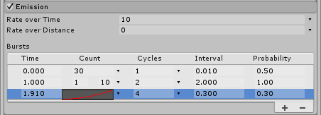

# 内置例子系统入门
  
## 【百日挑战89】unity教程之2D游戏开发初步（四十九）
  
前言：在上期教程中，我们复习了unity动画系统的动画控制器、动画状态和动画状态机、动画过渡、混合树状态过渡的相关概念，把《RubyAdventure2DRpg》教程的修复机器人部分收尾了，相信通过这么多期的讲解，大家也对unity 2d中的动画系统有了基本的了解，从今天开始，我们将学习使用unity视觉特效（VFX），实现Robot头顶冒烟的效果。
  
众所周知，特效在影视、游戏行业都有非常广泛的使用，作为游戏表现层不可或缺的部分，游戏中各种特效,如喷火、冰冻、闪光、爆炸和魔法等效果都需要特效师的参与，在character方面，打架时出现的刀光剑影、射击时枪口的火光，VFX可谓是功不可没，它可以很大程度的增强游戏画面的表现力，烘托氛围，让游戏表现部分看上去更加精美。
一句话：特效就是为了实现华丽的视觉效果。
根据组件功能和使用场景的不同，我们可以使用不同的组件来实现各种各样的视觉特效，其中最核心的就是粒子系统。
  
1. 粒子系统
1.1 粒子系统（Practice System）摘要：粒子在交互式应用程序中广泛用于创建各种效果。粒子系统可以创建数十个甚至数百个粒子，这些粒子是很小的图像，具备方向、速度、生命周期、颜色和许多其他属性。通过使用所有这些参数，粒子可以共同创建诸如烟雾、火花甚至火之类的效果。
  
1.2 概念：一个粒子系统可以模拟并渲染许多称为粒子的小图像或网格以产生视觉效果。系统中的每个粒子代表效果中的单个图形元素。系统共同模拟每个粒子以产生完整效果的印象。
  
需要创建诸如火、烟或液体之类的动态对象时，由于很难用网格 (3D) 或精灵 (2D) 描绘这种对象，因此粒子系统可以弥补它们的不足。网格和精灵更适合于描绘诸如房屋或汽车之类的实体对象。
  
1.3 开始之前：在开始之前我们应该选择适合的粒子系统解决方案，简而言之内置粒子系统是通过粒子系统组件实现，功能相对简单。Visual Effect Graph是更高级的粒子系统解决方案，可以通过可视化脚本的形式编写更为复杂的特效。
  
在《RubyAdventure2DRpg》教程项目中，我们本期教程先带大家使用内置粒子系统实现Robot冒烟的效果。
  
2. 内置粒子系统
2.1 简介：Unity 的内置粒子系统可用于为 Unity 支持的每个平台创建粒子效果。内置粒子系统在 CPU 上模拟粒子行为，这种技术具有以下主要优点：
  
· 您可以使用 C# 脚本与系统及其中的各个粒子进行交互。
· 粒子系统可以使用 Unity 的基础物理系统，从而与场景中的碰撞体进行交互。
  
为了使用内置粒子系统，你需要使用粒子系统(Particle System)组件。
  
2.2 粒子系统组件简介：粒子系统 (Particle System) 组件通过在场景中生成和动画化大量小型 2D 图像来模拟流体实体，如液体、云和火焰。
  
3. 让我们开始吧
  
3.1 准备精灵
  
Unity 提供了一种全面的粒子系统。在本教程中，你将使用粒子系统为我们的游戏创建一些粒子，例如损坏的机器人的烟雾效果。
  
你将使用精灵作为图像以放置在粒子上。这些图像的精灵图集可以在 Art > Sprites > VFX 中找到，名为 ParticlesSheet。
1.定位 Assets\2DBeginnerTutorialResources\Art\Sprites\VFX 目录，找到 ParticleSpriteAtlas，我们需要对这个完整的Sprite进行切割，将 Type 设置为 Multiple，并将 PPU 保留为 100。
2.打开 Sprite Editor 按照4x4的规格以对不同精灵进行切片。
3.精灵图集拆分为 4 列和 4 行。我们将使用前两个冒烟的Sprite来制作我们的特效，有关精灵图集切片的提醒，请参阅“精灵动画”教程。
准备好所有精灵后，我们来创建一个效果。让我们先从烟雾效果开始。
  
3.2 生成粒子特效——烟雾效果
  
要创建新的粒子效果，请执行以下操作：
1.使用 Hierarchy 窗口右上角的 Create 按钮（选择 Effects > Particle System）。
2.此时将为你创建一个默认的粒子系统。现在应该看起来像是向上喷射的白点。将这个粒子系统重命名为 SmokeEffect。默认会创建一个Particle System组件，此时你应该可以在场景中看到我们默认的粒子特效了。
3.在 Inspector 中，可以看到粒子系统 (Particle System) 由多个部分组成，这些部分均可折叠，用于定义该系统及其创建的粒子的所有属性。
  
4.替换素材：首先，将白点更改为烟雾精灵。在 Texture Sheet Animation 部分中，单击旁边的圆圈以启用该部分。单击该部分的名称以打开该部分：
  
4. 挑选随机精灵
  
通常可以使用此部分中的设置来对粒子图像进行动画处理。但在这里，你可以通过这种方式为每个粒子挑选随机精灵。
1.将 Mode 设置为 Sprites。
2.我们需要生成多个粒子，而且我们有多个烟雾的Sprite，单击显示的精灵条目旁边的 + 按钮，这样便可以得到 2 个精灵。
3.将精灵图集效果中的烟雾精灵分配给这些属性。
  
至此，我们就先完成了粒子的创建，接下来我们将对粒子系统细节进行微调
  
## 【百日挑战90】unity教程之2D游戏开发初步（五十）
  
前言：在上期教程中，我们开始接触unity的粒子系统，了解了特效的基本概念，作用，unity引擎的内置粒子系统和Visual Effect Graph的区别，我们开始使用粒子系统组件来实现我们的粒子特效，最后我们通过拆分Sprite，创建Particle System组件完成了最基本的粒子，使其在场景中显示烟雾特效，今天我们将在微调粒子特效的过程中学习使用Particle System组件
  
但是，我们也发现了其中一些问题，首先就是烟雾太大了，其次，Particle System只播放了第一个Sprite，我们希望通过随机数随机播放两个Sprite，让他们能不断随机切换播放两个不同的Sprite。
  
4.单击 Start Frame 属性右侧的小下拉箭头，选择 Random Between Two Constants，然后输入 0 和 2。系统将选择一个介于 0 到 2（不包括 2）之间的随机数，即 0 或 1，并对粒子使用相应的精灵，这样就能随机播放两个Sprite。
  
5.最后，单击 Frame over time 旁边的黑框，这个框显示曲线帧中相应的帧随时间的变化情况（从帧 0 到 1）。图像的横轴代表时间，纵轴代表对应的帧，在烟雾上升时候你根本不想要任何动画，所以请右键单击最右边的点，然后按 Delete 键：
  
现在，你可以在 Scene 视图中看到粒子正在随机使用一个或另一个烟雾精灵（如果已经创建这些精灵）。我们的烟雾变得更加丰富了，而且可以看到它是由两个Sprite共同组成的。而且我们烟雾在上升时候也不会切换到另一个烟雾Sprite。
  
下一步是更改创建这些烟雾精灵的方式，因为现在它们在方向上过于分散。我们接下来要修改烟雾上升的形态，我们希望烟雾是直线上升的。
  
6.在 Inspector 中打开 Shape 部分。Scene 视图将显示发射粒子的锥体。将 Radius（起始点锥体大小） 设置为 0，因为你希望所有粒子都从一个点发出（该值将更改为 0.0001，但别担心，仅仅是因为这个值不能为 0，所以 Unity 会将其设置为最接近零的值）。
7.我们希望烟雾发出的点固定到Robot头顶，将角度更改为大约 5 度，这样可以减少粒子的分散程度并以更加准直的线条生成：
  
现在我们可以看到我们的烟雾呈三角锥体的形状，烟雾散开的范围变小了，从圆心点点发散，更加符合物理逻辑了，至此，我们就完成了烟雾的制作。
你的粒子将以正确的方向开始，但移动速度还是太快。而且由于所有粒子都形状相同，所以看上去不够真实。自然界的事物是混乱的，因此要让事物看起来不那么虚假，诀窍就是增加随机性——真实感来源于随机。
  
4. 为粒子增加随机性
在 Particle System 顶部的主要部分中，查找以下三个设置：
  
1.Start Lifetime：粒子的生命周期是指粒子在屏幕上被粒子系统销毁之前存在的时间（说白了就是粒子在游戏中显示的时间）。如果在 Scene 视图中缩小，你会看到所有粒子都差不多在同一位置消失。这是因为粒子的初始速度和生命周期都相同，因此最终在相同的距离处被销毁，这样烟雾消失的高度就不一样。
单击 Start Lifetime 右侧的小向下箭头，然后选择 Random Between Two Constants（随机在两个阈值间切换）。输入 1.5 和 3。粒子的消失速度会更快，因为现在它们的生命周期更短了。而且粒子也会以更加自然的方式消失，因为粒子现在的生命周期各不相同。
2.Start Size：这是粒子创建后的大小。现在只设置了一个数字，因此所有粒子的大小都相同。和上面一样，选择 Random Between Two Constants 并分别设置为 0.3 和 0.5，这样来引入一些随机性。粒子现在变小了且大小不同，但移动速度仍然过快。
3.Start Speed：通过将这个属性设置为 Random Between Two Constants，可以降低粒子的初始移动速度并增加一些随机性。将两个常量分别设置为 0.5 和 1，这样有的烟雾的粒子上升的快些有的慢些。
粒子开始看起来像烟雾得多了。但是看起来仍然很奇怪，因为当粒子在生命周期即将结束时，就会突然消失。
  
至此烟雾的 形状和移动的效果基本符合我们的期望，这样我们的就通过随机开始生命周期、随机大小、随机速度的方式让烟雾看上去有的粗有的细有的浓有的稀有的高有的低。但现在的问题是烟雾消失的时候不是淡出的而是直接被销毁，给人感觉很生硬，也不符合常识，现实生活中的烟雾是慢慢消散的。
  
5. 使粒子逐渐消失
为了让这种变化没那么剧烈，我们要让粒子随着生命周期接近最大值的过程中逐渐增大透明度，直至变得完全透明。
这样，粒子就不会突然消失，而是会逐渐消失。
1.单击名为 Color over Lifetime 部分的名称旁边的小白色圆圈以启用该部分，然后打开该部分。
2.为了更轻松查看所有部分，别忘了可以通过单击已打开的部分的标题来关闭相应部分。单击 Color 旁边的白色方框以打开 Gradient Editor：
  
这一渐变显示了粒子颜色在生命周期内的变化方式。底部箭头是颜色，顶部箭头是透明度（在游戏美术用语中称为“Alpha”）。
在创建粒子时，可在左侧看到颜色和 Alpha；在粒子寿命结束时，可在右侧看到颜色和 Alpha。
在左右两侧之间，可以看到粒子将遵循的颜色和 Alpha 演变过程。
3.目前，粒子将保持完全白色，并且其 Alpha 值将保持不变。所以让我们更改一下：选择右上角的箭头，然后将 Alpha 从 255 更改为 0，这样Alpha的取值就会从255~0，即不透明逐渐过渡到完全透明最后被Destroy。
  
你快要完成了！现在的烟雾看起来好多了，但现在烟柱大小是固定的，我们希望烟柱随时间变小，所以还缺少一个小细节：烟雾应该随着时间而逐渐消失，因此，粒子的大小在其生命周期内也应改变，即逐渐变小。
  
就像 Color 一样，还有一个名为 Size Over Lifetime（生命周期大小） 的部分，因此请启用并打开这一部分，打开这个曲线编辑器。
  
4.单击 Size 框，然后查看显示在 Inspector 底部的曲线，默认是从0逐渐增大：
  
目前，粒子系统的功能与你想要的效果刚好相反，因为粒子从大小 0 开始并在其生命周期内增大，直到生命周期结束时达到最大大小（这是一个乘数，因此不会破坏我们先前设置的大小的随机性）。
  
5.我们可以通过将第一个点上调至 1 并将最后一个点下调至 0 来进行反转。
注意：可以使用每个点旁边的切线来控制曲线，并进行各种尝试，直到在 Scene 视图中获得所需的结果。要让烟雾更加美观，你需要使曲线保持平坦直到曲线大约一半的位置，然后骤然下降。
  
可以看见，最终效果就是一开始是一大片的烟，上升时候逐渐变小，这正是我们想要的效果。现在你的烟雾看起来非常漂亮了，接下来便可以将烟雾添加到你的机器人。
  
6. 将特效添加到Robot
我们需要为Robot预制件添加新的特效对象，合成新的预制件。
  
步骤：
1.让我们将前面制作的烟雾特效SmokeEffect保存为新的预制件。
2.打开Robot的预制件进入Prefab编辑模式。
3.将烟雾特效的预制件拖到Robot的下面使其成为Robot的子对象，调整烟雾的位置使其处于Robot的头顶，保存即可。
  
再次运行，便可看到机器人头顶冒烟的效果且跟随Robot一起移动，这里还有些细节可以完善：我们希望当Robot移动的时候，烟雾要斜着移动而不是垂直移动，方向与Robot的移动方向相反。
  
打开SmokeEffect预制件，找到组件的Simulation Space。由Local改为World，根据世界坐标位置而不是局部坐标位置模拟粒子的物理效果。
  
最终效果如图，至此我们就完成了烟雾粒子的创建。
  
## 【百日挑战91】unity教程之2D游戏开发初步（五十一）
  
前言：在上期教程中，我们通过调整烟雾粒子的Particle System组件属性，通过修改Shape属性改变烟雾上升的形态、Start Lifetime修改粒子生命周期、Start Speed修改粒子起始速度、Start Size修改粒子大小，Size Over Lifetime修改粒子透明度实现淡出的效果，最终我们通过随机开始生命周期、随机大小、随机速度的方式让烟雾看上去有的粗有的细有的浓有的稀有的高有的低。且一开始是一大片的烟，上升时候逐渐变小，设置Simulation Space 让烟雾不随机器人移动，学习了如何生成并美化烟雾粒子特效，这期我们将通过代码控制烟雾特效。
  
背景：如果让 Ruby 向机器人投掷一个齿轮来修复机器人，机器人会继续冒烟。你需要在机器人修好后禁用烟雾粒子效果。
  
6. 代码中的粒子系统
我们将通过代码实现：Robot最初是出于Broken状态的，所以头顶会冒烟，玩家击中Robot之后将其修复后Robot头顶不再冒烟，而实现不冒烟效果我们既可以使用gameObject.SetActive(false); 方法隐藏粒子对象，也可以直接用Destroy()方法销毁对象。
  
要在机器人修好后使烟雾停止，请执行以下操作：
1.声明对象：由于EnemyController 组件本身并没有粒子系统的对象，我们需要该变量设置为公有的，为其赋值——包含粒子组件的游戏对象。打开 EnemyController 脚本，并添加一个名为 smokeEffect 且类型为 ParticleSystem 的公共成员。
  
2.现在，在你的机器人预制件的 Inspector 中将出现一个新字段 smokeEffect。将包含烟雾效果的对象拖入该字段中。这也是获取游戏对象的一种方式，还有一种是使用GameObject.Find("对象名").GetComponent<组件名称>().方法; 这个在以后单例模式会讲。
你可能好奇，既然你分配的是游戏对象，为什么类型为 ParticleSystem 而不是 Gameobject。
这是因为，如果公共成员是 Component 或 Script 类型（而不是 GameObject），则当你在 Inspector 中为这个成员分配游戏对象时，Unity 将存储游戏对象上的组件类型。
这样可以避免必须像以前一样在脚本中执行 GetComponent。此外还会阻止你将没有该组件类型的游戏对象分配给该设置。这也避免了用户不小心制造 bug。
  
3.最后，在 EnemyController 脚本的 Fix 函数中，添加：
Destroy(smokeEffect);
  
运行效果如下：
  
但是这样的作法未免有些太“粗暴”了，在实际生活中，烟雾不可能瞬间消失，我们的做法是让新的烟雾粒子不再冒出，已经生成的烟雾粒子直到生命周期结束才消失更合适。因此我们可以调用特效本身的方法：
smokeEffect.Stop();
  
现在，运行游戏，在修复了机器人后，烟雾便会停止，新的粒子不再生成，且已生成的烟雾粒子也会在生命周期结束后才消失，而不是瞬间消失。
  
顺便提醒一下，为什么要使用 Stop，而不是像先前飞弹那样简单地销毁粒子系统？
如果感到好奇，找到原因的最佳方法是不断尝试：
注释掉 smokeEffect.Stop() 并在下一行添加 Destroy(smokeEffect.gameObject)。
运行场景，并修复机器人。
你可以看到烟雾会立即消失。这是因为当粒子系统被销毁时，也会销毁当前正在处理的所有粒子，即使是刚刚创建的粒子。
但 Stop 只会阻止粒子系统创建粒子，已经存在的粒子可以正常结束自己的生命周期。这比所有粒子突然消失要看起来自然得多。
  
8. 创意时刻
你现在已经知道了粒子系统的工作方式，接下来便可以尝试为游戏创建更多的粒子。本教程开始时的精灵图集有一个示例粒子效果，可用来表示击中后的效果以及拾取生命值可收集对象。
不必担心做得完全一样，只要发挥创造力并尝试不同的设置，就可以通过反复尝试和试错来了解它们的工作方式。
  
下面的一些信息可以帮助你实现所需的目标：
  
通过学习本节课试着为Ruby增加吃草莓的特效、齿轮击中Robot的特效
  
以下是官方教程中的更多提示：
  
  
## 【百日挑战92】unity教程之粒子系统知识点总结（一）
  
前言：在前面的教程中我们已经创建了机器人头顶冒烟的特效并通过代码实现在玩家修复之后停止播放，在完成粒子系统组件最基本的学习之后，让我们复习前面用到的基础概念，对unity的整个特效部分有更加细致的了解。
  
## 1. 特效 VFX 概述

### VFX ： Visual Effects 视觉特效
  
视觉效果（有时缩写为VFX ）是在电影制作和视频制作中的真人镜头环境之外创建或操纵图像的过程。
  
游戏中的视觉特效从功能上可以分为两类：
  
* 环境影响旨在表示物理事件，例如火灾、雨水、薄雾或爆炸；当然，也可以延伸到非自然现象，例如魔法等。
* 游戏效果旨在增强或吸引对特定用户交互的关注。例如，您可以在选择对象时添加发光效果，或者在游戏内成就附带的庆祝效果，巫师三中的调查视角就是一个很好的例子。实际上这种特效，可以理解为对UI的增强。
  
常被用作各种特效动画、技能系统、以及一些视觉细节表示；能大幅度提升游戏的整体视觉效果，使游戏变得更加生动。2D、3D游戏中，都应该尽可能地去添加这些特效。
  
### 视觉特效艺术家
  
视觉特效艺术家通常负责任何移动但不是角色或动物的计算机生成图像 (CGI) 。
  
* 如果它不动（如树或建筑物），它可能是由 3D 艺术家制作的，包括 3D 建模师和纹理艺术家。
* 如果是动画角色，则可能是角色艺术家、装配艺术家或动画师的责任。
  
大多数 VFX 艺术家将在传统艺术原则（如颜色、纹理和构图）方面有基础。他们还将熟悉物理和流体动力学，以了解液体、布料类型或粒子在不同条件下的行为。
  
除了 Unity，VFX 艺术家可能会使用或熟悉其他软件程序，包括：
  
* 2D 图像编辑软件，例如Photoshop，用于创建 2D 纹理和粒子
* 3D 建模和动画软件，例如Maya，为某些效果创建 3D 形状
* 专门从事流体和粒子等程序模拟的软件，例如Houdini
  
## 2. Unity 特效系统
  
分类：
  
在 Unity 官方文档中，共列出5种特效分类：

| 功能     | 名称               | 描述                                                     |
| -------- | ------------------ | -------------------------------------------------------- |
| 粒子特效 | 粒子系统           | Unity 特效的核心实现模块，各种粒子效果。有老版和新版之分 |
| 后期光影 | 后期处理和全屏效果 | 设置和使用后期处理 和 Unity 中的其他全屏效果             |
| 后期光影 | 镜头光晕和光晕     | 创建镜头光晕和晕轮效应                                   |
| UI 增强  | 贴花和投影仪       | 创建贴花和投影仪效果                                     |
| UI 增强  | 线路、小径和广告牌 | 渲染线条、轨迹和广告牌                                   |

我们入门系列学习的核心是粒子系统

### 内置粒子系统和 VFX Graph

分类：

* 内置粒子系统：粒子系统是 Unity 默认的基于组件的系统，默认使用 CPU 运算。该解决方案允许通过 C# 脚本对系统及其包含的粒子进行完全的读/写访问。您可以使用粒子系统 API 为粒子系统创建自定义行为。
* VFX Graph 是一个更新的、基于节点的系统，它非常强大，默认使用 GPU 运算。该解决方案可以在 GPU 上运行以模拟数百万个粒子并创建大规模的视觉效果。Visual Effect Graph 还包含一个视觉图形编辑器，可帮助您创作可高度定制的视觉效果。

### 如何选择粒子系统

### 粒子系统用途

* 场景中：装饰场景
* 装备上：类似场景中，提升装备逼格
* 动画中：提升动画效果
* UI中：美化UI
* 技能中：实现炫酷技能效果
* ......

## 3. 内置粒子系统

粒子系统：模拟并渲染许多称为粒子的小图像或网格以产生视觉效果。系统中的每个粒子代表效果中的单个图形元素。系统共同模拟每个粒子以产生完整效果的印象。

需要创建诸如火、烟或液体之类的动态对象时，由于很难用单独的网格 (3D) 或精灵 (2D) 描绘这种对象，因此粒子系统非常有用。网格和精灵更适合于描绘诸如房屋或汽车之类的大的、独立的实体对象。

内置粒子系统，是 Unity 旧版的例子系统，默认使用 CPU 来进行运算处理。

优点：

* 可以使用 C#脚本与系统和其中的单个粒子相互作用
* 粒子系统可以使用 Unity 的底层物理系统，比如重力和碰撞
  
## 【百日挑战93】unity教程之粒子系统知识点总结（二）
  
前言：书接上回，我们了解了Visual Effects 视觉特效相关的负责内容与作用，视觉特效艺术家职责，内置粒子系统和 VFX Graph区别，粒子系统用途，对内置粒子系统做了简单的概述，今天我们继续复习前面用到的基础概念，对unity的整个特效部分有更加细致的了解。
  
## 4. 粒子系统组件

粒子系统组件，应该是Unity中最复杂的组件。

拥有Unity所有组件中最多的属性，为方便起见，inspector 中，将它们组织成称为“模块”的可折叠部分。这些模块记录在单独的页面中。

内置粒子系统原理上其实很简单，由发射器（类似水枪）和粒子（类似水枪中喷出的水）组成，上面提到的那些属性，基本上都是用来描述这两个核心功能对象的

### 发射器 Emitter

用来将粒子发射出去的装置（或者说是生成粒子的装置），虽然不可见，但它还是存在的。比如粒子系统的第一个属性：Duration 时长，描述的就是发射器发射粒子的时间长度，在这个时间长度中，会一直发射粒子，然后停止粒子产出。

### 粒子 Particle

粒子系统中的可视部分，我们看到的效果，就是由这些一个个粒子组成的。

* 粒子本身形状：可以是3D mesh ，也可以是2D 的 Spirit 。但一个粒子系统中，只能使用同一种粒子形状。所以一个复杂的粒子效果，通常是多个粒子系统的组合。
* 描述粒子的其他属性：有很多个，分别分布在粒子系统的不同模块中，比如发射时的属性（每个粒子的生存时间、速度....）、是否发光（光照属性）、是否能碰撞（碰撞属性）...... 通过对这些属性的设置，可以获得各种不同的、纷繁炫丽的视觉效果

### 默认四核心组件

一般来说，添加一个粒子系统到场景中后，会默认开启四个模块，称为粒子系统的“四核心”模块：Particle System 主模块、Emission 发射模块、Shape 形状模块、Renderer 渲染器模块。但也不是每一种粒子特效都要包含这四个模块，在一些特殊情况下，有的模块也可以不要，比如，一些2D特效中，就可以去除 Emission 模块。

### 预览操作面板

在场景视图中，选中包含粒子系统组件的游戏对象，会打开粒子系统预览操作面板

### 4.1 主模块 main

粒子系统模块包含影响整个系统的全局属性。大多数这些属性控制新创建的粒子的初始状态。

主模块标题会显示为包含粒子系统的游戏对象名称

| 名称                          | 功能                                                                                                                                                                                                                                                                                                                                                                                                                                                                   |
| ----------------------------- | ---------------------------------------------------------------------------------------------------------------------------------------------------------------------------------------------------------------------------------------------------------------------------------------------------------------------------------------------------------------------------------------------------------------------------------------------------------------------- |
| Duration 发射器时长           | 粒子系统运行的时间长，即发射器发射粒子总时长度                                                                                                                                                                                                                                                                                                                                                                                                                         |
| Looping 循环                  | 是否循环播放                                                                                                                                                                                                                                                                                                                                                                                                                                                           |
| Prewarm 预热                  | 如果启用，系统将被初始化，就好像它已经完成了一个完整的周期（仅在也启用了循环时才有效）                                                                                                                                                                                                                                                                                                                                                                                 |
| Start Delay 启动延迟          | 粒子系统开始发射前的延迟（以秒为单位）                                                                                                                                                                                                                                                                                                                                                                                                                                 |
| Start Lifetime 启动生命周期   | 粒子的显示时长                                                                                                                                                                                                                                                                                                                                                                                                                                                         |
| Start Speed 启动速度          | 每个粒子在适当方向上的初始速度                                                                                                                                                                                                                                                                                                                                                                                                                                         |
| 3D Start Size 3D起始尺寸      | 想分别控制每个轴的大小，请启用此选项                                                                                                                                                                                                                                                                                                                                                                                                                                   |
| Start Size 起始尺寸           | 每个粒子初始大小                                                                                                                                                                                                                                                                                                                                                                                                                                                       |
| 3D Start Rotation 3D起始旋转  | 想分别控制每个轴的旋转，请启用此选项                                                                                                                                                                                                                                                                                                                                                                                                                                   |
| Start Rotation 起始旋转       | 每个粒子的初始旋转角度                                                                                                                                                                                                                                                                                                                                                                                                                                                 |
| Filp Rotation 翻转旋转        | 使一些粒子向相反方向旋转                                                                                                                                                                                                                                                                                                                                                                                                                                               |
| Start Color 起始颜色          | 每个粒子的初始颜色                                                                                                                                                                                                                                                                                                                                                                                                                                                     |
| Gravity Modifier 重力修改器   | 按比例缩放重力值，0会关闭重力，负值会产生反重力，即朝上飘 ；还可以设置为非固定值或随机值                                                                                                                                                                                                                                                                                                                                                                               |
| Simulation Space 模拟空间     | 控制粒子是否在父对象的本地空间（因此随父对象移动）、世界空间或相对于自定义对象（随您选择的自定义对象移动）进行动画处理                                                                                                                                                                                                                                                                                                                                                 |
| Simulation Speed 模拟速度     | 调整整个系统更新的速度                                                                                                                                                                                                                                                                                                                                                                                                                                                 |
| Delta Time 间隔时间           | 在Scaled和Unscaled之间进行选择，其中Scaled使用Time窗口中的Time Scale值，而Unscaled忽略它。例如，这对于出现在暂停菜单上的粒子系统很有用                                                                                                                                                                                                                                                                                                                                 |
| Scaling Mode 缩放模式         | 如何使用缩放。可选择项为：Hierarchy、Local或Shape。Local仅应用粒子系统变换比例，忽略任何父项。Shape模式将缩放应用于粒子的起始位置，但不影响它们的大小。                                                                                                                                                                                                                                                                                                                |
| Play On Awake 自动播放        | 如果启用，粒子系统会在创建对象时自动启动                                                                                                                                                                                                                                                                                                                                                                                                                               |
| Emitter Velocity 发射器速度   | 选择粒子系统如何计算继承速度和发射模块使用的速度。该系统可以计算速度使用刚体组件，如果存在，或通过跟踪的运动变换组件. 如果不存在 Rigidbody 组件，则系统默认使用其 Transform 组件                                                                                                                                                                                                                                                                                       |
| Max Particles 最大粒子数      | 一次系统中的最大粒子数。如果达到限制，则会移除一些粒子                                                                                                                                                                                                                                                                                                                                                                                                                 |
| Auto Random Seed 自动随机种子 | 如果启用，粒子系统在每次播放时看起来都不同。设置为 false 时，每次播放时系统完全相同                                                                                                                                                                                                                                                                                                                                                                                    |
| Random Seed 随机种子          | 禁用自动随机种子时，此值用于创建独特的可重复效果                                                                                                                                                                                                                                                                                                                                                                                                                       |
| Stop Action 停止动作          | 当属于系统的所有粒子都完成后，就可以使系统执行一个动作。当一个系统的所有粒子都死了，并且它的年龄超过了它的持续时间时，它就被确定为停止了。对于循环系统，仅当系统通过脚本停止时才会发生这种情况。可选择执行的动作有：禁用游戏对象、销毁游戏对象、执行回调事件                                                                                                                                                                                                           |
| Culling Mode 剔除模式         | 选择当粒子离开屏幕时是否暂停粒子系统模拟。可选择选项：  *  Automatic 自动 ：循环系统使用Pause，所有其他系统使用Always Simulate。 *  Pause And Catch-up 暂停并赶上 ： 系统在屏幕外停止模拟。当重新进入视图时，模拟会执行一个很大的步骤，以达到如果它没有暂停的点。在复杂系统中，此选项可能会导致性能峰值。*  Pause ：系统在屏幕外停止模拟 *  Always Simulate 始终模拟：系统在每一帧上处理它的模拟，不管它是否在屏幕上。                                                 |
| Ring Buffer Mode 环形缓冲模式 | 使粒子保持活动状态，直到它们达到最大粒子数，此时新粒子会提前回收最旧的粒子，而不是在粒子的生命周期结束时移除粒子。 可选择选项：  *   Disabled 禁用 ：禁用Ring Buffer Mode ；*  Pause Until Replaced ：在其生命周期结束时暂停旧粒子，直到达到最大粒子限制，此时系统会回收它们，因此它们会作为新粒子重新出现； *  Loop Until Replaced ：在其生命周期结束时，粒子会倒回到其生命周期的指定比例，直到达到最大粒子限制，此时系统会回收它们，因此它们会以新粒子的形式重新出现 |

> 注意：
> * 单次粒子系统显示时长 = Duration + Start Lifetime ； 即 发射器发射粒子的总时间长度+最后一个粒子的存活时间  
> * Gravity Modifier 是重力缩放比例，即 1 相当于 1倍重力，默认重力是 9.81 ，除非你在配置里更改了这个值
> * Simulation Space属性确定粒子是随粒子系统父对象、自定义对象移动还是在游戏世界中独立移动。即：局部坐标还是世界坐标。例如，云、软管和火焰喷射器等系统需要独立于其父游戏对象进行设置，因为即使产生它们的对象四处移动，它们也会在世界空间中留下持续存在的轨迹。如果模拟粒子在两个电极之间产生火花，则粒子应与父对象一起移动。当设置为自定义时，粒子不再相对于它们自己的变换组件移动。相反，它们都相对于指定的 Transform 组件的移动而移动。粒子系统使用自定义变换来计算发射器速度，发射器的继承速度模块和距离上的速率属性用于控制粒子速度和发射。

### 4.2 Emission 发射模块

作用：此模块用来设置发射器的发射频率和时间

包含属性：

| 属性名                            | 功能                       |
| --------------------------------- | -------------------------- |
| Rate over Time 频率随时间变化     | 每秒发射的粒子数           |
| Rate over Distance 频率随距离变化 | 每移动单位距离发射的粒子数 |
| Bursts 突发、爆发                 | 爆发是产生粒子的事件       |

注意：发射速率可以是恒定的，也可以根据曲线在系统的整个生命周期内变化。如果速率随距离模式处于活动状态，则父对象移动的每单位距离都会释放一定数量的粒子。这对于模拟物体运动实际产生的粒子非常有用（例如，泥土路上汽车车轮上的灰尘）。

如果Rate over Time处于活动状态，则无论父对象如何移动，每秒都会发射所需数量的粒子。此外，您可以添加在特定时间出现的额外粒子的爆发（例如，产生烟雾的蒸汽火车烟囱）。

### 4.3 Shape 形状模块

该模块定义了可以发射粒子的体积或表面，以及起始速度的方向。简单来说，Shape属性定义了发射器的形状。

所有形状（除了Mesh）都具有定义其尺寸的属性，例如Radius属性。也可以在场景中，直接使用编辑手柄拖拽，用以更改形状、大小。

形状的选择会影响可以发射粒子的区域，还会影响粒子的初始方向。

不同的形状有不同的属性设置，内容较多，就不再搬了，大家可以直接去看官方文档：https://docs.unity3d.com/2023.1/Documentation/Manual/PartSysShapeModule.html

### 4.4 Renderer 渲染器模块

渲染器模块的设置决定了一个粒子的图像（2D Sprite）或网格（3D Mesh）如何被变换、着色和绘制

详细属性设置，见官方文档：https://docs.unity3d.com/2023.1/Documentation/Manual/PartSysRendererModule.html

核心属性：

* Render Mode ： Unity 如何从图形图像（或网格）生成渲染图像。

* 广告牌渲染模式通常用于2D粒子素材，当您使用 2D 广告牌图形时，不同的渲染模式可以产生各种结果，使其适合特定用途：
  * 广告牌模式对于表示从任何方向（例如云）看起来相似的体积的粒子很有用。
  * 当粒子覆盖地面（例如目标指示器和魔法法术效果）或当它们是平行于地面飞行或漂浮的平面物体时，水平广告牌模式很有用。
  * 垂直广告牌模式使每个粒子保持直立并垂直于 XZ 平面，但允许它围绕其 y 轴旋转。当您使用正交相机并希望粒子大小保持一致时，这会很有帮助。
  * 拉伸广告牌模式以类似于传统动画师使用的“拉伸和挤压”技术的方式强调粒子的表观速度。请注意，在 Stretched Billboard 模式下，粒子被对齐以面向相机，并且还与它们的速度对齐。无论 Velocity Scale 值如何，都会发生这种对齐 - 即使 Velocity Scale 设置为 0，此模式下的粒子仍会与速度对齐。

> 注意：
> 使用广告牌渲染模式时，可以使用法线方向在平面矩形广告牌上创建球形阴影。如果使用将光照应用于粒子的材质，这有助于创建 3D 粒子的错觉。

## 5. 如何设计粒子特效？

1. 总体构思：构思画草图；
2. 时间分割：粒子特效是动态的，必须从时间上先分步骤
3. 空间分割：粒子特效通常是组合状态，所以也需要从空间划分成不同部分
4. 粒子素材：选择合适的素材充当为粒子
5. 轨迹：是否需要轨迹，如何运动
6. 物理系统：是否需要重力，是否需要碰撞等等
7. 编码：是否需要代码控制，考虑和其他对象交互的逻辑

> 参考资料：
>
> [https://www.raywenderlich.com/23120977-vfx-in-unity-getting-started](https://www.raywenderlich.com/23120977-vfx-in-unity-getting-started)

 

 

配套视频教程：
[https://space.bilibili.com/43644141/channel/seriesdetail?sid=299912](https://space.bilibili.com/43644141/channel/seriesdetail?sid=299912)

文章也同时同步微信公众号，喜欢使用手机观看文章的可以关注

