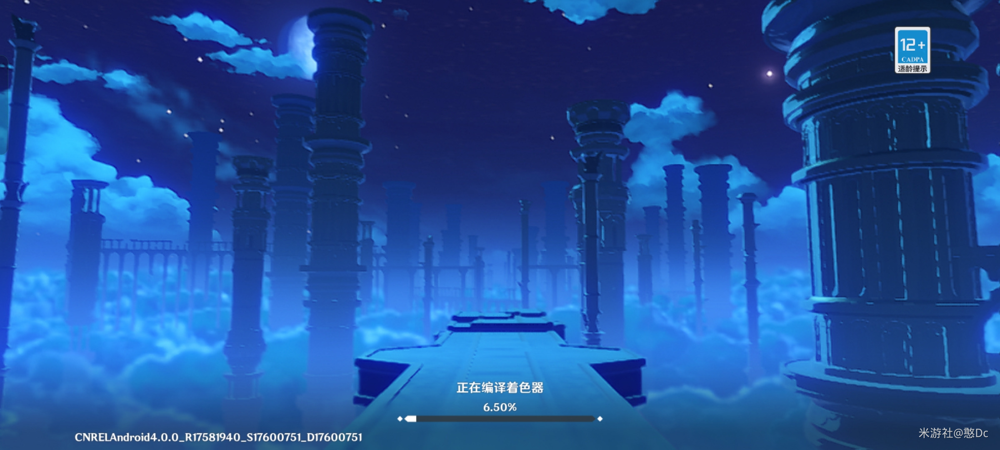

# 【杂谈】聊聊所谓的“编译着色器”到底是干什么的

前言：最近原神4.0版本大更新，在图形方面有了很卓越的进步，除了全局光照让环境照明更加真实，这次更新之后，许多小伙伴也在吐槽第一次进入游戏漫长的等待——“编译着色器”，但很少有人知道为什么第一次启动需要编译着色器，以及编译着色器的目的是为了什么，今天让我简单聊下这个编译着色器是怎么回事。

 

## 一、什么是着色器（shader），他有什么作用？

着色器(shader)是一种计算机程序，它在渲染3D 场景期间计算适当的光、暗和颜色级别，这一过程称为着色。简单的来说就是一种专为图形渲染而生的程序代码，通常运行在gpu上。有了着色器，我们才能看到精美的画面和各种精美的特效，角色等等，他们通常都是类c语言编写的。

常见的着色器语言如下：

- D3D: HLSL
- OpenGL：GLSL
- OpenGLES：ESSL
- Metal：MSL
- Vulkan：SPIR-V

常见的着色器类型如下：

- Vertex Shader 顶点着色器：描述顶点的属性（位置、纹理坐标、颜色等）
- Pixel Shader (fragment shader) 片元着色器：描述像素的特征（颜色、z 深度和alpha值）
- Geometry shader 几何着色器：用途包括点精灵生成、几何曲面细分、阴影体积挤出以及对立方体贴图的单通道渲染。
- Compute shader 计算着色器：顾名思义，执行各种并行计算任务，不限于图形应用程序。
- Tessellation/hull 曲面细分着色器：允许在运行时将更简单的网格细分为更精细的网格。

 

## 2. 游戏引擎是如何针对不同平台编译着色器的

相信对研究图形程序的小伙伴对于引擎跨平台Shader编译不会感到陌生，由于不同平台的图形api大相径庭，各种接口定义完全不同，对于支持跨平台的游戏引擎来说，除了支持每个图形 API 之外，还要思考如何实现跨平台的 Shader 编译。

对于unity而言，将某一个图形 API Shader 编译为字节码或中间格式，通过转换字节码\中间格式生成其他 Shader 的源代码。Unity 5.x 之后采用的是这个方案，通过 HLSL 编译器编译成 DirectX 字节码，然后再通过自研的 HLSLcc 模块（和 UE4 同名，但不是同一套机制）将字节码翻译成目标 API 的 Shader 源码。也就是说，开发者编写的shaderlab是一个高度封装过的语言，最后会被编译到目标平台对应的api上。

.png)

 

## 3. 为何要为每个平台编译着色器？

有人可能就要问了，大家都有gpu啊，为什么要为不同的平台编译呢？因为Shader编译和CPU端代码编译不太一样，究其原因是CPU架构统一，一套X86 X64走天下，故而CPU代码可以提前编译为机器码，但GPU架构众多，需要通过硬件自带的GPU编译器来生成对应的机器码。所以目前Shader的编译，基本是延迟编译的，即在打包时，生成每个Shader变体对应的中间码，然后在用户安装该应用后，在第一次启动时，将该二进制进一步编译为机器码，然后缓存下来供后续重复利用。

早期的图形 API，例如Direct3D 11，需要在发出绘制调用之前进行数十次单独调用以动态配置 GPU 参数。最近的图形 API，例如Direct3D 12 (D3D12)、Vulkan和Metal，支持使用预配置的 GPU 状态信息包（称为管道状态对象 (PSO)）来更快地更改 GPU 状态。

虽然这大大提高了渲染效率，但按需生成新的 PSO 可能需要 100 或更多毫秒，因为应用程序必须配置每个可能的参数。这使得有必要在需要 PSO 使其高效之前很久就生成 PSO。

 

> PSO的概念
>
> 本文档普遍使用术语管道状态对象 (PSO) 来指代 GPU 状态，该名称在 D3D12 API 中使用。其他 API 使用的名称略有不同。比如 Vulkan 使用pipeline，Metal 使用pipeline state。但是，从概念上讲，它们都是相似的。
> 术语PSO 缓存是指包含在构建中的具有 PSO 描述的文件，因此游戏可以及早创建这些状态。换句话说，PSO 缓存是早期创建的 PSO 列表。

 

上文提到Shader编译，然后想将其得到的机器码缓存下来，从而避免重复漫长的编译。那么是如何缓存的呢？答案是通过PSO，即Pipeline State Object，管线状态对象。现代图形API在应用层引入了PSO的概念，其实道理也很简单，如果没有PSO，那么管线状态需要一个个设置，设置管线状态是很影响性能的，因为这会触发管线相关硬件去刷新状态，通知其他相关部件。如果使用PSO，那就相当于把这些状态批量设置，提高性能。在应用层创建PSO对象，并回读PSO的二进制将其缓存起来，这里的PSO二进制不仅仅包含了shader编译好的机器码，还包含了各种渲染状态。如果下次使用时，查询到存在其缓存，那就直接取出来使用，以此提升性能减少可能的卡顿。

 

但是，PSO 数据并不通用。如Unreal Engine 中的每个渲染硬件接口 (RHI)都具有不同的属性，并且可能执行不同的渲染路径。

这导致 PSO 缓存的内容因平台和渲染级别而异。这些 PSO 缓存之间的信息不可互换。例如，使用 D3D12 RHI 运行的游戏收集的缓存不适用于在 Vulkan 上运行的同一游戏。

需要注意的是，OpenGL是不存在PSO概念的，但是它可以通过 各种渲染状态+Shader代码 通过glLinkProgram方法生成对应的Program，然后再使用glGetProgramBinary来获取Program二进制，从而实现类似的效果。

 

## 4. 总结

到这里其实就已经真相大白了，所谓进游戏时候编译着色器，意思就是把收集的PSO提前进行缓存，尽量避免运行时调整各种渲染状态造成的卡顿。但是由于gpu架构的不统一，我们不得不在每次启动前为每台设备配置不同的PSO，考虑到《原神》项目庞大的体积，这就是导致漫长的“编译着色器”的“罪魁祸首”，当然，这并不是一件坏事，相反，这种机制可以有效降低我们游玩过程中的掉帧与卡顿，改善游戏体验，总的来说还是利大于弊的。
