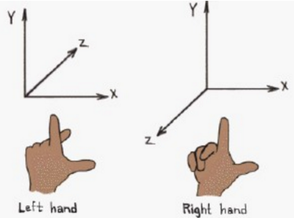
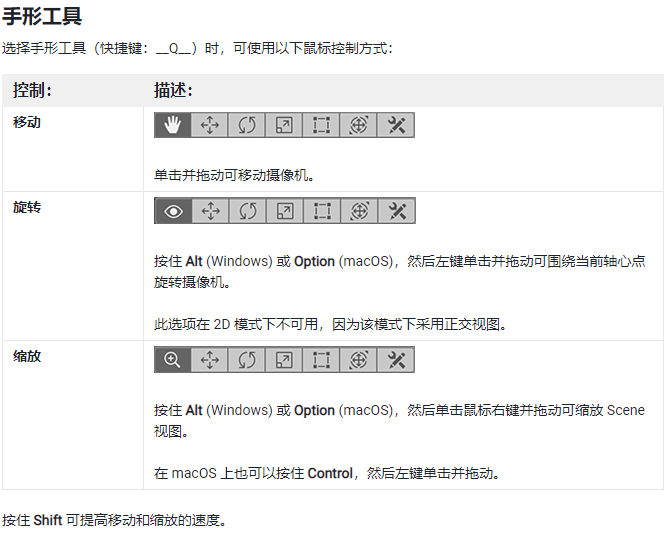
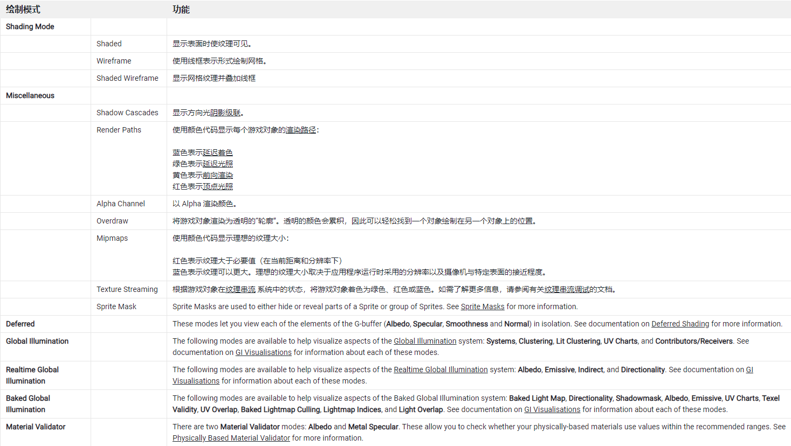
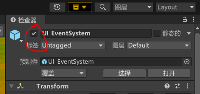
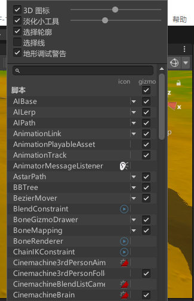

# Scene 视图

> 官方文档：[https://docs.unity3d.com/cn/current/Manual/UsingTheSceneView.html](https://docs.unity3d.com/cn/current/Manual/UsingTheSceneView.html)

Scene 视图是正在创建的世界的交互式视图。Scene 视图可用于选择和定位景物、角色、摄像机、光源和所有其他类型的游戏对象。在 Scene 视图中选择、操作和修改游戏对象是开始使用 Unity 必须掌握的一些必要技能。

> 本节内容：
>
> - 如何在 Scene 中移动，找到合适的操作视角
> - 如何在 scene 中选择游戏对象
> - 如何在 scene 中操作游戏对象位置设定与变换设定
> - scene 控制栏
> - scene 视图摄像机
> - Gizmos 菜单

## 1. 在 Scene 中移动

### 1.1 坐标工具

#### 1.1.1 unity 坐标系统

3D 坐标系是 3D 游戏开发与 VR 开发中的基础概念。一般而言 3D 坐标系都是使用的  
笛卡尔坐标系来描述物体的坐标信息，笛卡尔坐标系：分为左手坐标系与右手坐标系

笛卡尔坐标系简介

平面上的笛卡尔坐标系是一个通过一对唯一指定每个点的坐标系。称为坐标的实数，是从两个固定垂线到该点的有符号距离定向线，称为坐标线、坐标轴或系统的轴（复数axis）。它们相交的点称为原点，坐标为(0, 0)。类似的，三维空间中任意点的位置可以通过三个笛卡尔坐标来指定，这三个笛卡尔坐标是该点到三个相互垂直的平面的有符号距离。更一般地，n笛卡尔坐标指定n维欧几里得空间中任意维度 n的点。这些坐标是从该点到n 个相互垂直的固定超平面的有符号距离。

    

三维空间的笛卡尔坐标系由经过公共点（原点 ）<em>且</em>成对垂直的有序三元线（轴 ）组成<em>；</em>每个轴的方向；以及所有三个轴的单一长度单位。与二维情况一样，每个轴都成为一条数轴。对于空间中的任意点<em>P ，可以考虑通过P</em>垂直于每个坐标轴的超平面，并将该超平面与轴相交的点解释为数字。<em>P</em>的笛卡尔坐标是按所选顺序排列的这三个数字。逆向构造在给定三个坐标的情况下&nbsp;确定点<em>P。</em>

或者，点<em>P</em>的每个坐标可以视为从<em>P</em>到由其他两个轴定义的超平面的距离，其符号由相应轴的方向确定。

每对轴定义一个<em>坐标超平面</em>。这些超平面将空间划分为八个<em style="color: rgb(51, 102, 204);">八分圆</em>。八分圆是：

超链图片

  

坐标通常写为三个数字（或代数公式），用括号括起来并用逗号分隔，如(3, −2.5, 1)或(&nbsp;<em>t</em>&nbsp;,&nbsp;<em>u</em>&nbsp;+&nbsp;<em>v</em>&nbsp;,&nbsp;<em>π</em>&nbsp;/2)。因此，原点的坐标为(0, 0, 0)，三个轴上的单位点为(1, 0, 0)、(0, 1, 0)和(0, 0, 1)。

三个轴上的坐标没有标准名称（但是，有时会使用术语<em>横坐标</em>、<em>纵坐标</em>和<em>应用）。</em>坐标通常用字母<em>X</em>、<em>Y</em>和<em>Z</em>或<em>x</em>、<em>y</em>和<em>z</em>表示。这些轴则可以分别称为<em>X</em>轴、<em>Y</em>轴和<em>Z</em>轴。那么坐标超平面可以称为<em>XY</em>平面、<em>YZ</em>平面和<em>XZ</em>平面。

在数学、物理和工程背景中，前两个轴通常被定义或描述为水平的，第三个轴朝上。在这种情况下，第三个坐标可以称为<em>高度</em>或<em>高度</em>。通常选择方向，以便从点(0, 0, 1)观察时，第一轴到第二轴的 90 度角看起来是逆时针的；<em>通常称为右手</em><em style="color: rgb(51, 102, 204);">定则的</em>约定。——摘自《维基百科》

三维笛卡尔坐标系

 

左手坐标系与右手坐标系

Unity 中使用的是左手坐标系，X 轴代表水平方向 horizontal, Y 轴代表垂直方向 vertical ，Z 轴代表深度。Vector3(x,y,z)

Unity 中坐标系分类：

- word Space （世界坐标系）:用来描述游戏场景内所有物体位置和方向的基准，Unity 场景中创建的物体都是以全局坐标系中的坐标原点（0，0，0）来确定各自的位置。
- local Space （局部坐标系）:是相对于父物体来说也就是当两个游戏对象互为父子关系，那么子物体会以父物体的坐标点为自身的坐标原点。如果游戏对象没有父物体,那么会以这个世界的 0,0 为自身的坐标原点.
- Screen Space（屏幕坐标系）：以像素为单位，左下角是（0，0），右上角为（screen.width, screen.height），Z 的位置是以相机的世界单位来衡量及物体离相机远近。
- viewport （视口坐标）：视口坐标是标准的和相对于相机的。相机的左下角为（0，0）点，右上角为（1，1）点，Z 的位置是以相机的世界单位来衡量的。
- GUI 界面的坐标系：这个坐标系与屏幕坐标系相似，不同的是该坐标系以屏幕的左上角为（0，0）点，右下角为（Screen.width，Screen.height）。

#### 1.1.2 scene 视图坐标工具

需要先打开 3D 视图，在 scene 视图右上角，可以快速调整视角

单击任何锥形轴臂会将 Scene 视图摄像机对齐到该锥形轴臂所代表的轴（例如：顶视图、左视图和前视图）。还可以右键单击该立方体来显示一个包含视角列表的菜单。要返回默认视角，请右键单击场景视图辅助图标，然后单击 Free。

技巧： Shift 键并单击场景视图辅助图标中心的立方体，即可返回**透视图**，使用从侧面和略微从上方观察的角度查看场景。

### 1.2 导航工具

1. 方向键：用方向在键场景中移动，同时按住 shift 可加速
2. 手型工具（Q）+鼠标：
   - 移动：选中后，鼠标左键单击并拖动；
   - 旋转：alt/option，左键单击并拖动围绕当前轴心点旋转视角；2d 模式不可用
   - 缩放：alt/option，右键单击并拖动可缩放

 3. 按住鼠标右键进入“飞越模式”：使用 WASD 键向左/向右/向前/向后移动，使用 Q 和 E 键向上和向下移动。按住 Shift 键可以加快移动速度。 4. 聚焦指定对象:选中对象后，点 F；要将视图锁定到游戏对象（即使游戏对象正在移动），请按 Shift+F。

另外一些快捷键：

## 2. 选择游戏对象（Game Object）

> 对应的官方文档：[https://docs.unity3d.com/cn/2021.1/Manual/ScenePicking.html](https://docs.unity3d.com/cn/2021.1/Manual/ScenePicking.html)

复杂的场景中，可能有成千上万个游戏对象，如何快速选中想要的游戏对象也是一门技术

Unity 会在 Scene 视图中突出显示选择的游戏对象及其子项。默认情况下，选择轮廓颜色为橙色，子项轮廓颜色为蓝色。还可以选择以其他颜色突出显示所选游戏对象的线框(unity 设置中可以更改)。

### 2.1 选中 Game Object

#### 2.1.1 单选

1. 在 Scene 视图中单击游戏对象。如果反复单击重叠的游戏对象之间的共享空间，选择将在这些游戏对象之间循环;
2. 在 Hierarchy 窗口中单击游戏对象的名称(推荐优先使用)

#### 2.1.2 多选

1. 鼠标拖拽矩形框
2. shift + 鼠标左键单击；Ctrl/Command 在选择范围内添加或删除游戏对象。

### 2.2 设置是否允许选中

在 Hierarchy 中，点击游戏对象“拾取”标记，来控制该对象的可选性

- 鼠标左键单击“拾取标记”：该对象和其子对象
- Alt+鼠标左键单击“拾取标记”：仅仅影响对象本身，不影响子对象

> 注意：  
> 在 Hierarchy 窗口中进行的所有场景拾取更改都是持久有效的。每当使用 Select All 或 Deselect All、关闭然后重新打开场景或进行其他操作时，Unity 都会重新应用这些更改。

## 3. 游戏对象定位和变形

> 官方文档：  
> [https://docs.unity3d.com/cn/2021.1/Manual/PositioningGameObjects.html](https://docs.unity3d.com/cn/2021.1/Manual/PositioningGameObjects.html)

### 3.1 游戏对象的定位(移动)和变换（变形）

游戏对象的移动和变换，是通过 scene 视图左上角的五个工具来实现的

1. 移动：  
   选中移动工具(w)
   - 沿坐标轴移动：按着坐标轴移动
   - 沿平面移动：按着方块移动
   - 沿 scene camera 所面向的平面移动：按着 shift，移动方块
2. 旋转：  
   选择旋转工具（e）后，通过单击并拖动围绕游戏对象显示的线框球体辅助图标的轴来更改游戏对象的旋转。（红色表示 x 轴，绿色表示 y 轴，蓝色表示 z 轴）；使用最外面的圆圈围绕 Scene 视图 z 轴旋转游戏对象。可将此行为视为在屏幕空间中旋转。
3. 缩放：  
   使用缩放工具（r）,可通过单击并拖动辅助图标中心的立方体，在所有轴上均匀地重新缩放游戏对象。也可以单独缩放每个轴，但如果在有子游戏对象的情况下执行此操作，则应该注意，因为效果看起来会很奇怪。
4. 矩形变换：前三个工具组合，一般用于 2d 对象
5. 变换：前三个工具的组合，一般用于 3d 对象

### 3.2 辅助图标控制柄 位置开关

可定义变换组件工具辅助图标的位置以及用于操纵辅助图标本身的控制柄。

1. 位置  
   单击左侧的 Pivot/Center 按钮可在 Pivot 和 Center 之间切换。
   - Pivot [ˈpɪvət] （枢 shu 轴 ） 将辅助图标定位在游戏对象的实际轴心点（由变换组件进行定义）。
   - Center 将辅助图标定位在中心位置（根据所选游戏对象）。

> 概念说明：
>
> - Pivot：该游戏对象（不包括子对象）的中心。
> - Center：该游戏对象（包括子对象）的中心。 center 就是你那个模型，或者多个模型联合起来的外接盒的几何中心。

2. 旋转  
    单击右侧的 Local/Global 按钮可在 Local 和 Global 之间切换。
   - Local 保持辅助图标相对于游戏对象的旋转。
   - Global 将辅助图标固定在世界空间方向。
     > 概念说明：
     >
     > - Local：相对于父对象的坐标（相对位置）
     > - Global：在 scene 中的真实坐标（实际位置）

## 4. Scene 视图工具栏（控制栏）

> 官方文档：  
> [https://docs.unity3d.com/cn/current/Manual/ViewModes.html](https://docs.unity3d.com/cn/current/Manual/ViewModes.html)

使用 Scene 视图控制栏可以选择用于查看场景的各种选项，还可以控制是否启用光照和音频。这些控件仅在开发期间影响 Scene 视图（视觉辅助），对构建的游戏没有影响。

说白了就是视觉辅助，更方便我们清晰的看到我们想要了解的东西，并不做实质改变

Scene 视图工具栏

### 4.1 绘制模式（Draw mode）下拉菜单

第一个下拉菜单选择要用于描绘场景的“绘制模式”

### 4.2 2D/3D、Lighting 和 Audio 开关

1. 2D：切换 2D / 3D 视图
2. Lighting：打开或关闭 scene 光照（光源、对象着色等）
3. Audio：打开或关闭声音

### 4.3 Effects 按钮和菜单

启用或禁用渲染效果

- Skybox：在场景的背景中渲染的天空盒纹理
- Fog：视图随着与摄像机之间的距离变远而逐渐消褪到单调颜色。
- Flares：光源上的镜头光晕。
- Always Refresh: 定义动画元素是否播放动画. 当选中，基于时间的特效会播放动画. 比如场景特效, (像地面上的草，随风摇摆).
- Post Processing: 后期处理特效是否显示.
- Particle Systems: 粒子系统特效是否显示.

### 4.4 场景可见性开关

场景可见性开关可打开和关闭游戏对象场景可见性。在打开时，Unity 将应用场景可见性设置。关闭时，Unity 将忽略这些设置。此开关还显示场景中隐藏的游戏对象数量。

请注意：这仅仅是控制物体是否在scene视图中显示游戏对象的快捷按钮，只影响场景可见性，但这个并不影响游戏本身（如Game视图）的可见性，如果你希望彻底隐藏某个游戏对象，需要在Hierachy视图中取消勾选该gameobject或者在c#脚本中使用SetActive()方法。

### 4.5 Scene 视图摄像机设置

#### 4.5.1 scene camera 和普通 camera 的区别

简单来说，scene camera 是开发者视角，camera 游戏对象是玩家视角

- scene camera: 开发者使用 Unity 操作 scene 视图时所看到的视角
- 普通 camera: 指 unity 中的摄像机游戏对象，是专门添加到 scene 中，玩家在游戏中查看游戏世界时用到的视角

#### 4.5.2 scene camera 设置

摄像机设置菜单包含用于配置 Scene 视图摄像机的选项。这些调整不会影响带有摄像机组件的游戏对象上的设置。

说白了，就是这个菜单只用来设置 scene camera ，跟游戏中普通的游戏对象 camera 无关

## 5. Gizmos 菜单

Gizmos 菜单包含用于控制对象、图标和辅助图标的显示方式的许多选项。此菜单在 Scene 视图和 Game 视图中均可用。

## 6. 场景可见性

可见性控件可用于在 Scene 视图中快速隐藏和显示游戏对象，而无需更改它们在游戏中的可见性。这可用于处理难以查看和选择特定游戏对象的大型或复杂场景。

操作方式和“拾取”控件完全一样

场景可见性

 

> 注意：
>
> 为了避免误操作，建议配合拾取控件同时使用

> 参考资料：
>
> - [Unity 坐标系统](https://cloud.tencent.com/developer/article/1637094)

配套视频教程：[https://space.bilibili.com/43644141/channel/seriesdetail?sid=299912](https://space.bilibili.com/43644141/channel/seriesdetail?sid=299912)

文章也同时同步微信公众号，喜欢使用手机观看文章的可以关注

