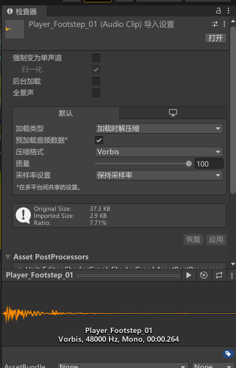

# Game 视图、 Hierachy、project、inspector 窗口

## 1. Game 视图

> 官方文档：  
> [https://docs.unity3d.com/cn/2021.1/Manual/GameView.html](https://docs.unity3d.com/cn/2021.1/Manual/GameView.html)

**作用**：从应用程序中的摄像机渲染 Game 视图。该视图代表最终发布的应用程序。需要使用一个或多个摄像机来控制玩家在使用应用程序时看到的内容。

### 1.1 Game 运行控制按钮

**作用**：可使用工具栏中的按钮来控制 Editor 运行模式以及查看发布的应用程序的运行情况。有点类似与视频播放器里面的播放按钮。

从左到右依次为：

- 运行游戏（ctrl+p）
- 暂停(ctrl+shift+p)
- 按帧运行(ctrl+alt+p)

> 注意：在运行模式下，所做的任何更改都是暂时的，在退出运行模式后将会重置。Editor UI 会变暗来提醒此情况。
>
> 这意味着我们在Game中的更改不会立即应用到我们的项目中，PlayMode模式里面看上去没问题再重新做上去——gaolx注

### 1.2 Game 视图控制栏

## 2. Hierachy 窗口

创建 Unity 新场景时的默认 Hierarchy 窗口视图

 

> 官方文档：  
> [https://docs.unity3d.com/cn/2021.1/Manual/Hierarchy.html](https://docs.unity3d.com/cn/2021.1/Manual/Hierarchy.html)

**作用**：Hierarchy 窗口显示场景中的每个游戏对象，如模型、摄像机或预制件。可以使用 Hierarchy 窗口对场景中使用的游戏对象进行排序和分组。在 Scene 视图中添加或移除游戏对象时，也会从 Hierarchy 窗口添加或移除它们。
Hierarchy 窗口还可以包含其他场景，每个场景都包含自己的游戏对象。

说白了就是：场景中游戏对象的管理器（选择器）

显然，Hierarchy窗口与Scene视图是紧密相关，Hierarchy中的每一个gameobject与场景中的物体是一一对应的。

**主要功能：**

1. 父子包含关系：  
   将游戏对象链接在一起以帮助移动、缩放或变换游戏对象的集合。移动顶层对象或父游戏对象时，也会移动所有子游戏对象。
2. 管理游戏对象：
   - 创建、复制粘贴、选取、删除
   - 更改嵌套关系
   - 是否可选，是否可见
   - 排序
3. 多场景编辑

> 注意：  
> Hierarchy 窗口中，虽然允许编辑多个场景，但根节点通常都是场景对象（scene），其他的游戏对象都包含在某个场景中。

## 3. project 窗口

作用：Project 窗口显示与项目相关的所有文件，该窗口是在应用程序中导航和查找资源以及其他项目文件的主要方法。但把他理解为“资源”窗口，会更贴切些，所以在本教程中，我通常会将其称为“资源管理器”。

> 官方文档：  
> [https://docs.unity3d.com/cn/2021.1/Manual/ProjectView.html](https://docs.unity3d.com/cn/2021.1/Manual/ProjectView.html)

虽然叫项目（project）窗口，但把他理解为“资源”窗口，会更贴切些，所以在本教程中，我通常会将其称为“资源管理器”

Project 窗口显示与项目相关的所有文件，该窗口是在应用程序中导航和查找资源以及其他项目文件的主要方法。

浏览器的左侧面板将项目的文件夹结构显示为层级列表。从列表中选择文件夹时，Unity 将在右侧面板中显示其内容。可单击小三角形来展开或折叠文件夹，显示文件夹包含的任何嵌套文件夹。单击时按住 **Alt** 键将以递归方式展开或折叠所有嵌套文件夹。

各个资源在右侧面板中显示为图标，这些图标指示了资源的类型（例如，脚本、材质、子文件夹）。要调整图标的大小，可使用面板底部的滑动条；如果滑动条移动到最左侧，这些图标将替换为层级列表视图。滑动条左侧的空白位置显示当前选定项，包括该项的完整路径（如果正在执行搜索）。

项目结构列表上方是 **Favorites** 部分，可在其中保存常用项以方便访问。可将所需项从项目结构列表拖动到 Favorites 部分，也可在此处保存搜索查询结果。

### 3.1 project 工具栏

project 常用操作工具按钮栏

 

**搜索筛选条件：**

在后期的项目中，文件数量将会相当庞大，这会给搜索带来极大的困扰。于是合理的设置搜索筛选条件就显得很重要了，搜索筛选条件的工作原理是在搜索文本中添加额外的搜索词。以“t:”开头的搜索词按指定的资源类型进行筛选，而“l:”按标签筛选。如果知道要查找的具体内容，可直接在搜索框中输入这些搜索词，无需使用菜单。一次可搜索多个类型或标签。添加几个类型将使搜索扩展以便包括所有指定的类型（即，多个类型通过 OR 逻辑结合）。添加多个标签会将搜索范围缩小到具有任意指定标签的项（即，多个标签将通过 OR 逻辑组合在一起）。

### 3.2 资源管理区域

1. 左侧树状目录：
   - Assets ： 资源文件
   - Packages： 库文件（运行游戏所需要的程序库）

2. 右侧文件操作区域：  
   就像 windows 中的文件操作方式一样

> 注意：Packages涉及了编辑器、运行时各个组件等必要的脚本、Shader等各种资源，他们之间互相依赖，请勿随意修改或删除这些文件，如果需要修改请通过Package Manager进行操作，否则会出现诸如CS0246: The type or namespace name ‘xxx‘ could not be found等错误  ——gaolx注

## 4. inspector 窗口

 

> 官方文档：  
> [https://docs.unity3d.com/cn/2021.1/Manual/UsingTheInspector.html](https://docs.unity3d.com/cn/2021.1/Manual/UsingTheInspector.html)

说白了，就是被选中游戏对象的属性窗口，可以在其中查看、编辑属性

使用 Inspector 窗口可对 Unity 编辑器中几乎所有内容（包括游戏对象、Unity 组件、资源、材质）查看和编辑属性和设置，以及查看和编辑编辑器内的设置和首选项。

选择相同类型的多个资源时，Inspector 窗口会显示它们共有的所有属性。选择不同类型的多个资源时，Inspector 会显示一个列表，其中显示选择的每种类型资源的数量。单击该列表中的任何项可检查该类型的所有资源。

### 4.1 检查项

可以在 Inspector 窗口中查看和编辑的内容取决于所选择的内容。本部分介绍对于可以选择的不同类型的项，Inspector 窗口所显示的内容。
  
#### 4.1.1 检查游戏对象

选择游戏对象时（例如在 Hierarchy或 Scene视图中），Inspector 会显示其所有组件和材质的属性。可以在 Inspector 窗口中编辑视图和重新排列组件。

#### 4.1.2 检查自定义脚本组件

当游戏对象附加了自定义脚本组件时，Inspector 会显示脚本的公共变量。可以采用与编辑任何其他属性相同的方式编辑脚本变量，这意味着可以在脚本中设置参数和默认值而无需修改代码。

#### 4.1.3 检查资源

选择资源时（例如通过Project 窗口），Inspector 会显示控制Unity 如何在运行时导入和使用资源的设置。

每种类型的资源都有自己的设置。在Inspector 窗口中编辑的资源导入设置示例包括：

- Model ImportSettings 窗口。

- Audio Clip Import Settings 窗口。

- Texture Import Settings 窗口。

#### 4.1.4 检查预制件

处理预制件时，Inspector窗口会显示一些附加信息并提供一些附加选项。例如：

- 编辑预制件实例时，Inspector窗口会提供处理预制件资源和应用覆盖的选项。
- 应用实例覆盖时，Inspector窗口会以粗体显示覆盖的属性的名称。

### 4.2 检查多个项

选择了两个或更多项时，可以在 Inspector 窗口中编辑它们共有的所有属性。Unity 会将提供的值复制到所有选定项。Inspector 窗口会显示选定项的数量。

1、多个游戏对象
选择多个游戏对象时，Inspector 窗口会显示它们共有的所有组件。

- 对于在两个或更多选定游戏对象中不同的属性值，Inspector 会显示破折号 (-)（以下屏幕截图中的 1）。

- 对于在所有选定游戏对象中相同的属性值，Inspector 会显示实际值（以下屏幕截图中的 2）。

- 要将一个选定游戏对象中的属性值应用于所有选定游戏对象，请右键单击属性名称并从上下文菜单中选择 **Set to Value of [游戏对象的名称]**（以下屏幕截图中的 3）。

- 如果任何选定游戏对象具有其他选定对象上不存在的组件，则 Inspector 会显示一条消息，指出某些组件已隐藏。

显示多个选定游戏对象的 Inspector

 

2、多个资源
选择相同类型的多个资源时，Inspector 窗口会显示它们共有的所有属性。

- 对于在所有选定资源中相同的属性值，Inspector 会显示实际值。

- 对于在两个或更多选定资源中不同的属性值，Inspector 会显示破折号 (-)（以下屏幕截图中的 1）。

- 对于无法同时为所有选定资源编辑的属性，Inspector 会将它们显示为灰色（以下屏幕截图中的 2）。

显示相同类型的多个选定资源的 Inspector

 

选择不同类型的多个资源时，Inspector 会显示一个列表，其中显示选择的每种类型资源的数量。单击该列表中的任何项可检查该类型的所有资源。

显示不同类型的多个选定资源的 Inspector

 

### 5. 查找源

在 Inspector 窗口中打开游戏对象或资源时，可以使用 Ping 命令在 Scene 视图或 Project 视图中查找它。

从 Inspector 窗口的 More Items (⋮) 菜单，选择 Ping。Unity 在 Hierarchy 视图或 Project 视图中突出显示该项目。可以快速查找源

ping 命令会突出显示当前在 Inspector 中显示的项

 

 

配套视频教程：
[https://space.bilibili.com/43644141/channel/seriesdetail?sid=299912](https://space.bilibili.com/43644141/channel/seriesdetail?sid=299912)

文章也同时同步微信公众号，喜欢使用手机观看文章的可以关注

