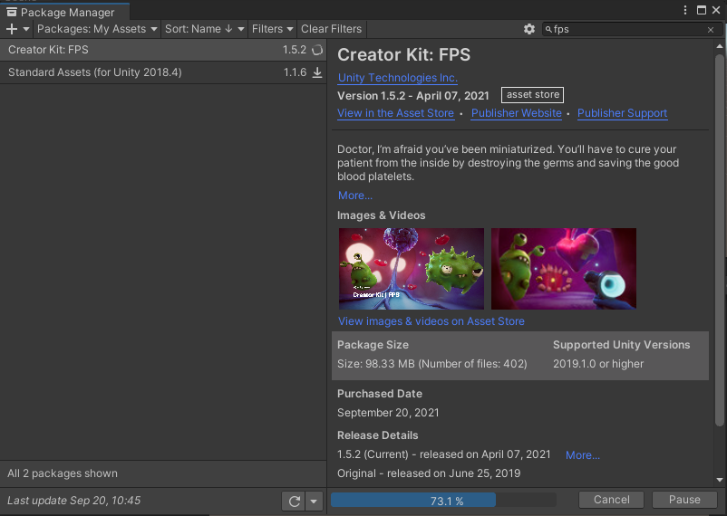
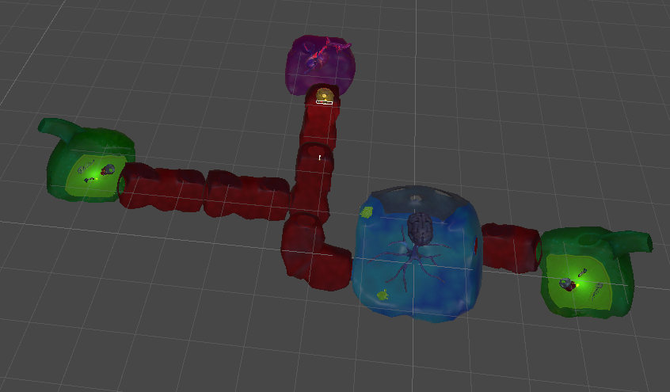
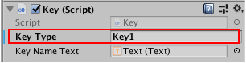
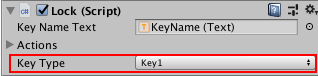
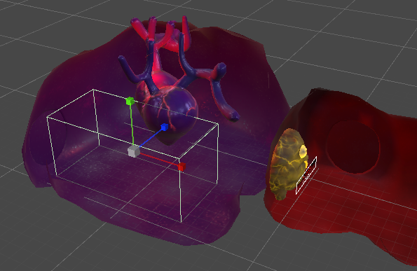

# 使用 Creator kit FPS

前言：这期开始我们给大家讲一个新的系列，创作者套件里面的fps（第一人称视角射击），这章我们仍旧不急着讲编程，而是在3D的大框架下学习游戏资源的放置，进行游戏对象的操作，如何来设置场景，如何设计我们的关卡，以及如何配置武器系统等等，这里也希望能用这套教程激发大家对unity和c#编程的好奇心。
> - [官方教程地址-创作者套件：FPS](https://learn.unity.com/project/chuang-zuo-zhe-tao-jian-fps?uv=2020.3)
> - [AssetStore 地址](https://assetstore.unity.com/packages/templates/tutorials/creator-kit-fps-149310?_ga=2.85655312.885135272.1631762446-522971275.1624332126)
> - [百度网盘地址](https://pan.baidu.com/s/1frsqKKhqSMOYjMF6CD7AzA) 提取码: b8ym
> - [迅雷云盘地址](https://pan.xunlei.com/s/VMk08AooAFpxmtm7yZKyxUv6A1) 提取码：d9tf

在学习我们这门课程之前当然需要先准备好资源，一般在Asset Store里面搜索 Creator Kit: FPS 按照之前的方式添加到我的资源再到unity用Package Manager下载并导入一个空项目即可。
  
如果网络不好的也可以先把unitypackage下载到本地再手动导入
> 本地 unitypackage 文件使用：  
> 新建项目 --> 打开项目 --> 将 unitypackage 文件拖入已打开 unity 的界面的 Project 窗口中 --> 选择需要导入的资源，import 导入

导入Package之后还需要在Package Manager中添加 Post Processing包，否则场景中部分gameobject会显示组件缺失，而且游戏的视觉效果也将大打折扣
## 项目介绍

欢迎学习 3D FPS 创作者套件 (FPS Creator Kit)！此细分套件以神奇的魔法将你微型化为医生，让你能够为对抗疾病贡献微小的正义力量。你的任务是游走于患者的身体中，完成一系列任务，在发现任何邪恶的病菌时消灭它们。

重点：

- 3D 游戏相关操作
- 关卡设置
- 修改武器

> **强调说明**：  
这种 Creator Kit 类型的项目，本身结构较为复杂，作为初学者项目，是为了给我们全面展示 Unity 功能和使用方法；而非让初学者必须一开始就把项目中每个元素都搞清楚，千万记住不要在这种大型的项目中过于追求细节，这样很容易陷入死循环，造成较大的挫败感觉，跟着教程走就行，要做到不求甚解！等未来你掌握了足够的知识（比如编程技术）后，可以再回头学习这个系列，就可以随心所欲地更改这个项目，并能从此项目中吸收更多的经验，用到日后游戏设计中

笔记：TutorialInfo：项目的描述（说明）文件，根据情况是否保留。
>  

 

## 1. 试玩游戏

1. 在 Project 窗口中，Assets/Creator Kit - FPS/Scenes 文件夹
2. 双击 ExampleScene 场景
3. 运行

- 按键盘上的 W A S D 键进行移动
- 按空格键进行跳跃
- 按住 Shift 键进行奔跑
- 用鼠标进行武器瞄准
- 瞄准后单击鼠标按钮用药物消灭病菌

## 2. 自定义目标对象

1. 创建场景：  
   由于直接创建新的空场景话操作太过繁琐，在顶部菜单栏中，选择 FPSKIT > Create new Scene。在Asset/Scenes里创建新的场景。

   > 注意：  
   > FPSKIT 菜单并非是 unity 中的默认菜单，而是通过代码，新增如 Unity 编辑器的自定义功能。 Assets/Creator Kit - FPS/Scripts/Editor  
   > unity 支持定制功能，非常灵活，开发者可以根据自己的需求，打造属于自己的 unity ，从而简化开发过程

可以看到，脚本默认为我们创建了一个已经包含部分游戏对象的场景，类似一个模板，降低了前期繁琐的工作。由于我们的视角是第一人称，所以Character这里并没有身体的mesh，但为了检测碰撞，这里用一个胶囊体形状的Collider代替玩家实际的身体。

   

这个场景主要包含了以下几个部分：

· Character组件下还包含了声音，角色控制器，相机，武器等等各种组件。

· GameSystem组件负责游戏系统，比如管理各个Prefabs，控制不同物体的后处理，声音源等。

· LevelLayout 管理整个地图。

· StartCheckpoint 设置玩家起始位置。

二：
相信大家在上一期简单的试玩我们的《工作细胞》之后，有的小伙伴已经迫不及待的要设计自己的关卡了，那么今天我们继续学习这个项目
2. 添加游戏目标：
这里我们要添加“敌人”——细菌和血细胞
   选中 Assets/Creator Kit - FPS/Prefabs/Targets/GermSlimeTarget 预制件，拖入 Hierarchy 中（默认位于原点），并在 scene 中，调整其位置（回忆下两种修改游戏对象位置的方式），我们不难发现其中已经包含许多组件了，这里就能体现出Prefab的最大优势——减少重复工作量。

接下来我们看看新建的“目标”中都包含了哪些组件。
· Rigidbody（刚体）：刚体提供了一种基于物理的方式来控制游戏对象的移动和位置。
· Target：设置脚本组件的各种数值，包括生命，分数，死亡特效，声音等等。
· Capsule Collider（胶囊碰撞体）：有人可能会问，为什么有了刚体还需要碰撞体呢？主要是只有两者相结合才能模拟子弹碰撞到其他物体的效果。
3. 更改目标对象属性：  
   Inspector 窗口 --> Target 组件 --> 更改目标的 Health（小怪的生命） 和 Point Value （杀死后得分），可以看到小怪（GermSlimeTarget）里面Point Value为正，即打死小怪加分，血细胞（BloodCellTarget）为负，即打到血细胞会扣分。

小知识：
1、对游戏对象进行分组：由于场景当中可能包含大量相同类型的gameobject，全部位于场景根目录下会显得很乱，因此我们有必要把相同类型的组件放在一起，但unity本身没有为我们提供文件夹的概念，但我们可以利用父子对象的关系来管理我们的游戏对象。我们首先在 Hierarchy 中新建一个空的游戏对象，命名为 gameTarget_01，然后我们选中 GermSlimeTarget 和 BloodCellTarget等有关的对象，将他们拖进gameTarget_01 这个空的游戏对象即可。这样一来，拖进去的这些Prefab都会成为gameTarget_01 的子游戏对象，而父对象是 gameTarget_01 这样一个不包含任何功能的子游戏对象。
  
2、绝对位置和相对位置：细心的小伙伴可能会发现，当我们将多个子游戏对象放入父游戏对象时候，父游戏对象的位置也会随之变化，这是因为父对象的位置是取所有子对象坐标的中心点，这就要引出相对坐标与绝对坐标的概念，比如子对象的下的物体所用的坐标就是相对坐标，坐标原点是以父坐标为原点，这就是相对坐标。而Scene根目录下的物体所用的坐标就是绝对坐标，所在的原点就是世界的原点（世界坐标（0，0，0））
  
可以看到，虽然两个物体的坐标是一样的，但所处的实际位置（世界坐标）完全不同
总结：记住单个游戏对象的相对坐标总是相对于父物体，无父物体则是相对世界原点。框选多个游戏对象则是取他们的几何中心作为相对父物体的坐标。
局部坐标与

前言：在上上期教程中，我们为我们的游戏添加了所需的游戏目标，包括敌人细菌，友军细胞等等，了解了预制件上各个组件以及组件值得作用，学会了如何给游戏对象进行分组，最后学习了绝对位置和相对位置的相关概念，今天，让我们来继续为我们的游戏添加新的元素。
  
1.创建自定义预制件：在之前的Playground项目中，我们用 Prefab 创建了许多重复的小行星与陨石，这次们将创建一个更复杂的预制件，这样我们可以很方便的定制我们想要的游戏素材。与上次不同的是，这次我们在已经成型的预制件上面做新的预制件。

4. 添加其他目标对象并创建自定义预制件

在之前的Playground项目中，我们用 Prefab 创建了许多重复的小行星与陨石，这次们将创建一个更复杂的预制件，这样我们可以很方便的定制我们想要的游戏素材。与上次不同的是，这次我们在已经成型的预制件上面做新的预制件。

   

Assets/Creator Kit - FPS/Art/Models/Characters，选中 GermSpike ，拖入 scene，点击层级窗口的小箭头或者点击Inspector的Open进入编辑模式

可以看到，在进入预制件编辑模式之后，我们就只能看到预制件本身，点击左上角这个小箭头可以退出。

可以看到，该预制件主要由三个对象组成，

· GermSpikeModel是这个游戏对象的模型，可以看到底下还挂载了animator组件，用于将动画指定给游戏对象在你的Scene，动画器组件需要引用动画控制器定义哪个动画剪辑来使用，并控制何时以及如何在它们之间混合和过渡。例如怪物的悬浮，抖动等效果。我们简单了解下即可

· IdlePlayer 播放待机状态下的声音

· HitPlayer 播放受击状态下的声音 

但是当我们进入游戏之后发现尽管怪物在动，但当我们射击这个怪物是没有任何反应的，显然我们还缺失一些非常重要的组件，因为组件决定了游戏对象的功能——被子弹射中。

5. 为新对象添加刚体组件：  

回顾下之前做的Playground项目，要想实现碰撞，显然刚体和碰撞体是必不可少的，因为子弹各项参数也要用到unity的物理引擎计算，倘若我要知道一个物体（Target）到底有没有被击中本质上就是我们的子弹是否接触到Target，因此，我们需要为Target创建一个具有碰撞功能的组件。

单击 Add Component 按钮，然后开始在搜索栏中键入“Rigidbody”并添加；禁用 Use Gravity 复选框，启用 Is Kinematic 复选框。原因详见官方文档说明

总的来说，禁用 Use Gravity 将使病菌漂浮，不让他一开始就往下掉，而启用 Is Kinematic 会阻止子弹（或其他任何对象）使病菌四处移动。

   > 注意：启用 Is Kinematic，则刚体对象将不会被物理引擎驱动，只能通过**变换 (Transform)** 对其进行操作。

6. 为新对象添加碰撞体:  
   Add Component 并搜索 Sphere Collider。添加该组件。他主要负责我们的gameplay部分，与玩法，状态，效果等密切相关，如果想提高怪物的血量增加Health即可

   Sphere Collider（球形碰撞体）将确保可以击中病菌，有时会将这个碰撞体称为“命中范围”。在 Scene 视图中，你会发现这个碰撞体就是包围病菌的绿色球体。

   点击Edit Collider或者组件的Center和Radius值，调整碰撞体的大小和位置，使其紧紧地包围住整个对象素材。否则就会出现子弹即使穿过模型没有死亡效果的bug了

7. 将新对象设置为目标：  
   单击 Add Component，然后搜索并添加 Target 组件。

    组件会添加一个自定义脚本来使病菌成为目标。添加脚本后，请更改目标的 Health 和 Point Value 值，然后添加HitPlayer和IdlePlayer，再次测试游戏。完成后，请务必保存更改。

最后，把我们制作的游戏对象转换成预制件，直接把我们的预制件从层级窗口拖进Asset/Prefabs文件夹，然后点击Original Prefab，通常出现在预制体之上再新建预制体会看到这个对话框，创建原始预制件即可。
  
## 3. 使用Level Layout组件设计关卡

前言：在上期教程中，我们学会了如何添加其他目标对象并创建自定义预制件，以及如何设置刚体与碰撞体来检测子弹碰撞，今天我们接着前面内容来尝试着自己设计一个关卡。
提示：Level Layout组件类似于一个地图编辑器，我们可以使用它来设计我们的关卡。点击 Editing Layout 后会显示Add和Remove 两个按钮，分别是添加和删除，Group下是不同的场景组件预设
1. 关闭音频辅助图标：  
   在 Hierarchy 窗口中，选择 LevelLayout 游戏对象。  
   在 Scene 视图的右上角，单击 Gizmos 按钮旁的向下箭头。
   在菜单中，向下滚动列表并禁用 Built-in Components 部分中的以下两个复选框：AudioReverbZone、AudioSource
2. 添加新房间和走廊：  
   在 Hierarchy 中，确认 LevelLayout 游戏对象仍然为选中状态；  
   在 Inspector 窗口中，找到 Level Layout 组件。单击 Editing Layout。这样会默认启用添加模式。然后，单击 CorridorGroup 以添加走廊，或者单击 RoomGroup 以添加房间。  
   你可以按键盘上的 R 键来旋转房间并更改这个房间尝试贴靠到的门。对位置感到满意后，请单击鼠标按钮来放置房间。
   如果要退出关卡编辑模式，点击 Editing Layout 然后保存即可。

   
s
   如果操作失误或者要删除房间，请单击组件中的 Remove 按钮。完成此操作后，将光标移到 Scene 视图中的房间和走廊上方就会突出显示这些房间和走廊。单击一个房间即可将这个房间删除。

   完成关卡设计的编辑工作后，再次单击 Inspector 窗口中的 Editing Layout 按钮以禁用关卡编辑器工具。

3. 添加门：  
为了增加游戏的乐趣，解谜通常是必不可少的元素。我们可以通过添加门和钥匙来实现。
   选择 Assets/Creator Kit - FPS/Prefabs/Door and Key/FatBlob，拖拽到 scene 中，选择合适的位置，堵住路口，充当门

4. 添加钥匙并匹配门：  
   在 Project 窗口中，选择 Key 预制件，拖拽到 scene 中，选择合适的位置，在 Inspector 中，找到 Key 组件。在 Key Type 字段中，为钥匙提供一个唯一的名称。

   

通过修改这个Text组件的文本可以修改ui显示的钥匙名字

补充官方关于Text组件的说明

   在 Hierarchy 中，选择 FatBlob 游戏对象。在 Inspector 中，找到相应的 Lock 组件。使用下拉菜单将 Key Type 值设置为所选的钥匙名称

   

   现在，玩家只要收集到钥匙，就可以开启对应的门
   进入游戏，通过拾取钥匙我们可以打开这扇门进入其他的房间，至此我们就完成了关卡的设计，大家可以自行发挥想象，设计更多有趣的玩法。

## 4. 修改武器

前言：在上期教程中，我们学会了使用Level Layout组件设计自己的关卡，并添加了解密元素——钥匙和门以及将他们绑定，了解了text组建的用法，今天让我们继续学习如何为我们角色创建武器。

目标：在游戏中通过键盘上的1234键或者是鼠标的滚轮键来切换默认的三种武器，分别是短枪，长枪，药丸，并能正常射击目标

1. 根据原武器新建自己的新武器：  
   选择 Assets/Creator Kit - FPS/Prefabs/Weapon/GermOBlaster 预制件，按 Ctrl + D (Windows) 或 Cmd + D (macOS) 来复制一个副本，并将武器重命名。
2. 在新武器的预制件中，更改武器属性：  
   双击新武器，进入预制件编辑状态，在 Inspector 中，找到 Weapon 组件。  
   注：TriggerType是武器发射方式，选择Auto是点一次子弹全部发射出去，Manual是点一下发射一个子弹，WeaponType是武器类型。clipSize是每个弹匣的子弹数量。fireRate是攻击频率，当快速点击鼠标或auto模式下子弹发射间隔。reloadTime是换弹匣的时间，damage是攻击力，每颗子弹有多少伤害。ammoType是子弹类型，可以选择激光束或药丸。
   将 Trigger Type 更改为 Manual。现在，仅在按下扳机时，武器才会发射一次，而不是尽可能快地发射。
   Clip Size 的值从 30 更改为 8，以减少单次重新装填弹匣的弹药量。将 Damage 的值从 0.5 更改为 5。  
   保存。
3. 将新武器添加给 Character：  
   在 Hierarchy 中，选择 Character 游戏对象

   在 Inspector 窗口中，找到 Controller 组件。

   选择 Starting Weapons 条目名称左侧的小箭头以展开该条目。将 Size 从 3 更改为 4。或者直接点加号，这将在关卡开始时为玩家提供四种武器。

   将新武器预制件从 Project 窗口拖到 Inspector 中显示的 Element 3 字段上。

   保存后，运行游戏测试，用鼠标滚轮或 1、2 、3、4 键来切换武器。检查下新添加的武器是否正常运作

## 5. 创建关卡终点

前言：在上期教程中，我们学会了如何为角色创建武器，设置各种属性（发射方式、类型、子弹数量、攻击频率、换弹匣的时间、攻击力等等），以及如何将武器预制件分配给玩家，今天我们来为我们的游戏设置关卡终点，毕竟任何无论是做游戏还是做别的事情都要有始有终。
1. 创建 LevelEnd 游戏对象：  
目标：玩家一旦进入终点区域就显示结束（Game Over）然后提示各种信息，例如通关用时，得分等等。
   根据前面关于Level Layout的知识自己做一个终点场景，我这里就以这个红色的房子为例，在 Hierarchy 窗口中右键单击一个空的区域，然后选择 Create Empty，创建一个空游戏对象，在 Inspector 窗口中，将游戏对象重命名为“LevelEnd”。

2. 添加盒装碰撞体：  
目标：我们的想法是玩家一旦接触到这个物体的碰撞盒就在脚本触发游戏结束的类，即判定为到达终点。
   在 Inspector 中，单击 Add Component 按钮。搜索“Box Collider”，然后将此组件添加到 LevelEnd。调整大小和位置，启用 Is Trigger 复选框，否则我们会被挡住或者弹回来，而永远进不去，这个collider本身就是为了执行游戏结束的效果而触发。

   单击 Add Component 按钮。搜索“End Checkpoint”，然后将此组件添加到 LevelEnd。

3. 将碰撞体放在合适位置：  
   使用变换组件工具将该对象放置在所需的关卡结束位置。房间或走廊的尽头就很适合作为关卡终点。

   

   最后执行测试：切换武器，打怪，捡钥匙，碰门，进入检查点，结束，检查之前做的组件是否正常。如果没问题话就可以准备发布了

## 6. 构建游戏

1. 确保要用于游戏的场景已打开，脚本没有编译错误。在顶部菜单中，选择 File > Build Settings。

2. 在对话窗口中，选择空的 Scenes In Build 列表底部的 Add Open Scenes 按钮。此时会将当前打开的场景添加到构建中。

3. 单击 Build 按钮。选择要保存构建版本的文件夹并为其命名。Unity 将创建构建版本，然后打开包含可执行文件的文件夹。通过启动此文件即可玩这个游戏。编译过程可能比较漫长，视电脑配置情况而定，请小伙伴们耐心等待。

4. 压缩含有构建版本的文件夹，然后将其发送给朋友！

注：如果在项目设置里面配置了il2cpp作为脚本后端，根据你所用的操作系统，安装过程中选择模块时，unityhub必须选中 Windows Build Support(IL2CPP)或Mac Build Support(IL2CPP)。且Win下需要安装visual studio 2019或更高版本。安装时至少要包含 使用Unity的游戏开发 和 使用c++的游戏开发 组件。
 

 

> 探索创作者套件的所有可能性:
>
> 参考[详细手册](https://connect-prd-cdn.unity.com/20200317/7a981784-430a-4a3c-8423-302fe220e6d7/Creator%20Kit%20FPS%20_%20Manual.pdf?_ga=2.86683665.885135272.1631762446-522971275.1624332126)以了解更多信息以及编辑器的背景资料。  
> 这些参考内容包括：
>
> - 此创作者套件中所有武器设置的相关概述。
> - 有关导入你自己的 3D 模型并使用它来创建新型武器的指导。
> - 有关高级游戏功能（例如，创建在销毁目标时触发的门锁系统）的指导。

 

 

配套视频教程：
[https://space.bilibili.com/43644141/channel/seriesdetail?sid=299912](https://space.bilibili.com/43644141/channel/seriesdetail?sid=299912)

文章也同时同步微信公众号，喜欢使用手机观看文章的可以关注

