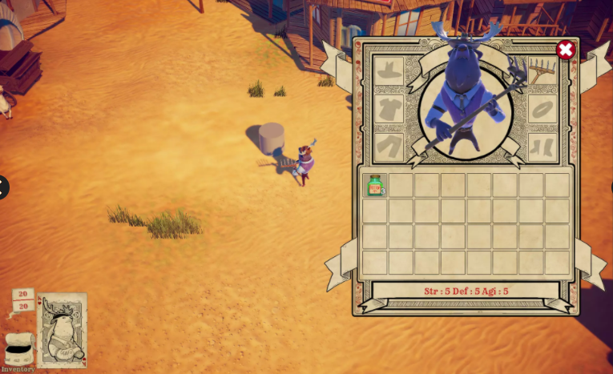
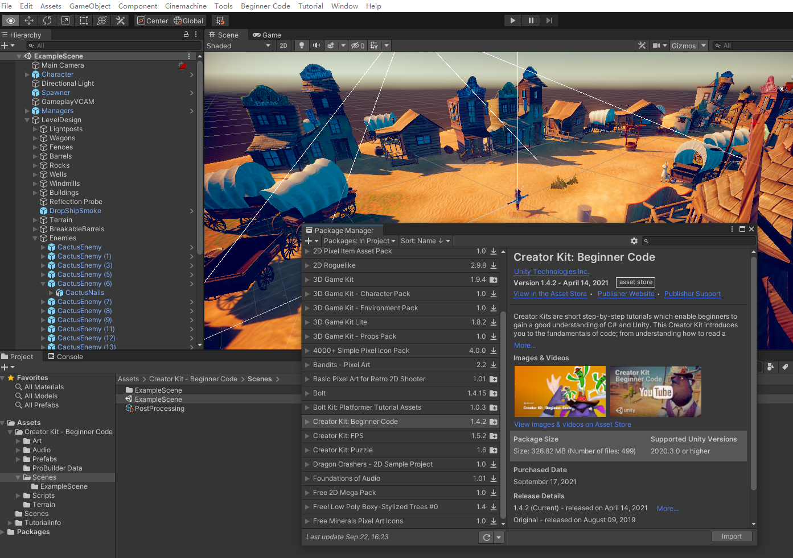

# 使用 Creator kit FPS

> - [官方教程地址-创作者套件：FPS](https://learn.unity.com/project/chuang-zuo-zhe-tao-jian-fps?uv=2020.3)
> - [AssetStore 地址](https://assetstore.unity.com/packages/templates/tutorials/creator-kit-fps-149310?_ga=2.85655312.885135272.1631762446-522971275.1624332126)
> - [百度网盘地址](https://pan.baidu.com/s/15lRmIzkZmZU6vmQNsTLDVg) 提取码: 8nzx
> - [迅雷云盘地址](https://pan.xunlei.com/s/VMk08AooAFpxmtm7yZKyxUv6A1) 提取码：d9tf


<br>

<hr>
<br>

> 注意：  
> 一定要使用英文官方网站的 api 文档：[https://docs.unity3d.com/ScriptReference/MonoBehaviour.html](https://docs.unity3d.com/ScriptReference/MonoBehaviour.html)

<br>
<hr>
<br>

## 1. 导入项目并测试

    步骤1 ：新建空的 unity 3d 项目
    步骤2 ：导入 Creator kit : Beginner Code ，不管是使用 package manager ,双击下载好的 unitypackage 文件，还是将文件直接拖拽如 project 窗口，都行，随你喜好
    步骤3 ：project 窗口 -> Assets/Create kit - Beginner Code /Scenes/ExampleScene 双击，运行，测试游戏

提示：1、该项目使用了URP（Universal Rendering Pipeline）作为项目的渲染管线，所以在新建项目时应该在unity hub创建“3D (URP)”的模板，否则shader会不兼容，材质球会出现粉色。
2、由于新建的项目默认不会安装cinemachine组件，导致依赖缺失而编译错误，导入package之后可能会提示诸如“error CS0246: The type or namespace name 'CinemachineVirtualCamera' could not be found (are you missing a using directive or an assembly reference?)”等报错信息而无法运行和构建游戏，这需要我们手动在Package Manager安装Cinemachine的包。

游戏类型： 3D ARPG (动作角色扮演游戏)  、第三人称俯视角射击（TPS）
包含：

- 角色系统
- 怪物系统
- 物品系统
- AI 系统

* ....



## 2. 使用 visual studio 作为脚本代码编辑器

工欲善其事必先利其器，在编写代码之前，我们先要确保IDE（集成开发环境）是正确配置的，unity本身不负责编写代码，他只负责将用户写好的代码进行编译并完成相应的功能。我这里使用visual studio 2022进行演示，当然，你们想使用vscode，rider也是可以的
目的：使得unity能正确链接我们的ide，在vs中能正确生成解决方案，关联系统的基本库，正确识别MonoBehaviour类和项目之间的引用关系，使用关联查找、智能提示等功能，方便断点调试
方法：菜单栏 edit - preference - External Tools -> visual studio XXXX 2019（视你安装的ide为定），选择之后点击“Regenerate project files”，重新生成项目的.csproj文件。

好处：

- 代码智能提示
- 基础类库识别
- 代码导航
- 按项目处理代码，而非单个文件
  
书写代码：
Hierarchy -> LevelDesign -> PotionSpawner -> Inspector -> Spawner Sample -> SpawnerSample -> Project -> 双击在 vs 中打开

或者，直接在 Project -> Assets/Creator Kit - Beginner Code/Scripts/Tutorial/ 下，双击在 vs 中打开
  
```C#
//引入命名空间 UnityEngine
using UnityEngine;

// 生成器示例类
// 这个生成器会在不同位置，生成三个指定的游戏对象
public class SpawnerSample : MonoBehaviour
{
    // 声明 一个attribute（字段），是一个游戏对象，用来获取生成器生成的 gameobject
    public GameObject ObjectToSpawn;

    // start事件方法，是包含此脚本的游戏对象 Start is called just before any of the Update methods is called the first time
    // 在 update 前执行，且在游戏对象生命周期只执行一次
    // Start is only called once in the lifetime of the behaviour.
    void Start()
    {
        // 声明整型变量 angle 并赋值为 15
        int angle = 15;

        //声明一个 3D Vector (矢量) 对象 spawnPosition 并赋值为当前游戏对象的位置
        Vector3 spawnPosition = transform.position;

        // 声明一个 3D Vector (矢量) 对象 direction，并使用 Quaternion（四元数）类的静态方法  Euler（欧拉）返回值 * Vector3(1,0,0)
        // 说白了就是创建一个 方向对象
        Vector3 direction = Quaternion.Euler(0, angle, 0) * Vector3.right;
        // 重新计算 spawnPosition 的值
        spawnPosition = transform.position + direction * 2;
        // 用 Object 的 Instantiate 静态方法实例化游戏对象
        Instantiate(ObjectToSpawn, spawnPosition, Quaternion.identity);

        // 用一套新值，在新的位置重新生成一个游戏对象
        angle = 55;
        direction = Quaternion.Euler(0, angle, 0) * Vector3.right;
        spawnPosition = transform.position + direction * 2;
        Instantiate(ObjectToSpawn, spawnPosition, Quaternion.identity);

        // 用一套新值，在新的位置重新生成一个游戏对象
        angle = 95;
        direction = Quaternion.Euler(0, angle, 0) * Vector3.right;
        spawnPosition = transform.position + direction * 2;
        Instantiate(ObjectToSpawn, spawnPosition, Quaternion.identity);
    }
}

```
说明：
1、注释：编辑器中绿色部分的文字叫做注释，通常用“//...”即可创建，如果需要批量注释可以用/*开始到*/结束。这些代码不会在游戏中实际运行，仅供开发人员参考，增强代码可读性。
2、MonoBehavior：脚本基类
  
这节课能看懂多少是多少，不求甚解，后面会逐一解释这些代码。

注意：学习unity的api时候一定要到英文官网查询，中文官网部分api不全。而且英文api版本内容更新。
<br>
<hr>
<br>

配套视频教程：
[https://space.bilibili.com/43644141/channel/seriesdetail?sid=299912](https://space.bilibili.com/43644141/channel/seriesdetail?sid=299912)

文章也同时同步微信公众号，喜欢使用手机观看文章的可以关注


前言：在上期教程中，我们通过一个新的项目《CreatorKit_BeginnerCode》，配置使用 visual studio 作为脚本代码编辑器，最后我们看了一段示例代码来逐渐开始入门unity脚本编程，今天我们继续学习c#脚本编程中的重要概念——变量。