# 在脚本中使用变量

> [官方教程 - 初学者代码脚本](https://learn.unity.com/tutorial/bian-liang-jian-jie?uv=2020.3&projectId=5fad021eedbc2a00225e688f#)  
> [官方文档 - 变量和 inspector](https://docs.unity3d.com/cn/current/Manual/VariablesAndTheInspector.html)  
> [微软官方 C#文档](https://docs.microsoft.com/zh-cn/dotnet/csharp/)  
> [微软文档最佳学习路线 - C# 编程指南](https://docs.microsoft.com/zh-cn/dotnet/csharp/programming-guide/)

Unity 对应 C# 版本：

- 2020.3 最新长期支持版：  
   [官方文档说明页](https://docs.unity3d.com/2020.3/Documentation/Manual/CSharpCompiler.html)：C# 8.0
- 2021.2 最新正式版:  
   [官方文档说明页](https://docs.unity3d.com/2021.2/Documentation/Manual/CSharpCompiler.html): C# 9.0

> 扩展阅读：  
> 微软原先有两个 C# 的运行环境（简单可以理解为，安装运行环境后，才能运行 C# 程序）：只支持 windows 的 .net framwork 和 开源的全平台 mono（收购 Xamarin 公司的）；  
>
> .net 功能强大，可以发挥所有 C# 功能，mono 什么操作系统都支持，但有些 C# 功能不能发挥出来。  
> 后来，微软又推出了 .net core 开源框架，实际上就是 mono 的替代品。unity 因为推出时， .net core 还没有正式版，所以使用了 mono ，这也是 unity 会有部分 C# 功能不支持的原因，一部分是因为底层是cpp导致功能迭代慢，很多cs的特性跟不上，另一部分是历史包袱。（虽然 新版本的 mono 也集成了部分 .net core 的功能，但并不完全，因为更新速度跟不上）  
> unity 应该也在考虑将 mono 替换为 .net core（.net 6），而且根据最新的消息，unity官方计划逐步将编辑器迁移到.NET CoreCLR，我们拭目以待
> 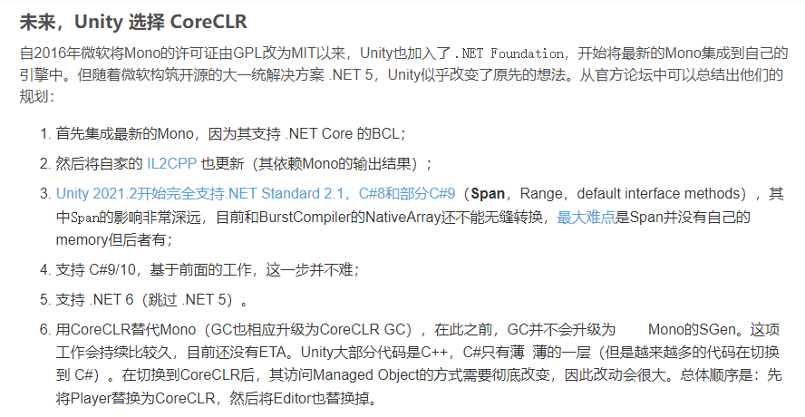;

</br>

> 结论：
> 刚开始学 C# 的同学，可以直接学习 C# 11.0 版本，这是截止2023年9月最新的c#标准，另外C#其实是一门更新很快的语言，C#每一次版本升级，都是底层算法的迭代，这需要开发者不断去学习
>
> 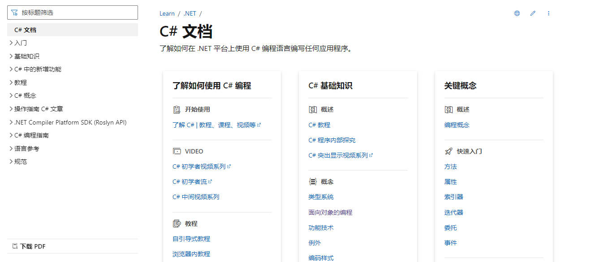;

</br>
</hr>
</br>

## 1. 变量

### 1.1 概念

在创建脚本时，实际上是在自定义新的组件类型，可以像任何其他组件一样将这种组件附加到游戏对象。

unity C# 脚本中的变量，可以当做是这个脚本组件中的属性。你可以用代码决定组件拥有的功能。

可以隐藏在代码中，也可以暴露在 inspector 中（将变量的可访问性设置为 public）

从编程角度来讲，变量就像是一个有名字的盒子，存储在内存中，可以通过名字找到它的位置，从中取出它里面的值——“取值”，也可以把想存放的值放（存）进去——“赋值”

### 1.2 创建并使用变量

讲完了前面那些八股，接下来让我们试着写一个具有功能的组件
注意：不要光看教程，一定要亲自动手，遇到问题可以评论区反馈。

- 步骤 1：新建一个 scene，命名为 MyScene，放入 Assets/Scenes 下
- 步骤 2：在新的 scene 中，新建一个 empty gameobject(空游戏对象)命名为 Player
- 步骤 3: 为 Player 对象新增脚本组件，放入 Assets/Scripts 下，命名为 MainPlayer，这个是决定脚本的文件名称，同时也是类名，两者需要互相匹配（类是组件的一个代称）
- 步骤 4：在脚本中添加如下代码（注意配合注释食用效果更佳）：

  ```CS
  using UnityEngine;
  //注意，类名和脚本名不匹配会导致无法将组件挂载到游戏对象上
  public class MainPlayer : MonoBehaviour  //继承MonoBehaviour类，根据MonoBehaviour类作为他的父类，继承父类的意思就是这段代码是另一段代码的下一层，具有上层允许被继承的全部属性，讲人话就是儿子具有父亲的所有属性，但又在父亲之上扩充
  {
      public string myName;  //Public表示该变量可以被外部修改和访问，也会被暴露到inspector中，这里定义一个字符串变量，用来存储玩家名字
      //如果需要为变量赋予初始值请用 public string myName = "xxx"
      //从左到右依次为访问修饰符(可访问性）、数据类型、变量名字
      //假如你还是搞不懂就这么理解：变量就是生存游戏里面的空箱子，变量名就是给箱子取个名字，你往里装东西就完了

      // Start is called before the first frame update
      void Start()  //游戏开始时候会执行一次这里的代码，void是返回值类型，Start是函数，函数是包含代码段落的容器
      {
        //打印字符串到控制台
          Debug.Log("我的名字是：" + myName);  //以分号结束的一行，这就是一句语句
          //Debug.Log() 意思是向控制台输出一段文字，引号里面是一个字符串（String），简单地说就是存储文字的变量
      }

      // Update is called once per frame
      void Update()
      {

      }
  }
  //这段代码的意思是：设置一个存储玩家姓名的变量，并在游戏开始时候将 "我的名字是：" + myName 这个字符串打印在控制台

  ```

- 步骤 5： 运行，并测试，可以更改 Player 对象 MainPlayer 组件中的 My Name 属性，查看 console 窗口中的输出，默认情况下如果不给 myName 赋值，那他就是空的，新赋值优先级＞初始值优先级

  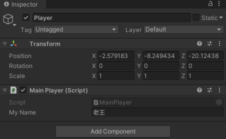

  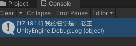

</br>

## 【百日挑战19】unity教程之学习脚本编程初步（三）

前言：在上期教程中，我们学习了变量的的基本概念，通过手写一个基本的组件——打印名字到控制台 来学习变量的作用，了解了c#代码最基本的的组成部分，今天我们来继续学习变量的使用，希望大家能加深对变量的理解。
  
> 拓展阅读：变量表示存储位置。 每个变量都有一个类型，用于确定可以在变量中存储的值。 C # 是一种类型安全的语言，c # 编译器保证变量中存储的值始终为适当的类型。 可以通过赋值或使用和运算符来更改变量的值 ++ -- 。

在获取变量的值之前，必须 明确 地 (明确赋值） 。

如以下各节中所述，变量为 初始赋值 或 _ 初始未赋值 *。 最初分配的变量具有定义完善的初始值，并始终被视为明确赋值。 初始未赋值的变量没有初始值。 对于在某个特定位置被视为明确赋值的初始未赋值的变量，对该变量的赋值必须出现在通向该位置的每个可能的执行路径中。

## 2. 在游戏中使用变量

首先在场景中找到 PotionSpawner 这个物体，他是一个生成药瓶的组件，我们将以这个物体为研究对象学习，并使用它练习我们的脚本编写
;

在 SpawnerSample 脚本中，声明新的变量：

- 步骤 1：复制并阅读代码，不懂的地方查文档，仔细阅读注释，配合unity的api文档和微软官方的c#文档看懂这些函数是怎么使用的（类似于看不懂的单词查字典）
- 步骤 2：制定 TODO：声明一个变量，用来存储新生成的药瓶和生成点距离的值，反复赋值，测试，了解这个 radius 变量是如何影响gameplay（玩法系统）的
  .png);
  .png);
  .png);

- 显而易见，当我们改变变量——radius值得时候药瓶生成的半径也会随之变化
- 拓展 1：试着再声明三个变量分别存储三个药瓶的角度，实现不同的药瓶可设定不同的摆放角度
  .png);
  .png);

- 拓展 2：如果你已经熟练掌握过c#编程，不妨模仿上面的代码，试着加一段在新的位置生成一个游戏对象（药瓶）的代码，实现开始游戏时生成4个药瓶
  .png);

- 到此为止，恭喜你已经基本掌握了c#变量的基本用法
- 预习：将 radius 变量的int类型改成float类型，对比看看能填写的数值类型发生了哪些变化

测试代码如下：

```CS

//引入命名空间 UnityEngine
using UnityEngine;

// 生成器示例类
// 这个生成器会在不同位置，生成三个指定的游戏对象
public class SpawnerSample : MonoBehaviour
{
    // 声明 一个attribute（字段），是一个游戏对象，用来获取生成器生成的 gameobject
    public GameObject ObjectToSpawn;
    // 声明一个变量，用来存放距离
    public int radius;
    // start事件方法，是包含此脚本的游戏对象 Start is called just before any of the Update methods is called the first time
    // 在 update 前执行，且在游戏对象生命周期只执行一次
    // Start is only called once in the lifetime of the behaviour.
    void Start()
    {
        // 声明整型变量 angle 并赋值为 15
        int angle = 15;

        //声明一个 3D Vector (矢量) 对象 spawnPosition 并赋值为当前游戏对象的位置
        Vector3 spawnPosition = transform.position;

        // 声明一个 3D Vector (矢量) 对象 direction，并使用 Quaternion（四元数）类的静态方法  Euler（欧拉）返回值 * Vector3(1,0,0)
        // 四元数 Quaternion 是 unity 3d 系统中，用来处理旋转的类
        // 说白了就是创建一个 方向对象，指定一个方向，旋转多少角度，然后生成一个向量坐标
        Vector3 direction = Quaternion.Euler(0, angle, 0) * Vector3.right;
        // 重新计算 spawnPosition 的值，原来的位置坐标 + 一个方向 * 距离
        spawnPosition = transform.position + direction * radius;
        // 用 Object 的 Instantiate（实例化） 静态方法实例化游戏对象，说白了就是创建游戏对象
        Instantiate(ObjectToSpawn, spawnPosition, Quaternion.identity);

        // 用一套新值，在新的位置重新生成一个游戏对象
        angle = 55;
        direction = Quaternion.Euler(0, angle, 0) * Vector3.right;
        spawnPosition = transform.position + direction * radius;
        Instantiate(ObjectToSpawn, spawnPosition, Quaternion.identity);

        // 用一套新值，在新的位置重新生成一个游戏对象
        angle = 95;
        direction = Quaternion.Euler(0, angle, 0) * Vector3.right;
        spawnPosition = transform.position + direction * radius;
        Instantiate(ObjectToSpawn, spawnPosition, Quaternion.identity);
    }
}


```

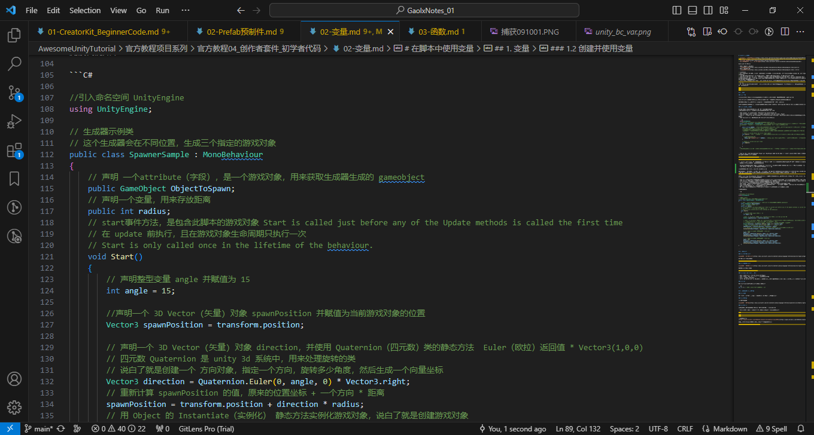;
.png);

</br>

## 【百日挑战20】unity教程之学习脚本编程初步（四）

前言：在上节课我们讲过了变量的概念以及基本的使用方式，在一个具体的项目中实践了通过编写代码来理解变量是如何影响gameplay的，那么今天我们来继续补充一些关于数据类型，c#语句、表达式和运算符，内容虽然有些枯燥，但是磨刀不误砍柴工，对于开发者来说这些基础概念是必不可少的

## 3. 数据类型

即变量的类型，他是装变量的一个盒子，不同规格的盒子可以装不同类型的变量，为什么要区分数据类型？cpu对于不同类型的变量处理方式是不同的，因此开发人员应该根据不同的需求选择不同的数据类型，来尽量利用计算资源

### 3.1 整型数值类型

[官方文档 - 整型数值类型](https://docs.microsoft.com/zh-cn/dotnet/csharp/language-reference/builtin-types/integral-numeric-types)

整型数值类型 表示整数。大多数情况下使用该类型

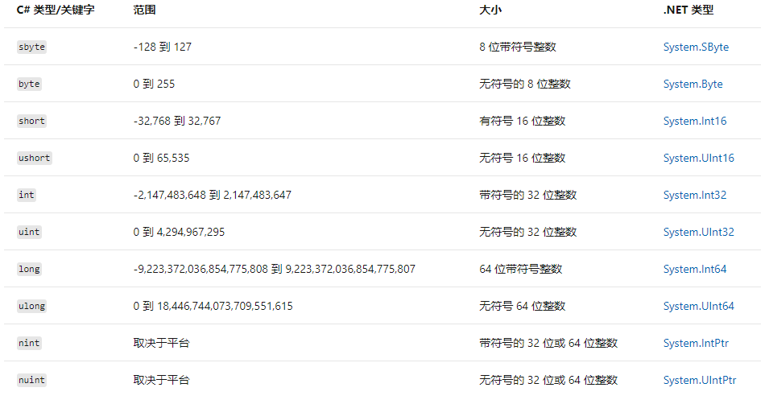

### 3.2 浮点数值类型

[官方文档 - 浮点数值类型](https://docs.microsoft.com/zh-cn/dotnet/csharp/language-reference/builtin-types/floating-point-numeric-types)

浮点数值类型表示实数。需要小数的大多数情况下使用该类型

注：位(bit)是计算机中最小的存储单位，只能存一个0或1(二进制)，一个字节(bytes)等于8位，即8个0或1

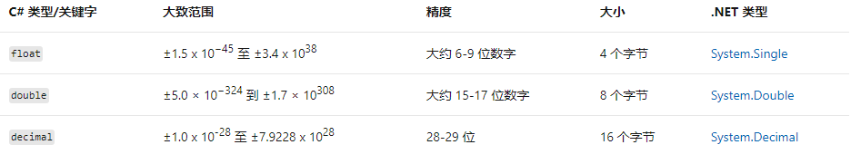

补：字符串（string）：不属于基本数值类型，多个字符放在一起的集合，属于数组，后面讲数组，字符与字符串会单独说明。

### 3.3 bool char null 和 可空

- bool: 布尔型，值为 true 或 false （真或假），只要一个位即可存放
  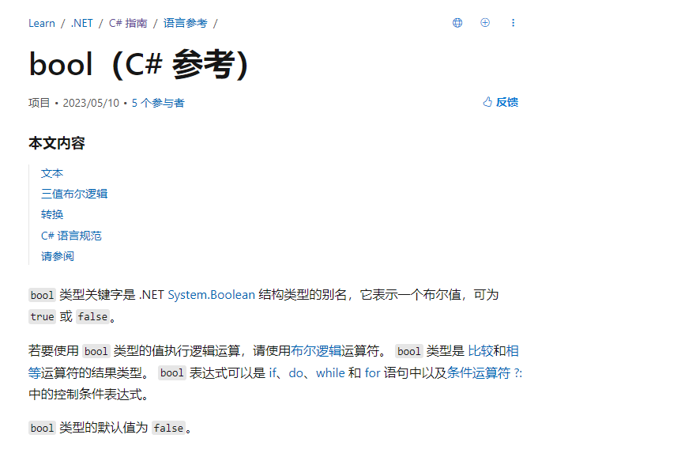;

- char: 字符型, 大小 16 位,值为 '' 括起来的单个字符
  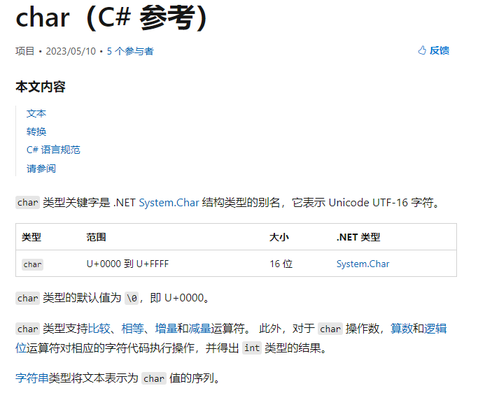;
- null: 空，表示什么都没有
- 类型?: 可空。 如 int? a; 表示可以为空的变量 a，使用之前需要先判断 a 的值是否为空；直接使用空值会引起异常，导致程序出错，不能运行

### 3.4 var

隐式“类型”var，会根据赋值类型，推断出变量类型
.PNG);

```CS
var a = 5; // 变量 a 的类型会被系统推断为 int
```

## 4. 语句、表达式和运算符

### 4.1 语句

概念：C# 中，以 ; 结束的一行，称为一条语句，是 C# 代码执行时的最小单位

例如：
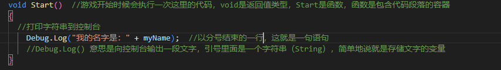;

### 4.2 运算符

概念：用作运算的符号  
以下三种常用的运算符需要熟练掌握

[官方文档 - 运算符](https://docs.microsoft.com/zh-cn/dotnet/csharp/language-reference/operators/arithmetic-operators)

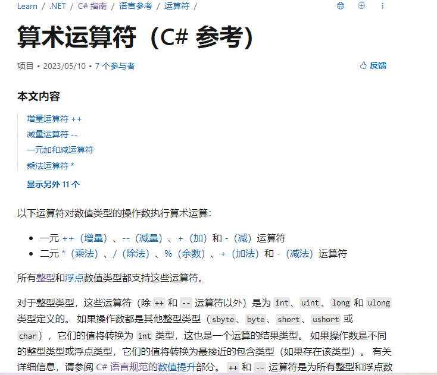;
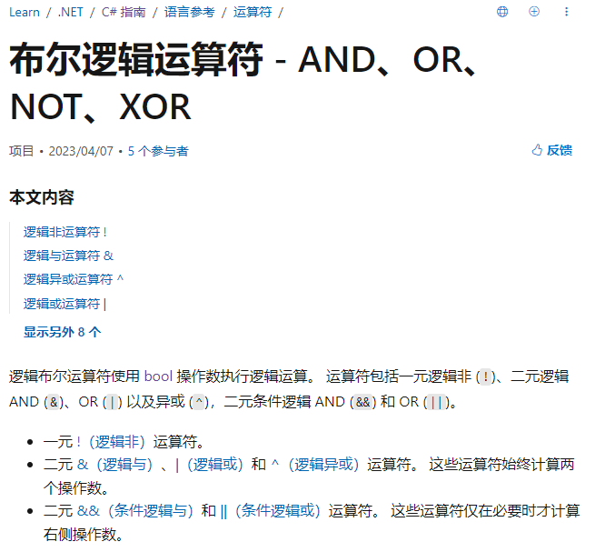;
.png);

注：元：需要多少个计算数参与

### 4.3 表达式

常量（具体的值，如1，2，3）、变量（int a，float b)和运算符组成的式子，经过运算，可以得出一个确定的值。

所以，每个表达式就是一个没有被计算出来的值，但一定是固定的数据类型，所以要对应一个确定的数据类型

</br>

</hr>
</br>

配套视频教程：
[https://space.bilibili.com/43644141/channel/seriesdetail?sid=299912](https://space.bilibili.com/43644141/channel/seriesdetail?sid=299912)

文章也同时同步微信公众号，喜欢使用手机观看文章的可以关注


补：数组：是存储相同类型元素的固定大小的有顺序的一种集合。

前言：在上期的教程中，我们学习了许多c#有关的基本概念，如：数据类型（整形，浮点型）、bool char null 和 可空、隐式类型var、语句、表达式和运算符等等，今天让我们学习新的概念——函数，以及如何使用函数.
