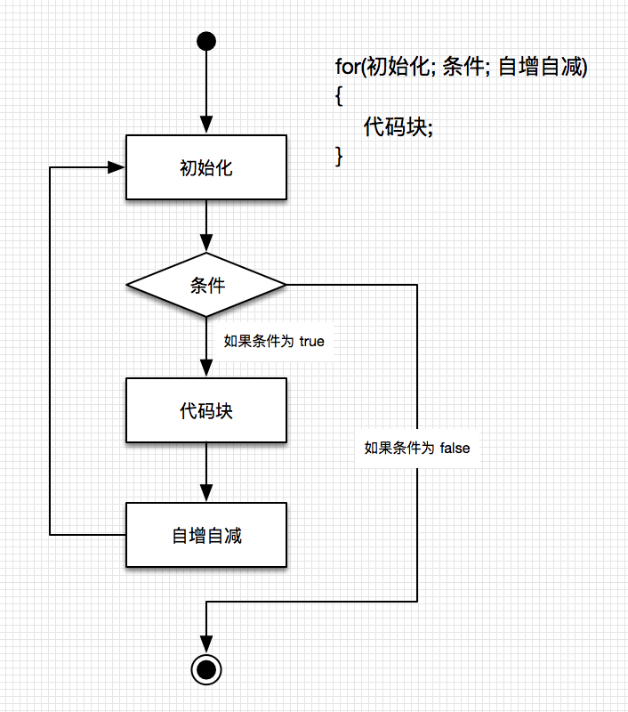

# 流程控制

> [C# 官方文档 - 选择语句](https://docs.microsoft.com/zh-cn/dotnet/csharp/language-reference/statements/selection-statements)  
> [C# 官方文档 - 迭代语句](https://docs.microsoft.com/zh-cn/dotnet/csharp/language-reference/statements/iteration-statements)  
> [C# 教程 - 通过分支和循环语句了解条件逻辑（强烈建议学习）](https://docs.microsoft.com/zh-cn/dotnet/csharp/tour-of-csharp/tutorials/branches-and-loops)

【百日挑战24】unity教程之学习脚本编程初步（七）
  
前言：在上期教程中，我们学习了在不使用代码的情况下使用可视化脚本进行编程，我们介绍了 Visual Script 相关概念和如何安装，以及这种编程方式的优缺点，最后动手实操如何使用Visual Script编写代码，用可视化的方式复刻了之前打印名字到控制台的代码，今天我们一起学习关于流程控制的知识，包括选择语句和迭代语句（分支和循环）。
## 1. 条件分支

包括了选择和迭代（循环），
概念：设定一个条件，根据不同结果，执行不同的语句段

也可以称为“选择”，遇到一个节点时候，不同的选择会有不同的流程，就好像生活，在每个节点，做出不同选择，就会走上不同的道路，整个人生就是由这一次次的选择所组成

### 1.1 if


  
如图，这是一个流程图，通常有一个起始点和一个终点，菱形是条件，条件一般是一个布尔表达式（值为布尔型），如果为ture则执行后面的代码块，否则跳过这段代码，矩形是代码块，执行单条代码，箭头是程序的走向。
  
接下来我们以一段代码为例
  
这段代码的目的就是比较 myName 和 需要比较的值 是否一致，如果一致则控制台打印字符串：输入的myName与需要比较的值相等喵~，我们测试一下
  
```C#
using System.Collections;
using System.Collections.Generic;
using UnityEngine;
//注意，类名和脚本名不匹配会导致无法将组件挂载到游戏对象上
public class MainPlayer : MonoBehaviour
{
    public string myName = "爱莉小跟班";  
    public string 需要比较的值 = "爱莉小跟班";

    // Start is called before the first frame update
    void Start()  //游戏开始时候会执行一次这里的代码，void是返回值类型，Start是函数，函数是包含代码段落的容器
    {

        if (myName.Equals(需要比较的值))  //括号内的代码用于比较字符串是否相等，
                                    //Equals是一个方法，用于比较前面的字符串对象 myName 和后面参数的字符串值是否相等
                                    //同时返回一个布尔值，等于返回ture，不等于返回false，相当于关系运算符“==”
        {
            Debug.Log("输入的myName与需要比较的值相等喵~");
        }
    }

    // Update is called once per frame
    void Update()
    {

    }
}

```
  
这段代码的目的就是比较 myName 和 需要比较的值 是否一致，如果一致则控制台打印字符串：输入的myName与需要比较的值相等喵~，我们测试一下
  
可以看到，当我们输入的两个字符串一致就会在控制台打印字符串：输入的myName与需要比较的值相等喵~，如果不一致就无事发生，这说明只有当 myName 和 需要比较的值 一致的时候就会执行Debug.Log() 这行代码
  
总结：if之后可以什么都不做，代表条件为真执行函数体内的代码，否则就跳出不执行函数体内代码。
  
注意：一般情况下，代码是按顺序执行的，也就是从上到下，所以改变代码所在行的顺序也会改变控制台打印字符串的顺序
  
现在再让我们来看这段代码，比之前多了个else和一个新的函数体，让我们再执行下看看效果。
  
可以看到，当我们输入的两个字符串一致就会在控制台打印字符串：输入的myName与需要比较的值相等喵~，如果不一致就在控制台打印：输入的myName与需要比较的值不相等喵~，这说明当 myName 和 需要比较的值 一致的时候（if后面的条件为真）就会执行if后面的函数体，否则就执行else后面的函数体。这里就出现了两个分支，满足条件的走向if下面的代码块，不满足条件的都走到else下面的代码块，可见，不同的条件分别走向不同的打印结果，相当于语文中的如果...否则...句式。
  
但是有时候我们肯定不止两种条件，那就不能用else了，而是用多个else if，在shader编程中类似的语句还有elif，但他们的作用基本一致，如果if的判断没有通过,则进行下面的else if,如果当前的else if判断通过,则执行当前else if的语句。如果没通过,则一直执行下面的else if，直到跳出整个if，else if的用法与if基本一致。让我们接着看段代码。
  
可以看到，代码执行情况跟我前面的讲解完全一致，当test的值与testVariable2相等时候会执行if代码块里的内容，当test的值与testVariable2相等时候则执行else if里面的代码块，如果都不相等则不执行任何代码。当然你再加else也是一样的，但是要注意顺序
  
最后再来加深印象，if括号里面接的是一个布尔表达式，只能接受真或假的结果，如果使用else if说明如果满足别的分支条件则执行对应的代码块，else为最后的分支，如果在else之前的if、else if判断都没有通过就会执行else里面的语句，他们后面都要跟着一个代码块，里面装各种要执行的方法，条件与条件之间必须互斥，不能有包含关系。那么今天就先讲下关于if函数的用法，大家先慢慢消化下。
  
```C#
using System.Collections;
using System.Collections.Generic;
using UnityEngine;
//注意，类名和脚本名不匹配会导致无法将组件挂载到游戏对象上
public class MainPlayer : MonoBehaviour
{
    public string myName = "爱莉小跟班";
    public string test = "";  

    public string testVariable1 = "我永远喜欢爱莉希雅";
    public string testVariable2 = "夸夸你，好厉害";

    // Start is called before the first frame update
    void Start()  //游戏开始时候会执行一次这里的代码，void是返回值类型，Start是函数，函数是包含代码段落的容器
    {

        if (test.Equals(testVariable2))  //括号内的代码用于比较字符串是否相等，
                                    //Equals是一个方法，用于比较前面的字符串对象 myName 和后面参数的字符串值是否相等
                                    //同时返回一个布尔值，等于返回ture，不等于返回false，相当于关系运算符“==”
        {
            Debug.Log(myName + "，哇，谢谢你，好想让你再多夸夸我啊~满足我的心愿，好吗？");
        }
        else if (test.Equals(testVariable1))
        {
            Debug.Log(myName + "，嗨，你好呀！看见我，有没有很开心呢？");
        }
        
    }

    // Update is called once per frame
    void Update()
    {

    }
}

```

```C#
using System.Collections;
using System.Collections.Generic;
using UnityEngine;
//注意，类名和脚本名不匹配会导致无法将组件挂载到游戏对象上
public class MainPlayer : MonoBehaviour
{
    public string myName = "爱莉小跟班";  
    public string 需要比较的值 = "爱莉小跟班";

    // Start is called before the first frame update
    void Start()  //游戏开始时候会执行一次这里的代码，void是返回值类型，Start是函数，函数是包含代码段落的容器
    {

        if (myName.Equals(需要比较的值))  //括号内的代码用于比较字符串是否相等，
                                    //Equals是一个方法，用于比较前面的字符串对象 myName 和后面参数的字符串值是否相等
                                    //同时返回一个布尔值，等于返回ture，不等于返回false，相当于关系运算符“==”
        {
            Debug.Log("输入的myName与需要比较的值相等喵~");
        }
        else
        {
            Debug.Log("输入的myName与需要比较的值不相等喵~");
        }
    }

    // Update is called once per frame
    void Update()
    {

    }
}

```
  
【百日挑战25】unity教程之学习脚本编程初步（八）  
前言：在上期教程中，我们大致介绍了条件分支的概念，然后讲了分支语句中的if语句，先看了他的流程图，然后用三段代码详细的讲解了if，else，else if语句的用法，最后归纳了他们的区别，今天我们继续讲解if，else，else if语句的格式，switch语句相关知识点。
  
- 格式：

```C#
// 第一种形式：

//条件表达式值为 true，执行语句块
//如果布尔表达式为 false，则跳过 if 语句块，直接执行后面的代码（闭括号后）
if(布尔表达式){
    语句块...
}

// 第二种形式：

//条件表达式值为 true，执行语句块1
//如果布尔表达式为 false，则跳过 if 语句块，执行语句块2
if(布尔表达式){
    语句块1...
}
else{
    语句块2...
}

// 第三种形式：

if(boolean_expression 1)
{
    /* 当布尔表达式 1 为真时执行 */
}
else if( boolean_expression 2)
{
    /* 当布尔表达式 2 为真时执行 */
}
else if( boolean_expression 3)
{
    /* 当布尔表达式 3 为真时执行 */
}
else
{
    /* 当上面条件都不为真时执行 */
}

```

布尔表达式:值为 bool 类型的表达式

### 1.2 switch

概念：也是条件分支的一种，一个 switch 语句允许测试一个变量等于多个值时的情况。每个值称为一个 case，且被测试的变量会对每个 switch case 进行检查。
  
区别：和if条件语句不同，switch条件语句只能针对某个表达式的值做出判断，从而决定程序执行哪段代码。switch关键字后面会有一个表达式case,case关键字后有目标值,当表达式的值和某个目标值case相匹配的时候,会执行对应的case语句，而if语句是如果满足if后的条件,就进行相应的处理,否则的话就进行else,另一种处理
  
格式：

```C#
switch(expression){
    case constant-expression  :
       statement(s);
       break;
    case constant-expression  :
       statement(s);
       break;

    /* 您可以有任意数量的 case 语句 */
    default : /* 可选的 */
       statement(s);
       break;
}
```

例子：

```C#

//成绩变量 grade ，设置默认值 'B'
public char grade = 'B';
//grade的值是什么，根据下面的case决定
switch (grade) 
{
    case 'A':  //case后面跟着要关心的值，每个case就是一个分支，后面跟着一个条件分支语句段，
        Debug.Log("很棒！");  //意思是满足条件grade为“A”时候，控制台打印"很棒！"
        break;  //到了break就会跳出这个switch分支
    case 'B':  //满足条件B的时候继续往下执行
    case 'C':
        Debug.Log("做得好");  //所以当case的值是B或C的时候都会在控制台打印"做得好"
        break;
    case 'D':
        Debug.Log("您通过了");
        break;
    case 'F':
        Debug.Log("最好再试一下");
        break;
    default:  //如果A,B,C,D都不满足就执行default里的语句
        Debug.Log("无效的成绩");
        break;
}
Debug.Log($"您的成绩是 {grade}");  //字符串前面加一个$符号，就能用{}把我们想输出的变量直接输出，如果你希望在一个字符串中输出一个变量的值要稍微注意下

```
  
把这段代码粘贴到unity，测试并输入A,B,C,D,F检查运行效果，可以看到，当分别输入A,B,C,D,F的时候，控制台分别打印"很棒！"、"做得好"、"您通过了"、"最好再试一下"，如果值都不满足则输出"无效的成绩"，最后打印 "您的成绩是+你输入的grade"
  
### 1.3 使用Visual Script
  
学习了条件分支语句if和switch的知识，我们趁热打铁，用可视化Visual Script编写条件分支，代码就是上期那段讲if分支最后的例子。因为之前已经很细致的讲过Visual Script的用法了，一些基本的操作我会略过。
  
1、创建变量，给gameObject挂载一个Script Machine，Variable也会自动创建，在其中填写我们需要用到的变量：myName、test、testVariable1、testVariable2，值分别为“爱莉小跟班”、留空、“我永远喜欢爱莉希雅”、“夸夸你，好厉害”，Type全选String。
  
2、添加变量的节点，在Asset中新建一个脚本图编辑，Script Machine中Source选Graph，方便复用脚本，将脚本图绑定给对应的Script Machine组件，添加4个Get Object Variable节点，分别选择之前在Variable添加的四个变量。
  
3、添加生命周期方法（事件函数）On Start，箭头代表流程，你把三角形往哪拖流程就往哪走，然后添加if节点，注意观察他，前面有true或者false的点，这里同样需要传入布尔表达式来判断条件真假。
  
4、我们的目的是比较变量test输入的值是否与testVariable2或者testVariable1匹配，所以我们要添加一个Equal节点，把test的变量和Equal节点相连，然后将testVariable2变量节点连在Equal节点的B上，表示将test变量的值与testVariable2对应的字符串进行比对，如果相等返回true的布尔值，反之返回false，最后将Equal节点与if节点连接，这样一个条件表达式就成立了
  
5、根据打印的内容，由于我们需要组合变量和常量，常量部分是一个String，内容是："，哇，谢谢你，好想让你再多夸夸我啊~满足我的心愿，好吗？"，这里需要用到 Add Inputs 节点，然后分别将变量和常量两个节点连在Add Inputs 节点的A，B上，表示A+B，如果你要加更多的量可以增加该节点的数字，这段共同组成了一个新的字符串（参数）：myName + "，哇，谢谢你，好想让你再多夸夸我啊~满足我的心愿，好吗？"，添加Debug:Log(message)节点，表示将前面的字符串打印在控制台上，最后将他们连起来即可。
  
6、继续添加if节点，常量值为："，嗨，你好呀！看见我，有没有很开心呢？"，控制台打印字符串：myName + 常量值，操作都是类似的，只是注意开始这个if语句开始的条件是当前一个if不成立（false）的情况再打印，组成else if的效果，保存，填写test变量值，测试，与代码运行效果一致。
  
## 2. 循环(迭代)

循环语句允许我们多次执行一个语句或语句组，满足一个或多个条件情况下会重复执行某一段代码，直到不满足条件为止，下面是大多数编程语言中循环语句的一般形式：


  
> 死循环：  
> 循环条件一直为 true 的循环，会永远执行下去，不会跳出

### 2.1 while / do while

```C#
//先判断bool表达式，当值为 true，进入循环
//执行完循环语句段，会再次进行判断
//如此往复，直到表达式为 false ，跳出循环
//执行后面的语句
while(bool表达式)
{
    循环语句段
}

//和上面的区别是，会先执行一次循环语句段，
//之后再进行条件判断
do{
    循环语句段
}
while(bool表达式)
```

### 2.2 for

for 是 while 的缩写

```C#
for(int i=1 ;i< 10; i++)
{
    Debug.Log($"第{i}次循环....");
}

```



### 2.3 foreach 遍历

遍历集合

### 2.4 break / continue / return

- break :  
  结束当前 case ,继续往下执行；
- continue :  
  结束本次循环，继续下一次循环；
- return ：
  return 语句可终止它所在的方法的执行，并将控制权返回给调用方法。 它还可以返回可选值。  
  如果用在循环里，会立马返回，终止循环

<br>

<hr>
<br>

配套视频教程：
[https://space.bilibili.com/43644141/channel/seriesdetail?sid=299912](https://space.bilibili.com/43644141/channel/seriesdetail?sid=299912)

文章也同时同步微信公众号，喜欢使用手机观看文章的可以关注


注：Audio Source（音频源），相当于一个声音的控制器，控制声音的各种选项，Audio Clip是Audio Source中最核心的一个类，他就是一个声音的片段，对应Asset中的声音文件，Audio Clip决定Audio Source会播放什么样的音频，Audio Source有一个类叫做Play On Awake，如果启用，声音将在场景启动的那一刻开始播放。如果禁用，则需要使用脚本中的 Play（） 命令启动它。
