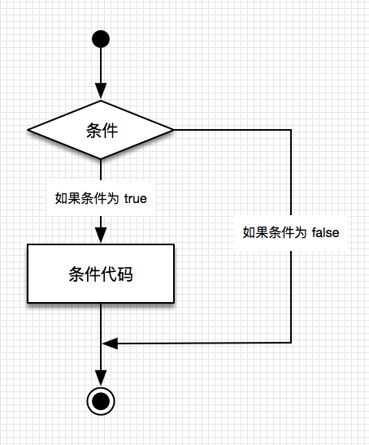
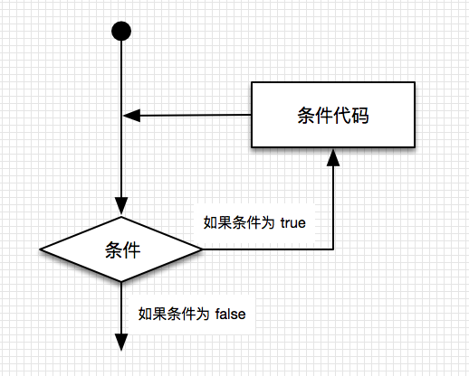

# 流程控制

> [C# 官方文档 - 选择语句](https://docs.microsoft.com/zh-cn/dotnet/csharp/language-reference/statements/selection-statements)  
> [C# 官方文档 - 迭代语句](https://docs.microsoft.com/zh-cn/dotnet/csharp/language-reference/statements/iteration-statements)  
> [C# 教程 - 通过分支和循环语句了解条件逻辑（强烈建议学习）](https://docs.microsoft.com/zh-cn/dotnet/csharp/tour-of-csharp/tutorials/branches-and-loops)

【百日挑战24】unity教程之学习脚本编程初步（七）
  
前言：在上期教程中，我们学习了在不使用代码的情况下使用可视化脚本进行编程，我们介绍了 Visual Script 相关概念和如何安装，以及这种编程方式的优缺点，最后动手实操如何使用Visual Script编写代码，用可视化的方式复刻了之前打印名字到控制台的代码，今天我们一起学习关于流程控制的知识，包括选择语句和迭代语句（分支和循环）。
## 1. 条件分支

包括了选择和迭代（循环），
概念：设定一个条件，根据不同结果，执行不同的语句段

也可以称为“选择”，遇到一个节点时候，不同的选择会有不同的流程，就好像生活，在每个节点，做出不同选择，就会走上不同的道路，整个人生就是由这一次次的选择所组成

### 1.1 if


  
如图，这是一个流程图，通常有一个起始点和一个终点，菱形是条件，条件一般是一个布尔表达式（值为布尔型），如果为ture则执行后面的代码块，否则跳过这段代码，矩形是代码块，执行单条代码，箭头是程序的走向。
  
接下来我们以一段代码为例
  
```C#
using System.Collections;
using System.Collections.Generic;
using UnityEngine;
//注意，类名和脚本名不匹配会导致无法将组件挂载到游戏对象上
public class MainPlayer : MonoBehaviour
{
    public string myName = "爱莉小跟班";  
    public string 需要比较的值 = "爱莉小跟班";

    // Start is called before the first frame update
    void Start()  //游戏开始时候会执行一次这里的代码，void是返回值类型，Start是函数，函数是包含代码段落的容器
    {

        if (myName.Equals(需要比较的值))  //括号内的代码用于比较字符串是否相等，
                                    //Equals是一个方法，用于比较前面的字符串对象 myName 和后面参数的字符串值是否相等
                                    //同时返回一个布尔值，等于返回ture，不等于返回false，相当于关系运算符“==”
        {
            Debug.Log("输入的myName与需要比较的值相等喵~");
        }
        else
        {
            Debug.Log("输入的myName与需要比较的值不相等喵~");
        }
    }

    // Update is called once per frame
    void Update()
    {

    }
}

```
  
注意：if之后可以什么都不做，代表条件为真执行函数体内的代码，否则就跳出不执行函数体内代码。
  
- 格式：

```C#
// 第一种形式：

//条件表达式值为 true，执行语句块
//如果布尔表达式为 false，则跳过 if 语句块，直接执行后面的代码（闭括号后）
if(布尔表达式){
    语句块...
}

// 第二种形式：

//条件表达式值为 true，执行语句块1
//如果布尔表达式为 false，则跳过 if 语句块，执行语句块2
if(布尔表达式){
    语句块1...
}
else{
    语句块2...
}

// 第三种形式：

if(boolean_expression 1)
{
    /* 当布尔表达式 1 为真时执行 */
}
else if( boolean_expression 2)
{
    /* 当布尔表达式 2 为真时执行 */
}
else if( boolean_expression 3)
{
    /* 当布尔表达式 3 为真时执行 */
}
else
{
    /* 当上面条件都不为真时执行 */
}

```

布尔表达式:值为 bool 的表达式

### 1.2 switch

一个 switch 语句允许测试一个变量等于多个值时的情况。每个值称为一个 case，且被测试的变量会对每个 switch case 进行检查。

```C#
switch(expression){
    case constant-expression  :
       statement(s);
       break;
    case constant-expression  :
       statement(s);
       break;

    /* 您可以有任意数量的 case 语句 */
    default : /* 可选的 */
       statement(s);
       break;
}
```

例子：

```C#

//成绩变量 grade ，设置默认值 'B'
public char grade = 'B';

switch (grade)
{
    case 'A':
        Debug.Log("很棒！");
        break;
    case 'B':
    case 'C':
        Debug.Log("做得好");
        break;
    case 'D':
        Debug.Log("您通过了");
        break;
    case 'F':
        Debug.Log("最好再试一下");
        break;
    default:
        Debug.Log("无效的成绩");
        break;
}
Debug.Log($"您的成绩是 {grade}");

```

## 2. 循环(迭代)

循环语句允许我们多次执行一个语句或语句组，满足一个或多个条件情况下会重复执行某一段代码，直到不满足条件为止，下面是大多数编程语言中循环语句的一般形式：


  
> 死循环：  
> 循环条件一直为 true 的循环，会永远执行下去，不会跳出

### 2.1 while / do while

```C#
//先判断bool表达式，当值为 true，进入循环
//执行完循环语句段，会再次进行判断
//如此往复，直到表达式为 false ，跳出循环
//执行后面的语句
while(bool表达式)
{
    循环语句段
}

//和上面的区别是，会先执行一次循环语句段，
//之后再进行条件判断
do{
    循环语句段
}
while(bool表达式)
```

### 2.2 for

for 是 while 的缩写

```C#
for(int i=1 ;i< 10; i++)
{
    Debug.Log($"第{i}次循环....");
}

```


### 2.3 foreach 遍历

遍历集合

### 2.4 break / continue / return

- break :  
  结束当前 case ,继续往下执行；
- continue :  
  结束本次循环，继续下一次循环；
- return ：
  return 语句可终止它所在的方法的执行，并将控制权返回给调用方法。 它还可以返回可选值。  
  如果用在循环里，会立马返回，终止循环

<br>

<hr>
<br>

配套视频教程：
[https://space.bilibili.com/43644141/channel/seriesdetail?sid=299912](https://space.bilibili.com/43644141/channel/seriesdetail?sid=299912)

文章也同时同步微信公众号，喜欢使用手机观看文章的可以关注


