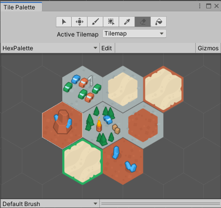
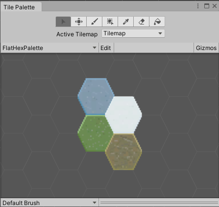
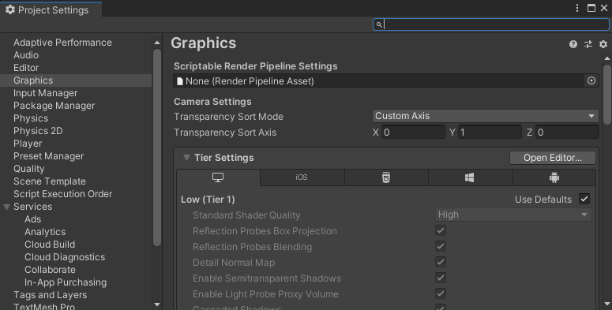

# 使用瓦片地图创建世界

## 1. 瓦片地图 Tilemap 系统

### 1.1 概念

> [Tilemap 官方手册](https://docs.unity3d.com/cn/2021.2/Manual/class-Tilemap.html)

简介：Tilemap 是 2D 游戏中，用来构建世界的工具，这个工具使用技术的好坏，直接影响到你制作 2D 游戏时的工作量，在unity的瓦片地图中，地图是由一个一个网格组成的
  
一、官方文档介绍:
1. The Tilemap component is a system which stores and handles Tile Assets for creating 2D levels.  
瓦片地图组件，是一个存储和操作 Tile 资源的系统，用来创建 2D 关卡。
  
2. It transfers the required information from the Tiles placed on it to other related components such as the Tilemap Renderer and the Tilemap Collider 2D.  
该系统还可以将所需信息通过所包含的 Tiles 传输到其他相关组件，例如 Tilemap Renderer（渲染呈现） 和 Tilemap Collider 2D（碰撞）。
  
创建瓦片地图时，Grid 组件自动作为瓦片地图的父级，并在将瓦片布置到瓦片地图上时作为参照
  
### 1.2 常见模块介绍
  
二、相关概念：
  
1、素材相关（类）：
  
- Sprite(精灵)：纹理的容器。大型纹理图集可以转换为精灵图集(Sprite Sheet)
- Tile(瓦片)：包含一个精灵，以及二个属性，颜色和碰撞体类型。使用瓦片就像在画布上画画一样，画画时可以设置一些颜色和属性
  
2、工具相关：
  
- Tile Palette(瓦片调色板)：当你在画布(Canvas)上画画时，会需要一个位置来保存绘画的结果。类似地，调色板(Palette)的功能就是保存瓦片，将它们绘制到网格上  
关于Create New Palette 属性如下：
- Brush(笔刷)：用于将画好的东西绘制到画布上。使用 Tilemap 时，可以在多个笔刷中任意选择，绘制出线条、方块等各种形状
  
3、组件相关：
  
- Tilemap（瓦片地图）：类似 Photoshop 中的图层，我们可以在 Tilemap 上画上 Tile  
关于 Tilemap（瓦片地图） 属性如下：
- Grid(网格)：用于控制网格属性的组件。Tilemap 是 Grid 的子对象。Grid 类似于 UI Canvas(UI 画布)。
- Tilemap Renderer(瓦片地图渲染器)：是 Tilemap 游戏对象的一部分,用于控制 Tile 在 Tilemap 上的渲染，控制诸如排序、材质和遮罩等。
  
今天我们就先简单讲解下关于Tilemap系统各项功能及其用法，下期我们将带大家动手实操一次瓦片地图中的各个功能模块，实现在场景中创建Tilemap以及使用Tile Palette为场景绘制网格地图。
  
### 【百日挑战49】unity教程之2D游戏开发初步（十三）
  
前言：在上期教程中，我们通过官方一个新的2D的RPG游戏教程系列《RubyAdventure2DRpg》学习了关于Tilemap系统各项组件功能及其相关概念和用法，今天我们接着在实际的项目中使用这些工具实现在场景中创建Tilemap以及使用Tile Palette为场景绘制网格地图。
  
接下来让我们按照官方项目的步骤，动手实操下这个瓦片地图。
  
1.首先下载官方教程的素材，一张砖块的图片，用于构建我们的地图，将其存放在Assets\Art\Sprites 目录下，重命名为 tile，导入设置保持默认的Sprite即可
  
2.我们希望让这个图片充当Tile Map中的Tile（瓦片），首先在Scene中新建一个瓦片地图，步骤是 Hierachy窗口中右键->GameObject->2D Object->Tilemap->Rectangler （矩形瓦片地图）。
  
3.选择 Tilemap 选项后，在场景中将会创建一个新的 Grid 游戏对象，其中包含 Tilemap 子游戏对象。Grid 游戏对象决定了其子 Tilemap 的布局。而且Scene中多了两个游戏对象，我们可以在Hierachy窗口里看到一个Grid的父对象包含一个Tilemap的子对象，前者主要是用于定位以及网格的设置等（偏移、网格大小），后者才是主要用于绘制游戏地图的。
  
4.Tilemap 子游戏对象由 Tilemap 组件和 Tilemap Renderer 组件组成。Tilemap 游戏对象是绘制瓦片的地方。重点讲解其中的Tilemap组件，该组件的各项功能可参考上期教程，这里面所有参数保持默认即可。
  
5.当包含Tilemap组件的对象被选中时，Scene右下角会出现“打开瓦片调色板”（新版隐藏在scene的右上角找找，scene上面的最后一个图标），打开即可进行Tile Palette(瓦片调色板)相关配置了。
  
6.在Tile Palette中点击“Create New Palette”，设置名称，网格、单元格大小、排序模式等，除了名称外都先保持默认，点击“创建”，然后选择一个对应的文件夹存放对应的Prefab。
  
7.完成了Palette的创建，继续创建瓦片，在专门存放Tiles的文件夹下，点击Asset右键->Create->2D->Tiles->Rule Tile，其中也可以选择各种类型的Tile，比如Animated Tile可以设置动态的瓦片，比如瀑布，烟雾，闪光，火焰等，这里选择常规的一类瓦片地图——规则的Tile，不同版本这里显示的可能会不同，但功能大差不差，这里面也可以创建Tile Palette。
  
提示：Unity 使用面板 (Palette) 来定义在瓦片地图的哪个单元格中渲染哪个瓦片。你的瓦片地图就像是画布，瓦片则像是你的颜色。你可以将瓦片置于面板上，这样你就可以拾取瓦片并将瓦片应用于瓦片地图，Tilemap实际上也是一种特殊的Sprite。
  
8.点击创建Rule Tile的asset之后，重命名，在 Inspector 中，可以看到瓦片资源的属性。此处包括一个 Sprite 字段（瓦片将绘制此精灵），Default Sprite指的是创建新Rule时候默认使用的Sprite，在 Inspector 中，单击 Sprite 属性右侧的圈选按钮。此时将打开一个对话窗口，其中会显示你的项目的所有精灵。选择刚保存在 Project 中的一个精灵。或者，可以将刚保存的精灵从 Project 文件夹拖放到 Inspector 中的 Sprite 属性字段。我们这里不设置规则就是一般的tile，铺满一个格子的这种Sprite。
  
9.创建完了Rule Tile，我们打开瓦片调色板，将新瓦片 (FirstTile) 从 Project 窗口拖到新面板（Tile Palette）的中心（要求的位置），再将显示在面板网格中的瓦片单击以将其选中，最后从 Tile Palette 顶部的工具栏中，选择画笔工具，即可愉快的刷地图了
  
10.打开scene视图的Gizmos，白框是摄像机的可视范围，即屏幕能展示的区域，所以绘制的时候要注意下范围，确保选择了画笔工具，然后就能通过拖拽或者点击的方式绘制瓦片地图了
  
11.这里有一个小bug需要解决，就是scene中的瓦片并没有填充满整个Tile，这是因为我们在Tile的占用的单元格大小和Sprite每单位像素数不一致造成的。
  
11.1.在 Hierarchy 窗口中，选择 Grid 游戏对象。在 Inspector 中，找到 Cell Size 属性。你会发现 x 和 y 均设置为 1，这意味着每个单元格的宽度为 1 个单位，高度为 1 个单位。
  
12.在 Project 窗口中，选择瓦片精灵。Inspector 将显示精灵的 Import Settings。你会发现 Pixels Per Unit  属性已设置为 100。其中“Pixels per Unit”通过定义 1 个单位内应该设置的像素数量来告知 Unity 如何设置精灵的大小。此示例中为 100 像素/单位，它的作用是Sprite 图像中与世界空间中的一个距离单位相对应的宽度/高度像素数，即每个单位需要多少个像素，一个单位就是一个方格。即绘制的区域是按照100x100绘制的，但我们图片的分辨率是64x64，你在 Inspector 底部，查看精灵的大小。你会发现精灵的宽度和高度只有 64 像素。，显然无法占满整个单元格，解决办法也很简单，只要把这个值与我们图片的长宽匹配即可——设置为64，这样就只在一个单元格内填充64x64个像素了，编辑完成之后点击“Apply”保存即可。这样我们的tile就会填满整个瓦片地图了。
  
13.继续运行，这里又出现第二个问题，就是我们的瓦片地图出现在了玩家的上层，玩家被挡住了，这不符合我们的要求，我们希望瓦片地图能在图层的最下层，由于Renderer图层排序默认后添加的在上层，解决办法就是选择我们scene创建的 Tilemap 对象，找到 Tilemap Renderer 组件，将 Order in Layer（图层排序）改为-1，即可让Tilemap的绘制顺序始终在Player之后。
  
14.如果还是不行，再检查下Ruby 的Sprite Renderer中的Order in Layer（图层排序）是否大于Tilemap的图层排序。
  
最后的运行效果如图：
  
至此，我们就带大家手把手创建Tilemap以及使用Tile Palette为场景绘制网格地图，并踩坑了一些新手常见的误区，比如解决了单元格无法填充满和图层绘制顺序的问题。
  
### 【百日挑战50】unity教程之2D游戏开发初步（十四）
  
前言：在上期教程中，我们通过官方一个新的2D的RPG游戏教程系列《RubyAdventure2DRpg》手把手创建Tilemap以及使用Tile Palette为场景绘制网格地图，并踩坑了一些新手常见的误区，解决了单元格无法填充满和图层绘制顺序的问题。今天我们继续完善我们的瓦片地图，通过切割Sprite的方式为tile设定更多的规则，使得绘制元素更加丰富多样。
  
在正式的项目中，Tile Palette中通常是由多个瓦片拼接而成的一个集合，所以如果我们要将这些Sprite作为Palette中的Tile使用之前需要进行分割，比如我们希望将这个方砖拆分成九宫格，这样做的好处就是可以重复利用素材，想画哪里就取哪里的格子，比如我想画边界的区域就用四周的格子，中间就用中间的格子，操作步骤如下。
  
1.首先将这个Sprite的Pixels per Unit设置为64，点击“Apply”，保证能填满整个单元格。
  
2.你不能直接将整个Sprite拖拽进Tile Palette，否则只能一整块的绘制，这显然不符合我们的要求在，这里有个很重要的操作就是对Sprite进行拆分。
  
3.点击Tile Palette中的Edit按钮，点击Erase可以擦除Tile Palette内的Tile。
  
4.这里要用到Sprite Editor，先选择tile对应的Sprite，在inspector面板点击“Sprite Editor”按钮，进入Sprite编辑器，编辑器从该图像中提取不同部分到同一纹理的单独精灵中，这里面可以对导入的Sprite进行一些处理，比如Slice（切割）。
  
5.但是默认情况下这个Slice是灰色的，我们需要在Sprite的导入设置里面，将“Sprite Mode”由Single（单一）改为“Multiple（多个）”，这样方可对Sprite进行切割，点击“Apply”应用设置。
  
6.再次打开Sprite Editor，点击Slice（切割），其中有多种切割模式，Automatic适合不规则不连续的Sprite，按照网格分割不够灵活的情况下使用，从 Sprite 编辑器中选择切片工具后工具栏并将其Type设置为Grid by Cell Size（或者设置为Grid by Cell Count，然后将“行&列” 设置为 3x3），将出现以下编辑器面板：
  
注：使用“网格”选项进行切片时，纹理上会显示 SpriteRect 的预览，以帮助指导切片。调整切片设置将相应更新预览。切片后可能不会生成显示的预览 Sprite矩形，具体取决于处理现有 Sprite矩形 的方法或预览 Sprite 矩形的像素内容。
  
7.选择了切割模式和相关选项之后，点击下面的“切片”，然后点击Sprite Editor右上方的“Apply（应用）”即可。
  
8.在Project窗口可以看到我们原先一整块Sprite被拆成了9个部分，我们就通过Sprite Editor完成了Sprite的拆分，从而更方便的复用Sprite进行地图的绘制。
  
9.打开Tile Palette，将刚才分割的Sprite拖进去，选择对应的文件夹保存，可以看到文件夹下自动生成了9个tile的asset。
  
10.当我们再次用Palette进行绘制的时候，就可以选中Palette的九宫格里的任意一格单独进行更加灵活的绘制，而不是绘制一整块Sprite，如图。
  
至此，我们就学会了使用Sprite Editor对一整块Sprite进行切割并放入Tile Palette作为绘制场景的素材。
  
课后作业：试着对Assets\2DBeginnerTutorialResources\Art\Sprites\Environmnent 目录下的其他素材按照以上的步骤进行切割然后制作成tilemap存放在在Tile Palette作为更多绘制场景的颜料！
  
### 【百日挑战51】unity教程之2D游戏开发初步（十五）
  
前言：在上期教程中，我们通过官方一个新的2D的RPG游戏教程系列《RubyAdventure2DRpg》，学会了使用Sprite Editor对一整块Sprite进行切割并放入Tile Palette作为绘制场景的素材，丰富我们绘制场景的Palette，算是带大家动手实践了一整套基本的绘制瓦片地图的流程。今天我们先复习/科普下前面开发中用到的各种概念，介绍瓦片地图工作流，然后通过介绍编程瓦片和编程画笔的概念引入一套全新的瓦片画笔工具：2D 瓦片地图扩展。
  
知识梳理：
  
### 1.1 Tile Palette 工具栏

你可以将两个有用的工具与 Tilemap Palette 搭配使用来进行绘制：Tile Palette 工具栏和其他快捷方式。  
1.1.1 关于工具栏的介绍：
  
注：还有一些有用的快捷方式将帮助你绘制瓦片地图：
  
· Alt + 鼠标左键拖动 - 平移  
· 鼠标滚轮键拖动 - 平移  
· 旋转鼠标滚轮键 - 放大或缩小  

### 1.2 分类

- Rectangler 矩形瓦片地图
- Hexagonal 六边形瓦片地图：除常规瓦片地图外，Unity 还提供 Hexagonal Point Top Tilemap（点朝上） 和 Hexagonal Flat Top Tilemap（边朝上） 瓦片地图。六角形瓦片通常用于战略类桌面游戏，因为它们的中心与边上的任何点之间具有一致的距离，并且相邻的瓦片总是共享边。因此，这些瓦片非常适合构建几乎任何类型的大型游戏区域，并让玩家做出关于移动和定位的战术决策。
    
   点朝顶部的六角形瓦片示例  
    
   平边朝顶部的六角形瓦片示例
- Isometric 等距瓦片地图: 等距透视图显示所有三个 X、Y 和 Z 轴，因此可以将伪深度和高度添加到瓦片地图。  
   等距瓦片地图常用于策略类等要求仰俯视角的游戏，因为等距透视图允许模拟 3D 游戏元素，例如不同的海拔和视线。这样可使玩家在游戏过程中做出关于移动和定位的战术决策。

> 参考资料：
>
> - [【Unity】使用 Tilemap 创建等距视角 (Isometric) 的 2D 环境](https://zhuanlan.zhihu.com/p/91186217)

## 2. 瓦片 Tile

**瓦片**是排列在**瓦片地图**上的**资源**，用于构建 2D 环境。每个瓦片引用一个选定的**精灵**，然后在瓦片地图网格上的瓦片位置处渲染该精灵。

- Tile ：新版本中已经看不到，但可以使用
- Scriptable Tile：自编程瓦片
- Rule Tile：规则瓦片
- Animated Tile：动画瓦片

## 3. 瓦片地图工作流程

0. 预处理 sprite 资源：将图片资源拖拽到 project 中，生成 sprite；然后一般需要进行切割 slice ，将其配置成需要的各个 tile;
1. 创建要在其上绘制瓦片的瓦片地图。此过程中还会自动创建 Grid 游戏对象作为瓦片地图的父级。
2. 直接创建瓦片资源，或者通过将用作瓦片素材的精灵带入 Tile Palette 窗口自动生成瓦片。
3. 创建一个包含**瓦片资源**的 Tile Palette，并使用各种笔刷来绘制到**瓦片地图**上。
4. 可以将 Tilemap Collider 2D 组件连接到瓦片地图以便使瓦片地图与 Physics2D 交互。

一般 Tilemap 创建三个，分别为:

- background(地图背景)
- bound(边界)
- foreground(前景，主要是地形)
  
尽管unity已经提供了一套完整的地图绘制工具，但是对于一个商业规模的游戏，按照单个单个Tile绘制的方式效率依旧比较低下，尤其是涉及到一些重复元素的绘制时候会感到要做很多重复且枯燥的操作，那有没有一种可以更高效的绘制方式呢？
  
## 4. 瓦片地图的高级使用

使用普通的瓦片地图，构建整个世界，一个一个格子用笔刷来填充，非常费时，Unity 在不断地升级中，添加了很多种快速构建瓦片地图的方式，掌握了这些方法，能够极大减少绘制地图所用的时间。

### 4.1 编程瓦片 Scriptable Tile

Unity 支持用代码创建自己的 Tile 类，自己书写瓦片的绘制规则。

还可以为瓦片创建自定义编辑器。这与脚本化对象的自定义编辑器的工作方式相同。

创建一个继承自 TileBase（或 TileBase 的任何有用子类，如 Tile）的新类。重写新的 Tile 类所需的所有方法。

### 4.2 编程画笔 Scriptable Brush

Unity 也支持创建自己的 Brush 类，设计适合自己游戏的网格画笔。

创建一个继承自 GridBrushBase（或 GridBrushBase 的任何有用子类，如 GridBrush）的新类。重写新的 Brush 类所需的所有方法。

创建可编程画笔后，画笔将列在 Palette 窗口的 _Brushes 下拉选单 中。默认情况下，可编程画笔脚本的实例将经过实例化并存储在项目的 Library_ 文件夹中。对画笔属性的任何修改都会存储在该实例中。如果希望该画笔有多个具备不同属性的副本，可在项目中将画笔实例化为资源。这些画笔资源将在 Brush 下拉选单中单独列出。

### 4.3 2D Tilemap Extras （2D 瓦片地图扩展）

### 4.3.1 背景

尽管编程瓦片+编程画笔功能强大，但是代码门槛对于美术来说门槛比较高，官方推出了2D 瓦片地图扩展在不书写代码的情况下创建自己的瓦片规则，相当于就是将这些需要用代码书写的东西包装之后通过图形化的形式呈现，初学者可在不写代码的情况下定制自己的瓦片和画笔规则，即所谓的Rule Tile。
  
### 4.3.2 简介
  
2D Tilemap Extras 包包含可重用的 2D 和 Tilemap 编辑器脚本，您可以将其用于您自己的项目，并作为您自己的自定义画笔和图块的基础。您可以自由自定义脚本的行为，以创建适合不同用途或场景的新画笔。要查找这些附加画笔，请打开“平铺调色板”窗口（菜单：“窗口”>“2D”>“平铺调色板”），然后打开编辑器底部附近的“画笔”下拉菜单。从可用的画笔选项中进行选择以获得不同的效果。
  
### 4.3.3 可编程画笔
  
· GameObject：此 Brush 实例、放置和操作游戏对象到场景上。以此为例创建以游戏对象（而非图块）为目标的画笔，以进行实例化和操作。
  
· 组：此画笔根据瓷砖之间的相对位置来选择瓷砖组。通过设置“间隙”和“限制”属性来调整画笔选取的组的大小。使用此画笔作为示例来创建根据特定条件选取图块的画笔。
  
· Line：此画笔在 Tilemap 上的两点之间绘制一条 Tiles 线。以此为例修改画笔绘画行为，使绘画更加高效。
  
· 随机：此画笔将随机图块放置到图块地图上。以此作为示例来创建存储每个画笔特定数据的画笔，并制作随机化行为的画笔。
  
### 4.3.4 可编写脚本的图块
  
以下是此包中包含的可编写脚本的 Tiles。您可以创建（菜单：创建 > 平铺）此包中包含的以下附加平铺类型。

· 动画：此图块按顺序运行并显示精灵列表，以创建逐帧动画。
  
· 规则图块：这是一个通用的视觉图块，它接受您使用平铺规则编辑器创建的规则来创建不同的图块集。规则图块是地形、管道、随机或动画图块的基础。每种Tilemap 网格类型都有不同类型的规则图块。默认规则图块仅与矩形网格类型图块地图一起使用，而六角形和等距规则图块与其各自的网格类型一起使用。
  
· 六角形规则瓷砖：六角形网格的规则瓷砖。启用平顶六角网格的“平顶”属性，或清除尖顶六角网格的“平顶”属性。
  
· 等距规则图块：与等距网格一起使用的规则图块。
  
· 规则覆盖图块：此图块可以覆盖给定规则图块的精灵和游戏对象，以提供不同的行为，而无需更改原始规则。
  
· 高级规则覆盖图块：此图块可以覆盖给定规则图块的规则子集以提供专门的行为，同时保持原始规则的其余部分不变。
  
简单介绍完了2D Tilemap Extras，下期教程中我们将会带大家用2D 瓦片地图扩展来创建可编程的tile，大家可以结合这期的概念慢慢消化下之前的教程，多加练习，熟能生巧。  
  
> [2D 瓦片地图扩展--官方文档](https://docs.unity3d.com/Packages/com.unity.2d.tilemap.extras@2.2/manual/index.html)
  
### 【百日挑战52】unity教程之2D游戏开发初步（十六）
  
前言：在上期教程中，我们通过官方一个新的2D的RPG游戏教程系列《RubyAdventure2DRpg》，我们先复习/科普下前面开发中用到的各种概念，介绍瓦片地图工作流，然后通过介绍编程瓦片和编程画笔的概念引入一套全新的瓦片画笔工具：2D 瓦片地图扩展。今天我们继续学习关于Rule Tile的设置，然后手把手带大家创建Rule Tile学习使用2D 瓦片地图扩展部分内容。
  
一、Rule Tile的设置
  
使用规则平铺编辑器设置具有所需规则的规则平铺。在规则平铺编辑器中，您可以更改、添加、复制或删除平铺规则列表中的规则。单击 + 或 - 按钮添加或删除规则。如果您选择了规则，单击 + 按钮将允许您选择添加新规则或复制所选规则。新创建的规则将放置在当前选定的规则之后。选择并按住每行的左上角，向上或向下拖动它们以更改列表中规则的顺序。
  
1.1 关于规则图块编辑器：规则介绍
  
添加新规则时，规则编辑器将显示以下内容：规则属性列表、可视化设置规则行为的 3x3 框以及显示所选 Sprite 预览的 Sprite 选择器。
  
3x3 框代表图块可以具有的邻居，其中中心代表图块本身，八个边界单元是其与图块相对位置的相邻图块。每个相邻单元格都可以设置为以下三个选项之一：Don't Care、This和Not This。这些定义了规则图块对这些图块的行为。编辑 3x3 框以设置图块必须匹配的规则。
  
如果规则图块的所有邻居都与为其各自方向设置的选项匹配，则该规则被视为匹配，并应用其余规则属性。
  
当规则设置为“固定”时，该规则将仅与为其邻居设置的条件完全匹配。下面的示例仅当其左侧和右侧有相同的规则图块时才会匹配。
  
当规则设置为“旋转”时，每次规则匹配失败时，3x3 框都会旋转 90 度，并且会尝试再次与此旋转的 3x3 框匹配。如果规则现在匹配，则将应用该规则的内容以及匹配该规则所需的轮换。如果您希望规则在可以旋转的情况下匹配四个 90 度旋转，请使用此选项。
  
当规则设置为镜像 X、镜像 Y 或镜像 XY 时，每次规则匹配失败时，3x3 框都会在该轴上镜像，并且会尝试再次与该镜像 3x3 框匹配。如果规则现在匹配，则将应用该规则的内容以及匹配该规则所需的镜像。如果您希望规则在可以镜像的情况下与镜像位置匹配，请使用此选项。
  
如果您希望规则图块具有随机输出，则可以将输出设置为随机。这将允许您指定要随机化的输入精灵的数量。精灵的旋转也可以通过更改Shuffle属性来随机化。
  
如果您希望规则图块输出精灵动画，您可以将输出设置为动画。这将允许您指定要按顺序设置动画的精灵数量。动画的速度也可以通过更改速度属性来随机化。
  
启用“扩展邻居”后，可以扩展 3x3 框以允许更具体的邻居匹配。变换规则匹配（例如旋转、镜像）将应用于扩展邻居集。
  
通过使用图块调色板工具，以与其他图块相同的方式使用规则图块进行绘制。

二、Rule Tile的创建  
  
我们现在可以通过图形化的工具定制相应的瓦片的规则和画笔规则，用可视化的方式定义一套拥有自己规则的瓦片，算是一种对原有的九宫格的拓展，使得绘制更加灵活，方便，高效，接下来我们将讲解如何配置这套拓展工具制作可编程的瓦片。
  
1. 准备步骤：按照上期的教程用Sprite Editor将名为FloorGrassToBricksSquare的Sprite拆分成九宫格的形式。
2. 在Tiles文件夹中新建一个新的Rule tile，这里再复习下创建步骤：点击Asset右键->Create->2D->Tiles->Rule Tile。
3. 在inspector面板点击Tiling Rules里的加号，新建瓦片规则，然后在这条规则中添加被拆分的瓦片碎片，最后在可视化设置规则行为的 3x3 框中设置规则，一般是临位的，比如这个左上角的tile，我们只希望在左上角出现，所以正上，正下不应该有，就标记为红色的叉，如果是应该有的就标记为绿色的箭头，即右边和正下，Collider和Output保持默认。
4. 我再演示创建第二个tile的规则，这个块在第一行的第二列，上面不应该有，打叉，然后下左右应该出现所以打勾，可以配合下面的预览图帮助构建规则
5. 继续创建剩余的七个规则添加，每个九宫格中的瓦片，同时让这个瓦片根据周围瓦片出现的位置自动确定应该出现哪个瓦片，哪个不应该出现，将从0到8的Sprite（九宫格）分别添加到这些规则中，其中编号对应的顺序的话0到2指的是第一横排从左至右，3到5是第二横排从左至右，其余的以此类推，做到每一个规则对应一个tile，所有的tile都被完全添加进去。
6. 最后，将刚才创建的Rule Tile拖入Tile Palette，选中Tile然后试着在场景中绘制。

可以看到，当我们在绘制时候，Palette会自动检测周边应该填充什么样的tile，并按照我们设定的规则智能绘制地图，以上就是我们使用Rule Tile绘制瓦片地图的全部内容了，希望大家课后时间能多多练习。
  
### 【百日挑战53】unity教程之2D游戏开发初步（十七）
  
前言：在上期教程中，我们通过官方一个新的2D的RPG游戏教程系列《RubyAdventure2DRpg》，学习关于Rule Tile的设置，然后手把手带大家创建Rule Tile学习使用2D 瓦片地图扩展部分内容，使用程序化规则瓦片帮助我们快速绘制瓦片地图。今天我们继续学习Rule Override Tile（覆盖规则瓦片）
  
背景：尽管Rule Tile功能强大，使用起来很方便，但是创建规则的过程还是比较麻烦的，所以我们今天再介绍一种更加方便的瓦片：Rule Override Tile，可以在原有的规则瓦片上重复工作量进一步减少，这种瓦片适用的场景是：你有大量类似的规则要套用到不同的素材上，可以算作对Rule Tile的升级版，可以让新的Rule Tile基于旧的Rule Tile基础上生成（有点类似于变体的概念），那什么是规则覆盖呢？假如你提供一个原本的规则，我们就可以用同样的规则，但不同的素材来代替它。以此快速的创建大量规则相同，进一步减少创建规则这项重复的工作。
  
概念：规则覆盖图块是可以覆盖给定规则图块的精灵和游戏对象，同时维护规则图块的规则集的图块。这允许您创建提供规则图块变体的图块，而无需设置新规则。
  
一、Rule Override Tile的设置
  
首先在Tile属性中选择要覆盖的 Rule Tile 。然后，编辑器会在您可以覆盖的选定规则图块中显示不同的精灵和游戏对象。
  
编辑器显示在左列的规则图块中使用的原始精灵。选择覆盖右侧“覆盖”列中各个原始精灵的精灵。当规则图块具有通常会输出原始精灵的匹配时，它将输出覆盖精灵。
  
在其下方，编辑器显示左列规则图块中使用的原始游戏对象。选择覆盖右侧“覆盖”列中各个原始游戏对象的游戏对象。当规则图块具有通常会输出原始游戏对象的匹配时，它将输出覆盖游戏对象。
  
注：如果您修改了原始规则图块并更改了其中的精灵，则规则覆盖图块将注意到原始精灵已丢失。您可以检查原始规则图块以查看其设置是否正确，或将“覆盖精灵”设置为“无”以删除覆盖。
  
二、Rule Tile的创建  

1. 准备步骤：按照之前的教程用Sprite Editor将名为FloorWaterRoundCorners的Sprite拆分成九宫格的形式。我们这期将按照之前创建FloorGrassToBricksSquare瓦片的规则创建FloorWaterRoundCorners的覆盖规则瓦片，就是替换下瓦片的素材，规则都是继承它的父级FloorWaterRoundCorners的，概念上应该是很好理解了。
2. 新建瓦片： 在Tiles文件夹中新建一个新的Rule Override Tile（覆盖规则瓦片），这里再复习下创建步骤：点击Asset右键->Create->2D->Tiles->Rule Override Tile，重命名为“Rule Override Tile01”，在inspector面板中，Tile（平铺）需要绑定一个已经设置好的Rule Tile。
3. 在Tile（平铺）绑定上期已经设置好的Rule Tile，这里叫做“Rule Tile 02”，绑定完成后，inspector里面多出来Original Sprite（Tile里面的原始精灵） 和 Override Sprite（同样规则的位置要替换的新精灵），说白了就是在同样规则素材的位置添加新的素材，然后新的素材就有了原始素材的规则成为一套新的Rule Tile了。
4. 定位Assets\2DBeginnerTutorialResources\Art\Sprites\Environmnent路径，找到我们之前拆分的FloorWaterRoundCorners的Sprite，展开，把拆分的九宫格Sprite按照原来Rule Tile的顺序一个一个拖进Override Sprite 即可，注意不要搞错顺序了。
5. 将刚才创建的Rule Override Tile01 拖入Tile Palette，选中Tile然后试着在场景中绘制。
6. 可以看到，它和之前创建的Rule Tile 02的规则瓦片的绘制规则是完全一样的，只是素材不一样而已。
7. 再简单介绍下Advanced Rule Override Tile，Tile还是拖过来原先的规则瓦片，inspector里面可以看到把原先Rule Tile 02里的规则都复制过来了，你只需要在Tiling Rules把需要用到的规则打勾然后修改右边的Sprite即可，你也可以再到可视化设置规则行为的 3x3 框里面进一步修改规则即可，这也是与原先Rule Override Tile区别最大的地方，适用于原先的规则不适用但又希望使用之前一部分规则需要定制和微调的场景，更加灵活一些，这个根据大家需求自己选择了。
  
三、知识补充：
  
#### 4.3.1 Animated Tile 动画瓦片

也叫动态的瓦片，动画瓦片在游戏运行时，按顺序显示 Sprite 列表以创建逐帧动画，然后按帧播放动画

#### 4.3.2 Rule Tile 规则瓦片

可以为每个瓦片创建规则，在绘制时，unity 会自动响应这些规则，绘制地图时更加智能

RuleTile 使用步骤：

- 准备 Tile 素材，配置素材属性，分割素材；
- 新建 RuleTile，为其添加规则，设置每个 Tile 的相邻规则；
- 将设置好的 RuleTile 拖拽到 Tile Palette 中，就可以使用了

#### 4.3.3 Rule Override Tile / Advanced Rule Override Tile 规则覆盖瓦片

可以用已经生成好的 Rule Tile，作为 Rule Override Tile 的规则来源，只替换对应的瓦片素材，而沿用原先的规则，可以快速的创建规则瓦片的方法
  
至此，我们就基本讲完了关于Rule Tile的全部内容了，初学者掌握这些常见瓦片的使用基本可以满足2D游戏开发的绝大部分需求。
  
> 参考资料：
>
> - [2D TileMap Extras 官方文档](https://docs.unity3d.com/Packages/com.unity.2d.tilemap.extras@2.2/manual/index.html)
> - [使用 Rule Tile 官方教程](https://learn.unity.com/tutorial/using-rule-tiles#5fe9914fedbc2a28d93ce460)
  
### 【百日挑战54】unity教程之2D游戏开发初步（十八）
  
前言：在上期教程中，我们通过官方一个新的2D的RPG游戏教程系列《RubyAdventure2DRpg》，学习根据已经生成好的 Rule Tile，作为 Rule Override Tile 的规则来源，快速生成多个具有相同规则的瓦片，然后简单的介绍了Advanced Rule Override Tile和Animated Tile（动画瓦片）的使用方法及其各自的使用场景，最后复习了常见的各类瓦片，今天我们继续学习unity的2D游戏开发中伪透视效果的实现。
  
## 5. 场景中图形排序

### 5.1 伪透视图

概念：透视图指的是有深度、距离感的图，一般要三维中的深度轴（Z轴）来表现场景的深度，而二维游戏中没有这个深度，只能通过前后遮罩来仿造深度效果，称为“伪透视图”
  
先前通过调整瓦片的 Order in Layer 属性来解决了瓦片地图的排序问题，但并非总是希望一个游戏对象在另一个游戏对象之上，众所周知玩家在场景中是不停移动的，比如，在同一个瓦片地图中，玩家角色在一个物体之前（比如一棵树）时，应该是玩家遮挡树，而玩家移动到树后时，应该是树遮挡玩家，对于这种特殊情形，就不能简单的用Order in Layer 属性了，我们希望这棵树所在的排序关系能随着玩家的位置变化而变化，这就需要“伪造”透视图。
  
在 2D 游戏中，场景里的 **“前后”** 是由 Y 轴决定的，需要让 Unity 根据游戏对象的 y 坐标来绘制游戏对象
  
Y 轴 y 坐标值越小，越靠前，应该遮挡 y 坐标值较大的游戏对象，也就是 y 坐标较小的游戏对象后绘制，就会位于上层
  
在游戏中，如果要设置 2D 伪透视试图，需要在项目设置中进行更改：
  
步骤：Edit > Project Settings > Graphics > Camera Settings > Transparency Sort Mode = Custom Axis（自定义轴） > Transparency Sort Axis x = 0 / y = 1 / z = 0

说明：此设置告诉 Unity 在 y 轴上基于精灵的位置来绘制精灵，即基于Y坐标轴的大小，小于则在前面，大于则在后面，小的后绘制，大的先绘制。后绘制的自然就会遮盖先复制的。

  
操作步骤如下：
  
1. 先来看一个简单的场景，里面包括我们的玩家：Ruby和我们之前用Tile Map创建的地面，我们的玩家
2. 定位Assets\2DBeginnerTutorialResources\Art\Sprites\Environmnent路径，选择 MetalCube 和 TreeBig 的Sprite，调整好大小，由于Sprite在绘制的时候就已经绘制了阴影，这个物体和阴影组成图片整个部分，所以Sprite的中心点在整个图片的中心。
3. 先运行游戏，可以看到，在不进行设置的情况下，玩家与树木和箱子之间的遮罩关系是随机的，尽管他们的 Order in Layer 是相同的，现在他们的遮罩关系是箱子可以遮住玩家，而玩家永远会被树遮住，但我们希望的效果是玩家如果在物体之前是始终遮挡物体的，玩家在物体之后则物品遮盖玩家。
4. 按照上面的教程在项目设置里面修改Camera Settings，关闭窗口，再运行游戏。
5. 按 Play 以进入运行模式并测试你的更改。现在，你的角色比箱子高时，角色应该会绘制在箱子的后面；而角色比箱子低时，绘制在箱子的前面。
6. 这里还有个小问题，就是看这个 TreeBig2 的物体，由于它的中心点并不在根部，但是我们是在 y 轴上基于精灵的位置来绘制精灵的，所以玩家显示的位置不正确，我们希望这个物体的中心点，让物体y轴比对的位置都在最下方，这样遮挡关系更符合生活的逻辑其实要解决这个bug也很简单，结合之前的知识一种办法是新建一个游戏对象作为TreeBig2 对象的父级即可，让有Sprite的游戏对象位于子级。
7. 还有一种更简单的办法是直接修改Sprite的导入设置，将“pivot（轴心）”由默认的“Center（中心）”改为下中心点位置——“Bottom（底部）”。
8. 如果还想要更精确的控制，可以先把“pivot（轴心）”由默认的“Center（中心）”改为“Custom（自定义）”，Asset下选中我们Ruby的Sprite，在 Sprite Editor 中，Sprite 所在的中心点就是蓝圈所在的位置，我们可以把它拖到任意的位置，它所在的位置就是轴心的位置，而Custom Pivot 就是自定义轴心的二维坐标，坐标轴原点是左下角，整个Sprite就是以1为坐标的单元格，设定为(0.5, 1)即为下中心点位置，如果不想直接修改素材，也可以创建预制件。
9. 将其他需要与Ruby交互的素材也按照上面的步骤修改轴心即可，再次运行游戏，遮挡关系就正确了。
  
至此，我们就学习了如何在2D游戏中实现伪透视效果的本质，原理及其如何实现。
  
### 【百日挑战55】unity教程之2D游戏开发初步（十九）
  
前言：在上期教程中，我们通过官方一个新的2D的RPG游戏教程系列《RubyAdventure2DRpg》，学习了如何在2D游戏中实现伪透视效果的本质，原理。最后带大家在编辑器里面实操了一遍，掌握了如何实现这样的透视效果，今天我们先复习上期用到的概念，再继续学习unity的2D游戏开发中的2D物理系统。
  
一、概念复习：
  
### 5.2 Sprite 轴心 pivot

每个 Sprite 都有一个轴心（中心点），Unity 根据 pivot 对 sprite 进行定位，这个 pivot 可以在 sprite editor 中调整，可以将其设置到 sprite 上任意位置

在 2D Rpg 游戏场景中的游戏对象，如果想要实现较为真实的 “伪透视” 效果，最好将游戏对象的 sprite 中 pivot 都设置到素材的最下方正中。

然后将游戏对象的 Sprite Sort Point 由 Center 改为 Pivot 即可
  
二、2D 物理系统入门
  
 

 

配套视频教程：
[https://space.bilibili.com/43644141/channel/seriesdetail?sid=299912](https://space.bilibili.com/43644141/channel/seriesdetail?sid=299912)

文章也同时同步微信公众号，喜欢使用手机观看文章的可以关注

