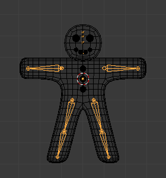
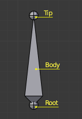
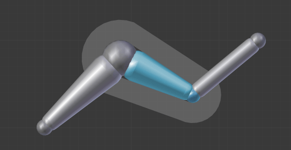
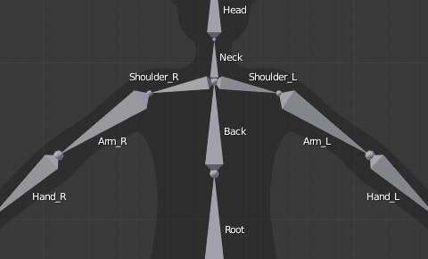
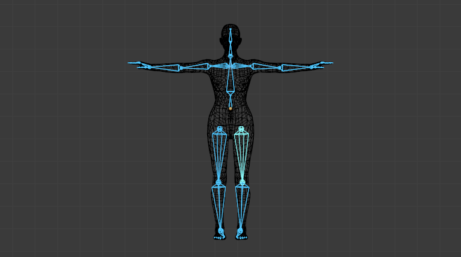
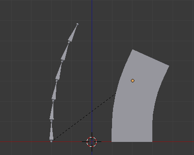
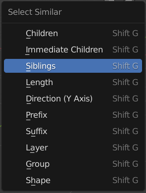

# Rigging 骨骼绑定

## 1. 概念

Blender 中的支架（armature）可以被认为类似于真实骨架（skeleton），就像真正的骨架一样，armature 可以由许多骨骼（bone）组成。 这些骨骼可以四处移动，它们附着或关联的任何东西都会以类似的方式移动和变形。

## 2. Armature 骨架、支架

关于 Armature：

- 它有一个原心，还有位置、 旋转和缩放系数。
- 有 Object Data, 所以能够在 编辑模式 中被编辑；但并不能用于建模，不能单独选中点线面进行更改，只能缩放、旋转、位移
- 它可以被连结到其它场景, 同样的骨架数据可以被多个物体使用。
- 在 Pose mode（姿态模式）下可以操作骨架，把骨架摆成各种姿势；而在 其他模式下，骨架处于静置姿势(rest position)，而且只能作为一个整体来设置动画（无法摆姿势）

骨架是由很多骨骼(默认情况下是刚体元素)组成的，这方面它模仿了真实骷髅，但它又能实现真实骷髅无法办到的动作：它除了有真实骷髅 天生 的关节旋转外，还可以进行移动甚至缩放操作! 你的骨骼可以不用相互连接；如果你愿意，它们可以完全独立。然而大多数自然的和有用的骨骼设置意味着骨头之间是相互影响的, 形成所谓的 “骨骼链”, 创建骨架的 四肢

使用 Armature 基本步骤：

1. 建立模型；3d Modeling
2. 创建对应骨架; Creating Armature
3. 蒙皮（绑定骨骼）；Rigging
4. 设置骨骼控制；Creating Rig controller
5. 创建动作（动画片段）: Action Animation clip
6. 导出 blender：export
7. 导入 unity：import

## 3. Bone 骨骼

Armature 由多个 Bone 组成

- Deforming Bones 变形骨骼  
  变形骨骼通过直接参与改变与骨骼相关联的顶点组位置来使他们跟随变形骨骼做出类似的变换。

- Control Bones 控制骨骼  
  控制骨骼相当于切换开关，他们变换时控制着其他骨骼或物体如何动作。例如，控制骨骼可以作为滑动开关控制，当控制骨骼位于左侧时，变换时它可以指示其他骨骼以特定方式进行反应，当控制骨骼位于右侧时当其变换时骨骼或物体以一些完全不同方式反应。控制骨骼不直接用于改变顶点的位置，因此，控制骨骼通常没有与自身直接相关联的顶点。

### 3.1 骨骼结构

每个 Bone 都由三部分组成：

- "root 关节 "： 首端(root) 或 头部(head) 。
- “body(身体)”：这个部分是骨骼的主体。
- “tip 关节”： 部分叫 顶端(tip) 或 尾端 (tail) 。

### 3.2 骨骼的影响

骨骼控制着 "跟随" 骨骼的网格顶点组. 就像当你移动手指时你的手指肌肉和皮肤跟随你的手指骨。

下图展示，在编辑模式，以封套(Envelope)模式显示的骨骼。  

要做到这一点，你必须定义骨骼在某个顶点上的 influence 影响 的强度。

最简单的方法是每根骨骼影响给定的几何体范围. 叫 封套技术(envelope technique),因为每根骨骼仅仅能够影响它 "封套几何体" 范围的区域。

如果一根骨骼以 封套 Envelope 显示 , 在 编辑模式 Edit mode 和 姿势模式 Pose mode 你可以看到它的影响范围, 这取决于：

- 距离(distance ) 属性
- 首端和尾端的半径。

### 3.3 操作骨骼

#### 3.3.1 添加

- Object mode/edit mode：shift a 添加一个独立的 bone
- edit mode：选中一个 bone , E 快捷键，或者 extrude 增加子 bone

选中两个骨骼，点击 F ，在两个骨骼之间添加骨骼

#### 3.3.2 选择

类似于网格的 顶点/边选择 , 在 编辑模式 有两种方法来选择骨头:

- 直接选择 bone 的 body(主体)部分。
- 选择它的两个关节(首端和尾端)。

当你选择一个连接到父级骨骼的骨骼首端(root)，你也同时选择了其父级骨骼的尾端(tip)(反之亦然)

反选使用 Ctrl + I，可以选择未选中的其余部分骨头

使用 Ctrl + 鼠标左键，可以快速选择从激活 bone 到鼠标选中的 bone 之间的所有 Bones，相当于选择了一个最短路径

Ctrl + L ，可以选择所有和当前 bone 的关联 bone，可以用于选择一整条分支

#### 3.3.3 编辑

编辑模式下，移动、旋转、缩放都还是以前的操作。

#### 3.3.4 锁定

shift - W 锁定骨骼，避免骨骼产生变换

#### 3.3.5 细分

Armature 菜单 -> subdvide 细分：这个工具将会细分所有选定的骨骼，并保留现有的关系：从一个细分中创建的骨头，总是形成一个连接链的骨头。

可以在左下角的操作配置菜单中，设置分割的次数，n 个切割会得到 n+1 个骨骼

你可以在一个骨骼通过细分得到两个或更多的骨骼

#### 3.3.6 命名

所有模式下，Properties ‣ Bone Properties ‣ Name 字段，可以为选中的 Bone 命名

在 Blender 命名习惯不仅仅是用于找到正确的骨骼，也告诉 Blender 哪两个骨骼是配对骨骼。

如果你的骨架可以镜像另一半(即它是两侧对称)，这是值得坚持左/右命名的约定。这将使您能够使用一些工具，可能会节省您的时间和精力(如 X 轴镜像 的编辑工具，我们上面看到的...)。

命名规则：

1. 首先，你应该给你的骨骼有意义的基名称，如 leg (腿部)，arm (手臂)，finger (手指)，back (背部)，foot (脚部)等。

2. 如果你的骨骼的副本在另一边，像手臂，给它如下面的分隔符区别：
   - 添加 left/right 前缀或后缀，如 L_arm 或 arm.R
   - 如果有一个大写或小写 "L", "R", "left" 或 "right", Blender 正确处理副本
   - 有效的分隔符示例:
     - (nothing 无): handLeft --> handRight
     - "\_" (underscore): hand_L --> hand_R
     - "." (dot): hand.l --> hand.r
     - "-" (dash): hand-l --> hand-r
     - " " (space): hand LEFT --> hand RIGHT
3. 在 Blender 处理一个骨骼的镜像和翻转前，它首先是移除数字扩展，如果有的话(像".001".)。

自动命名：  
编辑模式下，Armature ‣ Names ‣ Auto-Name Left/Right, Front/Back, Top/Bottom，三个 自动命名 条目允许您根据其头部相对于骨架原点及其局部坐标的位置，自动为所有选定骨骼添加后缀

#### 3.3.7 对称

编辑模式下，Armature ‣ Symmetrize

此操将根据 Blender 的对称骨架骨骼命名约定沿 X 轴镜像选定骨头，从左到右或从右到左，具体取决于选择。将创建名称相反但尚不存在的骨骼，并覆盖已存在的骨骼。

如果命名或位置导致无法识别位置，则该 bone 会被忽略

对称骨骼和约束属性将进行必要的更改以反映其行为。 当使用动作约束对称化骨骼时，必要的关键帧将被添加到目标动作，以在动作被激活时产生对称运动。

#### 3.3.8 蒙皮 Skinning

链接”一个骨架到物体产生变换和/或变形的这个过程被称为“蒙皮”

两种主要蒙皮类型：

1. 使用父子关系，骨架为父，模型为子 ：Parent -> with automatic weights

要建立骨架变形父子关系，你必须首先选择将受到骨架影响的所有子对象，最后选择骨架对象本身。一旦选择了所有子对象和骨架，请按 Ctrl-P ，然后在弹出菜单中设置父级到(Set Parent To)选择骨架变形(Armature Deform)。

骨架将是所有其他子物体的父物体，每个物体子将具有与骨架相关联的骨架修改器(Object 字段)。

2. 你也可以 在整个网格添加骨架修改器 ，然后，这些物体的一部分对应骨骼里面的一些骨骼。这个是更复杂和强大的模式，只有这样，才能真正使物体的几何形状形变，即修改它的顶点/控制点的相对位置。

[不同的蒙皮方式文档](https://docs.blender.org/manual/zh-hans/latest/animation/armatures/skinning/parenting.html)

#### 3.3.9 骨骼层

每个骨架有 32 层，通过将它们“重新组合”成一组骨骼来组织骨架。 只有活动层中的骨骼可见/可编辑，但它们始终有效（即移动对象或变形几何体），无论是否在活动层中。 此工具可更改 3D 视口中可见的图层。 要一次显示多个图层，请在要查看的图层上按住 Shift-LMB

- 模式:编辑模式
- 菜单:Armature ‣ Change Bone Layers
- 快捷键:M

### 3.4 父子关系

操作父级，子级会跟着动

Bone Properties -> Relations 中，可以更改选中 bone 的 parent

- Shift-[ 选择父级 bone
- Shift-] 选择子级 bone
- Shift-G 选择菜单

## 4. 骨骼控制

稍微复杂一些的骨架，都需要骨骼控制，否则在摆姿势时，会非常麻烦

### 4.1 正向动力学 Forward Kinematics

FK：通过父骨骼控制自骨骼的方式，即默认的骨骼父子关系影响而产生的，子骨骼随着父骨骼的 Transform 相应改变自己的 Transform 的运动方式

### 4.2 反向动力学 Inverse Kinematics

IK：子骨骼移动时，自动推算出影响到的父骨骼应该移动的位置。

反向运动学允许您定位骨骼链中的最后一个骨骼，而其他骨骼会自动定位。 这就像移动某人的手指会导致他们的手臂跟随它一样。

IK 主要是通过骨骼约束完成的，尽管在姿势模式中也有一个简单的自动 IK 功能。 它们以相同的方法工作，但约束提供了更多的选择和控制。

 

 
 

> 参考资料：
>
> -
> - [FK & IK 简介](https://orzgame.blog.csdn.net/article/details/105642689)
> - [https://www.raywenderlich.com/31539225-creating-reusable-characters-with-blender-and-unity](https://www.raywenderlich.com/31539225-creating-reusable-characters-with-blender-and-unity)

 

 

配套视频教程：
[https://space.bilibili.com/43644141/channel/seriesdetail?sid=299912](https://space.bilibili.com/43644141/channel/seriesdetail?sid=299912)

文章也同时同步微信公众号，喜欢使用手机观看文章的可以关注

